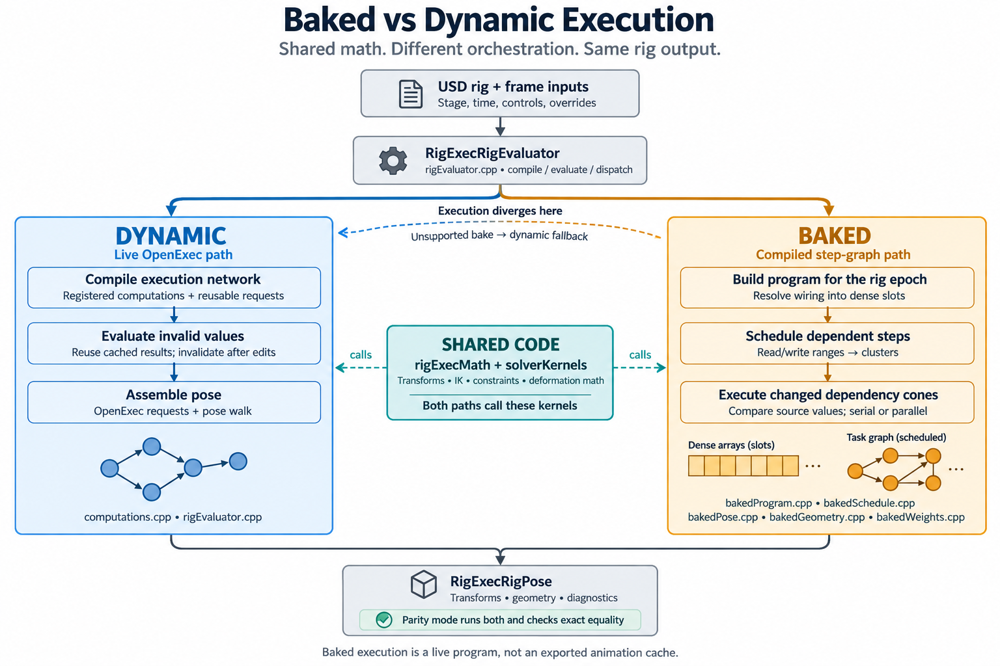

# RigExec

RigExec is an experimental character-rig evaluator for OpenUSD 26.08. It
evaluates controls, constraints, solvers, and geometry deformers in memory,
then publishes the results through Hydra for live playback in `usdview`.

**Status: 0.1 alpha.** APIs and file formats may change. Original project code
is [MIT licensed](LICENSE). See [third-party notices](THIRD_PARTY_NOTICES.md)
for bundled code, published methods, and unresolved asset provenance.
The distribution [NOTICE](NOTICE) identifies OpenUSD, noodles, and font credits.

Authors: [Nick Burkard](https://github.com/n-burk),
[Walt Yoder](https://github.com/wyoder) and
[Matt Schiller](https://github.com/matthewschiller) of
[Squarebit Studios](https://www.squarebitstudios.com).
The biped example rig in `examples/biped` is a Squarebit Studios
character converted to RigExec.

## Features

- FK, two-bone and single-chain IK, spline IK, twist, and transform constraints.
- Ordered deformation operations called **movers**, including skinning,
  blend shapes, lattices, smoothing, Delta Mush, and curvenets.
- Scalar, vector, and matrix operations; painted and procedural weight fields.
- Dynamic evaluation, a baked program, and experimental `.rigexec` export
  with a standalone binary runtime.
- `usdview` tools for controls, curves, layers, picking, and node graphs.

RigExec builds against OpenUSD installation with OpenExec.
The [architecture guide](docs/specs/spec.md) explains the evaluation layers;
the [node reference](docs/index.md) describes authoring and parameters.



## Build and run

Install OpenUSD **26.08** with OpenExec and `usdview`, CMake **3.26+**, Ninja,
and a C++17 compiler. Use the same Python version and architecture as your
OpenUSD build. See the upstream [build instructions](https://github.com/PixarAnimationStudios/OpenUSD/blob/v26.08/BUILDING.md).

The helpers default to a sibling `../usd-install` installation. Set `USD`
to use another prefix and `PY` to select its compatible Python interpreter.
`VENV` optionally selects a Python virtual environment. On Windows, the build
helper discovers Visual Studio; `RIGEXEC_VCVARS` can override its toolchain script.

### Windows

Run these commands in Command Prompt:

```bat
set USD=C:\path\to\usd-install
set PY=C:\path\to\python.exe
bin\build_rigexec.bat
bin\launch_usdview.bat examples\ArmShotAnim.usda
```

### Linux and macOS

```sh
export USD=/path/to/usd-install
export PY=/path/to/python
bin/build_rigexec.sh
bin/usdview.sh examples/ArmShotAnim.usda
```

The build helper configures the project, builds it, and runs enabled CTest
tests. Platform support depends on a compatible OpenUSD build; these commands
do not imply that every platform has been qualified for this checkout.

For manual configuration in an initialized compiler environment:

```sh
cmake -S . -B build -G Ninja -DCMAKE_BUILD_TYPE=Release \
  -DUSD_INSTALL_DIR=/path/to/usd-install -DCMAKE_PREFIX_PATH=/path/to/usd-install
cmake --build build
ctest --test-dir build --output-on-failure
cmake --install build --prefix /path/to/rigexec-install
```

The installed CMake package exposes targets such as `rigExec::rigExec`:

```cmake
find_package(rigExec CONFIG REQUIRED)
target_link_libraries(myApplication PRIVATE rigExec::rigExec)
```

## Examples and documentation

Start with [the smallest rig](examples/rigexec_flat.usda), the animated
[reference arm](examples/ArmShotAnim.usda), or the [example catalog](examples/README.md).
The [biped](examples/biped/README.md) remains available, with its provenance
status documented in the third-party notices.

- [Node reference and tutorials](docs/index.md)
- [Architecture and repository boundaries](docs/specs/spec.md)
- [Curvenet authoring](docs/specs/curvenet.md)
- [Viewport tools](docs/specs/viewport-gizmos.md) and [graph editor](docs/specs/graph-editor.md)
- [Bake and inverse APIs](docs/specs/python-bake-inverse.md)
- [Standalone runtime](docs/specs/standalone-runtime.md)
- [Public method references](docs/references.md)
- [Agent and contributor guide](AGENTS.md)

## Repository layout

| Directory | Purpose |
|---|---|
| `libs/rigExecMath` | Solver, deformation, interpolation, and weight math |
| `libs/rigExecSchema` | Authored USD schema definitions |
| `libs/rigExec` | OpenExec integration, evaluation, baked programs, and caches |
| `libs/rigExecRigging` | C++ authoring API |
| `libs/rigExecImaging` | Hydra scene indices and viewport publication |
| `libs/rigExecBake`, `libs/rigExecBinary`, `libs/rigExecRuntime` | Binary export, format, and playback |
| `libs/rigExecStandalone` | Experimental Esf adapter and rigpack backend |
| `python` | Python bindings and authoring helpers |
| `plugin` | Schema resources and optional viewer tools |
| `tests`, `examples`, `docs` | Verification, sample stages, and documentation |
| `bin`, `tools` | Environment helpers and command-line programs |

## Development

Run the build helper after native changes. For Python interaction math, use
`bin/test/run_python_tests.sh` or `bin\test\run_python_tests.bat`. Viewer integration
checks are available through the `bin/test/run_testusdview*` helpers and require a
working graphics context.

Node pages are generated from `libs/rigExecSchema/schema.usda` and
`docs/operator_notes.py` by `python docs/build_pages.py`. Generate the optional
HTML reference with `python docs/build_html.py` (requires `markdown`). Generated
HTML and local sizzle material are ignored by Git.

The standalone backends support a subset of the authoring/runtime surface.
Check their guides before integration. Changes to OpenUSD versions or binary
formats require explicit compatibility testing.
