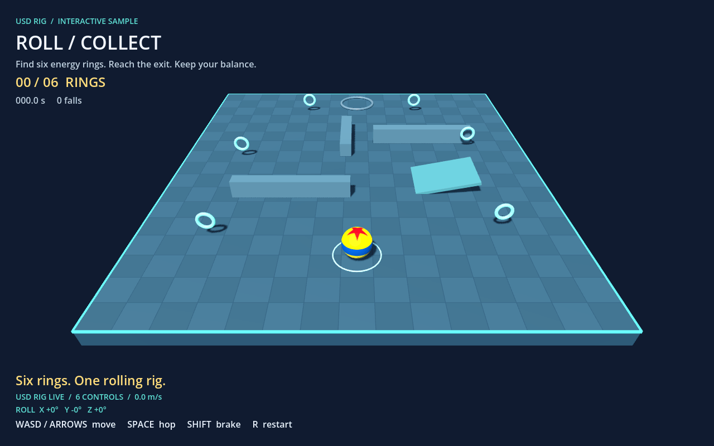
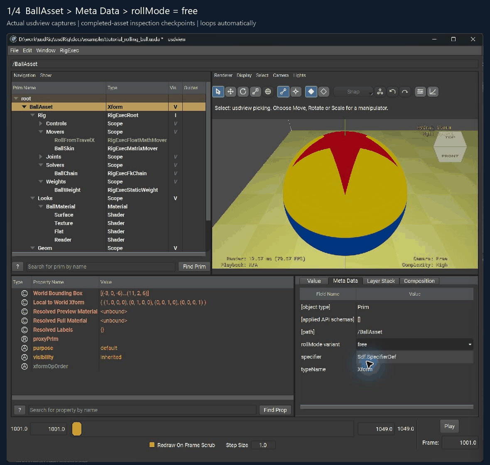
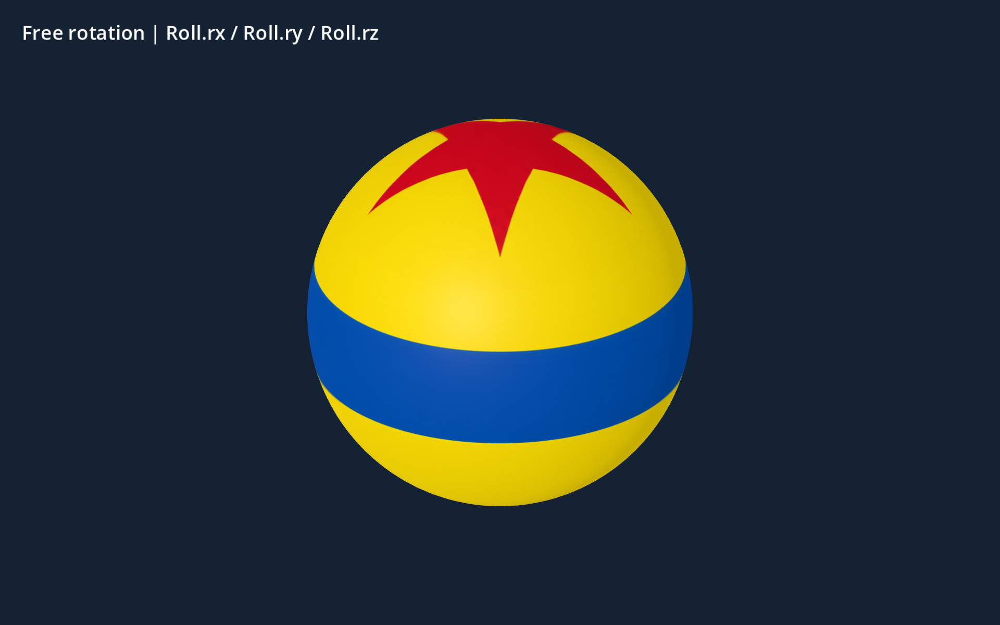

The Godot game loads **one `rolling_ball.rigexec` file**. That file contains
its rig program, geometry bindings, subdivision data, UVs, material, original
texture and public controller interface. No Godot skeleton, bone attachment,
OBJ assignment or material wiring is required.

[Download the editable example project](../examples/godot_rolling_ball.zip).
The archive includes Godot scenes/scripts, the self-contained asset, addon
source and tested Windows x86-64 extension libraries. Open `demo/project.godot`
in **Godot 4.7+**. The game needs no USD installation. Rebuilding the asset
requires the existing usdRig/USD build; other platforms need native libraries.



The game script owns collision and input. It feeds the exposed Move and Roll
controllers; rigExec evaluates the complete rig and returns deformed geometry.
The plugin renders that output. The source rig's joints remain internal to
the compiled execution program.

The gameplay and material GIFs are **1280 × 800 at 30 fps**, captured from
lossless PNG frames with 4× antialiasing and a fresh 256-color palette per
frame. They show the current reference-matched texture:
yellow, a red star centred on the +Y top cap, and a continuous blue equatorial
band. The usdview GIFs also show this corrected asset, using native-resolution
application captures in **1180 × 1120** captioned inspection checkpoints.
Each checkpoint pauses for 4.5 seconds. Open GIFs directly for full-size viewing.

[Download the USD source with its texture](../examples/usdview_rolling_ball.zip).
Extract the whole archive so the relative texture and icon paths resolve.

## Step 1 — build or inspect the source ball in usdview

From the `usdRig` checkout, open the source stage:

```bat
bin\launch_usdview.bat docs\examples\tutorial_rolling_ball.usda
```

The supplied stage is already complete. To author it yourself, follow the
[full source-authoring lesson](../concepts/tutorial-rolling-ball.md); do
that work in a copy of the stage so you retain the finished reference. Its
first stage already contains the sphere, UVs, material, texture and ground.
This walkthrough builds a rig around that geometry; it is not a sphere
modeling or texture-painting lesson.

1. Open **Window → Noodles Editor** and **Window → Layer Editor**.
   Choose the **Root Layer** as the edit target. Edits in usdview's session
   layer do not survive closing the application.
2. Add `/BallAsset/Rig` and `/BallAsset/Geom/Ball` to the graph: select each
   in the prim browser, then press **A** over the graph.
3. Under `Rig/Controls`, create `Move → Squash → Roll → Spin`. For each,
   use **Tab → RigExecControl**, rename it, then apply
   **RigExecControlAPI** through the same hotbox. `Move` translates;
   `Squash` scales at ground level; `Roll` has a rest-space translation of
   `(0, 1, 0)` so rotation happens at the sphere's centre; `Spin` is its child.


Next, create the joints and solver:

1. Under `Rig/Joints`, create `Root → Squash → Roll → Spin` with
   **Tab → RigExecJoint**. Give the Roll joint the same `(0, 1, 0)`
   rest-space translation; the other local rest transforms are identity.
2. Under `Rig/Solvers`, create `RigExecFkChain` named `BallChain`.
   Connect `rigExec:controls` to **Move, Squash, Roll, Spin**, in that order.
   Connect `rigExec:joints` to **Root, Squash, Roll, Spin**, in that order.


Finally, bind the mesh:

1. Under `Rig/Weights`, create `RigExecStaticWeight` named `BallWeight`,
   with `defaultWeight = 1` and `weightTarget` pointing to **Ball.points**.
   Under `Rig/Movers`, create `RigExecMatrixMover` named `BallSkin`, apply
   `RigExecMoverAPI`, then connect `moves → Ball.points`,
   `transform → Spin joint`, and `weightObject → BallWeight`.
   Save with **Ctrl+S** in the graph.


**Checkpoint:** moving `Move` translates the textured mesh; rotating `Roll`
turns it about its centre. The source lesson's later `RollFromTravelX` mover
adds automatic straight-line rolling. The next step disables that mapping
for gameplay, where direction can change at any time.

## Step 2 — expose the game controllers in USD

Open the provided wrapper from the usdRig checkout:

```bat
bin\launch_usdview.bat docs\examples\tutorial_rolling_ball_free.usda
```

1. Select **BallAsset** and inspect **Meta Data → rollMode variant**.
   It must be **free**. This disables `RollFromTravelX` and resets the
   straight-line roll gain. Gameplay supplies the independent rotation axes.
2. Select **Geom → Ball**, click the ball in the viewport and press **F**.
   Check **Resolved Preview Material** is `/BallAsset/Looks/BallMaterial`.
3. Expand **Looks → BallMaterial → Texture**. The texture is
   `textures/pixar_ball.png`, with diffuse scale `0.75`, repeat S and clamp T.



The wrapper also declares the public interface on its existing controls:

```usda
over "Move" {
    custom string rigExec:publicName = "Move"
    custom token[] rigExec:exposedAvars = ["tx", "ty", "tz"]
    over "Squash" {
        over "Roll" {
            custom string rigExec:publicName = "Roll"
            custom token[] rigExec:exposedAvars = ["rx", "ry", "rz"]
        }
    }
}
```

This excerpt belongs under `/BallAsset/Rig/Controls`. The supplied
[`tutorial_rolling_ball_free.usda`](../examples/tutorial_rolling_ball_free.usda)
already contains it. The exporter turns these declarations into **Move.tx,
Move.ty, Move.tz, Roll.rx, Roll.ry, Roll.rz**. Squash, Spin and the joint
hierarchy are not exposed as game inputs. Rotations are degrees; translations
use the wrapper's asset units, one metre per unit with a radius-one ball.

Save source edits before baking. A bake reads the stage from disk, including
its selected variant; unsaved usdview session changes are not included.

## Step 3 — bake one complete asset

Extract the example next to the usdRig checkout:

```text
workspace/
    usdRig/
    godot_rigExec/
        addons/rigexec/
        demo/
    usd-install/
```

Close this project's Godot editor before setup or native builds. On Windows,
the editor holds the addon DLL and its reload copy open, which can block a
second importer. From `godot_rigExec`, run:

```text
python demo/setup_rolling.py
```

The supplied Windows binaries are ready to use. To compile the native plugin
from source, install SCons and fetch the matching godot-cpp checkout first:

```text
python -m pip install scons
git clone https://github.com/godotengine/godot-cpp.git thirdparty/godot-cpp
git -C thirdparty/godot-cpp checkout 507ed9d840c01a3c5b2a39af8bb4000bfac30bf5
git -C thirdparty/godot-cpp submodule update --init --recursive
python demo/setup_rolling.py --build
```

Building needs a C++ compiler, the existing usdRig build, its matching USD
Python bindings with numpy, and OpenSubdiv. The tested Windows toolchain uses
MSVC. If needed, append `--godot "C:/path/to/godot_console.exe"` to setup.

Setup exports the presentation, then compiles the execution program with it
embedded, installs the addon, imports the project and runs the checks. The
game-facing output is **`demo/rolling_ball.rigexec`**. Intermediate mesh and
stencil files and the exported `presentation.rexp` are written under
`build/rolling_ball/` for bake inspection; the game and downloadable project
do not load them.

For the two steps explicitly, first export the presentation from
`godot_rigExec`:

```text
python tools/export_ball_assets.py
```

This writes the mesh, UVs, material, PNG, subdivision stencils and controller
metadata to `build/rolling_ball/presentation.rexp`. Then bake the program with
that presentation embedded, from usdRig in Command Prompt:

```bat
call bin\_env.bat
build\rigExecBake.exe docs\examples\tutorial_rolling_ball_free.usda --rig /BallAsset/Rig --time 1001 --presentation ..\godot_rigExec\build\rolling_ball\presentation.rexp -o ..\godot_rigExec\demo\rolling_ball.rigexec
```

The bake reads every rig input at time 1001 and stores that value as the
input's default. The file holds no frames; the game drives the inputs from
there. The bake refuses a presentation that names an input the file does not
list. Both steps are necessary for the self-contained renderable asset. The
exporter currently supports and validates this tutorial's mesh/material
graph; it is not a general USD material translator.

## Step 4 — import and view the asset in Godot

1. In Godot Project Manager, choose **Import** and select
   `godot_rigExec/demo/project.godot`. Alternatively use
   `godot --editor --path demo` from `godot_rigExec`.
2. Let import complete. Under **Project → Project Settings → Plugins**,
   confirm **rigExec** is enabled (the example enables it already).
3. Double-click **rolling_ball.tscn** in FileSystem and switch to **3D**.
4. Select **RigExecPlayer** in the Scene dock. Its **Character** is
   `rolling_ball.rigexec`. The ball is already visible in the editor.
5. Expand the **Controls** groups in the Inspector. The exposed Move and
   Roll channels come from the asset. There is no skeleton path to assign.

**Checkpoint:** the star and blue band are visible, and the Inspector exposes
only the six authored controller channels as rig inputs. Rendering resources
are created internally from the file, not saved as editable rig nodes.

## Step 5 — build the reusable game object

Create a **3D Scene** named `RollingBall`, attach the existing
`rolling_ball.gd`, and use **Add Child Node** to create this hierarchy:

```text
RollingBall                    Node3D + rolling_ball.gd
    Physics                    CharacterBody3D
        CollisionShape3D       SphereShape3D, radius 1
    RigExecPlayer              Character = rolling_ball.rigexec
```

Set Physics Position to `(0, 1, 0)`, Floor Stop On Slope off, Constant Speed
on, and Snap Length to `0.4`. The collider is centred at its parent origin.
Drag `rolling_ball.rigexec` from FileSystem into the player's **Character**
property. Keep the root and player's transforms at identity. Save the scene
as `rolling_ball_practice.tscn` if building a second copy.

That is all the scene wiring. The physics body is game-side collision;
the rig's transforms, joints, deformation, render geometry and material are
inside the asset. Do not create a Skeleton3D or copy the USD joint hierarchy.

## Step 6 — feed the exposed controllers

The provided `rolling_ball.gd` and `rolling_motion.gd` are the complete
controller implementation. The game-facing call sequence is:

```gdscript
player.set_control("Move.tx", body.position.x)
player.set_control("Move.ty", body.position.y - radius)
player.set_control("Move.tz", body.position.z)
player.set_control("Roll.rx", angles.x)
player.set_control("Roll.ry", angles.y)
player.set_control("Roll.rz", angles.z)
if not player.evaluate():
    push_error(player.get_last_error())
```

Check the boolean result of `set_control()` as the supplied script does.
`get_controls()` enumerates declared names, units, defaults and current
values; it does not return internal USD paths. Unknown channels, nonfinite
values and `set_input()` writes to internal attribute paths are rejected.
`reset_controls()` returns every input to its bake-time default. Assigning
the character evaluates those defaults at once; after that nothing advances
on its own, so the game sets the controls and calls `evaluate()` each tick.
The plugin updates its geometry after evaluation; the game does not manage
bones, rest poses, skinning matrices or material resources.

The controller calls `move_and_slide()` first and uses the **actual**
displacement after collision. It accumulates orientation as a quaternion:

```text
tangent = displacement - normal * dot(normal, displacement)
axis = normalize(cross(normal, tangent))
angle = length(tangent) / radius
orientation = normalize(quaternion(axis, angle) * orientation)
```

Skip zero-length motion. Keeping rotation history supports arbitrary turns;
position-to-angle mappings for independent axes do not. At the control
boundary, `Basis(orientation).get_euler(EULER_ORDER_ZYX) * (180.0 / PI)`
produces the degree channels corresponding to USD's row-vector XYZ convention.
Airborne movement retains angular velocity until ground contact resumes.

## Step 7 — preserve the usdview appearance inside the asset




This fresh native-renderer recording opens with the top-down view of the new
asset, rotates freely about all three axes, then checks the equatorial stripe.
The seam pass checks the rendered equator at 180 angles: the blue band remains
continuous through the texture seam. The top-down pass checks the star's rendered centre
at 12 orientations. [View the top-down checkpoint](../images/godot_ball_top.png).

The source [texture](../examples/textures/pixar_ball.png) places the stripe
at the UV equator, with matching stripe boundaries at its left and right
edges. The renderer repeats U in the texture sampler, retaining continuous
UV derivatives for mip filtering, and clamps V to the pole texels. Applying
`fract()` before sampling would introduce a derivative discontinuity at the
wrap seam. After rebaking, reimport the asset in Godot so an older cached
`.rigexec` import does not keep showing the previous texture.

The star uses a planar UV island centred on the source sphere's **north pole
(+Y)**, directly above the equatorial stripe. Its geometric centre, rather
than its asymmetric bounding-box centre, maps to the pole. This avoids the
pinching of latitude/longitude UVs. A separate side island preserves the
stripe's latitude coordinates and samples undecorated yellow above it, so
there are no repeated star fragments between the cap and band. The export
passes these source `st` coordinates into Godot.
`tools/retarget_ball_star_uvs.py` reproduces this atlas-specific source edit.

The export reads `/BallAsset/Geom/Ball`, its face-varying `st` topology and
bound `/BallAsset/Looks/BallMaterial`. It preserves the original texture
bytes and these authored values:

| USD input | Embedded material |
|---|---|
| Texture | Original `pixar_ball.png`, sRGB |
| Diffuse / emission scale | `(0.75, 0.75, 0.75)` / `(0.5, 0.5, 0.5)` |
| Roughness / metallic / specular | `0.5 / 0 / 0.35` |
| Wrap S / T | Repeat / clamp |

OpenSubdiv computes level-two limit-surface stencils during the export. At
runtime these stencils map **rigExec's deformed points** to render vertices;
derivative stencils provide normals. UV seams remain independent of position
indices. The tutorial's inward source winding is corrected for Godot.
No Godot skeleton participates in this evaluation.

Lighting and tone mapping differ between usdview and Godot, so the same
material data need not produce pixel-identical renders. The plugin's
`get_source_info()` exposes provenance for checking the original texture
checksum. See the [embedded presentation format](../specs/rigexec-presentation.md)
for the data contract and current exporter limits.

## Step 8 — instance the ball and run the game

1. Open **rolling_game.tscn**. Its root has `rolling_game.gd` and contains
   an instance of `rolling_ball.tscn` named **Ball**.
2. Select Ball and keep **Automatic Physics off**: the level calls its
   `advance()` method once per physics tick. In another game, enable
   Automatic Physics for keyboard driving, or call `drive(direction,
   delta, braking)` with it disabled.
3. Press **F5**. The main scene is already configured. The level script
   creates the course, camera, lights, rings and HUD when it starts.
4. Use **WASD / arrows** to move, **Space** to hop, **Shift** to brake,
   **R** to restart. Collect six rings and reach the exit. Falling respawns
   the ball while preserving collected rings. Press **F8** to stop.

To try your practice ball, create a Node3D scene, attach `rolling_game.gd`,
instance `rolling_ball_practice.tscn` as **Ball**, disable its Automatic
Physics, save and press **F6**. Running the ball scene alone with F6 does
not supply a floor or camera.

**Checkpoint:** the HUD says **USD RIG LIVE / 6 CONTROLS**. The star and band
roll continuously through direction changes. When pushing into a wall,
zero actual ground travel produces zero rolling increment.

## Step 9 — verify, record and rebuild

From `godot_rigExec`, with the editor closed:

```text
godot --headless --path demo --script verify_rolling.gd
godot --path demo --script verify_rolling.gd -- --capture
```

The current Windows example passes **1,346 checks**. These cover texture-band
continuity and centering, quaternion/FK parity, singularities, arbitrary turns and
slopes, deformed render geometry, absence of a Godot skeleton, the public
controller boundary, material values, collision, collection and reset.
The downloadable project is also tested from a fresh extraction containing
no loose mesh or texture assets. `--capture` writes `rolling_game_preview.png`.

Record the route used for the gameplay GIF as lossless PNG frames. From the
plugin folder, create `demo/captures` first (movie paths are relative to the
Godot project):

```text
mkdir demo/captures
godot --path demo --fixed-fps 30 --write-movie captures/game.png --script record_rolling.gd
godot --path demo --fixed-fps 30 --write-movie captures/material.png --script record_ball_material.gd
```

Encode at native resolution with a per-frame palette. Repeat for `material`
to create the close-up GIF:

```text
ffmpeg -framerate 30 -i demo/captures/game%08d.png -filter_complex "split[a][b];[a]palettegen=max_colors=256:reserve_transparent=0:stats_mode=single[p];[b][p]paletteuse=new=1:dither=none" -loop 0 game.gif
```

This injects keyboard input into the normal game controller. After changing
the USD rig, geometry or material, save it, close the Godot editor, rerun
setup and reopen the project. Rebuilding replaces the single asset file.

| Symptom | Check |
|---|---|
| Extension/DLL loading error | Close editors using this project; use Godot 4.7+ and matching native libraries |
| No visible asset or no Controls group | Export the presentation, then bake with `--presentation`; the file needs it embedded |
| Controller name refused | Check the source `rigExec:exposedAvars` declaration and rebake |
| Only X travel rolls | Bake the free wrapper with `RollFromTravelX` inactive |
| Ball moves twice as fast | Disable Automatic Physics when the level calls `advance()` |
| Blank scene when using F6 | Run the game scene, which supplies the floor and camera |

## Where to go next

* [Source rolling-ball lesson](../concepts/tutorial-rolling-ball.md)
* [Evaluation and independent checks](../concepts/baked-vs-dynamic.md)
* [Embedded presentation format](../specs/rigexec-presentation.md)
* [Execute publication buffers](../specs/runtime-execute-buffers.md)
