The oldest rigging exercise there is: a ball that rolls along the ground
without sliding. It is small enough to build in one sitting and it uses
most of what UsdRig is — a control hierarchy, an FK solver, joints, a
weight object and a mover — plus one thing that is easy to get wrong and
worth getting right, which is making the **spin follow the travel** so
there is only one channel to animate.

This page builds it live in `usdview`, through the **usdNoodles** node
graph editor, and shows every step as a recording of the real
application. The finished stage is
[`docs/examples/tutorial_rolling_ball.usda`](../examples/tutorial_rolling_ball.usda)
and every snippet below is a literal excerpt of it.

## What you start with

The geometry, and a rig root with nothing in it. Open
`docs/examples/tutorial_rolling_ball.usda` and delete everything under
`/BallAsset/Rig`'s five scopes to get back to this, or point the same
steps at a stage of your own — the pieces are:

* `/BallAsset/Geom/Ball` — a 32 × 16 lat/long sphere of radius 1, centred
  at `(0, 1, 0)` so it sits ON the ground and the contact point is the
  origin. It carries `primvars:st` and a `UsdPreviewSurface` reading
  `textures/pixar_ball.png`: yellow, one broad blue band, one red star.
  The graphic is not decoration — an untextured sphere spinning about its
  own centre looks perfectly still, and you cannot see whether a rolling
  rig is rolling or sliding.
* `/BallAsset/Geom/Ground` — a checkered plane.
* `/BallAsset/Rig` — a [Rig Root](../nodes/rig_root.md) with empty
  `Controls`, `Joints`, `Solvers`, `Weights` and `Movers` scopes.
* `/BallAsset/MainCam` — the camera the recordings use.

Open it with `bin/launch_usdview.bat docs/examples/tutorial_rolling_ball.usda`
(or `bin/usdview.sh`), then **Window ▸ Noodles Editor**. The editor opens
docked; it is scoped to the rig, so the graph starts on
`/BallAsset/Rig` rather than on the asset container.

## Step 1 — point your edits at the file

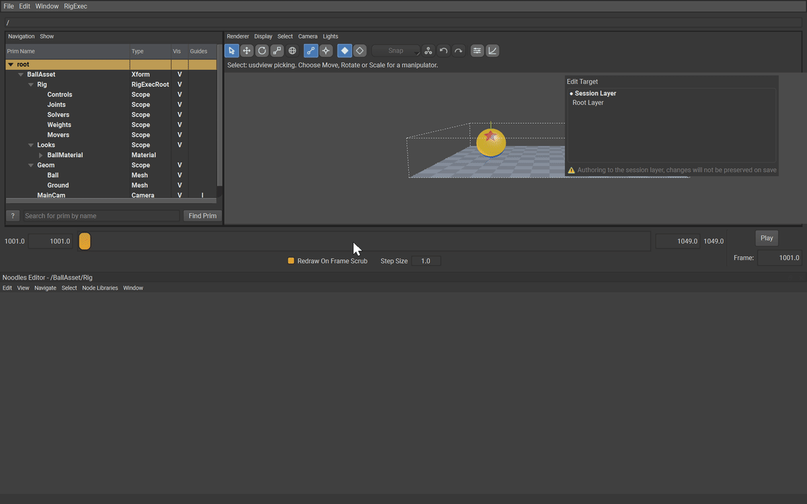

Do this first, every time. usdview opens with the **session layer** as the
edit target, and the session layer is thrown away when the application
closes. Everything you are about to build would go with it.

**In the UI:** **Window ▸ Layer Editor** opens the Noodles layer editor
beside the graph. It lists the stage's layers with a ● on the current edit
target, and a warning strip under them: *"Authoring to the session layer,
changes will not be preserved on save"*. Click the **Root Layer** row. The
● moves, the warning clears, and the graph's own banner goes with it.

From here on every prim, relationship and value lands in
`tutorial_rolling_ball.usda`, and **Ctrl+S** in the graph saves it.

## Step 2 — put the stage in the graph

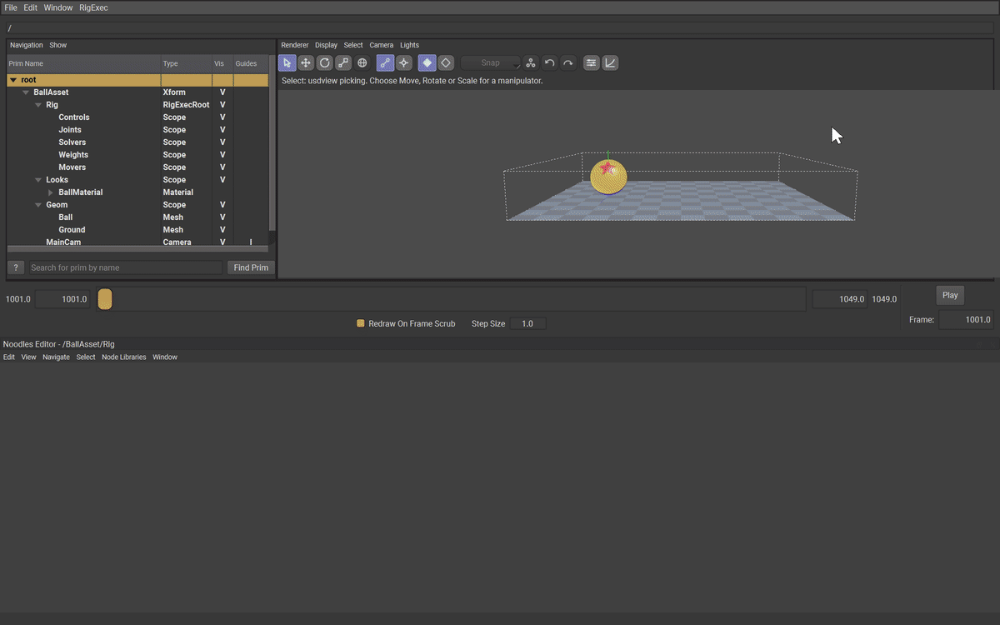

The editor draws the prims you ask it to. Select `/BallAsset/Rig` in
usdview's prim browser and press **A** over the graph canvas ("add from
prim tree"); do the same for `Geom/Ball` and `Geom/Ground`.

A mesh node arrives with a row per property — over a hundred of them for a
sphere — so click the **caret in its title bar** to collapse it, then drag
each node by its title into a tidy left-to-right layout. This is not
housekeeping: relationships are authored by dragging from a pin onto a
node, and a node under another node is a relationship pointed at the wrong
prim.

## Step 3 — the Move control

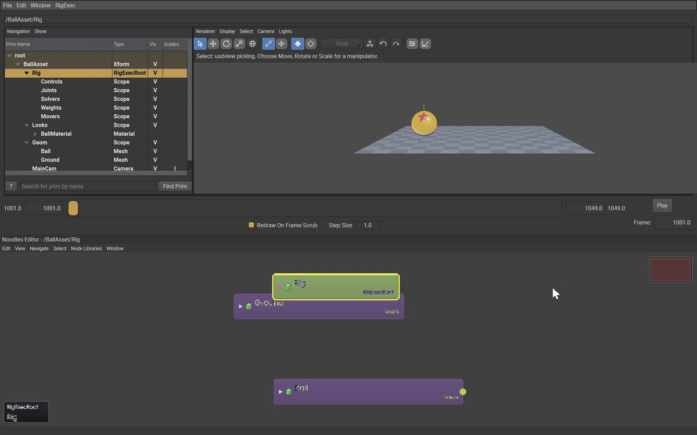

A [Control](../nodes/control.md) is the animator-facing prim: an
animatable coordinate space whose animation is authored on its `avars`.
`Move` is the one that travels along the ground.

**In the UI:** select the `Controls` scope in the prim browser (that is
where the new prim goes), hover the graph, press **Tab** to open the node
creation hotbox, type `RigExecControl`, press **Return**. The prim is
created as `RigExecControl1`; **double-click its title**, clear it, type
`Move`, **Return**. Then, with the node still selected, press **Tab**
again and type `RigExecControlAPI` — the same hotbox lists every applied
API schema in the build beside the concrete prim types, and choosing one
applies it to the selection.

```usda
def RigExecControl "Move" (
    prepend apiSchemas = ["RigExecControlAPI", "NodeGraphNodeAPI"]
)
{
    double avars:tx = 0
    double avars:tz = 0
    matrix4d rest:space = ( (1, 0, 0, 0), (0, 1, 0, 0), (0, 0, 1, 0), (0, 0, 0, 1) )
}
```

Nothing else is authored. `guide:shape`, `guide:drawMode`,
`guide:scaleX/Y/Z` and `guide:wireWidth` all have schema fallbacks that
draw exactly the wire circle you want, and a rig should not carry an
opinion that says what the schema already says.

## Step 4 — the Squash control

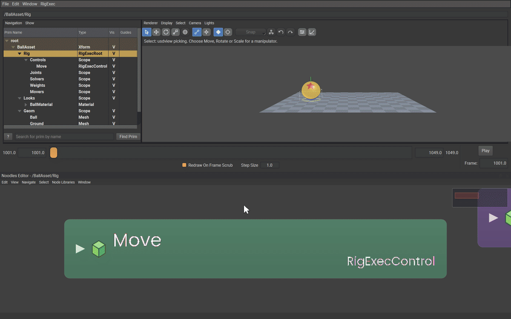

Same three actions, with `Move` selected so the new control lands
underneath it. `Squash` carries the scale avars.

```usda
def RigExecControl "Squash" (
    prepend apiSchemas = ["RigExecControlAPI", "NodeGraphNodeAPI"]
)
{
    double avars:sx = 1
    double avars:sy = 1
    double avars:sz = 1
    matrix4d rest:space = ( (1, 0, 0, 0), (0, 1, 0, 0), (0, 0, 1, 0), (0, 0, 0, 1) )
}
```

Its rest space is the **ground**, not the ball's centre, and it sits
**above** the roll in the hierarchy. Both of those are the whole trick of
a squashing ball: scaling about the ground keeps the contact point on the
ground, and squashing above the spin keeps the squash vertical while the
ball turns inside it. Swap the two and the ball squashes sideways as it
rolls.

## Step 5 — the Roll and Spin controls

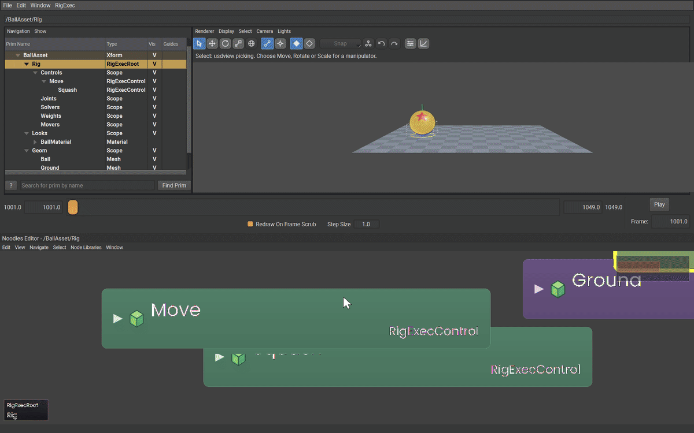

`Roll` is the control the rig drives for you; `Spin` is the one you can
still key by hand when a shot needs the ball to scuff or spin on the spot.

```usda
def RigExecControl "Roll" (
    prepend apiSchemas = ["RigExecControlAPI", "NodeGraphNodeAPI"]
)
{
    double avars:rz = -57.29578
    matrix4d rest:space = ( (1, 0, 0, 0), (0, 1, 0, 0), (0, 0, 1, 0), (0, 1, 0, 1) )

    def RigExecControl "Spin" (
        prepend apiSchemas = ["RigExecControlAPI", "NodeGraphNodeAPI"]
    )
    {
        double avars:rz = 0
        matrix4d rest:space = ( (1, 0, 0, 0), (0, 1, 0, 0), (0, 0, 1, 0), (0, 0, 0, 1) )
    }
}
```

Two values here are not cosmetic.

`rest:space` puts `Roll` at `(0, 1, 0)` — the ball's centre. A rotation
turns about its own frame's origin, and a roll about the ground would swing
the ball through the floor.

`avars:rz = -57.29578` is not a pose; it is the **gain**, the degrees of
roll per unit of travel, and Step 9 multiplies it by the travel. It is an
avar, so the Avar Editor types it — and
[Step 9](#step-9--make-the-roll-a-consequence-of-the-travel) is where
this page sets it, next to the mover that reads it.

## Step 6 — the joints

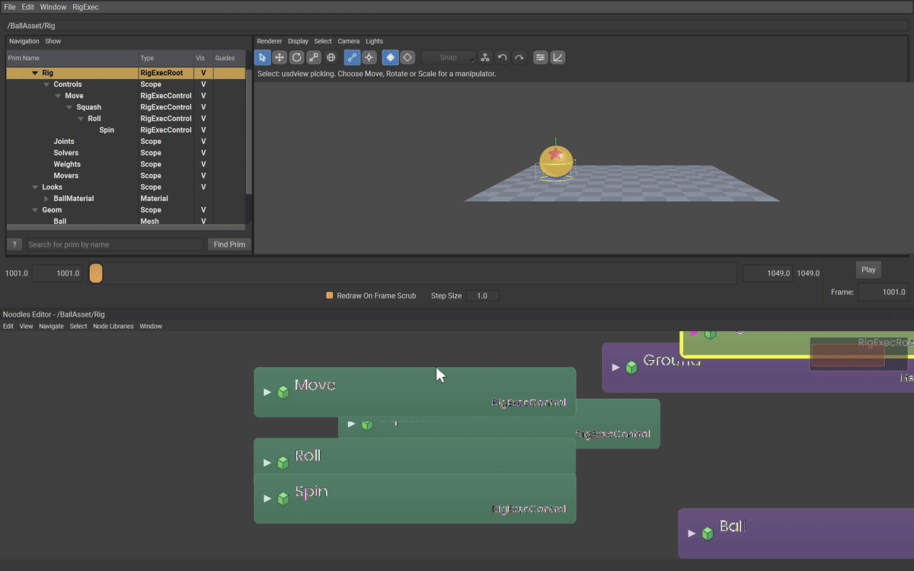

Controls are what an animator touches; [Joints](../nodes/joint.md) are
what a solver writes and a mover reads. This rig needs one per control, in
the same shape: `Root ▸ Squash ▸ Roll ▸ Spin`. Create them the same way —
**Tab**, `RigExecJoint`, **Return**, rename — with the parent joint
selected each time. No API schema: a joint needs none.

```usda
def RigExecJoint "Root"
{
    matrix4d rest:space = ( (1, 0, 0, 0), (0, 1, 0, 0), (0, 0, 1, 0), (0, 0, 0, 1) )

    def RigExecJoint "Squash"
    {
        matrix4d rest:space = ( (1, 0, 0, 0), (0, 1, 0, 0), (0, 0, 1, 0), (0, 0, 0, 1) )

        def RigExecJoint "Roll"
        {
            matrix4d rest:space = ( (1, 0, 0, 0), (0, 1, 0, 0), (0, 0, 1, 0), (0, 1, 0, 1) )

            def RigExecJoint "Spin"
            {
                matrix4d rest:space = ( (1, 0, 0, 0), (0, 1, 0, 0), (0, 0, 1, 0), (0, 0, 0, 1) )
            }
        }
    }
}
```

`Roll`'s bind frame is the ball's centre, for the same reason the
control's is: the mover divides the posed frame by the rest frame, and the
two have to agree about where the ball turns.

## Step 7 — the FK chain

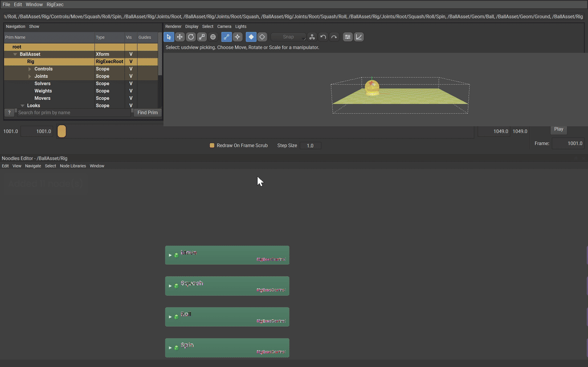

An [FK Chain](../nodes/fk_chain.md) is the solver that maps controls onto
joints, one to one, in order.

**In the UI:** select the `Solvers` scope, **Tab**, `RigExecFkChain`,
**Return**, rename to `BallChain`. The new node opens with its rows
showing: **drag from its `rigExec:controls` pin onto each control node**
in turn — `Move`,
`Squash`, `Roll`, `Spin` — and from `rigExec:joints` onto `Root`,
`Squash`, `Roll`, `Spin`. The order you drop them in is the order the
chain pairs them in.

```usda
def RigExecFkChain "BallChain"
{
    rel rigExec:controls = [
        </BallAsset/Rig/Controls/Move>,
        </BallAsset/Rig/Controls/Move/Squash>,
        </BallAsset/Rig/Controls/Move/Squash/Roll>,
        </BallAsset/Rig/Controls/Move/Squash/Roll/Spin>,
    ]
    uniform token rigExec:controlSpace = "parentRelative"
    rel rigExec:joints = [
        </BallAsset/Rig/Joints/Root>,
        </BallAsset/Rig/Joints/Root/Squash>,
        </BallAsset/Rig/Joints/Root/Squash/Roll>,
        </BallAsset/Rig/Joints/Root/Squash/Roll/Spin>,
    ]
}
```

`rigExec:controlSpace = "parentRelative"` is required and is **not** the
fallback. The fallback is `world`, which reads each control's whole
world transform and applies it to the joint; with a nested control
hierarchy that composes every ancestor's motion twice and the ball leaves
the ground within a few frames. See
[What no editor can author](#what-no-editor-can-author) — this is one of
the five values you have to type.

## Step 8 — the skin

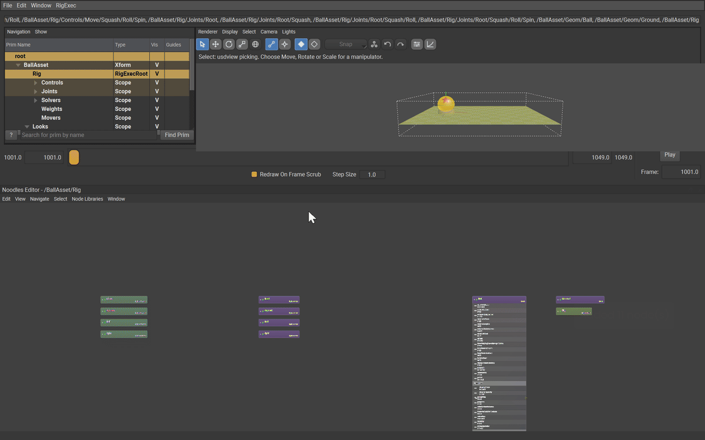

One [Matrix Mover](../nodes/matrix_mover.md) carries the whole ball from
the last joint, under a [Static Weight](../nodes/static_weight.md) of 1.

**In the UI:** create `RigExecStaticWeight` under `Weights` and drag its
`rigExec:weightTarget` pin onto the **`points` row** of the `Ball` node —
a weight object is a field over a property's elements, not over a prim.
Create `RigExecMatrixMover` under `Movers`, apply `RigExecMoverAPI` from
the hotbox, then drag `rigExec:moves` onto `Ball.points`,
`rigExec:transform` onto the `Spin` joint and `rigExec:weightObject` onto
the weight.

```usda
def RigExecStaticWeight "BallWeight"
{
    uniform float rigExec:defaultWeight = 1
    rel rigExec:weightTarget = </BallAsset/Geom/Ball.points>
}

def RigExecMatrixMover "BallSkin" (
    prepend apiSchemas = ["RigExecMoverAPI", "NodeGraphNodeAPI"]
)
{
    rel rigExec:moves = </BallAsset/Geom/Ball.points>
    rel rigExec:transform = </BallAsset/Rig/Joints/Root/Squash/Roll/Spin>
    rel rigExec:weightObject = </BallAsset/Rig/Weights/BallWeight>
}
```

The weight's representation stays at its `constant` fallback and its
envelope is `defaultWeight = 1`: every point of the ball is carried
whole. A `dense` array of per-point weights is what you reach for when
part of a mesh follows a joint and part of it does not — here nothing
does.

Select `Move`, pick **Move** on the viewport toolbar (or press **W**) and
drag the red X handle. The ball follows the control. It also **slides**,
which is the problem the next step solves.

## Step 9 — make the roll a consequence of the travel

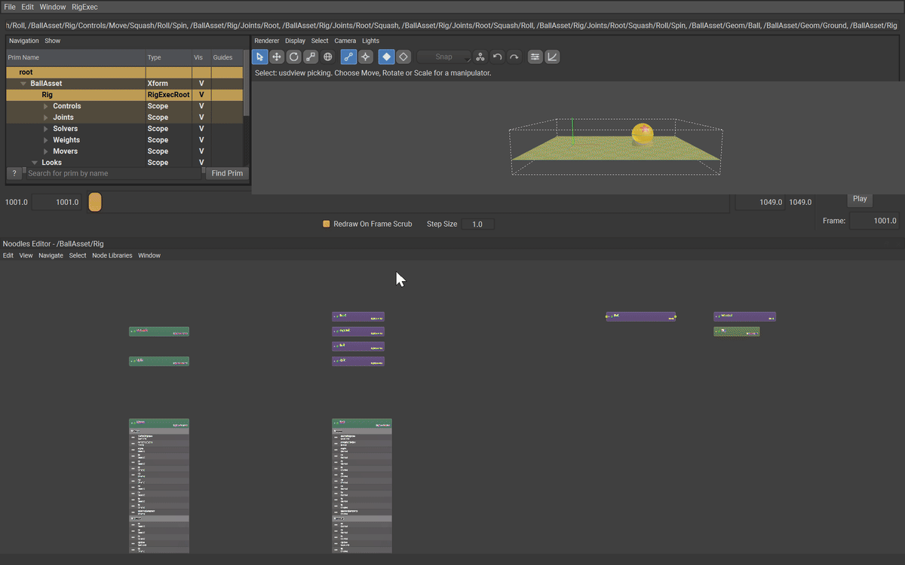

This is the step the whole tutorial is for.

A ball of radius *r* that rolls without slipping turns by the arc it
covers: rolling forward a distance *d* turns it *d / r* radians. Travelling
along **+X** turns it about **−Z**, so

```text
rz(radians) = -tx / r
rz(degrees) = -tx * 180 / (pi * r)
            = -57.29578 * tx          for r = 1
```

One full turn is 360° and carries the ball `2 * pi * r` = 6.2832 units.
Over the 8 units this shot travels the ball turns −458.37°, one and a
quarter revolutions.

You could key that by hand on `Roll.avars:rz`, and it would be wrong the
first time anyone changes the timing. Instead, derive it. A
[Float Math Mover](../nodes/float_math_mover.md) revises one exact float
property; its `inputs:value` accepts a **connection**, so it can read a
number from somewhere else on the stage. Point it at the travel, multiply,
and write the answer into the roll:

```usda
def RigExecFloatMathMover "RollFromTravelX" (
    prepend apiSchemas = ["RigExecMoverAPI", "NodeGraphNodeAPI"]
)
{
    float inputs:value = 0
    float inputs:value.connect = </BallAsset/Rig/Controls/Move.avars:tx>
    rel rigExec:moves = </BallAsset/Rig/Controls/Move/Squash/Roll.avars:rz>
    uniform token rigExec:operation = "multiply"
}
```

`multiply` computes `r = incoming * inputs:value`, where *incoming* is the
target's own authored value — the −57.29578 gain from Step 5 — and
`inputs:value` is the travel arriving down the connection. So

```text
Roll.avars:rz  =  -57.29578  *  Move.avars:tx
```

and the roll is recomputed every frame from wherever the ball happens to
be. There is nothing to key on it and nothing to keep in sync.

**In the UI:** select `Roll`, open the Avar Editor
(**RigExec ▸ General Editors ▸ Avar Editor**), set its **Write** mode to
**Default (the rest value)** — a gain is not a pose and has no business
being a key — and type the number into the `rz` box. The box carries
three decimals, so what you type is `-57.296`; over the whole eight-unit
shot that is two thousandths of a degree away from the exact figure.
Commit it with **Tab**.

Then create `RigExecFloatMathMover` under `Movers`, apply
`RigExecMoverAPI`, drag `rigExec:moves` onto the **`avars:rz` row** of the
`Roll` node, and drag from the **right-hand edge of the `avars:tx` row on
the `Move` node** onto the mover's **`value`** row (the row `inputs:value`
is drawn as, under the node's `inputs` header). A property row draws no
output dot until something is connected to it; the drag starts from the
row's edge all the same. That second drag is an attribute
connection rather than a relationship — a value travelling, not a
reference.

Property chains resolve *before* exec runs, so the revised `rz` is what
the FK chain sees in the same evaluation; nothing is a frame late.

Drag `Move`'s X handle again and the ball rolls, star and band sweeping
over the top, with no keys on any rotation.

For sideways travel, add a second mover the same way with
`inputs:value.connect` on `Move.avars:tz`, `rigExec:moves` on
`Roll.avars:rx`, and a gain of **+57.29578** — travelling along +Z turns
the ball about +X, so the sign flips.

## Step 10 — key the travel, and only the travel

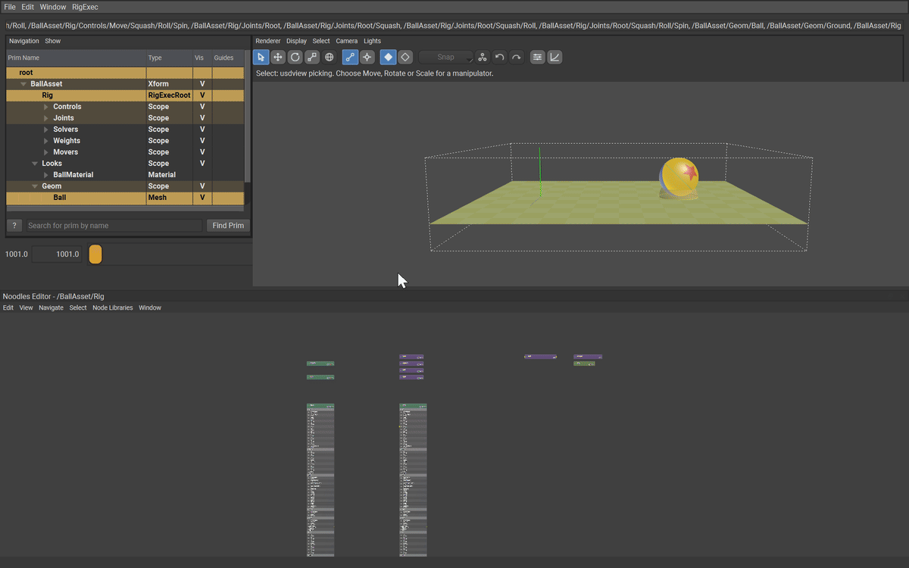

Select `Move`. Put the gizmo on **Animation** on the viewport toolbar and
the Avar Editor's own **Write** box on **Animation (key at current
frame)** — that is what makes an edit author a key at the current frame
instead of a default. Go to frame 1001, type `0` into the Avar Editor's
`tx` box and press **Tab**; go to 1049, type `8`, **Tab** again. (Tab is
the commit key here: Return leaves the box showing the old number.)

```usda
double avars:tx.spline = {
    1001: 0; pre (0, 0); post linear,
    1049: 8; post linear,
}
```

Two keys on one channel, and the ball rolls eight units without slipping.
Move them, retime them, add an ease — the roll follows, because it is not
a channel.

## Playback

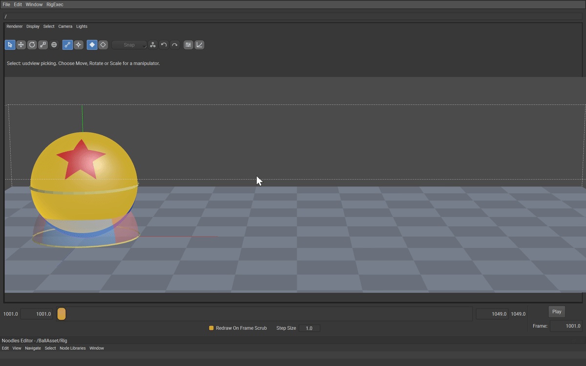

Drag usdview's frame slider from 1001 to 1049, or press **Play**. The rig
evaluates live: no bake, no export. The star and the band are what tell
you it is rolling — watch the contact point stay put under the ball as it
crosses the ground.

## What no editor can author

Everything above happens with the pointer except five values, and the
reason is worth knowing: **usdNoodles has no attribute-value editor**. It
creates prims, renames them, applies API schemas, draws relationships and
connections, and moves nodes — but nothing in it sets a value. usdview's
own property panel is read-only, and the Layer Opinions panel
(**RigExec ▸ General Editors ▸ Layer Opinions**) edits and deletes
opinions that already exist rather than creating them.

The Avar Editor covers the `avars` and the viewport manipulators cover
poses and rest offsets, which is most of a rig. What is left here is
three `uniform` properties — and `uniform` is exactly the kind no
animation UI touches — plus the two `rest:space` matrices from Steps 5
and 6, because a `matrix4d` is not a number a spin box takes:

```usda
# /BallAsset/Rig/Solvers/BallChain
uniform token rigExec:controlSpace = "parentRelative"

# /BallAsset/Rig/Weights/BallWeight
uniform float rigExec:defaultWeight = 1

# /BallAsset/Rig/Movers/RollFromTravelX
uniform token rigExec:operation = "multiply"

# /BallAsset/Rig/Controls/Move/Squash/Roll and
# /BallAsset/Rig/Joints/Root/Squash/Roll
matrix4d rest:space = ( (1,0,0,0), (0,1,0,0), (0,0,1,0), (0,1,0,1) )
```

usdview does have somewhere to type them, and it is not a text editor:
**Window ▸ Interpreter**. The recordings for Steps 7, 8 and 9 each open
it, type three lines and close it again, so you can see exactly where the
value goes:

```python
from pxr import Sdf
p = usdviewApi.stage.GetPrimAtPath('/BallAsset/Rig/Solvers/BallChain')
p.CreateAttribute('rigExec:controlSpace', Sdf.ValueTypeNames.Token, False, Sdf.VariabilityUniform).Set('parentRelative')
```

The others are the same three lines with a different path, name, type and
value — `Sdf.ValueTypeNames.Float` and `1.0` for the weight's envelope,
`Sdf.ValueTypeNames.Token` and `'multiply'` for the mover's operation,
and `Sdf.ValueTypeNames.Matrix4d` with
`Gf.Matrix4d().SetTranslate(Gf.Vec3d(0, 1, 0))` (and
`Sdf.VariabilityVarying` rather than uniform) for the two `rest:space`
frames. Editing the `.usda` and reloading (**File ▸ Reload All Layers**)
does the same job, and `docs/examples/tutorial_rolling_ball.usda` already
has every one of them.

## Where to go next

* [Baked and dynamic evaluation](baked-vs-dynamic.md) — the same rig, two
  ways to compute it.
* [Two-Bone IK](../nodes/two_bone_ik.md) — the next solver up, and the one
  that makes a limb out of the chain you just built.
* [Lattice Mover](../nodes/lattice_mover.md) — squash and stretch as a
  deformation rather than a scale, for when scaling the whole ball is too
  blunt.
