# RigExec nodes

One page per operator: what it does, how to wire it, every
parameter, and a minimal animated example. Each example stage
lives in [examples](examples/) and plays in `usdview` via
`bin\launch_usdview.bat`; the GIF on each page is rendered
live from that stage by `docs/render_media.py`, an offscreen
Storm viewport with the rig guides on.

## Rig

| | Node | Does |
|---|---|---|
|  | [Rig Root](nodes/rig_root.md) | The prim that makes a namespace a rig: partition, discovery root, evaluation unit. |

## Transform providers

| | Node | Does |
|---|---|---|
| 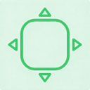 | [Control](nodes/control.md) | The animator's handle: animation is authored on its avars. |
| 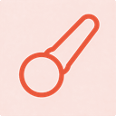 | [Joint](nodes/joint.md) | A posed output of the rig: solvers write it, movers read it. |

## Solvers

| | Node | Does |
|---|---|---|
| 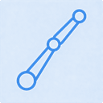 | [FK Chain](nodes/fk_chain.md) | Composes per-control local animation down a joint hierarchy. |
| 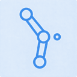 | [Two-Bone IK](nodes/two_bone_ik.md) | Aims a two-segment limb at an effector with pole-vector control. |
|  | [Spline IK](nodes/spline_ik.md) | Lays a joint chain along a curve built from three controls. |
| 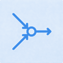 | [Blend Point Frames](nodes/blend_point_frames.md) | Blends two solver poses per joint under one weight. |
| 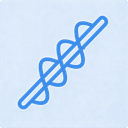 | [Twist Distribution](nodes/twist_distribution.md) | Unwinds roll between two frames across N interpolated frames. |
|  | [Ribbon](nodes/ribbon.md) | Samples a driver curve into transported frames for wrap deformers. |

## Constraints

| | Node | Does |
|---|---|---|
| 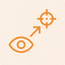 | [Aim Constraint](nodes/aim_constraint.md) | Rotates targets so a local axis points at blended sources. |
| 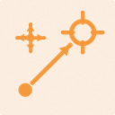 | [Position Constraint](nodes/position_constraint.md) | Moves one provider to the weighted average of its sources' origins. |
| 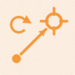 | [Rotation Constraint](nodes/rotation_constraint.md) | Copies orientation from blended sources, leaving position alone. |
| 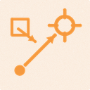 | [Scale Constraint](nodes/scale_constraint.md) | Copies blended source scale onto one target, per axis. |
| 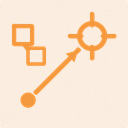 | [Parent Constraint](nodes/parent_constraint.md) | Carries a target with its sources — position and rotation — under a per-source offset; weight attaches and releases. |
| 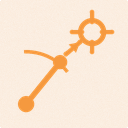 | [Single-Chain IK Constraint](nodes/single_chain_ik_constraint.md) | Re-poses an existing joint chain of any length onto an effector goal. |

## Geometry movers

| | Node | Does |
|---|---|---|
| 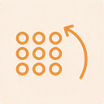 | [Matrix Mover](nodes/matrix_mover.md) | Carries points by a provider's rigid delta under a weight field. |
| 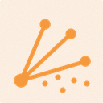 | [Skin Mover](nodes/skin_mover.md) | Blends many influences per point in one pass, UsdSkel-style. |
|  | [Blendshape Mover](nodes/blendshape_mover.md) | Sums sculpted blend channels into one delta pass. |
| 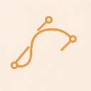 | [Curve Mover](nodes/curve_mover.md) | Transports points through a solver's frame array, or emits its frame origins. |
| 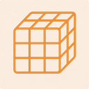 | [Lattice Mover](nodes/lattice_mover.md) | Deforms points through an animated Bernstein or B-spline cage. |
| 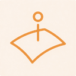 | [Surface Mover](nodes/surface_mover.md) | Drapes points onto an animated driver surface. |
| 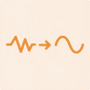 | [Smooth Mover](nodes/smooth_mover.md) | Relaxes points with uniform Laplacian smoothing. |
| 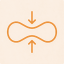 | [Volume Correct Mover](nodes/volume_correct_mover.md) | Pulls a deformation back toward its rest bound volume. |

## Curvenet

| | Node | Does |
|---|---|---|
| 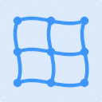 | [Curvenet](nodes/curvenet.md) | A net of cubic profile curves that articulates a surface independently of its tessellation. |
|  | [Curvenet Adjustment](nodes/curvenet_adjustment.md) | A handle on one curvenet knot, posed in the deformed frame. |
| 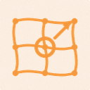 | [Curvenet Adjuster Mover](nodes/curvenet_adjuster_mover.md) | Applies knot and tangent controls in the frame of the already-deformed net. |
|  | [Curvenet Mover](nodes/curvenet_mover.md) | The Profile Mover: propagates a posed curvenet onto a surface. |

## Blend channels

| | Node | Does |
|---|---|---|
| 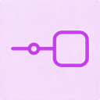 | [Blend Input](nodes/blend_input.md) | One weighted channel of sculpted targets inside a blendshape pass. |
| 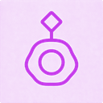 | [Blend Sample](nodes/blend_sample.md) | One sculpted target at a fixed channel activation. |

## Pose space

| | Node | Does |
|---|---|---|
| 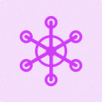 | [Pose Interpolator](nodes/pose_interpolator.md) | Turns a driver's rotation into one float per authored pose. |
| 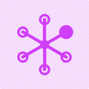 | [Pose](nodes/pose.md) | One place the driver can be, and the float it publishes when the driver gets there. |

## Weights

| | Node | Does |
|---|---|---|
| 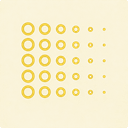 | [Static Weight](nodes/static_weight.md) | A painted, time-invariant weight field over moved points. |
| 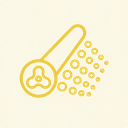 | [Dynamic Weight](nodes/dynamic_weight.md) | The joint is frozen; only the painted field is animated. |
|  | [Sphere Weight](nodes/sphere_weight.md) | A ball of influence: radial falloff generated from a placed volume. |
| 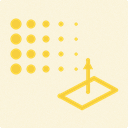 | [Plane Weight](nodes/plane_weight.md) | A half-space gradient: everything past the placed plane is weighted in. |
|  | [Curve Weight](nodes/curve_weight.md) | A tube of influence around a curve's control polygon. |
| 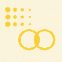 | [Combine Weight](nodes/combine_weight.md) | Folds several weight fields into one under a single mode. |
| 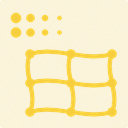 | [Curvenet Weight](nodes/curvenet_weight.md) | Paints a weight field on a curvenet and solves it onto a mesh. |

## Property math

| | Node | Does |
|---|---|---|
| 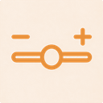 | [Float Math Mover](nodes/float_math_mover.md) | Arithmetic on one scalar channel: add, clamp, remap, blend. |
| 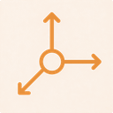 | [Vec3f Math Mover](nodes/vec3f_math_mover.md) | Component-wise arithmetic on one vector-valued property. |
|  | [Matrix Math Mover](nodes/matrix_math_mover.md) | Multiplies or blends one matrix channel. |

## Interface

| | Node | Does |
|---|---|---|
|  | [Picker](nodes/picker.md) | A character's control picker panel, shipped as scene data. |
| 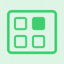 | [Picker Panel](nodes/picker_panel.md) | One sub-tab of a picker: a 2D canvas of buttons. |
|  | [Picker Button](nodes/picker_button.md) | One clickable shape: selects controls, flips a switch, or decorates. |
|  | [Touch Regions](nodes/touch_regions.md) | Named face sets that turn the model itself into the control picker. |
|  | [Touch Region](nodes/touch_region.md) | A named set of mesh faces that selects the control posing them. |

Implementation and design notes live in [specs](specs/).
