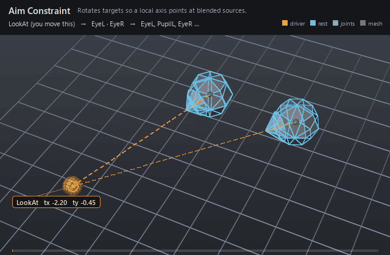

#  Aim Constraint

*Rotates targets so a local axis points at blended sources.*

| | |
|---|---|
| **Node type** | `RigExecAimConstraint` |
| **Example** | [aim_constraint.usda](../examples/aim_constraint.usda) |

On this page:

- [Overview](#overview)
- [How it works](#how-it-works)
- [Wiring](#wiring)
- [Parameters](#parameters)
- [Example](#example)
- [Tips](#tips)
- [See also](#see-also)

## Overview



FBX-style aim: the transform named by `rigExec:moves` rotates so its
aim vector points at the weighted source position, stabilized by the
world-up policy. The everyday use is eyes tracking a look-at control,
but the same node aims turrets, spotlights, and driven props.

FBX-style aim constraint. It rotates each transform named by
RigExecMoverAPI rigExec:moves so inputs:aimVector points toward the
weighted source position, with the selected world-up policy, axis masks,
offset, and inherited normalized weight.

rigExec:aimTarget, rigExec:aimAxis, rigExec:upPolicy, and
rigExec:preserve are retained as the legacy RigExec authoring contract so
existing assets keep their authored fields. New assets use the inherited
ordered rigExec:sources relationship and the FBX-style inputs below.

## How it works

In the pose phase the constraint blends the ordered `rigExec:sources`
into one goal position, builds the aim rotation from `inputs:aimVector`,
`inputs:upVector`, and the world-up mode, then mixes the result over the
incoming pose through the common mover envelope. Axis masks and the
rotation offset shape the result per channel, and only rotation is
written. New assets use `sources`; `aimTarget`/`aimAxis`/`upPolicy`/
`preserve` are the legacy contract kept for existing stages.

## Wiring

| Relationship | Points to | Required |
|---|---|---|
| `rigExec:sources` | Ordered transform sources to track. | yes |
| `rigExec:moves` | Exactly one joint or provider to re-aim (pose phase). | yes |
| `rigExec:worldUpObject` | Provider for object world-up modes. | no |

## Parameters

### Common mover envelope

#### `rigExec:moves`

*Relationship.*

Reserved write-set relationship: exact prim/property targets.

#### `inputs:enabled`

*Type:* `bool`. *Default:* `true`.

Shape-preserving enable. Disabled movers pass their preceding
revision through unchanged (value-only edit).

#### `inputs:defaultWeight`

*Type:* `float`. *Default:* `1`.

Normalized common mover envelope in [0, 1]. With no bound
rigExec:weightObject it broadcasts over every logical element: zero
passes the incoming value through bit-for-bit and one applies the
mover's full-strength result.

#### `rigExec:weightObject`

*Relationship.*

Optional compatible total weight field, at most one target.
When bound, the weight object's values (including its own sparse or
constant fallback) supply the common envelope instead of
inputs:defaultWeight. Target, domain, and cardinality must match each
mover application; an incompatible binding is a compile error. A
multi-target mover may bind only a constant operation envelope whose
weightTarget is the mover prim itself; that one value broadcasts to
every application of the atomic mover.

### Constraint base

#### `rigExec:locked`

*Type:* `uniform bool`. *Default:* `false`.

Authoring lock metadata for DCC interchange. Evaluation
remains active while locked; use RigExecMoverAPI inputs:enabled or
inputs:defaultWeight to disable or blend the operation.

#### `inputs:affectTranslationX`

*Type:* `bool`. *Default:* `true`.

Per-axis translation mask. Ignored groups are a compile error.

#### `inputs:affectTranslationY`

*Type:* `bool`. *Default:* `true`.

#### `inputs:affectTranslationZ`

*Type:* `bool`. *Default:* `true`.

#### `inputs:affectRotationX`

*Type:* `bool`. *Default:* `true`.

Per-axis rotation mask. Ignored groups are a compile error.

#### `inputs:affectRotationY`

*Type:* `bool`. *Default:* `true`.

#### `inputs:affectRotationZ`

*Type:* `bool`. *Default:* `true`.

#### `inputs:affectScaleX`

*Type:* `bool`. *Default:* `true`.

Per-axis scale mask. Ignored groups are a compile error.
RigExecParentConstraint overrides the default to false to match the
FBX runtime, which leaves scale off unless it is asked for.

#### `inputs:affectScaleY`

*Type:* `bool`. *Default:* `true`.

#### `inputs:affectScaleZ`

*Type:* `bool`. *Default:* `true`.

#### `inputs:translationOffset`

*Type:* `double3`. *Default:* `(0, 0, 0)`.

Additive translation offset applied after the source blend.

#### `inputs:rotationOffset`

*Type:* `double3`. *Default:* `(0, 0, 0)`.

Additive Euler rotation offset in degrees, applied after the blend.

#### `inputs:scaleOffset`

*Type:* `double3`. *Default:* `(0, 0, 0)`.

ADDITIVE scale offset applied after the blend, which is why
its identity is (0, 0, 0) and not (1, 1, 1): the kernel computes
blendedScale + offset. A multiplicative offset would be a different
operator, not a different default.

#### `rigExec:rotationOrder`

*Type:* `uniform token`. *Default:* `"XYZ"`.

Valid values: `XYZ`, `XZY`, `YXZ`, `YZX`, `ZXY`, `ZYX`.

Euler order for the operators that compose a rotation.
Authoring it on one that does not is a compile error.

### Ordered sources

#### `rigExec:sources`

*Relationship.*

Ordered transform sources. Order is preserved through
composition because it identifies entries in every parallel source
array.

#### `inputs:sourceWeights`

*Type:* `float[]`. *Default:* `[]`.

Per-source weights parallel to rigExec:sources. An empty
array gives every source equal, full weight. A non-empty array must
have exactly one entry per source.

### Node parameters

#### `inputs:aimVector`

*Type:* `double3`. *Default:* `(1, 0, 0)`.

Local-space vector that points toward the constrained aim direction.

#### `inputs:upVector`

*Type:* `double3`. *Default:* `(0, 1, 0)`.

Local-space vector used to stabilize roll around the aim direction.

#### `inputs:worldUpVector`

*Type:* `double3`. *Default:* `(0, 1, 0)`.

World-space up vector used by vector world-up modes.

#### `rigExec:worldUpObject`

*Relationship.*

Optional single transform provider used by object world-up modes.

#### `rigExec:worldUpType`

*Type:* `uniform token`. *Default:* `"none"`.

Valid values: `sceneUp`, `objectUp`, `objectRotationUp`, `vector`, `none`.

#### `rigExec:aimTarget`

*Relationship.*

Legacy single aim source; retained for backward compatibility.

#### `rigExec:aimAxis`

*Type:* `uniform token`. *Default:* `"x"`.

Valid values: `x`, `y`, `z`.

Legacy positive-axis selector retained for existing assets.

#### `rigExec:upPolicy`

*Type:* `uniform token`. *Default:* `"preserveInputUp"`.

Valid values: `preserveInputUp`.

Legacy up policy retained for existing assets.

#### `rigExec:preserve`

*Type:* `uniform token[]`. *Default:* `["origin", "scale"]`.

Legacy component-preservation declaration retained for existing assets.

## Example

Two eye joints track a look-at control that sweeps across the front of
the face. The control carries its own solid sphere guide, so the thing
being aimed at is a visible orange ball rather than an implied point: it
slides from one side to the other and each eye swings through about 100
degrees end to end following it. Each eye is a white card with a dark
pupil card in front, both skinned rigidly to the aimed joint, so the
pupils swing with the target.

Open it live with:

```bat
bin\launch_usdview.bat docs\examples\aim_constraint.usda
```

Re-render the GIF above with:

```bat
python docs/render_media.py --page aim_constraint
```

## Tips

- Put pose-phase constraints in a scope ordered below Geometry (bottom executes first) so skinning reads their final output.
- `rigExec:worldUpType = "vector"` with `inputs:worldUpVector` +Y keeps eyes level while they swing; `none` applies no roll correction at all (FBX minimum swing) -- but only once `rigExec:sources` is authored, because the legacy `rigExec:aimTarget` spelling still preserves the input up.
- Make the look-at handle visible: it is an ordinary control, so on the RigExecControl prim `guide:shape = "sphere"` with `guide:drawMode = "geometry"` draws a solid ball at its posed origin instead of the default wire circle, sized by `guide:scaleX/Y/Z` times the evaluated frame scale. Seeing the target is what makes an aim rig readable -- an eye pointing at nothing is just a rotating eye.

## See also

- [Matrix Mover](matrix_mover.md)
- [Control](control.md)
- [Joint](joint.md)

---

[RigExec nodes](../index.md)
