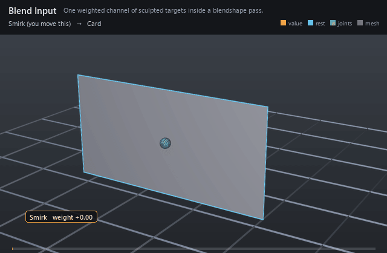

#  Blend Input

*One weighted channel of sculpted targets inside a blendshape pass.*

| | |
|---|---|
| **Node type** | `RigExecBlendInput` |
| **Example** | [blend_input.usda](../examples/blend_input.usda) |

On this page:

- [Overview](#overview)
- [How it works](#how-it-works)
- [Wiring](#wiring)
- [Parameters](#parameters)
- [Example](#example)
- [Tips](#tips)
- [See also](#see-also)

## Overview



A single channel — a smile, a brow raise, a phoneme. It carries one
animated `inputs:weight` and an ordered list of target samples; the
blendshape mover sums every bound channel into the final delta. Channels
are independent, so weights layer without interfering.

One independently composable blend channel with an authored or
connected weight and relationships to samples.

## How it works

The channel evaluates its samples against the weight: below the
first activation the delta fades in, between samples it interpolates,
past the last it holds (or extrapolates, per the mover). The result is
one delta array the mover adds to its sum.

## Wiring

| Relationship | Points to | Required |
|---|---|---|
| `rigExec:samples` | Ordered target samples for this channel. | yes |
| (bound by) | A blendshape mover's `rigExec:blendInputs` sums this channel. | - |

## Parameters

### Node parameters

#### `inputs:weight`

*Type:* `float`. *Default:* `0`.

#### `rigExec:samples`

*Relationship.*

## Example

One channel, one target: the Smirk weight sweeps 0 → 1 → 0 and the
card's right column slides sideways with it — the smallest possible
blend channel.

Open it live with:

```bat
bin\launch_usdview.bat docs\examples\blend_input.usda
```

Re-render the GIF above with:

```bat
python docs/render_media.py --page blend_input
```

## Tips

- One input per facial action keeps weights directable; combine them in the mover, not in the sculpts.
- Nest samples under their input so the channel reads as one unit in the graph.

## See also

- [Blendshape Mover](blendshape_mover.md)
- [Blend Sample](blend_sample.md)
- [Float Math Mover](float_math_mover.md)

---

[RigExec nodes](../index.md)
