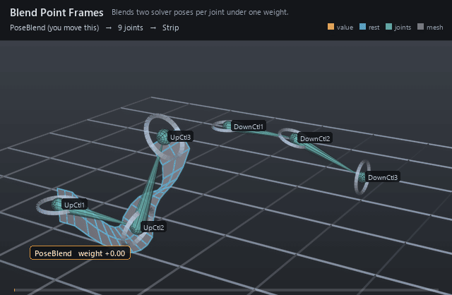

#  Blend Point Frames

*Blends two solver poses per joint under one weight.*

| | |
|---|---|
| **Node type** | `RigExecBlendPointFrames` |
| **Example** | [blend_point_frames.usda](../examples/blend_point_frames.usda) |

On this page:

- [Overview](#overview)
- [How it works](#how-it-works)
- [Wiring](#wiring)
- [Parameters](#parameters)
- [Example](#example)
- [Tips](#tips)
- [See also](#see-also)

## Overview



The IK/FK switch and everything like it: two solvers describe the same
skeleton, and the blend mixes their aggregates element by element under
`inputs:weight`. At 0 the A pose wins, at 1 the B pose wins, and between
them rotations take the shortest arc while scales blend logarithmically.
The two inputs only have to agree on element count — what each of them
poses, its own joints or nothing at all, is its own business. Blending is how
to *mix* two solvers on one skeleton; stacking them — naming the same joints
on both `rigExec:joints` lists — is how to have the later writer replace the
earlier one's frames outright.

IK/FK or general frame blend of two aggregate providers.
Publishes computePointFrameArray. Weight 0 selects inputA; 1 selects
inputB.

## How it works

The blend runs in the pose phase, in a batch after both inputs (an
`inputA`/`inputB` solver is a dependency, so the compiler's levels put it
in an earlier batch), and writes one blended frame per joint listed in
`rigExec:joints`; matrix movers then read those joints normally at the
`final` phase. Each element is blended as a rest-to-pose transform measured
against the A aggregate's rest landmarks — translation lerps, rotation
slerps shortest-arc, scale follows `rigExec:scaleBlend` — so a mid-weight
pose is the interpolation of the two transforms, not the midpoint of the
two skeletons' joints, and an intermediate chain can sit a little off the
average of the poses it is between. The blend still MEASURES both inputs
against the rests carried inside the A aggregate, but it APPLIES the blended
map to the joint's own rest reference — the frame a pose step below the blend
left there (spec section 4.2) — so a constrained joint carries its
displacement through the blend rather than losing it.

## Wiring

| Relationship | Points to | Required |
|---|---|---|
| `rigExec:inputA` | Aggregate solver selected at weight 0; unwired, inputB's pose passes through at every weight. | no |
| `rigExec:inputB` | Aggregate solver selected at weight 1; unwired, inputA's pose passes through at every weight. | no |
| `rigExec:joints` | Ordered joints the blend poses, one per aggregate element; omit only for a guide-only blend another solver reads. | no |

## Parameters

### Node parameters

#### `purpose`

*Type:* `uniform token`. *Default:* `"guide"`.

Render purpose, overriding UsdGeomImageable's `default`
fallback: joint and solver guides are DIAGNOSTICS, drawn when a
viewer asks for guides.

This is the stock attribute rather than a RigExec-specific token so
that the bounds and the drawing cannot disagree: UsdGeomBBoxCache
classifies a prim's extent by this exact attribute, and the results
scene index stamps the same resolved value onto the guide it
synthesizes. A control keeps the inherited `default` -- it is the
rig's interaction surface, not a diagnostic -- and authoring
`guide` on one moves both its drawing and its bounds together.

#### `rigExec:inputA`

*Relationship.*

#### `rigExec:inputB`

*Relationship.*

#### `inputs:weight`

*Type:* `float`. *Default:* `0`.

#### `rigExec:rotationBlend`

*Type:* `uniform token`. *Default:* `"shortestArc"`.

Valid values: `shortestArc`.

#### `rigExec:scaleBlend`

*Type:* `uniform token`. *Default:* `"log"`.

Valid values: `log`, `linear`.

#### `rigExec:joints`

*Relationship.*

Ordered output joints posed by the blended result (view-free
extraction). List position is the element index; the compiler
binds each joint to one aggregate element.

#### `guide:radius`

*Type:* `double`. *Default:* `1.0`.

Radius of the sphere and cone drawn at each aggregate
element: the exact counterpart of RigExecJoint's guide:radius,
including the rule that zero or negative draws no guides at all,
which is how a solver's diagnostics are turned off.

Without it the elements are stuck at Hydra's fallback radius of
1.0. That is proportionate on an asset authored at tens of units
and several times the size of the whole character on one authored
at one unit -- the joints were given this knob for exactly that
reason and the aggregate solvers were not, so turning guide
display on for a small asset buried it in solver geometry.

#### `guide:displayColor`

*Type:* `color3f`. *Default:* `(0.3, 0.6, 1.0)`.

#### `guide:displayOpacity`

*Type:* `float`. *Default:* `0.5`.

## Example

Two FK chains hold very different poses of one three-joint arm, four
units apart so neither hides the other. `FkUp` — the `UpCtl` rings in the
near lane, posing `PoseUp1/2/3` — is input **A**, a tight upward curl;
`FkDown` — the `DownCtl` rings in the far lane, posing `PoseDown1/2/3` —
is input **B**, a long low hook. `PoseBlend` writes the mix into
`Arm1/Arm2/Arm3`, and three matrix movers skin a 21×3 strip to those
three joints, so the strip is the only thing in frame that shows what the
blend produced. The weight sweeps 0 → 1 and back: at 0 the strip lies on
the A chain, at 1 on the B chain, and every value between is the
interpolation of the two *transforms* — a shape neither input has, and
not the average of the two skeletons' joint positions.

Open it live with:

```bat
bin\launch_usdview.bat docs\examples\blend_point_frames.usda
```

Re-render the GIF above with:

```bat
python docs/render_media.py --page blend_point_frames
```

## Tips

- The two inputs must publish the same number of elements: a cardinality mismatch warns and publishes nothing, and the joints then fall back to their rest chain rather than to either pose.
- An unwired `rigExec:inputA` or `rigExec:inputB` is not an error — the other input passes through unchanged at every weight, so a half-wired switch looks like a rig that simply ignores its weight.
- The kernel clamps `inputs:weight` to [0, 1], but shape it with a Float Math mover (as in `float_math_mover.usda`) when you want the extremes to dwell instead of relying on that bound.

## See also

- [FK Chain](fk_chain.md)
- [Two-Bone IK](two_bone_ik.md)
- [Float Math Mover](float_math_mover.md)

---

[RigExec nodes](../index.md)
