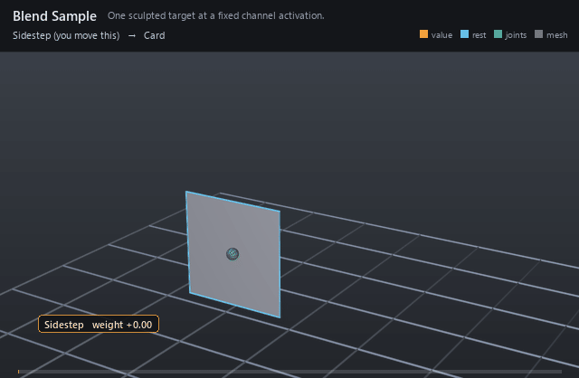

#  Blend Sample

*One sculpted target at a fixed channel activation.*

| | |
|---|---|
| **Node type** | `RigExecBlendSample` |
| **Example** | [blend_sample.usda](../examples/blend_sample.usda) |

On this page:

- [Overview](#overview)
- [How it works](#how-it-works)
- [Wiring](#wiring)
- [Parameters](#parameters)
- [Example](#example)
- [Tips](#tips)
- [See also](#see-also)

## Overview



A single pose on a channel's travel: full targets at activation 1,
in-betweens anywhere between. In-betweens shape the path — corners that
widen before they lift, lids that lag then catch up — instead of the
straight line one target would give.

One target or in-between activation, related EITHER to an exact
native target-shape points property or to a UsdSkelBlendShape carrying the
same shape as sparse offsets. Exactly one of rigExec:targetPoints and
rigExec:blendShape may be authored.

## How it works

Each sample names its sculpt through `rigExec:targetPoints` and its
position on the channel through `rigExec:activation`. The channel
interpolates between neighboring samples by weight, so a 0.5 sample is
the pose the channel passes through halfway up.

## Wiring

| Relationship | Points to | Required |
|---|---|---|
| `rigExec:targetPoints` | Native points prim holding the sculpt. | yes |
| (listed by) | The parent blend input's `rigExec:samples`. | - |

## Parameters

### Node parameters

#### `rigExec:activation`

*Type:* `float`. *Default:* `1`.

#### `rigExec:targetPoints`

*Relationship.*

Exact native points property of the target shape.

#### `rigExec:blendShape`

*Relationship.*

A UsdSkelBlendShape whose offsets (and pointIndices, when
non-empty) ARE the sample's deltas -- the same shape rigExec:targetPoints
expresses as a full moved-points array, stored as only the points that
move. An empty pointIndices means the offsets are dense and parallel to
the base points.

This exists because the dense form's cost does not depend on the weight.
A dense sample's full points array is read and copied off the stage once
per sample per frame whether its channel sits at 0 or at 1, measured at
0.37-0.38 ms per target per frame on a 26,276-point body -- so 169
correctives cost ~65 ms/frame with the rig standing at rest
(tools/biped/spikes/blend_cost.py). The real correctives move 4.87% of
the mesh, 1,279 points on average, so the sparse form is not an
optimization of the dense one; it is the difference between a rig that
runs and a rig that does not.

Mutually exclusive with rigExec:targetPoints: authoring both is a
compile error rather than a precedence rule, because a silent winner
between two shapes that disagree is the worst of the three outcomes.

#### `rigExec:pointsReadPhase`

*Type:* `uniform token`. *Default:* `"base"`.

Valid values: `base`, `preceding`, `final`.

## Example

One channel with two samples: at activation 0.5 the card shifts
right, at 1.0 it sits right and up, so sweeping the weight draws a
curved path instead of a straight slide.

Open it live with:

```bat
bin\launch_usdview.bat docs\examples\blend_sample.usda
```

Re-render the GIF above with:

```bat
python docs/render_media.py --page blend_sample
```

## Tips

- Activations need not be uniform: cluster in-betweens where the path curves hardest.
- Keep every target's point count identical to the moved mesh — topology must match exactly.

## See also

- [Blend Input](blend_input.md)
- [Blendshape Mover](blendshape_mover.md)
- [Static Weight](static_weight.md)

---

[RigExec nodes](../index.md)
