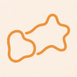
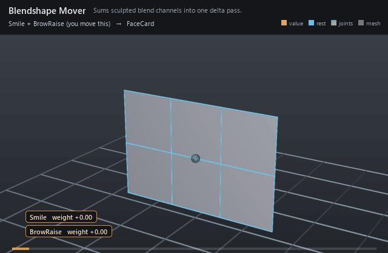

#  Blendshape Mover

*Sums sculpted blend channels into one delta pass.*

| | |
|---|---|
| **Node type** | `RigExecBlendShapeMover` |
| **Example** | [blendshape_mover.usda](../examples/blendshape_mover.usda) |

On this page:

- [Overview](#overview)
- [How it works](#how-it-works)
- [Wiring](#wiring)
- [Parameters](#parameters)
- [Example](#example)
- [Tips](#tips)
- [See also](#see-also)

## Overview



Applies facial-style blend shapes: each bound blend input contributes
its weighted channel delta, the mover sums them all, scales the total by
its weight object, and adds it to the moved points. Channels compose
independently, so a smile and a brow raise layer without interfering.

Applies independently composed blend inputs and native
target-shape points samples to an exact standard UsdGeomPointBased.points
property, then applies the common MoverAPI envelope to the accumulated
delta (spec section 7.3).

## How it works

Every `rigExec:blendInputs` channel evaluates its samples against
its weight (interpolating in-betweens by activation), producing one
delta array. The mover sums the channel deltas, multiplies by the common
envelope and the bound mask field, and revises the points. Target
topology must match the moved mesh point for point.

## Wiring

| Relationship | Points to | Required |
|---|---|---|
| `rigExec:blendInputs` | Blend channels to sum. | yes |
| `rigExec:weightObject` | Mask scaling the summed delta. | no |
| `rigExec:moves` | Exact points property to deform. | yes |

## Parameters

### Common mover envelope

#### `rigExec:moves`

*Relationship.*

Reserved write-set relationship: exact prim/property targets.

#### `inputs:enabled`

*Type:* `bool`. *Default:* `true`.

Shape-preserving enable. Disabled movers pass their preceding
revision through unchanged (value-only edit).

#### `inputs:defaultWeight`

*Type:* `float`. *Default:* `1`.

Normalized common mover envelope in [0, 1]. With no bound
rigExec:weightObject it broadcasts over every logical element: zero
passes the incoming value through bit-for-bit and one applies the
mover's full-strength result.

#### `rigExec:weightObject`

*Relationship.*

Optional compatible total weight field, at most one target.
When bound, the weight object's values (including its own sparse or
constant fallback) supply the common envelope instead of
inputs:defaultWeight. Target, domain, and cardinality must match each
mover application; an incompatible binding is a compile error. A
multi-target mover may bind only a constant operation envelope whose
weightTarget is the mover prim itself; that one value broadcasts to
every application of the atomic mover.

### Node parameters

#### `rigExec:blendInputs`

*Relationship.*

#### `rigExec:deltaSpace`

*Type:* `uniform token`. *Default:* `"target"`.

Valid values: `target`, `surfaceFrame`.

Target-space offsets by default; surfaceFrame rotates rest offsets into corresponding orthonormal vertex frames of the preceding mesh revision. Detail strength is independent of surface stretch.

## Example

A face card plays two channels in sequence: Smile sweeps through an
in-between (corners widen, then lift) and BrowRaise pulses the top row
up, all under a constant mask.

Open it live with:

```bat
bin\launch_usdview.bat docs\examples\blendshape_mover.usda
```

Re-render the GIF above with:

```bat
python docs/render_media.py --page blendshape_mover
```

## Tips

- Keep targets as invisible Points prims beside the geometry so the stage stays self-contained.
- A painted mask lets one mover shape the whole face while protecting the ears, neck seam, or scalp.

## See also

- [Blend Input](blend_input.md)
- [Blend Sample](blend_sample.md)
- [Static Weight](static_weight.md)

---

[RigExec nodes](../index.md)
