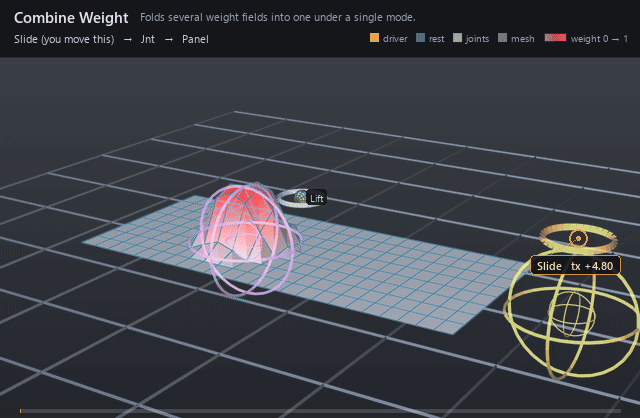

#  Combine Weight

*Folds several weight fields into one under a single mode.*

| | |
|---|---|
| **Node type** | `RigExecCombineWeight` |
| **Example** | [combine_weight.usda](../examples/combine_weight.usda) |

On this page:

- [Overview](#overview)
- [How it works](#how-it-works)
- [Wiring](#wiring)
- [Parameters](#parameters)
- [Example](#example)
- [Tips](#tips)
- [See also](#see-also)

## Overview



The operator that makes weight objects composable: a painted static
field masked by a sphere volume, two volumes unioned with `max`, a driven
dynamic weight subtracted out. Every input is resolved to a dense field
over the same elements and folded with one `rigExec:combineMode`, so the
result is an ordinary weight object that any mover can bind. One combine
carries one mode; mixed compositions nest combines inside combines rather
than tagging individual targets.

Folds an ordered list of weight objects into one field
(spec section 4.1, volumetric extension). This is what makes weight
objects composable: a painted RigExecStaticWeight masked by a
RigExecSphereWeight, two spheres unioned with `max`, a driven
RigExecDynamicWeight subtracted out.

Combines nest, and nesting is how mixed modes are expressed -- one
combine carries one mode, so a relationship never has to carry
per-target metadata.

## How it works

The fold runs when the bound mover evaluates, in the geometry
(point-chain) phase, after the pose phase has placed every volumetric input — a volume weight is a
`RigExecXformable`, so the pose walk gives it a provider slot exactly
like a joint's. It resolves each `rigExec:inputWeights` target to a dense
field of the mover's element count (its own `rigExec:weightTarget` is
read only for that count, never for its points), folds them under the
mode — `multiply`, `add`, `subtract`, `max`, `min`, `average`, or
`overlay` — then applies `inputs:invert` and `inputs:strength` as
`w = (w + (1 - 2w) * invert) * strength` and bounds the result under
`rigExec:rangePolicy`. One invalid or differently sized input fails the
whole packet rather than folding a truncated field, and the mover passes
its points through unchanged.

## Wiring

| Relationship | Points to | Required |
|---|---|---|
| `rigExec:inputWeights` | Ordered weight objects to fold; every one must cover the same target as this combine. | no |
| `rigExec:weightTarget` | The weighted domain, matching the bound mover's exact target; read only for its element count. | yes |
| (bound by) | A mover's `rigExec:weightObject` applies the folded field. | - |

## Parameters

### Weight field

#### `rigExec:weightTarget`

*Relationship.*

Canonical prim or exact property carrying the weighted
domain. For a constant envelope over an atomic multi-target mover,
this is the mover prim itself.

#### `rigExec:representation`

*Type:* `uniform token`. *Default:* `"constant"`.

Valid values: `constant`, `dense`, `sparse`.

#### `rigExec:rangePolicy`

*Type:* `uniform token`. *Default:* `"strict"`.

Valid values: `strict`, `clamp`.

### Node parameters

#### `rigExec:representation`

*Type:* `uniform token`. *Default:* `"dense"`.

Valid values: `dense`.

Redeclared to override the RigExecWeightObject fallback
of `constant`, which a combine cannot honour: it resolves every
input to a dense field before folding, so dense is the only
representation it can publish.

Inheriting the base fallback made a DEFAULT combine -- author the
prim, wire two inputs, change nothing else -- publish an invalid
packet on the exec path while the CPU oracle resolved it happily.
That is a parity mismatch reachable by doing the most obvious
possible thing, and a schema fallback its own kernel rejects is
simply the wrong fallback.

#### `rigExec:inputWeights`

*Relationship.*

Ordered weight objects to fold. Every input must resolve
to the same element count as this combine's own weightTarget; a
mismatch fails the packet rather than folding a truncated field,
because a short input would silently read as identity over its
missing tail.

#### `rigExec:combineMode`

*Type:* `uniform token`. *Default:* `"multiply"`.

Valid values: `multiply`, `add`, `subtract`, `max`, `min`, `average`, `overlay`.

multiply, add, max, min, and average are order
independent. subtract and overlay are NOT: they seed from the
first input and fold the rest in authored target order, which is
the one place this extension departs from the spec section 7.2
rule that target-list permutation cannot change a result. Authors
who need a permutation-proof composition use a commutative mode.

#### `inputs:strength`

*Type:* `float`. *Default:* `1`.

#### `inputs:invert`

*Type:* `float`. *Default:* `0`.

Reflects the folded field about 0.5; lerped, as elsewhere.

## Example

Two sphere volumes over one flat 24-quad panel, folded with `max`.
A static joint holds a 1.6-unit lift, so the panel's height is literally
the combined field; the Anchor volume sits still while the Slider volume
rides an animated control from x = 1.8 in to -0.4 and back. Two separate
domes merge into one wide ridge as the volumes overlap, then part again.

Open it live with:

```bat
bin\launch_usdview.bat docs\examples\combine_weight.usda
```

Re-render the GIF above with:

```bat
python docs/render_media.py --page combine_weight
```

## Tips

- `multiply`, `add`, `max`, `min`, and `average` are order independent; `subtract` and `overlay` seed from the first target and consume the authored order, so reordering the relationship changes the result for those two alone.
- A combine must publish `dense` — it is the schema fallback and the only value its kernel accepts — but its inputs may be constant, sparse, dense, or generated; each is resolved to dense before the fold.
- `rigExec:rangePolicy` is inherited unchanged from `RigExecWeightObject`, so a combine falls back to `strict` -- unlike the volume weights, which redeclare it as `clamp`. Author `clamp`, as the example does, or an `add` that overlaps past 1 (or an overdriven `inputs:strength`) invalidates the packet and the mover silently passes its points through.

## See also

- [Sphere Weight](sphere_weight.md)
- [Static Weight](static_weight.md)
- [Dynamic Weight](dynamic_weight.md)

---

[RigExec nodes](../index.md)
