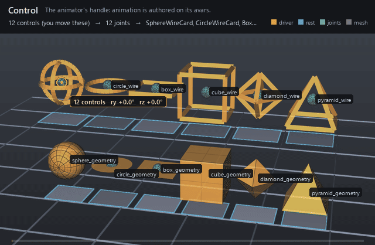

#  Control

*The animator's handle: animation is authored on its avars.*

| | |
|---|---|
| **Node type** | `RigExecControl` |
| **Example** | [control.usda](../examples/control.usda) |

On this page:

- [Overview](#overview)
- [How it works](#how-it-works)
- [Wiring](#wiring)
- [Parameters](#parameters)
- [Example](#example)
- [Tips](#tips)
- [See also](#see-also)

## Overview



A control is the rig's interaction surface. An animator keys its
translation, rotation, scale, and spin avars, and solvers and movers read
the resulting posed frame. Controls draw a viewport guide at the posed
origin — `sphere`, `circle`, `box`, `cube`, `diamond` or `pyramid`, drawn
as curves (`wire`) or as solids (`geometry`) — so the handle can be picked
directly; unlike joints and solvers, a control is not a diagnostic, so it
keeps the default render purpose.

An animator-facing RigExecXformable: animation is authored
on the avars (or an authored/connected posed:space), exactly like an
Ir xformable. Channel semantics live on the applied
RigExecControlAPI. Publishes computePointFrame/computeRestFrame/
computeMatrix (spec section 4.1). A synthesized viewport guide can be
drawn at the posed frame origin (see guide:shape), purpose guide, the
same synthesis-only style as the RigExecJoint guides.

## How it works

A control is evaluated in the base phase only — it is an input, so
nothing in the pose domain revises it and its base frame IS its posed
frame. The frame comes from `rest:space` plus the avars each frame:
translations and Euler rotations compose over the rest offset inside the
selected parent and default spaces (`avars * posed:defaultSpace *
inverse(parent:defaultSpace) * parent:space`), and scale avars apply
before rotation and translation. Anything downstream — an FK chain
listing the control, a constraint naming it as a source, a matrix mover
reading its frame — follows the animated result with no further
wiring.

## Wiring

| Relationship | Points to | Required |
|---|---|---|
| (none) | Controls are read by solvers, constraints, and movers; they take no input relationships. | - |

## Parameters

### Control channel

#### `rigExec:channelRole`

*Type:* `uniform token`. *Default:* `"pose"`.

Valid values: `pose`, `switch`, `tweak`.

### Transform provider

#### `rest:tx`

*Type:* `double`. *Default:* `0`.

#### `rest:ty`

*Type:* `double`. *Default:* `0`.

#### `rest:tz`

*Type:* `double`. *Default:* `0`.

#### `rest:rx`

*Type:* `double`. *Default:* `0`.

#### `rest:ry`

*Type:* `double`. *Default:* `0`.

#### `rest:rz`

*Type:* `double`. *Default:* `0`.

#### `rest:space`

*Type:* `matrix4d`. *Default:* `( (1, 0, 0, 0), (0, 1, 0, 0), (0, 0, 1, 0), (0, 0, 0, 1) )`.

Bind transform relative to the namespace frame provider's rest frame; always orthonormalized. A provider with no RigExec ancestor resolves against identity, so its rest:space is its local-to-world bind transform.

#### `default:tx`

*Type:* `double`. *Default:* `0`.

#### `default:ty`

*Type:* `double`. *Default:* `0`.

#### `default:tz`

*Type:* `double`. *Default:* `0`.

#### `default:rx`

*Type:* `double`. *Default:* `0`.

#### `default:ry`

*Type:* `double`. *Default:* `0`.

#### `default:rz`

*Type:* `double`. *Default:* `0`.

#### `default:space`

*Type:* `matrix4d`. *Default:* `( (1, 0, 0, 0), (0, 1, 0, 0), (0, 0, 1, 0), (0, 0, 0, 1) )`.

Local-to-world zero position for posing. Its computed fallback
is compose(default translation/XYZ rotation) * rest * inverse(parent
rest) * parent:defaultSpace. The rest is unaffected by default edits.
A connection is authoritative, including identity. Otherwise a
non-identity authored matrix overrides the computed fallback; an
identity value selects that fallback.

#### `posed:space`

*Type:* `matrix4d`. *Default:* `( (1, 0, 0, 0), (0, 1, 0, 0), (0, 0, 1, 0), (0, 0, 0, 1) )`.

Final local-to-world transform. For a joint this is
supplied by the compiler's private solver binding (view-free
extraction); it may also be authored or
connected directly. Unwired xformables follow the parent chain
with rest offsets and avars.

#### `posed:defaultSpace`

*Type:* `matrix4d`. *Default:* `( (1, 0, 0, 0), (0, 1, 0, 0), (0, 0, 1, 0), (0, 0, 0, 1) )`.

Controller-adjusted zero pose; falls back to avars:defaultSpace.
Used by the local-avars pose path before parent motion. A connection
overrides the fallback, as does a non-identity authored matrix.

#### `avars:tx`

*Type:* `double`. *Default:* `0`.

#### `avars:ty`

*Type:* `double`. *Default:* `0`.

#### `avars:tz`

*Type:* `double`. *Default:* `0`.

#### `avars:rx`

*Type:* `double`. *Default:* `0`.

#### `avars:ry`

*Type:* `double`. *Default:* `0`.

#### `avars:rz`

*Type:* `double`. *Default:* `0`.

#### `avars:rspin`

*Type:* `double`. *Default:* `0`.

#### `avars:rotationOrder`

*Type:* `token`. *Default:* `"XYZ"`.

Valid values: `XYZ`, `XZY`, `YXZ`, `YZX`, `ZXY`, `ZYX`.

#### `avars:defaultSpace`

*Type:* `matrix4d`. *Default:* `( (1, 0, 0, 0), (0, 1, 0, 0), (0, 0, 1, 0), (0, 0, 0, 1) )`.

Zero pose supplied to avar evaluation; falls back to the
computed default:space. A connection or non-identity authored matrix
selects another zero pose.

#### `avars:unitScaleFactor`

*Type:* `double`. *Default:* `1`.

Multiplier converting translation avars into local distance units before the selected default and parent transforms. Rotations and scales are unaffected.

#### `parent:space`

*Type:* `matrix4d`. *Default:* `( (1, 0, 0, 0), (0, 1, 0, 0), (0, 0, 1, 0), (0, 0, 0, 1) )`.

Selected parent's posed local-to-world space. Falls back to
the nearest namespace provider's computePointFrame; identity when
there is none. Connections (including identity) or a non-identity
authored matrix select a different parent space.

#### `parent:defaultSpace`

*Type:* `matrix4d`. *Default:* `( (1, 0, 0, 0), (0, 1, 0, 0), (0, 0, 1, 0), (0, 0, 0, 1) )`.

Selected parent's default local-to-world space. Falls back
to the nearest namespace provider's computeDefaultFrame. Connections
(including identity) or a non-identity authored matrix override it.
The avar pose is avars * posed:defaultSpace * inverse(parent:defaultSpace)
* parent:space, in row-vector convention.

### Node parameters

#### `avars:sx`

*Type:* `double`. *Default:* `1`.

Local X scale applied before rotation and translation; finite magnitudes below 1e-4 resolve to signed 1e-4, strict authoring rejects non-finite values, and raw non-finite USD resolves to identity on this axis.

#### `avars:sy`

*Type:* `double`. *Default:* `1`.

Local Y scale applied before rotation and translation; finite magnitudes below 1e-4 resolve to signed 1e-4, strict authoring rejects non-finite values, and raw non-finite USD resolves to identity on this axis.

#### `avars:sz`

*Type:* `double`. *Default:* `1`.

Local Z scale applied before rotation and translation; finite magnitudes below 1e-4 resolve to signed 1e-4, strict authoring rejects non-finite values, and raw non-finite USD resolves to identity on this axis.

#### `guide:shape`

*Type:* `uniform token`. *Default:* `"circle"`.

Valid values: `sphere`, `circle`, `box`, `cube`, `diamond`, `pyramid`.

Guide primitive synthesized at the control's posed frame
origin (spec section 10.3 extension), exactly parallel to the
RigExecJoint sphere/cone guides. Every shape is unit-sized and
centered at the origin: sphere and circle have radius 1, box and
cube span +-1, diamond (octahedron) has vertices at +-1 on each
axis, and pyramid has base corners (+-1, -1, +-1) with apex
(0, 1, 0). circle and box are the planar shapes -- normal +Y,
drawn in the local XZ plane -- while cube is the 3D box; this is
the conventional rigging distinction between the two box-ish
tokens.

#### `guide:drawMode`

*Type:* `uniform token`. *Default:* `"wire"`.

Valid values: `wire`, `geometry`.

wire draws the guide as curves, widthed by
guide:wireWidth. geometry draws solid shapes instead.

#### `guide:wireWidth`

*Type:* `double`. *Default:* `0.05`.

Width authored onto the wire curves, in the LOCAL
pre-scale units of the unit shape -- so the drawn width tracks the
evaluated control-frame scale multiplied by guide:scaleX/Y/Z along
with the rest of the shape. A non-uniform effective scale thickens
the curve anisotropically exactly as it stretches the points.

Zero or negative authors no widths at all and falls back to
hairline rendering; geometry draw mode ignores this entirely.

It has a default rather than being left unauthored because
usdview picks with a single-pixel window: an unwidthed hairline
is a one-pixel target that a real click virtually never lands
on, and an empty pick deselects to the pseudo-root. The default
width is what makes a wire control selectable at all.

#### `guide:scaleX`

*Type:* `double`. *Default:* `1.0`.

Positive per-axis draw multiplier of the guide shape whose
final size is abs(evaluated frame axis) * guide:scaleAxis, authored as
three separate double properties rather than a vec3. The control's
posed frame is orthonormalized for placement while its evaluated axis
magnitudes are retained for sizing. A non-positive
or non-finite guide multiplier on any axis draws no guide at all,
independently of the signed 1e-4 floor on avars:sx/sy/sz.

#### `guide:scaleY`

*Type:* `double`. *Default:* `1.0`.

Per-axis draw scale along the local Y axis; see guide:scaleX.

#### `guide:scaleZ`

*Type:* `double`. *Default:* `1.0`.

Per-axis draw scale along the local Z axis; see guide:scaleX.

#### `guide:offset`

*Type:* `double3`. *Default:* `(0, 0, 0)`.

Where the guide shape is drawn, in the control's LOCAL frame,
relative to the control's origin. The control still pivots, rotates
and scales about its origin; only the drawn shape moves. It is what
lets a control whose pivot is buried inside a character (the upper
face turns about the base of the skull) be drawn somewhere it can
be seen and picked. Scaled by the evaluated control-frame scale, so
a scaled control carries its shape with it.

#### `guide:displayColor`

*Type:* `color3f`. *Default:* `(1.0, 0.85, 0.2)`.

Constant colour of the synthesized guide. May be CONNECTED
to another color3f attribute, in which case the first connection
source's value at the evaluated time is drawn instead of the local
one -- the imaging bridge follows the connection because
UsdAttribute::Get never does.

#### `guide:displayOpacity`

*Type:* `float`. *Default:* `1.0`.

Constant opacity of the synthesized guide. May be CONNECTED
to a float or double attribute -- a limb's IK/FK dial, say -- and
then the first connection source's value at the evaluated time is
what is drawn, optionally complemented by guide:displayOpacityInvert
and never below guide:displayOpacityMin. An unconnected attribute
draws exactly the value it holds, floor and invert ignored.

#### `guide:displayOpacityInvert`

*Type:* `uniform bool`. *Default:* `false`.

When guide:displayOpacity is connected, draw 1 - source
instead of source. This is what lets one dial fade two control sets
in opposite directions: the IK controls connect to the switch as-is,
the FK controls connect to the SAME switch with this set, and there
is no second source of truth to drift. Ignored when the opacity is
not connected.

#### `guide:displayOpacityMin`

*Type:* `uniform float`. *Default:* `0.15`.

Floor applied to a CONNECTED guide:displayOpacity after the
optional inversion. A dial parked at its end stop would otherwise
drive the inactive control set to exactly zero, and a fully
transparent control is a trap: an animator who switches a limb to
IK can no longer see the FK controls they need to switch back.
Hydra still picks at any opacity above 0.0001, so the floor is for
the eye, not the picker: 0.15 is enough to find a ghosted control
against the character. Zero restores a true fade-out. Ignored when
the opacity is not connected.

## Example

Twelve controls in a 6x2 grid draw every `guide:shape` — sphere,
circle, box, cube, diamond, pyramid — in every `guide:drawMode`: wire on
the top row, geometry on the bottom. Each one swings `avars:ry` from 0 to
90 degrees and back over 1001-1024, and each wire control also feeds an FK
chain that poses a joint resting at the control, with a matrix mover
skinning the card below it. The two circles and the shaded sphere look
still because they are symmetric about the axis they turn on; the card
under the wire circle is the proof that the frame really moved.

Open it live with:

```bat
bin\launch_usdview.bat docs\examples\control.usda
```

Re-render the GIF above with:

```bat
python docs/render_media.py --page control
```

## Tips

- Keep `rest:space` at the handle's bind pose and animate only the avars; rest edits re-proportion every downstream solve.
- `guide:shape` and `guide:drawMode` change the pickable viewport guide without touching evaluation; a pair the build does not draw synthesizes no guide at all rather than falling back to one.
- `guide:wireWidth` is in the unit shape's local units — the drawn width is scaled by `guide:scaleX/Y/Z` along with the shape — and `geometry` draw mode ignores it entirely.

## See also

- [Joint](joint.md)
- [FK Chain](fk_chain.md)
- [Matrix Mover](matrix_mover.md)

---

[RigExec nodes](../index.md)
