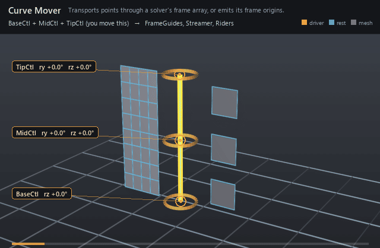

#  Curve Mover

*Transports points through a solver's frame array, or emits its frame origins.*

| | |
|---|---|
| **Node type** | `RigExecCurveMover` |
| **Example** | [curve_mover.usda](../examples/curve_mover.usda) |

On this page:

- [Overview](#overview)
- [How it works](#how-it-works)
- [Wiring](#wiring)
- [Parameters](#parameters)
- [Example](#example)
- [Tips](#tips)
- [See also](#see-also)

## Overview



Frame transport for geometry. In `ribbon` mode each moved point
carries a bind parameter that picks a spot in the driver frame array, and
the point is mapped by the rest-relative rigid transform read there — so a
dense mesh spread across the parameter bends, while a prop whose every
vertex shares one parameter rides rigidly. In `emitGuidePoints` mode the
mover skips the bind and writes the frame origins straight out as points.
Nothing in either mode samples a curve: the frames are the input, and any
solver that publishes a frame array — a ribbon, an FK chain, spline IK, a
twist distribution — can supply them.

Reads standard basis-curve properties for wire, spline-IK,
ribbon, and curve-coordinate movement and writes an exact native
UsdGeomPointBased points property (spec section 7.5).

## How it works

The mover runs as one revision on its `rigExec:moves` target's point
chain, reading the driver solver's frames after the pose phase has solved
them. It builds one rigid map per element from that element's rest
landmarks to its posed landmarks, then places each point by clamping its
bind u to [0, 1], scaling it across the array, and blending the two
neighbouring maps' results — so the array's cardinality, not a curve, sets
the resolution of the transport. Guide emission needs no bind at all: it
copies frame origin `i` to point `i`, and fails the revision if the counts
differ. The compiler maintains the moved mesh's normals and extent
afterwards.

## Wiring

| Relationship | Points to | Required |
|---|---|---|
| `rigExec:driverFrames` | Any solver publishing a frame array (ribbon, FK chain, spline IK, twist distribution). | yes |
| `rigExec:bindCoordinates` | Per-point `primvars:st`; u picks the spot in the frame array. | ribbon mode |
| `rigExec:moves` | Exact native points property to write. | yes |
| `rigExec:driverCurve` | Unread on this node — the frames already carry the curve's shape. | no |

## Parameters

### Common mover envelope

#### `rigExec:moves`

*Relationship.*

Reserved write-set relationship: exact prim/property targets.

#### `inputs:enabled`

*Type:* `bool`. *Default:* `true`.

Shape-preserving enable. Disabled movers pass their preceding
revision through unchanged (value-only edit).

#### `inputs:defaultWeight`

*Type:* `float`. *Default:* `1`.

Normalized common mover envelope in [0, 1]. With no bound
rigExec:weightObject it broadcasts over every logical element: zero
passes the incoming value through bit-for-bit and one applies the
mover's full-strength result.

#### `rigExec:weightObject`

*Relationship.*

Optional compatible total weight field, at most one target.
When bound, the weight object's values (including its own sparse or
constant fallback) supply the common envelope instead of
inputs:defaultWeight. Target, domain, and cardinality must match each
mover application; an incompatible binding is a compile error. A
multi-target mover may bind only a constant operation envelope whose
weightTarget is the mover prim itself; that one value broadcasts to
every application of the atomic mover.

### Node parameters

#### `rigExec:driverCurve`

*Relationship.*

#### `rigExec:driverFrames`

*Relationship.*

#### `rigExec:bindCoordinates`

*Relationship.*

#### `rigExec:mode`

*Type:* `uniform token`. *Default:* `"ribbon"`.

Valid values: `ribbon`, `emitGuidePoints`, `wire`.

ribbon transports points along a ribbon aggregate's frames;
emitGuidePoints writes its sample positions; wire moves each point by
the displacement of rigExec:driverCurve (a UsdGeomNurbsCurves) at the
parameter it was bound to: p' = p + f(d) * (C(u) - C0(u)), with (u, d)
per point from rigExec:bindCoordinates, C the curve's posed control
points at rigExec:driverCurveReadPhase and C0 its authored ones. With
a sparse weight object the bind table may be sparse too: one (u, d)
per weighted point, in the weight object's index order.

#### `rigExec:driverCurveReadPhase`

*Type:* `uniform token`. *Default:* `"base"`.

Valid values: `base`, `preceding`, `final`.

#### `rigExec:driverTransforms`

*Relationship.*

wire: move the driver curve's control points by matrix
providers instead of reading its points: one provider per unique
control point, or one for all. A periodic curve's repeated points
take their unique point's provider. The posed point is
C0 + w (M C0 - C0), M the provider measured against its entry in
rigExec:driverTransformSpaces and w its inputs:driverWeights entry.
No chain runs on the curve, so no phased read is needed.

#### `rigExec:driverTransformSpaces`

*Relationship.*

wire: the space each driver transform is measured against,
parallel to rigExec:driverTransforms, or one for all, or none.

#### `rigExec:transformReadPhase`

*Type:* `uniform token`. *Default:* `"base"`.

Valid values: `base`, `final`.

wire: which revision of the driver transforms is read.

#### `inputs:driverWeights`

*Type:* `float[]`. *Default:* `[]`.

wire: per unique control point weight of its driver
transform, or one for all; empty is 1.

#### `rigExec:driverBaseTransforms`

*Relationship.*

wire: an optional base motion applied to the curve AND its
rest before the driver transforms, as a wire whose base curve rides
the same deformers as its driver: B = C0 + wb (Mb C0 - C0), then
C = B + w (M B - B), and the wire deforms by C - B. Same entry rules
as rigExec:driverTransforms.

#### `rigExec:driverBaseTransformSpaces`

*Relationship.*

wire: the spaces of rigExec:driverBaseTransforms.

#### `inputs:driverBaseWeights`

*Type:* `float[]`. *Default:* `[]`.

wire: per unique control point weight of the base motion.

#### `inputs:dropoffDistance`

*Type:* `float`. *Default:* `0`.

wire: distance over which a point's pull from the curve
falls to zero, as 1 - smoothstep(0, dropoffDistance, d) with d the
point's rest distance from the curve. 0 applies no falloff.

## Example

Three controls stacked up Y are the only animation, and an FK chain
that claims no joints turns them into a three-element frame array. One
curve mover spreads a 45-point streamer -- five columns across, nine rows
up -- over the whole u range so it curls and twists between the frames, a
second pins all four corners of each card to a single u so the cards ride
rigidly at 0.15, 0.5 and 0.85, and a third in `emitGuidePoints` mode
writes the same three frame origins out as a gold guide curve. The
streamer sits wholly at negative x and the cards at positive x, so the
gold line up the middle is the third mover's output on its own -- the
frame origins themselves, one point per element. There is no ribbon, no
joint and no driver curve in the file.

Open it live with:

```bat
bin\launch_usdview.bat docs\examples\curve_mover.usda
```

Re-render the GIF above with:

```bat
python docs/render_media.py --page curve_mover
```

## Tips

- Any frame-publishing solver drives this mover — an FK chain that claims no joints is a legal frame source, and the array's element count is the transport resolution.
- `emitGuidePoints` writes one point per frame: give the target exactly as many points as the solver has elements or the revision fails and passes through unchanged.
- Bind u is clamped and scaled across the array, so equal u on every vertex of a prop rides one spot rigidly and a spread of u bends; u = 0 rides the first element's map exactly, u = 1 the last.

## See also

- [Ribbon](ribbon.md)
- [FK Chain](fk_chain.md)
- [Matrix Mover](matrix_mover.md)

---

[UsdRig](../index.md)
