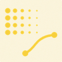
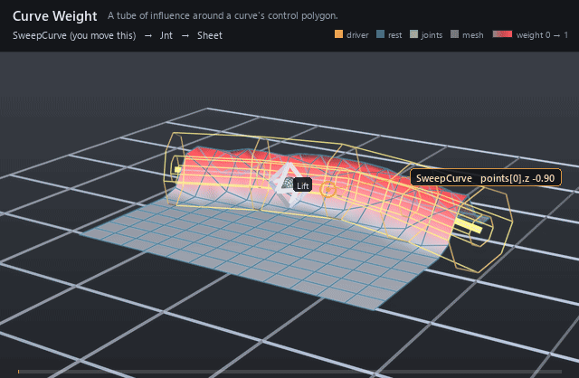

#  Curve Weight

*A tube of influence around a curve's control polygon.*

| | |
|---|---|
| **Node type** | `RigExecCurveWeight` |
| **Example** | [curve_weight.usda](../examples/curve_weight.usda) |

On this page:

- [Overview](#overview)
- [How it works](#how-it-works)
- [Wiring](#wiring)
- [Parameters](#parameters)
- [Example](#example)
- [Tips](#tips)
- [See also](#see-also)

## Overview



A placed volume that generates its field from distance to a curve
instead of storing one: everything within `inputs:falloffMin` of the
curve is fully weighted, everything past `inputs:falloffMax` is not, and
the band between them ramps. The curve is ordinary scene geometry named
through `rigExec:curve` — a weight object never grows its own points —
so a spline an artist already has becomes the shape of an influence.
Distance is measured to the **polyline through the control points**, not
to the evaluated basis, so the field never reaches anywhere the drawn
guide does not.

Tubular falloff about a curve: d is the distance to the
nearest point on the polyline through the target curve's points,
measured in rigid volume-local space after inputs:scaleX/Y/Z (spec
section 4.1, volumetric extension).

The polyline through the control points is deliberate rather than a
basis evaluation: a weight field wants a stable, cheap, monotone
distance, and the control polygon bounds the curve it hulls, so the
field never reaches somewhere the drawn guide does not.

## How it works

Compile registers the volume's placement tap (`computePointFrame`,
not `computeMatrix`, so an unanimated volume still lands where it is
placed) and bakes the falloff into a lookup table; the structural digest
hashes `rigExec:curve` together with the *type* its target resolves to,
so repairing or retyping the points source re-enters Compile while
merely moving the curve does not. Then, each frame, `computeWeightPacket`
reads the curve's points and the weighted domain's points in the same
space, carries both into rigid volume-local space, divides by
`inputs:scaleX/Y/Z`, and remaps the nearest-segment distance through the
baked profile plus `inputs:invert` and `inputs:strength`. The result is a
dense float per target element, published as the envelope of whichever
mover binds it through `rigExec:weightObject` — a matrix mover then
applies `p' = q + w (T q - q)`.

## Wiring

| Relationship | Points to | Required |
|---|---|---|
| `rigExec:curve` | Exactly one native points source — a BasisCurves prim or an exact `point3f[]` property — whose control polygon the distance is measured to. | yes |
| `rigExec:weightTarget` | Exact points property this field covers. | yes |
| `rigExec:sampleSource` | Optional unposed points to measure *instead of* the target, at the same element count; the weighted domain stays the target. | no |
| (bound by) | A mover's `rigExec:weightObject` applies this field. | - |

## Parameters

### Falloff band, sampling and guide

#### `purpose`

*Type:* `uniform token`. *Default:* `"guide"`.

Render purpose, overriding UsdGeomImageable's `default`
fallback for the same reason RigExecJoint does: an influence
volume is a DIAGNOSTIC, drawn when a viewer asks for guides, and
the stock attribute keeps the drawing and the bounds from
disagreeing.

#### `rigExec:weightTarget`

*Relationship.*

Canonical prim or exact property carrying the weighted domain.

#### `rigExec:representation`

*Type:* `uniform token`. *Default:* `"dense"`.

Valid values: `dense`.

A generated field has a value at every element, so dense
is the only representation it can honestly publish. Declared
anyway, and rejected rather than coerced when authored otherwise,
because the packet contract carries it and a combine has to match
representations across its inputs.

#### `rigExec:rangePolicy`

*Type:* `uniform token`. *Default:* `"clamp"`.

Valid values: `strict`, `clamp`.

Defaults to clamp rather than the strict used by the
authored weight objects: inputs:strength and inputs:invert are
animatable, and an artist scrubbing strength past one should see
the field saturate, not invalidate the rig mid-drag.

#### `inputs:falloffMin`

*Type:* `float`. *Default:* `0`.

Distance at which the field is fully ON. In the volume's
local units after inputs:scaleX/Y/Z, so for a sphere it is simply
the inner radius.

#### `inputs:falloffMax`

*Type:* `float`. *Default:* `1`.

Distance at which the field is fully OFF; the outer
radius for a sphere.

falloffMax < falloffMin is legal and flips the ramp -- the signed
denominator does it with no special case. falloffMax exactly
equal to falloffMin is the one degenerate case, and means a hard
step at that distance.

#### `inputs:invert`

*Type:* `float`. *Default:* `0`.

Exchanges the two ends of the band. A float rather than a
bool so it can be animated or driven like any other avar: it
LERPS between the two ramps, so an animated invert sweeps through
a flat field at 0.5 instead of popping.

#### `inputs:strength`

*Type:* `float`. *Default:* `1`.

Final multiplier on the remapped weight. Deliberately not
clamped by the kernel -- rigExec:rangePolicy is the authority on
out-of-range weights, and silently clamping here would hide a
strict-policy violation.

#### `rigExec:falloffProfile`

*Type:* `uniform token`. *Default:* `"smooth"`.

Valid values: `linear`, `smooth`, `easeIn`, `easeOut`, `constant`, `curve`.

Named analytic remap of the normalized band parameter, or
`curve` to use the spline authored on rigExec:falloffCurve. Every
profile pins f(0) = 0 and f(1) = 1, so switching profiles never
moves the band's endpoints -- only its shape between them.

The presets are baked to the same lookup table the curve is
resampled into, so there is exactly one remap path in the hot
loop whether the author picked a preset or drew a curve.

#### `rigExec:falloffCurve`

*Type:* `float`. *Default:* `0`.

Falloff shape as an authored Ts spline over x in [0, 1],
read when rigExec:falloffProfile is `curve`. x is the ramp
parameter -- 1 at falloffMin, 0 at falloffMax -- and the value is
the weight.

This is a STRUCTURAL read, resampled to a lookup table once per
binding epoch, NOT a per-frame exec input: an exec computation
resolves an attribute at one time, and a curve needs the whole
function. The animatable knobs are falloffMin/Max, invert, and
strength; the curve is a rig-authoring parameter, which is also
what keeps the field epoch-shape-stable (spec section 4.1).

Held extrapolation outside [0, 1] is the Ts default and is
exactly right here, so a curve authored over a shorter span still
yields a total field.

#### `rigExec:samplePhase`

*Type:* `uniform token`. *Default:* `"reference"`.

Valid values: `reference`, `current`.

Which points the distance function measures against.

`reference` samples the STATIC authored base points, so the field
is computed once per epoch and a point keeps the weight its bind
pose earned -- the behaviour of a painted map, and what a matrix
mover wants so that its own output cannot feed back into its own
weights.

`current` samples the points AS THEY STAND at this operation's
position in the mover stack, so the volume grabs whatever is
inside it right now. That is the dynamic behaviour, and it is
order dependent by construction: the same volume placed at two
points in the stack legitimately yields two different fields.

#### `rigExec:sampleSource`

*Relationship.*

Optional explicit static points source to measure
against, overriding rigExec:weightTarget for SAMPLING only. The
weighted domain stays the weightTarget, so this is how a volume
weights one mesh by another mesh's shape -- typically an
unposed reference copy. Ignored when samplePhase is `current`.

#### `guide:drawMode`

*Type:* `uniform token`. *Default:* `"wire"`.

Valid values: `wire`, `geometry`, `none`.

wire draws the falloffMin and falloffMax iso-surfaces as
curves, widthed by guide:wireWidth; geometry draws them solid;
none suppresses the guide without disturbing the field.

#### `guide:wireWidth`

*Type:* `double`. *Default:* `0.05`.

Width authored onto the wire curves; see RigExecControl.

#### `guide:displayColor`

*Type:* `color3f`. *Default:* `(1.0, 0.2, 0.2)`.

Red by convention, matching the influence overlay the
results scene index paints onto the weighted geometry so the
volume and the region it grabs read as one object.

#### `guide:displayOpacity`

*Type:* `float`. *Default:* `0.35`.

### Placement

#### `rest:tx`

*Type:* `double`. *Default:* `0`.

#### `rest:ty`

*Type:* `double`. *Default:* `0`.

#### `rest:tz`

*Type:* `double`. *Default:* `0`.

#### `rest:rx`

*Type:* `double`. *Default:* `0`.

#### `rest:ry`

*Type:* `double`. *Default:* `0`.

#### `rest:rz`

*Type:* `double`. *Default:* `0`.

#### `rest:space`

*Type:* `matrix4d`. *Default:* `( (1, 0, 0, 0), (0, 1, 0, 0), (0, 0, 1, 0), (0, 0, 0, 1) )`.

Bind transform relative to the namespace frame provider's rest frame; always orthonormalized. A provider with no RigExec ancestor resolves against identity, so its rest:space is its local-to-world bind transform.

#### `default:tx`

*Type:* `double`. *Default:* `0`.

#### `default:ty`

*Type:* `double`. *Default:* `0`.

#### `default:tz`

*Type:* `double`. *Default:* `0`.

#### `default:rx`

*Type:* `double`. *Default:* `0`.

#### `default:ry`

*Type:* `double`. *Default:* `0`.

#### `default:rz`

*Type:* `double`. *Default:* `0`.

#### `default:space`

*Type:* `matrix4d`. *Default:* `( (1, 0, 0, 0), (0, 1, 0, 0), (0, 0, 1, 0), (0, 0, 0, 1) )`.

Local-to-world zero position for posing. Its computed fallback
is compose(default translation/XYZ rotation) * rest * inverse(parent
rest) * parent:defaultSpace. The rest is unaffected by default edits.
A connection is authoritative, including identity. Otherwise a
non-identity authored matrix overrides the computed fallback; an
identity value selects that fallback.

#### `posed:space`

*Type:* `matrix4d`. *Default:* `( (1, 0, 0, 0), (0, 1, 0, 0), (0, 0, 1, 0), (0, 0, 0, 1) )`.

Final local-to-world transform. For a joint this is
supplied by the compiler's private solver binding (view-free
extraction); it may also be authored or
connected directly. Unwired xformables follow the parent chain
with rest offsets and avars.

#### `posed:defaultSpace`

*Type:* `matrix4d`. *Default:* `( (1, 0, 0, 0), (0, 1, 0, 0), (0, 0, 1, 0), (0, 0, 0, 1) )`.

Controller-adjusted zero pose; falls back to avars:defaultSpace.
Used by the local-avars pose path before parent motion. A connection
overrides the fallback, as does a non-identity authored matrix.

#### `avars:tx`

*Type:* `double`. *Default:* `0`.

#### `avars:ty`

*Type:* `double`. *Default:* `0`.

#### `avars:tz`

*Type:* `double`. *Default:* `0`.

#### `avars:rx`

*Type:* `double`. *Default:* `0`.

#### `avars:ry`

*Type:* `double`. *Default:* `0`.

#### `avars:rz`

*Type:* `double`. *Default:* `0`.

#### `avars:rspin`

*Type:* `double`. *Default:* `0`.

#### `avars:rotationOrder`

*Type:* `token`. *Default:* `"XYZ"`.

Valid values: `XYZ`, `XZY`, `YXZ`, `YZX`, `ZXY`, `ZYX`.

#### `avars:defaultSpace`

*Type:* `matrix4d`. *Default:* `( (1, 0, 0, 0), (0, 1, 0, 0), (0, 0, 1, 0), (0, 0, 0, 1) )`.

Zero pose supplied to avar evaluation; falls back to the
computed default:space. A connection or non-identity authored matrix
selects another zero pose.

#### `avars:unitScaleFactor`

*Type:* `double`. *Default:* `1`.

Multiplier converting translation avars into local distance units before the selected default and parent transforms. Rotations and scales are unaffected.

#### `parent:space`

*Type:* `matrix4d`. *Default:* `( (1, 0, 0, 0), (0, 1, 0, 0), (0, 0, 1, 0), (0, 0, 0, 1) )`.

Selected parent's posed local-to-world space. Falls back to
the nearest namespace provider's computePointFrame; identity when
there is none. Connections (including identity) or a non-identity
authored matrix select a different parent space.

#### `parent:defaultSpace`

*Type:* `matrix4d`. *Default:* `( (1, 0, 0, 0), (0, 1, 0, 0), (0, 0, 1, 0), (0, 0, 0, 1) )`.

Selected parent's default local-to-world space. Falls back
to the nearest namespace provider's computeDefaultFrame. Connections
(including identity) or a non-identity authored matrix override it.
The avar pose is avars * posed:defaultSpace * inverse(parent:defaultSpace)
* parent:space, in row-vector convention.

### Node parameters

#### `rigExec:curve`

*Relationship.*

Exactly one native points source for the curve -- a
UsdGeomBasisCurves prim or an exact point3f[] property. Its
points are read in the same space as the weighted domain's, so
both are carried into volume-local space together.

#### `inputs:scaleX`

*Type:* `float`. *Default:* `1`.

Per-axis divisor making the tube elliptical; see RigExecSphereWeight.

#### `inputs:scaleY`

*Type:* `float`. *Default:* `1`.

#### `inputs:scaleZ`

*Type:* `float`. *Default:* `1`.

## Example

A flat 5x7 sheet is weighted by a tube around a shallow V-shaped
curve, and a matrix mover lifts the weighted points 1.3 units. Nothing in
the rig animates — the Lift control holds `avars:ty` for the whole shot —
but the curve's own points sweep across the sheet and back, so a curved
ridge travels with it. What moves is not the transform but which points
the field grabs.

Open it live with:

```bat
bin\launch_usdview.bat docs\examples\curve_weight.usda
```

Re-render the GIF above with:

```bat
python docs/render_media.py --page curve_weight
```

## Tips

- The field uses the control polygon, not the evaluated basis, so a cubic curve influences the region around its hull rather than around the smooth curve you see; add control points where you need the tube to bend.
- `inputs:scaleX/Y/Z` divide the local coordinate before the distance, turning the tube elliptical — but any axis that is non-positive or non-finite invalidates the whole packet rather than collapsing the volume.
- Leave `rigExec:samplePhase` at `reference` and the tube measures the static bind points, so a point keeps the weight its rest position earned; `current` measures the points as they stand at this mover's place in the stack, which makes the field order dependent by design.

## See also

- [Sphere Weight](sphere_weight.md)
- [Matrix Mover](matrix_mover.md)
- [Static Weight](static_weight.md)

---

[RigExec nodes](../index.md)
