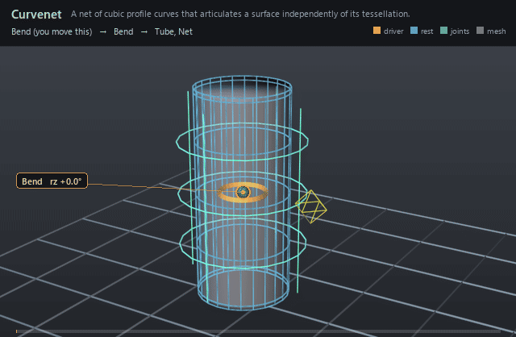

#  Curvenet

*A net of cubic profile curves that articulates a surface independently of its tessellation.*

| | |
|---|---|
| **Node type** | `RigExecCurvenet` |
| **Example** | [curvenet.usda](../examples/curvenet.usda) |

On this page:

- [Overview](#overview)
- [How it works](#how-it-works)
- [Wiring](#wiring)
- [Parameters](#parameters)
- [Example](#example)
- [Tips](#tips)
- [See also](#see-also)

## Overview



The rigging primitive of de Goes, Sheffler & Fleischer,
*Character Articulation through Profile Curves* (SIGGRAPH 2022): instead of
painting influences per vertex, a rigger traces a handful of profile curves
over the form — rings around a limb, rails along it, creases around a mouth —
and articulates those. A curvenet is a `UsdGeomPoints`, so its `points` array
is one shared pool of control points (knots **and** tangent handles) in the
projection pose, and `rigExec:splineIndices` names four pool entries per cubic
spline. Two splines meet because they name the *same* pool entry: index
sharing is the entire connectivity model, and it is what detaches the rig from
the mesh it drives.

A net of cubic splines profiling a surface, the rigging
representation of de Goes, Sheffler and Fleischer, "Character
Articulation through Profile Curves" (SIGGRAPH 2022), section 3.

Inherited `points` is the shared pool of control points -- knots AND
tangent handles -- in the PROJECTION pose, the pose the net was drawn
in. `rigExec:splineIndices` names four of them per cubic spline, and
two splines meet because they name the SAME pool entry: index sharing
is the whole connectivity model, which is what detaches the rig from
the surface tessellation.

The derived structure the deformation needs is computed, never
authored: an endpoint shared by three or more splines is an
intersection, one incident to a single spline is an anchor, and the
chains between them are the curves. Orientation and non-uniform scale
along every curve follow from that layout, so no normals, twists or
handles are authored anywhere.

Being a UsdGeomPointBased is deliberate: the pool is an exact native
point3f[], so every existing RigExec mover can pose the knots with no
curvenet-specific rigging code, which is what the paper means by
articulating knots "using traditional rigging tools".

## How it works

A curvenet authors no behavior of its own — it is
geometry that other nodes read. Its `points` pool is posed like any other
points array, in the geometry phase, by ordinary movers writing
`Net.points`; the compiler puts that chain ahead of every chain that reads
the net, so a Profile Mover always sees the finished pool
(`libs/rigExec/rigEvaluator.cpp:6817-6821`, `libs/rigExec/rigEvaluator.cpp:12083-12090`).
Everything structural is *derived* from `rigExec:splineIndices` and never
authored: `RigExecBuildCurvenetTopology` classifies an endpoint shared by
three or more splines as an intersection and one incident to a single spline
as an anchor, and chains the splines between them into curves
(`libs/rigExecMath/curvenet.cpp:305-333`, called from
`libs/rigExecMath/curvenetAdjustments.cpp:195` and
`libs/rigExec/curvenetWeightComputations.cpp:28-31`); the orientation and
non-uniform scale along every curve are then derived too, the Profile Mover's
bind re-orienting each intersection fan against the projection surface's
normals (`libs/rigExecMath/profileMover.cpp:58-70`). Readers take
`rigExec:basis` and `rigExec:samplesPerSpline` off the net prim itself
(`libs/rigExec/moverGraph.cpp:2120-2126`; the adjuster reads the basis the
same way at `libs/rigExec/curvenetAdjuster.cpp:102-104`).

## Wiring

| Relationship | Points to | Required |
|---|---|---|
| `points` | Inherited control-point pool in the projection pose: knots and tangent handles in one array. | yes |
| `rigExec:splineIndices` | Four pool indices per cubic spline; for the bezier basis they are p0, h0, h1, p1. | yes |
| (read by) | A Curvenet Mover's `rigExec:curvenet`, a Curvenet Adjustment's `rigExec:curvenet`, and a Curvenet Weight's `rigExec:curvenetPoints` / `rigExec:curvenetSplineIndices`. | - |
| (posed by) | Any mover whose `rigExec:moves` names this net's `points` — a matrix mover, a curve mover, an adjuster. | - |

## Parameters

### Node parameters

#### `rigExec:splineIndices`

*Type:* `int[]`. *Default:* `[]`.

Four control point indices per cubic spline. For the bezier
basis they are p0, h0, h1, p1, so entries 0 and 3 are the knots and
the two between are tangent handles.

#### `rigExec:basis`

*Type:* `uniform token`. *Default:* `"bezier"`.

Valid values: `bezier`, `catmullRom`.

Curve basis. "bezier" is the paper's cubic Bezier. The
centripetal Catmull-Rom of the 2026 face-parametrization talk puts
every control point exactly on the curve, which suits nets traced
onto a surface.

#### `rigExec:samplesPerSpline`

*Type:* `uniform int`. *Default:* `5`.

Sampling density before the mesh-resolution scaling of
section 3: the count per spline is this value times the ratio of the
spline's control polygon length to the surface's mean edge length.

## Example

A 96-quad tube profiled by three rings and four rails — 28
cubic splines over 76 pooled control points, none of which mentions a tube
vertex. An FK-driven matrix mover bends the upper pool with a painted field, a
Curvenet Adjustment pushes one bottom-ring knot straight out through the
Adjuster Mover, and the Profile Mover carries both onto the surface under a
`RigExecCurvenetWeight` envelope painted on the same 76 pool points, which
pins the tube's base row.

Open it live with:

```bat
bin\launch_usdview.bat docs\examples\curvenet.usda
```

Re-render the GIF above with:

```bat
python docs/render_media.py --page curvenet
```

## Tips

- Index sharing is the whole connectivity model: give two splines the same pool entry and they join. Valence is then derived — three or more incident splines make an intersection, one makes an anchor — so there is nothing else to declare, and no normal, twist or tangent frame is ever authored.
- Readers take the basis off the net prim, but `RigExecCurvenetWeight` carries its own `rigExec:basis`, which defaults to `catmullRom` while the net defaults to `bezier`. Author it to match the net, or connect it to the net's attribute, or the parametrization is built against a different curve than the deformation.
- Pose the pool with the rig you already have. `points` is an exact native `point3f[]`, so a matrix mover plus a weight object works exactly as it does on a mesh, and the evaluator hands the Profile Mover the result of the net's own chain rather than the authored value.

## See also

- [Curvenet Mover](curvenet_mover.md)
- [Curvenet Adjustment](curvenet_adjustment.md)
- [Curvenet Adjuster Mover](curvenet_adjuster_mover.md)

---

[RigExec nodes](../index.md)
