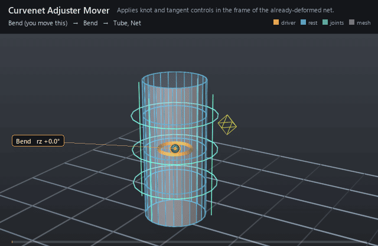

#  Curvenet Adjuster Mover

*Applies knot and tangent controls in the frame of the already-deformed net.*

| | |
|---|---|
| **Node type** | `RigExecCurvenetAdjusterMover` |
| **Example** | [curvenet.usda](../examples/curvenet.usda) |

On this page:

- [Overview](#overview)
- [How it works](#how-it-works)
- [Wiring](#wiring)
- [Parameters](#parameters)
- [Example](#example)
- [Tips](#tips)
- [See also](#see-also)

## Overview



The animation-facing half of the curvenet technique (2023 talk): a
deformer that writes the curvenet's *own* `points`, so an animator can push a
knot after every earlier deformer has fired. Each listed
`RigExecCurvenetAdjustment` contributes a local translate/rotate/scale delta
that is interpreted in a frame computed from the incoming deformation, not in
asset space — the same dial means "out along the curve" whether the net is at
rest or fully bent. Tangent adjustments parented under a knot control come
along automatically, so the relationship only ever names the knot controls.

Applies deformation-relative knot and tangent animation controls
to exactly one native RigExecCurvenet points property. Listed knot
adjustments include their tangent adjustment children automatically.
The common MoverAPI envelope blends over the preceding point revision.

## How it works

The adjuster is a revision in the point graph, on the curvenet's own
`points` property, so it runs after the pose pass and after whatever movers
precede it in the chain. It reads the net's authored (default-time) `points`
as the rest pose plus `rigExec:splineIndices` and `rigExec:basis`, samples
both the rest and the incoming configurations, and builds one frame per
control point: a best-fit rotation of the incident tangents at every
intersection, parallel transport elsewhere, and between two intersections a
slerp weighted by inverse arc distance. Each adjustment's local channel
matrix is then conjugated into its frame and applied to the knot (and, with
`rigExec:includeTangents`, its incident Bezier handles); the adjusted points
go through the common mover envelope, and the adjusted frames are published
per control prim in asset space for guides and viewport manipulation.

## Wiring

| Relationship | Points to | Required |
|---|---|---|
| `rigExec:moves` | The RigExecCurvenet's own exact `points` property — exactly one. | yes |
| `rigExec:adjustments` | The knot RigExecCurvenetAdjustment controls; their tangent children are collected automatically (curvenetAdjuster.cpp:70-85). | yes |
| `rigExec:curvenet` (on each adjustment) | The same net the mover targets; a knot naming a different net fails the compile. | yes |
| `rigExec:weightObject` | Optional per-point envelope field; without one `inputs:defaultWeight` broadcasts. | no |

## Parameters

### Common mover envelope

#### `rigExec:moves`

*Relationship.*

Reserved write-set relationship: exact prim/property targets.

#### `inputs:enabled`

*Type:* `bool`. *Default:* `true`.

Shape-preserving enable. Disabled movers pass their preceding
revision through unchanged (value-only edit).

#### `inputs:defaultWeight`

*Type:* `float`. *Default:* `1`.

Normalized common mover envelope in [0, 1]. With no bound
rigExec:weightObject it broadcasts over every logical element: zero
passes the incoming value through bit-for-bit and one applies the
mover's full-strength result.

#### `rigExec:weightObject`

*Relationship.*

Optional compatible total weight field, at most one target.
When bound, the weight object's values (including its own sparse or
constant fallback) supply the common envelope instead of
inputs:defaultWeight. Target, domain, and cardinality must match each
mover application; an incompatible binding is a compile error. A
multi-target mover may bind only a constant operation envelope whose
weightTarget is the mover prim itself; that one value broadcasts to
every application of the atomic mover.

### Node parameters

#### `rigExec:adjustments`

*Relationship.*

## Example

This page shares the Curvenet page's stage, so the same net, surface
and frame range appear here. Read it from the net outward: the control-point
pool is what the rig poses, the adjuster is the revision that adds a
knot-local offset on top of whatever the preceding movers handed in, and the
Profile Mover then carries the surface along.

Open it live with:

```bat
bin\launch_usdview.bat docs\examples\curvenet.usda
```

Re-render the GIF above with:

```bat
python docs/render_media.py --page curvenet_adjuster_mover
```

## Tips

- Chain order is the whole point: the adjuster belongs last on the net's points so its frames follow earlier deformation. In `tests/testRigExecCurvenetAdjuster.cpp:193-209` a 90 degree warp ahead of it turns a knot's `avars:tx` into motion along world +Y.
- Tangent children need `rigExec:basis = "bezier"`: a Catmull-Rom net has no separate handles, so `rigExec:includeTangents` moves nothing and a tangent adjustment fails the mover outright (rigExecMath/curvenetAdjustments.cpp:115-123, 213-218).
- Bindings fail atomically and at compile time — a duplicate knot index, a knot of valence 0, a tangent that is not a direct child of its knot, or a nonfinite transform is a compile error, and `inputs:enabled = false` does not excuse it: validation re-reads the mover with enabled forced true (curvenetAdjuster.cpp:119-121, 134-147; rigExecMath/curvenetAdjustments.cpp:204-221).

## See also

- [Curvenet](curvenet.md)
- [Curvenet Adjustment](curvenet_adjustment.md)
- [Curvenet Mover](curvenet_mover.md)

---

[RigExec nodes](../index.md)
