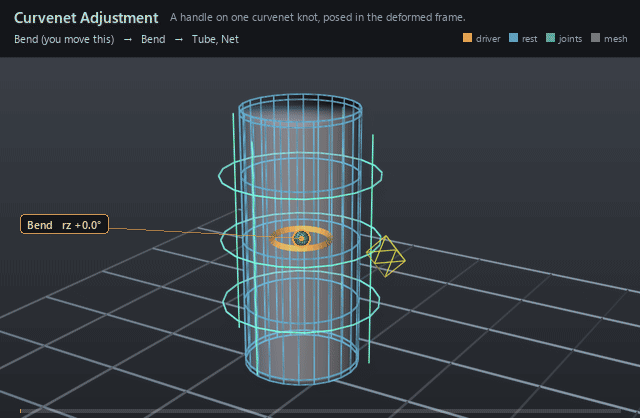

#  Curvenet Adjustment

*A handle on one curvenet knot, posed in the deformed frame.*

| | |
|---|---|
| **Node type** | `RigExecCurvenetAdjustment` |
| **Example** | [curvenet.usda](../examples/curvenet.usda) |

On this page:

- [Overview](#overview)
- [How it works](#how-it-works)
- [Wiring](#wiring)
- [Parameters](#parameters)
- [Example](#example)
- [Tips](#tips)
- [See also](#see-also)

## Overview



A curvenet adjustment is an ordinary animator control — the same
avar channels as a `RigExecControl` — bound to one entry of a curvenet's
shared control-point pool. It is how a face rig tweaks a profile curve on
top of whatever already moved it: the handle's local delta is applied in a
frame deduced from the curvenet's own deformed shape, so the same key reads
as "lift this knot away from the surface" whether the head is at rest or
mid-turn. Nothing places the control: there is no rest position to author
and no offset to keep in sync with the net, because the frame is recomputed
from the incoming points every evaluation.

An animation control on a curvenet knot. The Adjuster Mover
transports this control's local avar frame with preceding deformation.
Tangent adjustments are children of their incident knot adjustment and
use the parent's adjusted frame. No authored rest placement is needed.

## How it works

The adjustment is not evaluated in the pose phase at all — it is read
in the geometry (mover-graph) phase by the `RigExecCurvenetAdjusterMover`
whose `rigExec:adjustments` names it, while that mover revises the curvenet's
own `points`. The adjuster reads the prim's `rest:*`/`default:*`/`avars:*`
channels and space matrices into one local matrix, and the kernel builds a
deformation-relative frame per pool point by sampling the rest and incoming
nets at 16 intervals per spline: an intersection knot takes a best-fit
rotation from its incident tangents, and knots along a curve take the
neighbouring intersections' rotations transported along the curve and slerped
by the sample's fractional arc length between them. The local matrix is then
conjugated by that frame and applied to the knot (and, with `rigExec:includeTangents`, its incident Bezier
handles), the mover envelope blends the result over the incoming revision, and
the adjusted frames are published with the evaluated geometry as control
frames in asset space — which is what draws the handle's guide and what the
usdview manipulator edits.

## Wiring

| Relationship | Points to | Required |
|---|---|---|
| `rigExec:curvenet` | The RigExecCurvenet this handle adjusts; must be the same net the adjuster mover targets. | yes |
| (listed by the adjuster) | The RigExecCurvenetAdjusterMover's `rigExec:adjustments` names this prim itself, or -- for a tangent -- the knot adjustment it is a child of. | yes |
| `rigExec:knotIndex` | Index into the curvenet's shared `points` pool — the knot this handle moves, or, on a tangent child, the handle entry. | yes |
| `rigExec:pointKind` | "knot" (default) or "tangent". | no |
| (namespace parent) | A `pointKind = "tangent"` adjustment must be a child of the knot adjustment whose Bezier handle it names. | yes, for tangents |
| `rigExec:includeTangents` | Carry the knot's incident Bezier handles with it (default true). | no |

## Parameters

### Control channel

#### `avars:sx`

*Type:* `double`. *Default:* `1`.

Local X scale applied before rotation and translation; finite magnitudes below 1e-4 resolve to signed 1e-4, strict authoring rejects non-finite values, and raw non-finite USD resolves to identity on this axis.

#### `avars:sy`

*Type:* `double`. *Default:* `1`.

Local Y scale applied before rotation and translation; finite magnitudes below 1e-4 resolve to signed 1e-4, strict authoring rejects non-finite values, and raw non-finite USD resolves to identity on this axis.

#### `avars:sz`

*Type:* `double`. *Default:* `1`.

Local Z scale applied before rotation and translation; finite magnitudes below 1e-4 resolve to signed 1e-4, strict authoring rejects non-finite values, and raw non-finite USD resolves to identity on this axis.

#### `guide:shape`

*Type:* `uniform token`. *Default:* `"circle"`.

Valid values: `sphere`, `circle`, `box`, `cube`, `diamond`, `pyramid`.

Guide primitive synthesized at the control's posed frame
origin (spec section 10.3 extension), exactly parallel to the
RigExecJoint sphere/cone guides. Every shape is unit-sized and
centered at the origin: sphere and circle have radius 1, box and
cube span +-1, diamond (octahedron) has vertices at +-1 on each
axis, and pyramid has base corners (+-1, -1, +-1) with apex
(0, 1, 0). circle and box are the planar shapes -- normal +Y,
drawn in the local XZ plane -- while cube is the 3D box; this is
the conventional rigging distinction between the two box-ish
tokens.

#### `guide:drawMode`

*Type:* `uniform token`. *Default:* `"wire"`.

Valid values: `wire`, `geometry`.

wire draws the guide as curves, widthed by
guide:wireWidth. geometry draws solid shapes instead.

#### `guide:wireWidth`

*Type:* `double`. *Default:* `0.05`.

Width authored onto the wire curves, in the LOCAL
pre-scale units of the unit shape -- so the drawn width tracks the
evaluated control-frame scale multiplied by guide:scaleX/Y/Z along
with the rest of the shape. A non-uniform effective scale thickens
the curve anisotropically exactly as it stretches the points.

Zero or negative authors no widths at all and falls back to
hairline rendering; geometry draw mode ignores this entirely.

It has a default rather than being left unauthored because
usdview picks with a single-pixel window: an unwidthed hairline
is a one-pixel target that a real click virtually never lands
on, and an empty pick deselects to the pseudo-root. The default
width is what makes a wire control selectable at all.

#### `guide:scaleX`

*Type:* `double`. *Default:* `1.0`.

Positive per-axis draw multiplier of the guide shape whose
final size is abs(evaluated frame axis) * guide:scaleAxis, authored as
three separate double properties rather than a vec3. The control's
posed frame is orthonormalized for placement while its evaluated axis
magnitudes are retained for sizing. A non-positive
or non-finite guide multiplier on any axis draws no guide at all,
independently of the signed 1e-4 floor on avars:sx/sy/sz.

#### `guide:scaleY`

*Type:* `double`. *Default:* `1.0`.

Per-axis draw scale along the local Y axis; see guide:scaleX.

#### `guide:scaleZ`

*Type:* `double`. *Default:* `1.0`.

Per-axis draw scale along the local Z axis; see guide:scaleX.

#### `guide:offset`

*Type:* `double3`. *Default:* `(0, 0, 0)`.

Where the guide shape is drawn, in the control's LOCAL frame,
relative to the control's origin. The control still pivots, rotates
and scales about its origin; only the drawn shape moves. It is what
lets a control whose pivot is buried inside a character (the upper
face turns about the base of the skull) be drawn somewhere it can
be seen and picked. Scaled by the evaluated control-frame scale, so
a scaled control carries its shape with it.

#### `guide:displayColor`

*Type:* `color3f`. *Default:* `(1.0, 0.85, 0.2)`.

Constant colour of the synthesized guide. May be CONNECTED
to another color3f attribute, in which case the first connection
source's value at the evaluated time is drawn instead of the local
one -- the imaging bridge follows the connection because
UsdAttribute::Get never does.

#### `guide:displayOpacity`

*Type:* `float`. *Default:* `1.0`.

Constant opacity of the synthesized guide. May be CONNECTED
to a float or double attribute -- a limb's IK/FK dial, say -- and
then the first connection source's value at the evaluated time is
what is drawn, optionally complemented by guide:displayOpacityInvert
and never below guide:displayOpacityMin. An unconnected attribute
draws exactly the value it holds, floor and invert ignored.

#### `guide:displayOpacityInvert`

*Type:* `uniform bool`. *Default:* `false`.

When guide:displayOpacity is connected, draw 1 - source
instead of source. This is what lets one dial fade two control sets
in opposite directions: the IK controls connect to the switch as-is,
the FK controls connect to the SAME switch with this set, and there
is no second source of truth to drift. Ignored when the opacity is
not connected.

#### `guide:displayOpacityMin`

*Type:* `uniform float`. *Default:* `0.15`.

Floor applied to a CONNECTED guide:displayOpacity after the
optional inversion. A dial parked at its end stop would otherwise
drive the inactive control set to exactly zero, and a fully
transparent control is a trap: an animator who switches a limb to
IK can no longer see the FK controls they need to switch back.
Hydra still picks at any opacity above 0.0001, so the floor is for
the eye, not the picker: 0.15 is enough to find a ghosted control
against the character. Zero restores a true fade-out. Ignored when
the opacity is not connected.

### Transform provider

#### `rest:tx`

*Type:* `double`. *Default:* `0`.

#### `rest:ty`

*Type:* `double`. *Default:* `0`.

#### `rest:tz`

*Type:* `double`. *Default:* `0`.

#### `rest:rx`

*Type:* `double`. *Default:* `0`.

#### `rest:ry`

*Type:* `double`. *Default:* `0`.

#### `rest:rz`

*Type:* `double`. *Default:* `0`.

#### `rest:space`

*Type:* `matrix4d`. *Default:* `( (1, 0, 0, 0), (0, 1, 0, 0), (0, 0, 1, 0), (0, 0, 0, 1) )`.

Bind transform relative to the namespace frame provider's rest frame; always orthonormalized. A provider with no RigExec ancestor resolves against identity, so its rest:space is its local-to-world bind transform.

#### `default:tx`

*Type:* `double`. *Default:* `0`.

#### `default:ty`

*Type:* `double`. *Default:* `0`.

#### `default:tz`

*Type:* `double`. *Default:* `0`.

#### `default:rx`

*Type:* `double`. *Default:* `0`.

#### `default:ry`

*Type:* `double`. *Default:* `0`.

#### `default:rz`

*Type:* `double`. *Default:* `0`.

#### `default:space`

*Type:* `matrix4d`. *Default:* `( (1, 0, 0, 0), (0, 1, 0, 0), (0, 0, 1, 0), (0, 0, 0, 1) )`.

Local-to-world zero position for posing. Its computed fallback
is compose(default translation/XYZ rotation) * rest * inverse(parent
rest) * parent:defaultSpace. The rest is unaffected by default edits.
A connection is authoritative, including identity. Otherwise a
non-identity authored matrix overrides the computed fallback; an
identity value selects that fallback.

#### `posed:space`

*Type:* `matrix4d`. *Default:* `( (1, 0, 0, 0), (0, 1, 0, 0), (0, 0, 1, 0), (0, 0, 0, 1) )`.

Final local-to-world transform. For a joint this is
supplied by the compiler's private solver binding (view-free
extraction); it may also be authored or
connected directly. Unwired xformables follow the parent chain
with rest offsets and avars.

#### `posed:defaultSpace`

*Type:* `matrix4d`. *Default:* `( (1, 0, 0, 0), (0, 1, 0, 0), (0, 0, 1, 0), (0, 0, 0, 1) )`.

Controller-adjusted zero pose; falls back to avars:defaultSpace.
Used by the local-avars pose path before parent motion. A connection
overrides the fallback, as does a non-identity authored matrix.

#### `avars:tx`

*Type:* `double`. *Default:* `0`.

#### `avars:ty`

*Type:* `double`. *Default:* `0`.

#### `avars:tz`

*Type:* `double`. *Default:* `0`.

#### `avars:rx`

*Type:* `double`. *Default:* `0`.

#### `avars:ry`

*Type:* `double`. *Default:* `0`.

#### `avars:rz`

*Type:* `double`. *Default:* `0`.

#### `avars:rspin`

*Type:* `double`. *Default:* `0`.

#### `avars:rotationOrder`

*Type:* `token`. *Default:* `"XYZ"`.

Valid values: `XYZ`, `XZY`, `YXZ`, `YZX`, `ZXY`, `ZYX`.

#### `avars:defaultSpace`

*Type:* `matrix4d`. *Default:* `( (1, 0, 0, 0), (0, 1, 0, 0), (0, 0, 1, 0), (0, 0, 0, 1) )`.

Zero pose supplied to avar evaluation; falls back to the
computed default:space. A connection or non-identity authored matrix
selects another zero pose.

#### `avars:unitScaleFactor`

*Type:* `double`. *Default:* `1`.

Multiplier converting translation avars into local distance units before the selected default and parent transforms. Rotations and scales are unaffected.

#### `parent:space`

*Type:* `matrix4d`. *Default:* `( (1, 0, 0, 0), (0, 1, 0, 0), (0, 0, 1, 0), (0, 0, 0, 1) )`.

Selected parent's posed local-to-world space. Falls back to
the nearest namespace provider's computePointFrame; identity when
there is none. Connections (including identity) or a non-identity
authored matrix select a different parent space.

#### `parent:defaultSpace`

*Type:* `matrix4d`. *Default:* `( (1, 0, 0, 0), (0, 1, 0, 0), (0, 0, 1, 0), (0, 0, 0, 1) )`.

Selected parent's default local-to-world space. Falls back
to the nearest namespace provider's computeDefaultFrame. Connections
(including identity) or a non-identity authored matrix override it.
The avar pose is avars * posed:defaultSpace * inverse(parent:defaultSpace)
* parent:space, in row-vector convention.

### Node parameters

#### `rigExec:curvenet`

*Relationship.*

#### `rigExec:knotIndex`

*Type:* `uniform int`. *Default:* `-1`.

#### `rigExec:pointKind`

*Type:* `uniform token`. *Default:* `"knot"`.

Valid values: `knot`, `tangent`.

#### `rigExec:includeTangents`

*Type:* `uniform bool`. *Default:* `true`.

## Example

The shared curvenet stage profiles its tube with a small net and poses
that net with ordinary rig machinery; `RingPush` is the extra handle layered on
top, bound to one knot of the middle profile ring through `rigExec:curvenet`
and `rigExec:knotIndex = 4`. Watch the **diamond** on the right of the net, not
the ring on the tube: the chip in the corner names `Bend`, the FK control that
swings the whole thing, while the knot the page is about is the one the diamond
rides. The same key is authored twice with the same value — `avars:tx = 1.8` at
frame 1005 and again at 1022 — first with the rig at rest, then under a bend
held at 45 degrees from 1018 to 1030, and the knot leaves the surface the same
way both times because the adjuster rebuilds its frame from the incoming net.
Between the two pushes (1010-1018) only the bend moves, so the two deltas can be
told apart. The adjuster mover writes that knot and its incident Bezier handles
into the net's points, and the Profile Mover carries the tube along.

Open it live with:

```bat
bin\launch_usdview.bat docs\examples\curvenet.usda
```

Re-render the GIF above with:

```bat
python docs/render_media.py --page curvenet_adjustment
```

## Tips

- An adjustment's frame is an output of the point graph, so nothing in the pose phase may read it: naming one in a solver's `rigExec:controls`, a constraint's `rigExec:sources`, a matrix mover's transform provider — or nesting a RigExecControl under it, which would reach it through the default-space namespace fallback — is a compile error. Connecting a single avar scalar from it stays legal.
- On a tangent child, `rigExec:knotIndex` names the HANDLE's pool entry, not the knot's, and it must be one of the parent knot's incident handles; the tangent's delta then applies in the parent's already adjusted frame.
- `rigExec:includeTangents` only does anything on a `bezier` net — a `catmullRom` net has no separate handles, so a knot adjustment moves only its own pool entry and tangent children cannot be bound at all.

## See also

- [Curvenet](curvenet.md)
- [Curvenet Adjuster Mover](curvenet_adjuster_mover.md)
- [Control](control.md)

---

[RigExec nodes](../index.md)
