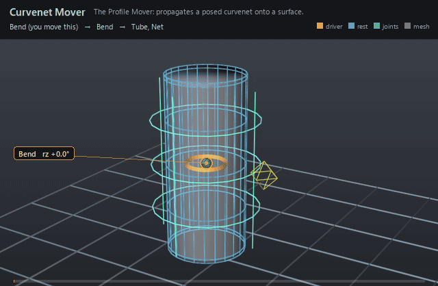

#  Curvenet Mover

*The Profile Mover: propagates a posed curvenet onto a surface.*

| | |
|---|---|
| **Node type** | `RigExecCurvenetMover` |
| **Example** | [curvenet.usda](../examples/curvenet.usda) |

On this page:

- [Overview](#overview)
- [How it works](#how-it-works)
- [Wiring](#wiring)
- [Parameters](#parameters)
- [Example](#example)
- [Tips](#tips)
- [See also](#see-also)

## Overview



The deformer half of curvenet rigging (de Goes, Sheffler & Fleischer,
*Character Articulation through Profile Curves*, SIGGRAPH 2022): a net of
profile splines is articulated like any other geometry, and this mover
carries that articulation onto one mesh's `points`. The surface reproduces
the curves while keeping its own detail, and because the mesh is cut along
the net, each side of a curve deforms independently — a crease can fold
without dragging the other side with it. Nothing in the wiring mentions the
target's tessellation, so re-meshing the surface only re-cuts and re-binds:
no wiring changes.

The Profile Mover: propagates a rigged curvenet's articulation
over one exact native UsdGeomPointBased points property (2022 paper
section 4).

Binding is precomputed once per epoch against the target's authored
base points -- the projection pose -- by cutting the mesh along the
curvenet and factorizing the resulting cut-aware Laplacian. Each frame
the mover interpolates the curvenet's per-side deformation gradients
over that cut-mesh and reconstructs vertex positions, so the surface
reproduces the curves while keeping its own detail, and each side of a
curve deforms independently.

The surface this deforms FROM is whatever the preceding revision in the
chain produced, which is exactly the paper's section 5 separation of
the projection pose from the rest pose: a curvenet layers over skinning,
another curvenet, or a simulation with no extra setup. The common MoverAPI
envelope blends the solved surface over that incoming revision.

## How it works

It runs as one revision of the target's point chain, after the solve
and after every earlier revision on that chain; same-target movers are
ordered by the reverse-sibling post-order walk of `<rig>/Movers`, so
descendants run before their mover parent and sibling branches run
bottom-to-top in usdview (`libs/rigExec/rigEvaluator.cpp:149-163, 3531-3533`).
Every frame it reads the *projection pose* — the curvenet's `points`,
`rigExec:splineIndices`, `rigExec:basis` and `rigExec:samplesPerSpline`,
plus the target's `faceVertexCounts`, `faceVertexIndices` and `points`, all
at **default** time (`libs/rigExec/moverGraph.cpp:2109-2137`) — and hashes
them into a bind digest; the expensive half, cutting the mesh along the net
and factorizing the cut-aware Laplacian, is done once and cached under that
digest (`libs/rigExecMath/profileMover.h:1-11`,
`libs/rigExec/moverGraph.cpp:2167-2199`). It then reads the net's *posed*
points — the result of the curvenet's own mover chain, which the evaluator
guarantees has already run by recording the net's points as a dependency
edge (`libs/rigExec/rigEvaluator.cpp:6821`) — harmonically interpolates the
per-side deformation gradients over the cut mesh, and Poisson-reconstructs
vertex positions from the incoming point revision, which is the surface it
deforms FROM (`libs/rigExec/moverGraph.cpp:830-848`). The solved points are
then blended over that incoming revision by the common MoverAPI envelope
(`libs/rigExec/moverGraph.cpp:888-913`) and written back to the target's
`points`.

## Wiring

| Relationship | Points to | Required |
|---|---|---|
| `rigExec:curvenet` | The `RigExecCurvenet` supplying the control points; the first target is the one used. Omitting it is not a compile error — the mover then fails and passes its incoming points through unchanged. | yes |
| `rigExec:moves` | Exactly one exact native `point3f[] points` property — the surface this deforms. Multi-target fan-out is rejected at compile. | yes |
| `rigExec:weightObject` | Optional weight field over the target's points, supplying the envelope instead of `inputs:defaultWeight`. | no |

## Parameters

### Common mover envelope

#### `rigExec:moves`

*Relationship.*

Reserved write-set relationship: exact prim/property targets.

#### `inputs:enabled`

*Type:* `bool`. *Default:* `true`.

Shape-preserving enable. Disabled movers pass their preceding
revision through unchanged (value-only edit).

#### `inputs:defaultWeight`

*Type:* `float`. *Default:* `1`.

Normalized common mover envelope in [0, 1]. With no bound
rigExec:weightObject it broadcasts over every logical element: zero
passes the incoming value through bit-for-bit and one applies the
mover's full-strength result.

#### `rigExec:weightObject`

*Relationship.*

Optional compatible total weight field, at most one target.
When bound, the weight object's values (including its own sparse or
constant fallback) supply the common envelope instead of
inputs:defaultWeight. Target, domain, and cardinality must match each
mover application; an incompatible binding is a compile error. A
multi-target mover may bind only a constant operation envelope whose
weightTarget is the mover prim itself; that one value broadcasts to
every application of the atomic mover.

### Curvenet source (read from `rigExec:curvenet`)

#### `rigExec:splineIndices`

*Type:* `int[]`. *Default:* `[]`.

Four control point indices per cubic spline. For the bezier
basis they are p0, h0, h1, p1, so entries 0 and 3 are the knots and
the two between are tangent handles.

#### `rigExec:basis`

*Type:* `uniform token`. *Default:* `"bezier"`.

Valid values: `bezier`, `catmullRom`.

Curve basis. "bezier" is the paper's cubic Bezier. The
centripetal Catmull-Rom of the 2026 face-parametrization talk puts
every control point exactly on the curve, which suits nets traced
onto a surface.

#### `rigExec:samplesPerSpline`

*Type:* `uniform int`. *Default:* `5`.

Sampling density before the mesh-resolution scaling of
section 3: the count per spline is this value times the ratio of the
spline's control polygon length to the surface's mean edge length.

### Node parameters

#### `rigExec:curvenet`

*Relationship.*

Exactly one RigExecCurvenet supplying the posed control points.

## Example

Shares the Curvenet page's stage: a profile net drawn over a
144-quad capped tube, its knots posed by ordinary rig machinery — a matrix
mover under an FK-driven joint, then a Curvenet Adjustment through the
Adjuster Mover — and `ProfileMover` propagating that posed net onto
`Tube.points` under a `RigExecCurvenetWeight` envelope. In the picture the
**green** curves are the posed net, the **cyan** wireframe is the rest pose
the whole thing departs from, and the small **yellow diamond** off the
middle ring is the `RingPush` knot handle. The wide swing is the bend; the
local lobe pushed out beside that diamond is *one* knot moved through the
Adjuster, and the surface reproducing it — with the rest of the tube left
alone — is the thing a skin cluster cannot do. The net's 76 pooled control
points are the only thing the rig names; the tube's 168 vertices appear in
no relationship anywhere — the whole point of the representation.

Open it live with:

```bat
bin\launch_usdview.bat docs\examples\curvenet.usda
```

Re-render the GIF above with:

```bat
python docs/render_media.py --page curvenet_mover
```

## Tips

- The projection pose is read at **default** time on both the net and the target, never at the evaluated frame: author the drawn pose as the default value and keep animation in time samples. A target whose `points` exist only as time samples binds nothing and passes through.
- Everything the cut depends on — `rigExec:basis`, `rigExec:samplesPerSpline`, `rigExec:splineIndices`, the net's default points and the target's default points and topology — is hashed into the bind key, so editing any of it re-cuts the mesh and re-factorizes. Animating the net's posed points changes none of those, which is why every frame after the first is cheap.
- The incoming point revision is the surface it deforms from, so a curvenet stacked after skinning, after another curvenet or over simulated points needs no extra setup — put the mover later in the chain and it layers.

## See also

- [Curvenet](curvenet.md)
- [Curvenet Adjuster Mover](curvenet_adjuster_mover.md)
- [Matrix Mover](matrix_mover.md)

---

[UsdRig](../index.md)
