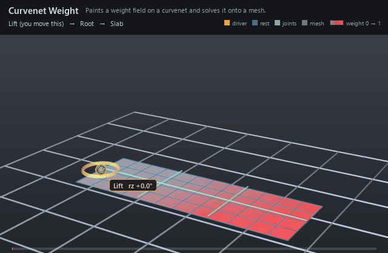

#  Curvenet Weight

*Paints a weight field on a curvenet and solves it onto a mesh.*

| | |
|---|---|
| **Node type** | `RigExecCurvenetWeight` |
| **Example** | [curvenet_weight.usda](../examples/curvenet_weight.usda) |

On this page:

- [Overview](#overview)
- [How it works](#how-it-works)
- [Wiring](#wiring)
- [Parameters](#parameters)
- [Example](#example)
- [Tips](#tips)
- [See also](#see-also)

## Overview



Weight painting that survives a re-mesh. Instead of one scalar per
vertex, the values live on a curvenet's control-point pool — a few dozen
numbers on curves traced over the surface — and the field is *solved*
onto whatever mesh the net is pointed at. Bound through a mover's
`rigExec:weightObject`, it is an ordinary dense envelope: the mover never
learns that the falloff came from curves. Retessellate the mesh and the
same painted net produces the same falloff.

Surface parametrization from scalar maps on a curvenet. Native
property relationships carry mesh/net arrays into computeWeightPacket;
L + kappa B^T B is factorized per layout and reused for animated weights.
weightTarget must be the mesh's exact points property. The four array
relationships each target exactly one native property. Basis/sample count
may connect to the corresponding curvenet attributes.

## How it works

The prim publishes `computeWeightPacket`, so the field is solved in
the weight computation that feeds its bound mover, before that mover's
application runs in the geometry phase. It reads the five native arrays
its relationships name — the mesh `points`, `faceVertexCounts` and
`faceVertexIndices`, and the net's `points` and `rigExec:splineIndices` —
at the requested time, walks each spline with `rigExec:basis` and
`rigExec:samplesPerSpline`, projects every sample onto the surface, and
minimizes `xᵀLx + κ‖Bx − Sw‖²` with `κ = 100 × mean edge length`
(`libs/rigExecMath/curvenetWeights.cpp:34`), where `S` interpolates `inputs:weights` at the
samples. Indices listed in `rigExec:autoSmooth` are solved harmonically
along the net's own connectivity first and their authored values ignored;
mesh components no sample reaches keep `rigExec:unreachedValue`
(`libs/rigExecMath/curvenetWeights.cpp:78-121,137-145,156`). `L + κBᵀB` is factorized once per
geometry/layout/basis/sampling/auto-smooth key and kept in a 32-entry
cache, so re-painting or animating `inputs:weights` re-solves against the
existing factors instead of re-cutting the mesh.

## Wiring

| Relationship | Points to | Required |
|---|---|---|
| `rigExec:weightTarget` | The moved mesh's exact `points` property — the same property the bound mover moves. | yes |
| `rigExec:curvenetPoints` | One RigExecCurvenet's `points` control pool. | yes |
| `rigExec:curvenetSplineIndices` | That same curvenet's `rigExec:splineIndices`. | yes |
| `rigExec:meshFaceCounts` | The target mesh's `faceVertexCounts`. | yes |
| `rigExec:meshFaceIndices` | The target mesh's `faceVertexIndices`. | yes |
| `inputs:weights` | One float per control-pool point, including the tangent handles; auto-smoothed entries are ignored. | yes |
| (bound by) | A mover's `rigExec:weightObject` applies this field. | - |

## Parameters

### Weight field

#### `rigExec:weightTarget`

*Relationship.*

Canonical prim or exact property carrying the weighted
domain. For a constant envelope over an atomic multi-target mover,
this is the mover prim itself.

#### `rigExec:representation`

*Type:* `uniform token`. *Default:* `"constant"`.

Valid values: `constant`, `dense`, `sparse`.

#### `rigExec:rangePolicy`

*Type:* `uniform token`. *Default:* `"strict"`.

Valid values: `strict`, `clamp`.

### Node parameters

#### `rigExec:representation`

*Type:* `uniform token`. *Default:* `"dense"`.

Valid values: `dense`.

#### `rigExec:rangePolicy`

*Type:* `uniform token`. *Default:* `"clamp"`.

Valid values: `strict`, `clamp`.

#### `rigExec:curvenetPoints`

*Relationship.*

#### `rigExec:curvenetSplineIndices`

*Relationship.*

#### `rigExec:meshFaceCounts`

*Relationship.*

#### `rigExec:meshFaceIndices`

*Relationship.*

#### `inputs:weights`

*Type:* `float[]`. *Default:* `[]`.

#### `rigExec:autoSmooth`

*Type:* `int[]`. *Default:* `[]`.

Control-pool indices whose values are interpolated from anchored neighbors.

#### `rigExec:basis`

*Type:* `uniform token`. *Default:* `"catmullRom"`.

Valid values: `bezier`, `catmullRom`.

#### `rigExec:samplesPerSpline`

*Type:* `uniform int`. *Default:* `5`.

#### `rigExec:unreachedValue`

*Type:* `float`. *Default:* `0`.

## Example

A flat slab is crossed by a curvenet: one rail down its length and
two profile curves meeting the rail at shared knots. The green splines are
that curvenet itself — it holds the numbers and stays at rest while the slab
bends, because the parametrization reads the authored pool, not a mover's
output. Eight knot values are painted and the solve turns them into a field
over all 65 slab vertices, which a matrix mover uses as its envelope: grey at
the Lift end, saturating to red at the far end, and the far edge stays paler
than the near edge, so the single `avars:rz` rotation lands as a graded bend
that also twists. Re-meshing the slab from three rows to five changed nothing
on the net — the same eight numbers re-solve onto whatever vertices are
there.

Open it live with:

```bat
bin\launch_usdview.bat docs\examples\curvenet_weight.usda
```

Re-render the GIF above with:

```bat
python docs/render_media.py --page curvenet_weight
```

## Tips

- Paint knots, auto-smooth handles: listing every tangent handle in `rigExec:autoSmooth` lets the net interpolate them harmonically, but each unknown run must reach at least one painted point or the bind fails with `auto-smooth component has no authored weight anchor` (libs/rigExecMath/curvenetWeights.cpp:104-105).
- Editing `inputs:weights` is a value edit — the factorization is keyed by geometry, layout, basis, sample count and auto-smooth membership (curvenetWeightComputations.cpp:88-90), and the arrays are read through the generation's resolved inputs every frame (bakedWeights.cpp:233-236), so an animated field costs one re-solve, not a re-cut.
- The least-squares fit can land just outside [0, 1]; the type's `clamp` default bounds it, while `strict` invalidates the packet (curvenetWeightComputations.cpp:48-55) and a mover handed an invalid envelope passes its preceding revision through unchanged (moverKernels.cpp:446).

## See also

- [Curvenet](curvenet.md)
- [Static Weight](static_weight.md)
- [Matrix Mover](matrix_mover.md)

---

[RigExec nodes](../index.md)
