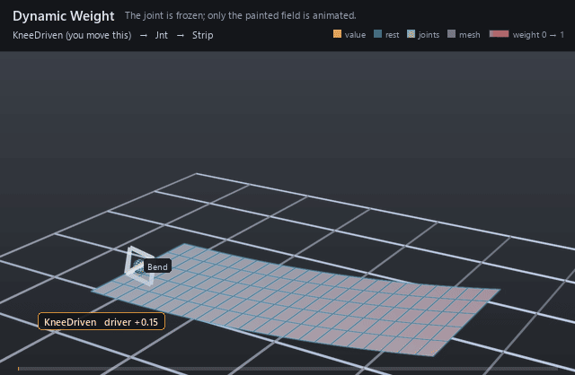

#  Dynamic Weight

*The joint is frozen; only the painted field is animated.*

| | |
|---|---|
| **Node type** | `RigExecDynamicWeight` |
| **Example** | [dynamic_weight.usda](../examples/dynamic_weight.usda) |

On this page:

- [Overview](#overview)
- [How it works](#how-it-works)
- [Wiring](#wiring)
- [Parameters](#parameters)
- [Example](#example)
- [Tips](#tips)
- [See also](#see-also)

## Overview



Paint that moves: a dynamic weight takes a static base field and
reshapes it every frame from an animated driver — a muscle that engages
with effort, a corrective that fades with a pose, a knee influence that
breathes with the stride. Same target contract as the field it wraps: it
declares the same `rigExec:weightTarget` and is bound in the mover's
place of the field it modulates.

Epoch-shape-stable weight field recomputed from statically
declared inputs, optionally modulating a base weight object:
r_i = (b_i * d) * s + a; w_i = RangePolicy(r_i) (spec section 4.1).

## How it works

The compiler binds the mover's `rigExec:weightObject` to one
`computeWeightPacket` for the whole epoch, and every generation
re-evaluates that packet from `inputs:driver`, `inputs:scale`, and
`inputs:bias` as ordinary dynamic inputs before the mover walk reads it
at the consuming revision. The base field resolves first — the
`rigExec:baseWeight` relationship pulls that object's own packet —
then each element becomes `(b × inputs:driver) × inputs:scale +
inputs:bias` — `inputs:scale` and `inputs:bias` apply *after* the driver
is combined in, not to the driver — and `rigExec:rangePolicy` either
rejects a result outside [0, 1] (`strict`) or clamps it (`clamp`). The
resolved envelope is handed to the mover and, when the influence overlay
is armed, published as the field a rigger is shown; nothing is written
back to the stage.

## Wiring

| Relationship | Points to | Required |
|---|---|---|
| `rigExec:baseWeight` | Weight field this one modulates; required unless the representation is `constant`, and at most one target. | yes |
| `rigExec:weightTarget` | Exact points property this field covers; must match the target of the mover that binds it. | yes |
| (bound by) | A mover's `rigExec:weightObject` applies this field. | - |

## Parameters

### Weight field

#### `rigExec:weightTarget`

*Relationship.*

Canonical prim or exact property carrying the weighted
domain. For a constant envelope over an atomic multi-target mover,
this is the mover prim itself.

#### `rigExec:representation`

*Type:* `uniform token`. *Default:* `"constant"`.

Valid values: `constant`, `dense`, `sparse`.

#### `rigExec:rangePolicy`

*Type:* `uniform token`. *Default:* `"strict"`.

Valid values: `strict`, `clamp`.

### Node parameters

#### `rigExec:baseWeight`

*Relationship.*

#### `rigExec:operation`

*Type:* `uniform token`. *Default:* `"multiply"`.

Valid values: `multiply`.

#### `inputs:driver`

*Type:* `float`. *Default:* `1`.

#### `inputs:scale`

*Type:* `float`. *Default:* `1`.

#### `inputs:bias`

*Type:* `float`. *Default:* `0`.

## Example

A 24 × 6 strip is skinned to one joint that holds a fixed 35-degree
bend, and the only animation in the file is `inputs:driver` sweeping
0.15 → 1 → 0.15. The base paint is a straight ramp from 0 at the
one-sixth mark to 1 at the tip, and with `inputs:scale = 1` the driver
simply scales that whole field at once: every painted point follows the
same fraction of the bend at every moment, so the grey-to-red ramp
brightens and dims — and the strip curls further and relaxes — while the
control and the joint never move. The docs renderer tints the strip by
the field the mover actually consumed — grey at weight 0, red at
weight 1 — so the ramp and the curl that follows it are the same
event.

Open it live with:

```bat
bin\launch_usdview.bat docs\examples\dynamic_weight.usda
```

Re-render the GIF above with:

```bat
python docs/render_media.py --page dynamic_weight
```

## Tips

- `rangePolicy: clamp` is what lets `inputs:scale` overdrive the paint: a result outside [0, 1] is clamped instead of failing the pose, so a driver can push part of a painted ramp to fully followed while the rest of it still fades.
- The influence overlay paints the field a mover consumed, so point it at the dynamic weight, not the base it wraps: an unbound base has no resolved field of its own to show.
- Drive the driver from another channel (a float math mover or a connection) to tie corrective strength to posing; each of driver, scale, and bias takes at most one float connection.

## See also

- [Static Weight](static_weight.md)
- [Matrix Mover](matrix_mover.md)
- [Float Math Mover](float_math_mover.md)

---

[UsdRig](../index.md)
