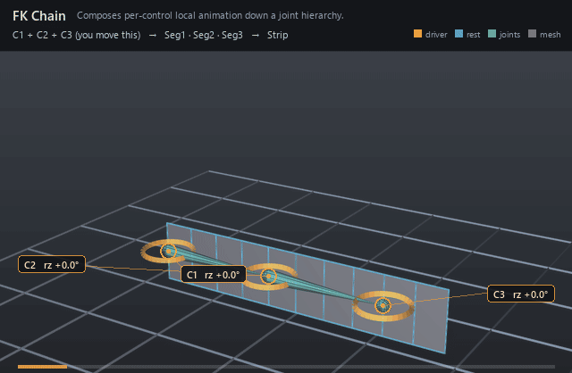

#  FK Chain

*Composes per-control local animation down a joint hierarchy.*

| | |
|---|---|
| **Node type** | `RigExecFkChain` |
| **Example** | [fk_chain.usda](../examples/fk_chain.usda) |

On this page:

- [Overview](#overview)
- [How it works](#how-it-works)
- [Wiring](#wiring)
- [Parameters](#parameters)
- [Example](#example)
- [Tips](#tips)
- [See also](#see-also)

## Overview



Forward kinematics in its simplest form: one control per joint, each
authoring a local rotation (or translation), composed down the chain so
every joint inherits its ancestors' motion. Use it for tails, spines,
fingers — anywhere the animator wants direct control of every link. The
controls are normally nested one under the next so each handle rides the
one above it, which is what `rigExec:controlSpace = "parentRelative"`
declares.

Applies control frames/offsets to a rest hierarchy. Publishes
aggregate computePointFrameArray; addressable joint providers publish
scalar frames (spec section 4.1).

## How it works

The solver runs in the pose phase: it reads each targeted control's
`computePointFrame` and `computeRestFrame`, forms that control's
rest-to-pose delta, and publishes one aggregate `computePointFrameArray`
whose element N is written to `rigExec:joints`[N] — the two lists are
parallel, so control N poses joint N and joint N inherits the composed
frames above it. `rigExec:controlSpace` decides how the deltas compose:
`world` chains them (W_i = W_(i-1) . A_i) for sibling controls, while
`parentRelative` takes each delta as-is because a nested control's frame
already travels with its parent. The chain MEASURES its deltas from its
*controls'* rests, but the basis it composes them onto is the joint's rest
reference — which the pose stack replaces with the frame the steps below the
chain left (spec section 4.2). So a constraint below the chain moves the
joint and the chain carries that displacement through its solve instead of
replacing it; a joint no step below it wrote keeps its authored rest and the
chain answers exactly as it always did. Rest offsets between joints set the bone
lengths and pivots — nothing is measured in absolute numbers — but the
solve itself is absolute: unless `rigExec:startFrame` names the provider
the chain hangs from, the chain ignores whatever its joints sit under.
Skinning movers then read the posed joints at the `final` phase.

## Wiring

| Relationship | Points to | Required |
|---|---|---|
| `rigExec:controls` | Ordered animator controls, one per joint. | yes |
| `rigExec:joints` | Ordered nested joints the chain poses; with none, the solver publishes frames nothing reads. | no |
| `rigExec:controlSpace` | `parentRelative` when the controls are nested under each other; `world` for sibling controls. | no |

## Parameters

### Node parameters

#### `purpose`

*Type:* `uniform token`. *Default:* `"guide"`.

Render purpose, overriding UsdGeomImageable's `default`
fallback: joint and solver guides are DIAGNOSTICS, drawn when a
viewer asks for guides.

This is the stock attribute rather than a RigExec-specific token so
that the bounds and the drawing cannot disagree: UsdGeomBBoxCache
classifies a prim's extent by this exact attribute, and the results
scene index stamps the same resolved value onto the guide it
synthesizes. A control keeps the inherited `default` -- it is the
rig's interaction surface, not a diagnostic -- and authoring
`guide` on one moves both its drawing and its bounds together.

#### `rigExec:controls`

*Relationship.*

Ordered chain controls (parents resolved via rigExec:parent).

#### `rigExec:controlSpace`

*Type:* `uniform token`. *Default:* `"world"`.

Valid values: `world`, `parentRelative`.

What each control's posed frame already contains, i.e.
whether it carries the motion of the control before it in the
chain.

`world` (the default): the controls are independent asset-space
frames, siblings under the rig's Controls scope, each contributing
only its own rest-to-pose delta A_i; the solver composes them down
the chain, W_i = W_(i-1) . A_i. Posing a control moves the joints
below it but NOT the child controls, which stay at their rest.

`parentRelative`: control i is authored as a namespace descendant of
control i-1 with a rest relative to it, so its computePointFrame is
already W_(i-1) . restLocal_i . D_i -- it travels with its parent
the way an FK limb control does -- and its asset-space
rest-to-pose delta is the whole W_i. The solver therefore takes
each control's delta as-is instead of composing the parent in
again, which would apply the parent's motion twice. The joint
result is identical to `world` for the same avars; only the
control frames differ. Nesting is what makes the controls follow;
this token is what keeps the solver honest about it.

#### `rigExec:startFrame`

*Relationship.*

Optional single provider (joint or control) whose POSED
frame is the base the whole chain hangs from: the solver composes
every element on top of that provider's rest-to-pose delta S, so
W_0 = S . A_0 instead of W_0 = A_0 (and in `parentRelative`,
W_i = S . A_i for every i, since there each control's delta is
already the whole chain map).

Unauthored is the historical behaviour, bit for bit: the chain is
an ABSOLUTE world solve that ignores whatever its joints hang from.
That is what this relationship exists to fix. Measured on a
synthetic `a -> b -> c` with an FkChain over `[b, c]` only: posing
`a` with avars:rz = 90 left b at (10,0,0) and c at (20,0,0) -- they
did not move at all, because nothing told the solver where its
chain starts. A hand built that way detaches from the wrist the
moment the arm moves.

Nesting the chain's first control under the thing it should follow
is NOT a substitute when that thing is solver-posed: a
solver-posed joint is an absolute override and namespace pose does
not propagate through it (see rigEvaluator's hierarchicalProviders
rule), and nesting under the arm's FK control follows in FK and
stands still in IK. Pointing this relationship at the joint the
chain hangs from -- the wrist, claimed by the arm's IK/FK blend --
follows in BOTH.

The target is an ordinary frame input, so the compiler already
orders this solver after whatever poses the target and rejects a
cycle. The start provider's own frame is NOT published as an
element: cardinality stays exactly rigExec:controls, and each
joint's element index is unchanged.

#### `rigExec:joints`

*Relationship.*

Ordered output joints this solver poses (view-free
extraction, user-directed 2026-07-25). List position is the
aggregate element index; length is the effective sample count.
The compiler binds each joint to one aggregate element
in the derived layer.

#### `guide:radius`

*Type:* `double`. *Default:* `1.0`.

Radius of the sphere and cone drawn at each aggregate
element: the exact counterpart of RigExecJoint's guide:radius,
including the rule that zero or negative draws no guides at all,
which is how a solver's diagnostics are turned off.

Without it the elements are stuck at Hydra's fallback radius of
1.0. That is proportionate on an asset authored at tens of units
and several times the size of the whole character on one authored
at one unit -- the joints were given this knob for exactly that
reason and the aggregate solvers were not, so turning guide
display on for a small asset buried it in solver geometry.

#### `guide:displayColor`

*Type:* `color3f`. *Default:* `(0.3, 0.6, 1.0)`.

#### `guide:displayOpacity`

*Type:* `float`. *Default:* `0.5`.

## Example

Three controls curl a ten-quad strip. C2 is a namespace child of C1
and C3 of C2, each with the same local rest offset as its joint (2 units),
so the rings sit on Seg1/Seg2/Seg3 at x = 0, 2, 4 and each one rides the
one above it — the chain reads them with `rigExec:controlSpace =
"parentRelative"`. One matrix mover per joint skins the strip through a
linear weight ramp, so each joint hands its influence to the next across a
two-unit span: the column on Seg2 is split 0.5 with Seg1, the midline
between Seg2 and Seg3 is split 0.5 to each, and the column on Seg3 is split
0.5 with Seg2. Both bends therefore draw as arcs rather than creases, and
the same handover is happening at every joint — the strip ends at x = 5 so
no part of it is a rigid slab hanging off the last one.

Open it live with:

```bat
bin\launch_usdview.bat docs\examples\fk_chain.usda
```

Re-render the GIF above with:

```bat
python docs/render_media.py --page fk_chain
```

## Tips

- Nesting the controls only works with `rigExec:controlSpace = "parentRelative"`: a nested control's frame already carries its parent's motion, so the default `world` composes it in a second time. On this stage, dropping the token sends Seg3 to x = -0.45 at frame 1006 instead of x = 3.03.
- Point `rigExec:startFrame` at the joint the chain hangs from when that joint is posed by another solver; without it the chain is an absolute solve and the limb detaches from its parent.
- FK pairs well with IK: blend the two aggregates through a Blend Point Frames node, or stack both solvers on the same joints — `rigExec:joints` is an ordered write, so the later writer simply replaces the frames the earlier one committed.

## See also

- [Two-Bone IK](two_bone_ik.md)
- [Blend Point Frames](blend_point_frames.md)
- [Joint](joint.md)

---

[UsdRig](../index.md)
