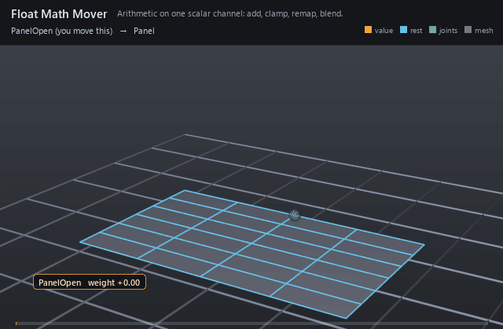

#  Float Math Mover

*Arithmetic on one scalar channel: add, clamp, remap, blend.*

| | |
|---|---|
| **Node type** | `RigExecFloatMathMover` |
| **Example** | [float_math_mover.usda](../examples/float_math_mover.usda) |

On this page:

- [Overview](#overview)
- [How it works](#how-it-works)
- [Wiring](#wiring)
- [Parameters](#parameters)
- [Example](#example)
- [Tips](#tips)
- [See also](#see-also)

## Overview



The property domain's calculator: it revises an exact float attribute
— a blendshape weight, a blend factor, an envelope — instead of geometry.
The everyday job is unit plumbing. A channel arrives in whatever range the
department upstream authored it in, and `remap` divides it down into the
0 → 1 a weight expects; `clamp`, `add`, `multiply` and `blend` cover the
rest. `remap` deliberately does not bound its result, so a clamp mover
after it is what keeps an overshoot from driving a shape past its target.

Statically typed add, multiply, clamp, remap, or blend over an
exact float property target (spec section 4.1).

The revision is r = op(incoming), then the common MoverAPI envelope mixes
it back over the incoming value. Zero is a pass-through and one applies
the operation outright -- the same rule every mover follows.

remap normalizes from [inputs:min, inputs:max] to [0, 1] and does NOT
clamp; compose a clamp mover after it to bound the result.

## How it works

A math mover has no phase inside exec at all. Its inputs are all
authored on itself and the chain's base is the target attribute's own
authored value, so property chains are evaluated BEFORE exec runs and the
result is supplied to exec as a value override — which is how a normalized
weight reaches the blendshape mover or solver that reads it instead of
being recomputed inside that kernel. Each revision computes
`r = op(incoming)` and mixes it back through the common envelope
(`incoming + defaultWeight × (r − incoming)`), so zero passes the incoming
value through and one applies the operation outright. Movers sharing one
target revise it in mover-stack order: a reversed namespace walk, each
parent after its children, so the last sibling listed runs first.

## Wiring

| Relationship | Points to | Required |
|---|---|---|
| `rigExec:moves` | Exact float property to revise; exactly one. | yes |

## Parameters

### Common mover envelope

#### `rigExec:moves`

*Relationship.*

Reserved write-set relationship: exact prim/property targets.

#### `inputs:enabled`

*Type:* `bool`. *Default:* `true`.

Shape-preserving enable. Disabled movers pass their preceding
revision through unchanged (value-only edit).

#### `inputs:defaultWeight`

*Type:* `float`. *Default:* `1`.

Normalized common mover envelope in [0, 1]. With no bound
rigExec:weightObject it broadcasts over every logical element: zero
passes the incoming value through bit-for-bit and one applies the
mover's full-strength result.

#### `rigExec:weightObject`

*Relationship.*

Optional compatible total weight field, at most one target.
When bound, the weight object's values (including its own sparse or
constant fallback) supply the common envelope instead of
inputs:defaultWeight. Target, domain, and cardinality must match each
mover application; an incompatible binding is a compile error. A
multi-target mover may bind only a constant operation envelope whose
weightTarget is the mover prim itself; that one value broadcasts to
every application of the atomic mover.

### Node parameters

#### `rigExec:operation`

*Type:* `uniform token`. *Default:* `"clamp"`.

Valid values: `add`, `multiply`, `clamp`, `remap`, `blend`.

#### `inputs:value`

*Type:* `float`. *Default:* `0`.

#### `inputs:min`

*Type:* `float`. *Default:* `0`.

#### `inputs:max`

*Type:* `float`. *Default:* `1`.

## Example

A hinged panel curls open from a single blendshape. The incoming
channel swings 0 → 4.8 → 0 in its own units on the blend input's
`inputs:weight`; `Normalize` (remap, min 0 max 4) turns that into the
0 → 1.2 → 0 a weight can use, and `Bound` (clamp, min 0 max 1) catches the
overshoot so the panel dwells fully open instead of tearing past its
target shape. The chip shows the raw number going in; the panel shows what
came out.

Open it live with:

```bat
bin\launch_usdview.bat docs\examples\float_math_mover.usda
```

Re-render the GIF above with:

```bat
python docs/render_media.py --page float_math_mover
```

## Tips

- Property chains resolve before exec runs, so a revised weight reaches solvers and movers in the same evaluation.
- Same-target math movers run in mover-stack order — the reversed namespace walk — so the LAST sibling listed executes FIRST. `reorder nameChildren` is how the example puts remap before clamp.
- `remap` only normalizes: `(v − min) / (max − min)`, with a zero-width range returning 0 rather than dividing. Chain a `clamp` after it whenever the incoming channel can overshoot.

## See also

- [Blend Input](blend_input.md)
- [Blendshape Mover](blendshape_mover.md)
- [Vec3f Math Mover](vec3f_math_mover.md)

---

[RigExec nodes](../index.md)
