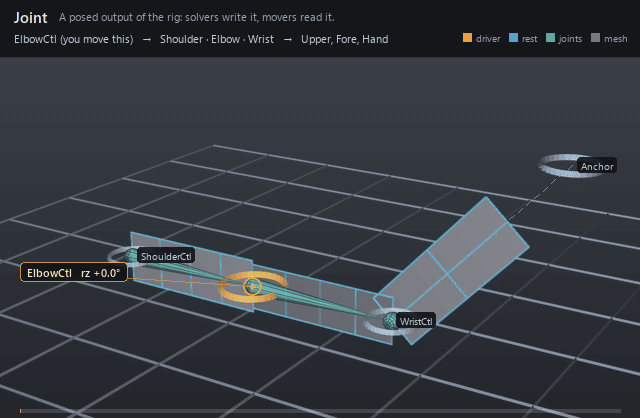

#  Joint

*A posed output of the rig: solvers write it, movers read it.*

| | |
|---|---|
| **Node type** | `RigExecJoint` |
| **Example** | [joint.usda](../examples/joint.usda) |

On this page:

- [Overview](#overview)
- [How it works](#how-it-works)
- [Wiring](#wiring)
- [Parameters](#parameters)
- [Example](#example)
- [Tips](#tips)
- [See also](#see-also)

## Overview



A joint is where solved posing becomes readable data.
`rigExec:joints` is an ordered write and not an exclusive claim: any number of
aggregate solvers may name one joint, and any number of pose constraints may
name it on `rigExec:moves`. All of them are steps of one kind in ONE
hierarchical stack, ordered by the composed namespace of the whole rig — the
bottom sibling first — and by nothing else. A constraint that sits BELOW a
solver runs before it and feeds it: the frame it leaves becomes that solver's
rest reference. A constraint ABOVE it revises the solver's output, which is the
classic shape and the one you get by putting `Solvers` at the bottom of the
rig. Joints nest in the namespace to form the hierarchy, and
usdview draws each joint as a guide sphere with a cone to every nested
child.

The joint of an armature-based rig, mirroring OpenExec's
IrJointScope exactly: a RigExecXformable specialized so guides can be
drawn (a sphere at the posed origin and one cone to each nested child
joint, purpose guide). Hierarchy is namespace nesting (a child joint is
authored inside its parent joint), and guide links derive directly from
the evaluated parent and child origins.

## How it works

The compiler builds one chain per joint out of every step that
writes it — the solvers that name it and the constraints that move it — in the
rig's hierarchical order, and the pose phase runs that chain. A solver
extracts the joint's element from its frame array and REPLACES whatever stood
there, measuring the joint from the frame the preceding steps left; a
constraint reads that same incoming frame and writes a revised one over it. A
joint no solver names is still evaluated — it follows its namespace parent's
posed space with its own rest offset and avars — and a joint with no step
before a solver hands that solver its authored `rest:space` rest, which is why
a rig whose constraints all sit above its solvers behaves exactly as it always
did. A mover reads the `base` frame — the joint after the LAST SOLVER in the
chain — unless it asks for `final`, which is the top of the chain, or names a
prim, which is the joint as of when the walk finished with it.

## Wiring

| Relationship | Points to | Required |
|---|---|---|
| (posed by) | Any number of solvers' `rigExec:joints` name this joint; the writes stack in hierarchical order and the last one supplies its base frame. | - |
| (revised by) | Any number of pose constraints name this joint on `rigExec:moves`. They occupy the SAME hierarchical stack as the solvers: one above a solver revises its output, one below feeds it. | - |

## Parameters

### Transform provider

#### `rest:tx`

*Type:* `double`. *Default:* `0`.

#### `rest:ty`

*Type:* `double`. *Default:* `0`.

#### `rest:tz`

*Type:* `double`. *Default:* `0`.

#### `rest:rx`

*Type:* `double`. *Default:* `0`.

#### `rest:ry`

*Type:* `double`. *Default:* `0`.

#### `rest:rz`

*Type:* `double`. *Default:* `0`.

#### `rest:space`

*Type:* `matrix4d`. *Default:* `( (1, 0, 0, 0), (0, 1, 0, 0), (0, 0, 1, 0), (0, 0, 0, 1) )`.

Bind transform relative to the namespace frame provider's rest frame; always orthonormalized. A provider with no RigExec ancestor resolves against identity, so its rest:space is its local-to-world bind transform.

#### `default:tx`

*Type:* `double`. *Default:* `0`.

#### `default:ty`

*Type:* `double`. *Default:* `0`.

#### `default:tz`

*Type:* `double`. *Default:* `0`.

#### `default:rx`

*Type:* `double`. *Default:* `0`.

#### `default:ry`

*Type:* `double`. *Default:* `0`.

#### `default:rz`

*Type:* `double`. *Default:* `0`.

#### `default:space`

*Type:* `matrix4d`. *Default:* `( (1, 0, 0, 0), (0, 1, 0, 0), (0, 0, 1, 0), (0, 0, 0, 1) )`.

Local-to-world zero position for posing. Its computed fallback
is compose(default translation/XYZ rotation) * rest * inverse(parent
rest) * parent:defaultSpace. The rest is unaffected by default edits.
A connection is authoritative, including identity. Otherwise a
non-identity authored matrix overrides the computed fallback; an
identity value selects that fallback.

#### `posed:space`

*Type:* `matrix4d`. *Default:* `( (1, 0, 0, 0), (0, 1, 0, 0), (0, 0, 1, 0), (0, 0, 0, 1) )`.

Final local-to-world transform. For a joint this is
supplied by the compiler's private solver binding (view-free
extraction); it may also be authored or
connected directly. Unwired xformables follow the parent chain
with rest offsets and avars.

#### `posed:defaultSpace`

*Type:* `matrix4d`. *Default:* `( (1, 0, 0, 0), (0, 1, 0, 0), (0, 0, 1, 0), (0, 0, 0, 1) )`.

Controller-adjusted zero pose; falls back to avars:defaultSpace.
Used by the local-avars pose path before parent motion. A connection
overrides the fallback, as does a non-identity authored matrix.

#### `avars:tx`

*Type:* `double`. *Default:* `0`.

#### `avars:ty`

*Type:* `double`. *Default:* `0`.

#### `avars:tz`

*Type:* `double`. *Default:* `0`.

#### `avars:rx`

*Type:* `double`. *Default:* `0`.

#### `avars:ry`

*Type:* `double`. *Default:* `0`.

#### `avars:rz`

*Type:* `double`. *Default:* `0`.

#### `avars:rspin`

*Type:* `double`. *Default:* `0`.

#### `avars:rotationOrder`

*Type:* `token`. *Default:* `"XYZ"`.

Valid values: `XYZ`, `XZY`, `YXZ`, `YZX`, `ZXY`, `ZYX`.

#### `avars:defaultSpace`

*Type:* `matrix4d`. *Default:* `( (1, 0, 0, 0), (0, 1, 0, 0), (0, 0, 1, 0), (0, 0, 0, 1) )`.

Zero pose supplied to avar evaluation; falls back to the
computed default:space. A connection or non-identity authored matrix
selects another zero pose.

#### `avars:unitScaleFactor`

*Type:* `double`. *Default:* `1`.

Multiplier converting translation avars into local distance units before the selected default and parent transforms. Rotations and scales are unaffected.

#### `parent:space`

*Type:* `matrix4d`. *Default:* `( (1, 0, 0, 0), (0, 1, 0, 0), (0, 0, 1, 0), (0, 0, 0, 1) )`.

Selected parent's posed local-to-world space. Falls back to
the nearest namespace provider's computePointFrame; identity when
there is none. Connections (including identity) or a non-identity
authored matrix select a different parent space.

#### `parent:defaultSpace`

*Type:* `matrix4d`. *Default:* `( (1, 0, 0, 0), (0, 1, 0, 0), (0, 0, 1, 0), (0, 0, 0, 1) )`.

Selected parent's default local-to-world space. Falls back
to the nearest namespace provider's computeDefaultFrame. Connections
(including identity) or a non-identity authored matrix override it.
The avar pose is avars * posed:defaultSpace * inverse(parent:defaultSpace)
* parent:space, in row-vector convention.

### Node parameters

#### `avars:sx`

*Type:* `double`. *Default:* `1`.

Local X scale applied before rotation and translation; finite magnitudes below 1e-4 resolve to signed 1e-4, strict authoring rejects non-finite values, and raw non-finite USD resolves to identity on this axis.

#### `avars:sy`

*Type:* `double`. *Default:* `1`.

Local Y scale applied before rotation and translation; finite magnitudes below 1e-4 resolve to signed 1e-4, strict authoring rejects non-finite values, and raw non-finite USD resolves to identity on this axis.

#### `avars:sz`

*Type:* `double`. *Default:* `1`.

Local Z scale applied before rotation and translation; finite magnitudes below 1e-4 resolve to signed 1e-4, strict authoring rejects non-finite values, and raw non-finite USD resolves to identity on this axis.

#### `purpose`

*Type:* `uniform token`. *Default:* `"guide"`.

Render purpose, overriding UsdGeomImageable's `default`
fallback: joint and solver guides are DIAGNOSTICS, drawn when a
viewer asks for guides.

This is the stock attribute rather than a RigExec-specific token so
that the bounds and the drawing cannot disagree: UsdGeomBBoxCache
classifies a prim's extent by this exact attribute, and the results
scene index stamps the same resolved value onto the guide it
synthesizes. A control keeps the inherited `default` -- it is the
rig's interaction surface, not a diagnostic -- and authoring
`guide` on one moves both its drawing and its bounds together.

#### `guide:radius`

*Type:* `double`. *Default:* `1.0`.

Radius of BOTH guide primitives: the sphere at the posed
origin and every cone drawn to a nested child joint. Without this the
guides use Hydra's fallback radius of 1.0 -- correct at arm scale,
far larger than the geometry on a small asset. Zero or negative draws
no guides at all.

#### `guide:displayColor`

*Type:* `color3f`. *Default:* `(1.0, 0.3, 0.3)`.

#### `guide:displayOpacity`

*Type:* `float`. *Default:* `0.5`.

## Example

A three-joint arm whose wrist is written twice. The FK chain poses
shoulder, elbow, and wrist from three controls as the elbow control curls 70
degrees, then an aim constraint re-aims the wrist at a fixed anchor above and
beyond the hand in the pose phase. Each panel is skinned rigidly to its own
joint (Upper to Shoulder, Fore to Elbow, Hand to Wrist) and reads the `final`
phase, so the long hand panel keeps pointing at the anchor while the forearm
swings out from under it. In the GIF the pale spheres at the shoulder, elbow
and wrist are the joints themselves and the tapered wire between each pair is
the bone that the namespace nesting creates; the dashed line from the wrist to
`Anchor` is the pose-phase aim revision, not a control link. `ShoulderCtl` is
deliberately left unanimated, so the Upper panel sits on its own rest ghost
for the whole loop and the only motion in frame comes from the one driver.

Open it live with:

```bat
bin\launch_usdview.bat docs\examples\joint.usda
```

Re-render the GIF above with:

```bat
python docs/render_media.py --page joint
```

## Tips

- Nest joints (Elbow inside Shoulder) so hierarchy, guides, and FK composition all agree — and remember `rest:space` is measured from the parent joint's rest, not from the world.
- Several solvers may pose one joint, and pose constraints are steps of the same kind in the same stack: the order is the composed namespace of the whole rig and nothing else, bottom sibling first. Put `Solvers` at the bottom of the rig to get the classic "solve, then revise" shape; a constraint that ends up BELOW a solver feeds it instead — every solver kind composes over the frame the steps below it left, so nothing is discarded either way.
- A solver whose output another solver reads is naming joints for their rests, not claiming them, so an IK and an FK chain can both list the chain that their IK/FK blend actually poses.

## See also

- [FK Chain](fk_chain.md)
- [Aim Constraint](aim_constraint.md)
- [Matrix Mover](matrix_mover.md)

---

[RigExec nodes](../index.md)
