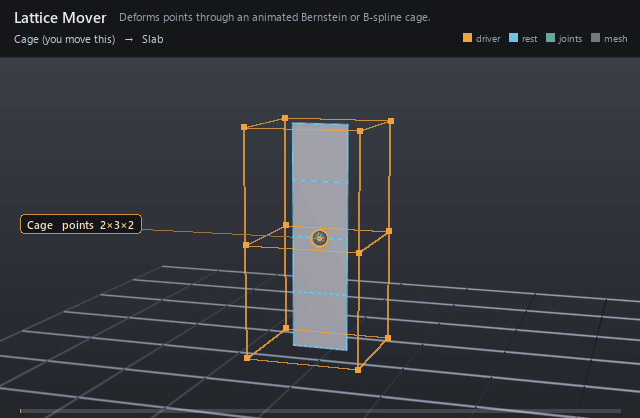

#  Lattice Mover

*Deforms points through an animated Bernstein or B-spline cage.*

| | |
|---|---|
| **Node type** | `RigExecLatticeMover` |
| **Example** | [lattice_mover.usda](../examples/lattice_mover.usda) |

On this page:

- [Overview](#overview)
- [How it works](#how-it-works)
- [Wiring](#wiring)
- [Parameters](#parameters)
- [Example](#example)
- [Tips](#tips)
- [See also](#see-also)

## Overview



Free-form deformation: a native Points or mesh cage surrounds the
geometry, and posing the cage (default time is the bind, timeSamples are
the posed cage) carries the moved points through tensor-product basis
evaluation. Fewer cage points than mesh vertices drive broad, smooth
shaping — bulges, bends, squash and stretch.

Reads cage points from a native mesh/points prim and writes
exactly one exact native UsdGeomPointBased points property through
tensor-product basis evaluation (spec sections 4.1, 7.5).

## How it works

Each moved point is located in the bind cage's lattice coordinates,
then re-evaluated in the posed cage under the `bernstein` or `bspline`
basis. `rigExec:divisions` sets the cage resolution per axis with
x-fastest point ordering; the cage is read at `rigExec:cageReadPhase`
(usually `base`, the authored animation).

## Wiring

| Relationship | Points to | Required |
|---|---|---|
| `rigExec:cage` | Native Points/mesh prim supplying cage points. | yes |
| `rigExec:moves` | Exact points property to deform. | yes |

## Parameters

### Common mover envelope

#### `rigExec:moves`

*Relationship.*

Reserved write-set relationship: exact prim/property targets.

#### `inputs:enabled`

*Type:* `bool`. *Default:* `true`.

Shape-preserving enable. Disabled movers pass their preceding
revision through unchanged (value-only edit).

#### `inputs:defaultWeight`

*Type:* `float`. *Default:* `1`.

Normalized common mover envelope in [0, 1]. With no bound
rigExec:weightObject it broadcasts over every logical element: zero
passes the incoming value through bit-for-bit and one applies the
mover's full-strength result.

#### `rigExec:weightObject`

*Relationship.*

Optional compatible total weight field, at most one target.
When bound, the weight object's values (including its own sparse or
constant fallback) supply the common envelope instead of
inputs:defaultWeight. Target, domain, and cardinality must match each
mover application; an incompatible binding is a compile error. A
multi-target mover may bind only a constant operation envelope whose
weightTarget is the mover prim itself; that one value broadcasts to
every application of the atomic mover.

### Node parameters

#### `rigExec:cage`

*Relationship.*

Native mesh/points prim supplying cage control points.

#### `rigExec:basis`

*Type:* `uniform token`. *Default:* `"bspline"`.

Valid values: `bspline`, `bernstein`.

#### `rigExec:divisions`

*Type:* `int3`. *Default:* `(2, 2, 2)`.

#### `rigExec:cageReadPhase`

*Type:* `uniform token`. *Default:* `"base"`.

Valid values: `base`, `preceding`, `final`.

## Example

A 2×3×2 Bernstein cage bulges its middle layer outward and back,
widening the middle of a vertical strip. Bind and posed cage share the
same point ordering.

Open it live with:

```bat
bin\launch_usdview.bat docs\examples\lattice_mover.usda
```

Re-render the GIF above with:

```bat
python docs/render_media.py --page lattice_mover
```

## Tips

- Hide the cage (`visibility = invisible`): it is scaffolding, not geometry.
- Follow a bulge with a Smooth mover to settle the lattice falloff or a Volume Correct mover to hold girth.

## See also

- [Smooth Mover](smooth_mover.md)
- [Volume Correct Mover](volume_correct_mover.md)
- [Matrix Mover](matrix_mover.md)

---

[RigExec nodes](../index.md)
