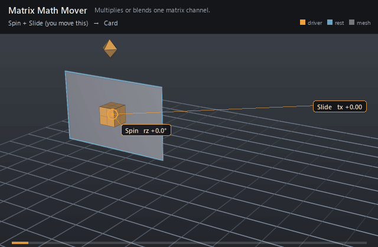

#  Matrix Math Mover

*Multiplies or blends one matrix channel.*

| | |
|---|---|
| **Node type** | `RigExecMatrixMathMover` |
| **Example** | [matrix_math_mover.usda](../examples/matrix_math_mover.usda) |

On this page:

- [Overview](#overview)
- [How it works](#how-it-works)
- [Wiring](#wiring)
- [Parameters](#parameters)
- [Example](#example)
- [Tips](#tips)
- [See also](#see-also)

## Overview



Matrix arithmetic on an exact matrix4d attribute — composing spaces,
post-multiplying offsets, blending between alternative frames. Distinct
from the point-moving Matrix Mover: this one revises the matrix itself,
and whatever reads that matrix follows. The operand is an ordinary
matrix4d input, so it can be a constant or a connection to another matrix
channel — a control's `posed:space` makes an animator handle the second
matrix in the product.

Statically typed multiply or blend over an exact matrix4d
property target (spec section 4.1). Distinct from the point-moving
RigExecMatrixMover.

multiply post-multiplies (inputs:value applied AFTER the incoming
matrix, in GfMatrix4d's row-vector convention); blend replaces. The common
MoverAPI envelope mixes component-wise and is exact at both endpoints.

## How it works

`multiply` post-applies `inputs:value` after the incoming matrix
(row-vector convention: points meet the incoming matrix first, the value
second); `blend` replaces it. The envelope mixes component-wise and is
exact at both endpoints, so a `blend` at weight 1 is a straight
substitution and a partial weight is a crossfade between two frames.
`inputs:value` may be CONNECTED, which is how a control drives the
arithmetic: the mover reads the same `posed:space` matrix the control is
posed and drawn at. The whole property chain resolves BEFORE exec runs —
that is what lets its result be handed back as the attribute's value —
so the operand has to be a matrix that already stands on the stage,
authored or connected.

## Wiring

| Relationship | Points to | Required |
|---|---|---|
| `rigExec:moves` | Exact matrix4d property to revise. | yes |
| `inputs:value.connect` | Optional matrix4d source for the operand. Pointed at a control's `posed:space`, the mover follows that handle; unconnected, it uses the authored constant. | no |

## Parameters

### Common mover envelope

#### `rigExec:moves`

*Relationship.*

Reserved write-set relationship: exact prim/property targets.

#### `inputs:enabled`

*Type:* `bool`. *Default:* `true`.

Shape-preserving enable. Disabled movers pass their preceding
revision through unchanged (value-only edit).

#### `inputs:defaultWeight`

*Type:* `float`. *Default:* `1`.

Normalized common mover envelope in [0, 1]. With no bound
rigExec:weightObject it broadcasts over every logical element: zero
passes the incoming value through bit-for-bit and one applies the
mover's full-strength result.

#### `rigExec:weightObject`

*Relationship.*

Optional compatible total weight field, at most one target.
When bound, the weight object's values (including its own sparse or
constant fallback) supply the common envelope instead of
inputs:defaultWeight. Target, domain, and cardinality must match each
mover application; an incompatible binding is a compile error. A
multi-target mover may bind only a constant operation envelope whose
weightTarget is the mover prim itself; that one value broadcasts to
every application of the atomic mover.

### Node parameters

#### `rigExec:operation`

*Type:* `uniform token`. *Default:* `"multiply"`.

Valid values: `multiply`, `blend`.

#### `inputs:value`

*Type:* `matrix4d`. *Default:* `( (1, 0, 0, 0), (0, 1, 0, 0), (0, 0, 1, 0), (0, 0, 0, 1) )`.

## Example

Two handles and one card, with no solver in between, and each
handle is drawn as one of the two operands. The **diamond** swinging on a
stalk above the card's rest centre is the Spin dial: it is the `blend`
operand, and the `blend` mover takes the card Xform's authored identity
straight to that frame (envelope 1 is a substitution, not a mix). The
**box** riding the card's centre is the Slide handle, the `multiply`
operand, post-applied afterwards. Because the multiply comes *after*, its
translation acts in the spun frame's parent: the card turns about its own
centre through 70° and *then* slides along the grid's X, not along its
own tilted X — which is the whole difference between post- and
pre-multiplication, visible in one picture. The blue wireframe card is
the rest pose the pair departs from.

Open it live with:

```bat
bin\launch_usdview.bat docs\examples\matrix_math_mover.usda
```

Re-render the GIF above with:

```bat
python docs/render_media.py --page matrix_math_mover
```

## Tips

- Post-multiplication order matters: the value applies AFTER the incoming matrix, so it acts in the incoming frame's parent — a translation runs along the parent axes whatever rotation came before it, and the incoming transform happens first.
- Connect `inputs:value` to a control's `posed:space` to make the operand animatable. A joint's posed frame is not available here: the chain resolves before the solve, so what it would read is the authored identity.
- Two movers on one matrix are a stack, and composed children execute bottom-up — author the `blend` that establishes the frame BELOW the `multiply` that offsets it.

## See also

- [Matrix Mover](matrix_mover.md)
- [Control](control.md)
- [Float Math Mover](float_math_mover.md)

---

[RigExec nodes](../index.md)
