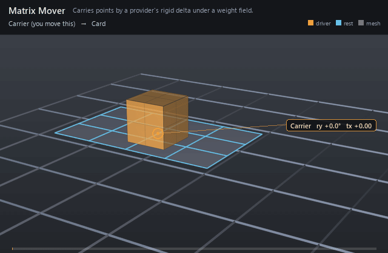

#  Matrix Mover

*Carries points by a provider's rigid delta under a weight field.*

| | |
|---|---|
| **Node type** | `RigExecMatrixMover` |
| **Example** | [matrix_mover.usda](../examples/matrix_mover.usda) |

On this page:

- [Overview](#overview)
- [How it works](#how-it-works)
- [Wiring](#wiring)
- [Parameters](#parameters)
- [Example](#example)
- [Tips](#tips)
- [See also](#see-also)

## Overview



The workhorse deformer: it reads one transform provider's
rest-relative delta and applies it to the moved points, scaled per point
by a weight object. One mover at constant weight is a rigid attachment;
several stacked on one target are applied in sequence, each from the
preceding revision, which is exact wherever a point has a single
influence and is not linear blend skinning where weights overlap — that
is the Skin Mover's job.

Moves the preceding native point3f[] points value through one
declared target-local affine transform and blends each point with the
common MoverAPI envelope: p' = q + w (T q - q) (spec section 7.4).

## How it works

The provider publishes `computeMatrix`, the rest-to-posed map of its
own frame (computations.cpp:401-415), and the mover blends it over the
incoming points as `p' = q + w (T q - q)` (schema.usda:1677-1679), where
`w` is the bound weight field or, with none bound,
`inputs:defaultWeight`. `rigExec:transformReadPhase` chooses which
revision of the provider is read: the default `base` binds the provider
itself, `final` binds the head of its frame chain
(moverGraph.cpp:1366-1379). The result is passed down the point chain,
and the compiler synthesizes the recompute revisions that keep authored
`normals` and `extent` on that gprim current (rigEvaluator.cpp:5821-5863).

## Wiring

| Relationship | Points to | Required |
|---|---|---|
| `rigExec:transform` | Exactly one control or joint to follow. | yes |
| `rigExec:weightObject` | Weight field scaling the follow (optional; overrides the envelope when bound). | no |
| `rigExec:moves` | Exact points property to deform. | yes |

## Parameters

### Common mover envelope

#### `rigExec:moves`

*Relationship.*

Reserved write-set relationship: exact prim/property targets.

#### `inputs:enabled`

*Type:* `bool`. *Default:* `true`.

Shape-preserving enable. Disabled movers pass their preceding
revision through unchanged (value-only edit).

#### `inputs:defaultWeight`

*Type:* `float`. *Default:* `1`.

Normalized common mover envelope in [0, 1]. With no bound
rigExec:weightObject it broadcasts over every logical element: zero
passes the incoming value through bit-for-bit and one applies the
mover's full-strength result.

#### `rigExec:weightObject`

*Relationship.*

Optional compatible total weight field, at most one target.
When bound, the weight object's values (including its own sparse or
constant fallback) supply the common envelope instead of
inputs:defaultWeight. Target, domain, and cardinality must match each
mover application; an incompatible binding is a compile error. A
multi-target mover may bind only a constant operation envelope whose
weightTarget is the mover prim itself; that one value broadcasts to
every application of the atomic mover.

### Node parameters

#### `rigExec:transform`

*Relationship.*

Exactly one GfMatrix4d provider (computeMatrix).

#### `rigExec:transformReadPhase`

*Type:* `uniform token`. *Default:* `"base"`.

Valid values: `base`, `preceding`, `final`.

## Example

A solid box control sits on a flat card, and the mover's
`rigExec:transform` points straight at that control — no joint in between —
so the card is rigidly bolted to the handle. The box slides 2.2 units along
X and yaws 24 degrees and back, and the card goes with it corner for corner,
which is what "rigid delta" means. No weight object is bound and the envelope
stays at 1, so the follow is full strength over every point of the card.

Open it live with:

```bat
bin\launch_usdview.bat docs\examples\matrix_mover.usda
```

Re-render the GIF above with:

```bat
python docs/render_media.py --page matrix_mover
```

## Tips

- The provider may be a control as readily as a joint: those are the only two types `rigExec:transform` accepts (rigEvaluator.cpp:7221-7231).
- `final` binds the provider's frame-chain head, so a constraint that revises the joint downstream is included; the default `base` binds the provider itself (moverGraph.cpp:1366-1379, schema.usda:1685).
- Same-target movers are an ordinary stack ordered by the composed namespace: reverse-sibling post-order, so descendants run before their parent and the bottom sibling before the top (spec section 4.2). Stacking is how you layer rigid follows, not how you blend influences on one point — use the Skin Mover for that (schema.usda:1700-1705).

## See also

- [Skin Mover](skin_mover.md)
- [Static Weight](static_weight.md)
- [Joint](joint.md)

---

[RigExec nodes](../index.md)
