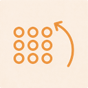
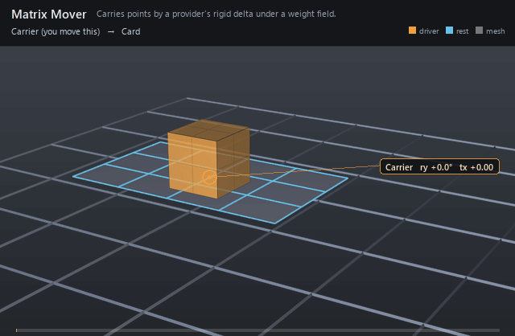

#  Matrix Mover

*Carries points by a provider's rigid delta under a weight field.*

| | |
|---|---|
| **Node type** | `RigExecMatrixMover` |
| **Example** | [matrix_mover.usda](../examples/matrix_mover.usda) |

On this page:

- [Overview](#overview)
- [How it works](#how-it-works)
- [Wiring](#wiring)
- [Parameters](#parameters)
- [Example](#example)
- [Tips](#tips)
- [See also](#see-also)

## Overview



The workhorse deformer: it reads one transform provider's
rest-relative delta and applies it to the moved points, scaled per point
by a weight object. One mover at constant weight is a rigid attachment;
several stacked on one target are applied in sequence, each from the
preceding revision, which is exact wherever a point has a single
influence and is not linear blend skinning where weights overlap — that
is the Skin Mover's job. Naming a bare prim — a joint, a control or an
Xformable — instead of a `points` property moves that prim's FRAME the
same way, as a step of the pose stack.

Moves the preceding value through one declared target-local
affine transform, blended by the common MoverAPI envelope.

Two domains, chosen by what rigExec:moves names -- the same split the
write side draws everywhere: <prim>.points is the geometry domain and a
bare prim path is the transform domain.

GEOMETRY. One native point3f[] points property. Each point blends
p' = q + w (T q - q) (spec section 7.4).

TRANSFORM. One Xformable, RigExecControl or RigExecJoint. Its frame
blends M' = T_w M, the exact twin of the point form and of UsdSkel's own
pairing of ComputeSkinnedPoints with ComputeSkinnedTransform. The weight
is one element, so inputs:defaultWeight is it unless a weight object with
a single element is bound, and rigExec:weightBlend chooses the falloff
exactly as it does for points.

A transform placed where a point is, given the same deformers in the same
order at the same weights, lands where that point lands. That invariant
is what makes a transform able to ride a deformer stack instead of
approximating one with a blend of constraint sources.

## How it works

The provider publishes `computeMatrix`, the rest-to-posed map of its
own frame (computations.cpp:401-415), and the mover blends it over the
incoming points as `p' = q + w (T q - q)` (schema.usda:1677-1679), where
`w` is the bound weight field or, with none bound,
`inputs:defaultWeight`. `rigExec:transformReadPhase` chooses which
revision of the provider is read: the default `base` binds the provider
itself, `final` binds the head of its frame chain
(moverGraph.cpp:1366-1379). The result is passed down the point chain,
and the compiler synthesizes the recompute revisions that keep authored
`normals` and `extent` on that gprim current (rigEvaluator.cpp:5821-5863).

## Wiring

| Relationship | Points to | Required |
|---|---|---|
| `rigExec:transform` | Exactly one control or joint to follow. | yes |
| `rigExec:weightObject` | Weight field scaling the follow (optional; overrides the envelope when bound). | no |
| `rigExec:moves` | Exact points property to deform, or a bare joint, control or Xformable whose frame to move. | yes |

## Parameters

### Common mover envelope

#### `rigExec:moves`

*Relationship.*

Reserved write-set relationship: exact prim/property targets.

#### `inputs:enabled`

*Type:* `bool`. *Default:* `true`.

Shape-preserving enable. Disabled movers pass their preceding
revision through unchanged (value-only edit).

#### `inputs:defaultWeight`

*Type:* `float`. *Default:* `1`.

Normalized common mover envelope in [0, 1]. With no bound
rigExec:weightObject it broadcasts over every logical element: zero
passes the incoming value through bit-for-bit and one applies the
mover's full-strength result.

#### `rigExec:weightObject`

*Relationship.*

Optional compatible total weight field, at most one target.
When bound, the weight object's values (including its own sparse or
constant fallback) supply the common envelope instead of
inputs:defaultWeight. Target, domain, and cardinality must match each
mover application; an incompatible binding is a compile error. A
multi-target mover may bind only a constant operation envelope whose
weightTarget is the mover prim itself; that one value broadcasts to
every application of the atomic mover.

### Node parameters

#### `rigExec:pointFrame`

*Type:* `uniform token`. *Default:* `"rest"`.

Valid values: `rest`, `posed`.

WHICH FRAME the points this cluster moves are already in.
Only meaningful with rigExec:transformSpace, and only in the
geometry domain.

rest, the fallback, is a cluster that runs BEFORE the skin and so
moves points still in the asset's own units. posed is one that
runs after it and moves points a skin has already carried into the
rig's posed frame.

The distinction is invisible until something above the rig is
scaled, which is exactly why it needs saying. The offset
rigExec:transformSpace measures is INVARIANT under a master scale
-- both the transform and the space carry it on the right, so
T * S^-1 gives the same answer either way -- and that is correct
for a pre-skin cluster, whose own skin is still to come and will
apply the scale itself. A post-skin cluster gets a mesh twice as
big and an offset that has not grown, so it pulls the doubled mesh
by the original distance.

posed conjugates the offset by the rig's CARRY, C^-1 M C, where C
is rigExec:space's own rest->pose map. That is the whole
correction and not a scale correction: for a master moved by T,
(p + T) * T^-1 M T is p*M + T, which is what rigidity wants, and
a rotated or scaled master needs nothing else said. One blanket
answer cannot serve both families -- rest and posed need it in
opposite directions -- which is why this says which, exactly as
it does on RigExecCurveMover.

WITHOUT rigExec:space the conjugation falls back to the measuring
space's own SCALE, which is all this could do before a carry
could be named: it fixes a scaled master and does nothing at all
for a translated or rotated one. A space nothing has scaled then
measures (1,1,1) and the correction is skipped, so every rig
without a scaled master and without a named carry is
bit-identical.

#### `rigExec:space`

*Relationship.*

The prim whose movement away from its rest carries the
whole rig -- normally a TRS master. Only meaningful with
rigExec:pointFrame = "posed", and only in the geometry domain.

NOT the same thing as rigExec:transformSpace. That one is what the
offset is MEASURED against -- the handle's own parent, so the
points take the handle's motion inside it and not the space's.
This one is what the POINTS the offset is applied to have already
been carried by, which for a post-skin cluster is everything above
the rig. The measured offset is invariant under the masters by
construction (both terms carry them on the right and they cancel),
so applying it to carried points shears them by T*R - T, growing
with the master's motion and zero only when the offset has no
rotation.

The carry used is the named prim's own rest->pose map -- what
computeMatrix publishes -- so a master sitting at its rest
contributes identity and a rig naming no space is unchanged, down
to taking the same arithmetic branch it always did rather than
multiplying by an identity.

#### `rigExec:transform`

*Relationship.*

Exactly one GfMatrix4d provider (computeMatrix).

#### `rigExec:transformSpace`

*Relationship.*

Optional second provider the transform is measured against:
T = M(transform) * inverse(M(transformSpace)), both read at the same
phase. With the transform nested under the space in the control
hierarchy, T is the transform's own local motion carried to its rest
pivot, so the points move by what the handle does inside the space
and not by the space's motion -- a localized cluster, for geometry
that is deformed at rest before it is skinned to that space.

#### `rigExec:referenceTransform`

*Relationship.*

Optional neutral-solve provider sharing transform's authored
rest frame. Normalizes the transform as inverse(M(reference)) *
M(transform), so the fitted neutral solve produces identity even
when a solver has rest residuals or controls have default offsets.
Read at transformReadPhase; the reference must have animation
channels neutralized while sharing the live fitting parameters.

#### `rigExec:referenceTransformSpace`

*Relationship.*

Neutral counterpart of transformSpace. Required when both
referenceTransform and transformSpace are supplied. Normalize both
transforms independently before removing the space's motion.

#### `rigExec:transformReadPhase`

*Type:* `uniform token`. *Default:* `"base"`.

Valid values: `base`, `preceding`, `final`.

#### `rigExec:weightBlend`

*Type:* `uniform token`. *Default:* `"linear"`.

Valid values: `linear`, `radial`.

How a partial weight is taken.

linear is the historical form and the default: p' = q + w(Tq - q),
exact at both ends and a straight line between them.

radial takes a fraction of the transform's ROTATION instead, so a
point keeps its distance from the axis at every weight. The two
agree exactly at weight 0 and weight 1 and differ only in the
falloff, where linear follows the chord of the arc. A chord always
falls inside its arc, toward the axis, so a cluster that rotates a
lid about an eyeball drives it INTO the eyeball at mid weight --
by r(1 - cos(theta/2)), which is a tenth of the radius at a 56
degree sweep.

## Example

A solid box control sits on a flat card, and the mover's
`rigExec:transform` points straight at that control — no joint in between —
so the card is rigidly bolted to the handle. The box slides 2.2 units along
X and yaws 24 degrees and back, and the card goes with it corner for corner,
which is what "rigid delta" means. No weight object is bound and the envelope
stays at 1, so the follow is full strength over every point of the card.

Open it live with:

```bat
bin\launch_usdview.bat docs\examples\matrix_mover.usda
```

Re-render the GIF above with:

```bat
python docs/render_media.py --page matrix_mover
```

## Tips

- The provider may be a control as readily as a joint: those are the only two types `rigExec:transform` accepts (rigEvaluator.cpp:7221-7231).
- `final` binds the provider's frame-chain head, so every pose step above it is included; the default `base` is the joint after the LAST SOLVER wrote it, which is not the same as "before every constraint" — a constraint that sits below the last solver is folded into `base` through that solver. Name a prim if you want a specific moment: the `Solvers` scope means "after the last solver", the `Movers` scope "after the last constraint" (moverGraph.cpp:1366-1379, schema.usda:1685).
- Same-target movers are an ordinary stack ordered by the composed namespace: reverse-sibling post-order, so descendants run before their parent and the bottom sibling before the top (spec section 4.2). Stacking is how you layer rigid follows, not how you blend influences on one point — use the Skin Mover for that (schema.usda:1700-1705).
- `rigExec:weightBlend = "radial"` blends a fraction of the rotation instead of the chord, so a partly weighted point keeps its distance from the driver's pivot; the default `linear` is the classic cluster. A frame mover blends its landmark points the same way (examples/15_TransformMatrixMover.usda).

## See also

- [Skin Mover](skin_mover.md)
- [Static Weight](static_weight.md)
- [Joint](joint.md)

---

[UsdRig](../index.md)
