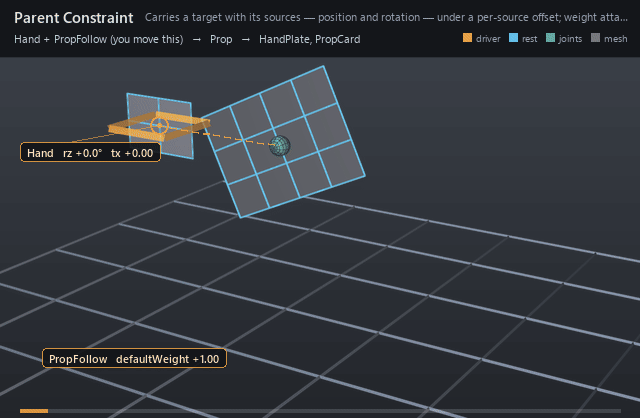

#  Parent Constraint

*Carries a target with its sources — position and rotation together — under a per-source offset.*

| | |
|---|---|
| **Node type** | `RigExecParentConstraint` |
| **Example** | [parent_constraint.usda](../examples/parent_constraint.usda) |

On this page:

- [Overview](#overview)
- [How it works](#how-it-works)
- [Wiring](#wiring)
- [Parameters](#parameters)
- [Example](#example)
- [Tips](#tips)
- [See also](#see-also)

## Overview



FBX-style parenting expressed as a constraint rather than as namespace
nesting: the prim named by `rigExec:moves` is carried by the blended
`rigExec:sources`, keeping the offset authored for each source. It is the
one constraint that writes all three channel groups, and the one whose
scale group is **off** by default, matching the FBX runtime — a parented
prop inherits where its parent is and which way it faces, not how big it
is. Because it is an ordinary mover, `inputs:defaultWeight` is the
attach/release channel: key it down and the prop settles back into its own
space.

FBX-style parent constraint. Translation and rotation are
enabled on every axis by default. Scale is disabled on every axis by
default to match the FBX runtime default. Offset arrays are parallel to
the inherited ordered rigExec:sources relationship.

## How it works

In the pose phase the constraint resolves each entry of the ordered
`rigExec:sources` to that source's current revision, composes the matching
`inputs:translationOffsets[i]` / `inputs:rotationOffsets[i]` entry *before*
the source transform (`targetMatrix = offset * source`), and accumulates a
weighted average of the resulting translations and scales plus a
shortest-arc Euler average of the rotations, anchored on the first
contributing source and read in `rigExec:rotationOrder`. That candidate is
then written per axis through the three `inputs:affect*` mask triples and
blended over the target's incoming frame by the common mover envelope, so
the single `rigExec:moves` target is revised in place and anything that reads
that provider afterwards -- a skinning mover with
`rigExec:transformReadPhase = "final"`, for instance -- sees the parented
result. A zero envelope is an exact pass-through: the target keeps whatever
posed it before the constraint ran.

## Wiring

| Relationship | Points to | Required |
|---|---|---|
| `rigExec:sources` | Ordered transform providers that carry the target; order is shared with every parallel array. | yes |
| `rigExec:moves` | The one transform provider this constraint revises (pose phase). | yes |
| `rigExec:weightObject` | Optional constant weight field supplying the attach envelope instead of `inputs:defaultWeight`. | no |
| `inputs:translationOffsets` | Per-source translation offsets, parallel to `rigExec:sources` (empty = zero). | no |
| `inputs:rotationOffsets` | Per-source Euler offsets in degrees, parallel to `rigExec:sources` (empty = zero). | no |
| `inputs:sourceWeights` | Per-source blend weights (empty = every source at full weight). | no |

## Parameters

### Common mover envelope

#### `rigExec:moves`

*Relationship.*

Reserved write-set relationship: exact prim/property targets.

#### `inputs:enabled`

*Type:* `bool`. *Default:* `true`.

Shape-preserving enable. Disabled movers pass their preceding
revision through unchanged (value-only edit).

#### `inputs:defaultWeight`

*Type:* `float`. *Default:* `1`.

Normalized common mover envelope in [0, 1]. With no bound
rigExec:weightObject it broadcasts over every logical element: zero
passes the incoming value through bit-for-bit and one applies the
mover's full-strength result.

#### `rigExec:weightObject`

*Relationship.*

Optional compatible total weight field, at most one target.
When bound, the weight object's values (including its own sparse or
constant fallback) supply the common envelope instead of
inputs:defaultWeight. Target, domain, and cardinality must match each
mover application; an incompatible binding is a compile error. A
multi-target mover may bind only a constant operation envelope whose
weightTarget is the mover prim itself; that one value broadcasts to
every application of the atomic mover.

### Constraint base

#### `rigExec:locked`

*Type:* `uniform bool`. *Default:* `false`.

Authoring lock metadata for DCC interchange. Evaluation
remains active while locked; use RigExecMoverAPI inputs:enabled or
inputs:defaultWeight to disable or blend the operation.

#### `inputs:affectTranslationX`

*Type:* `bool`. *Default:* `true`.

Per-axis translation mask. Ignored groups are a compile error.

#### `inputs:affectTranslationY`

*Type:* `bool`. *Default:* `true`.

#### `inputs:affectTranslationZ`

*Type:* `bool`. *Default:* `true`.

#### `inputs:affectRotationX`

*Type:* `bool`. *Default:* `true`.

Per-axis rotation mask. Ignored groups are a compile error.

#### `inputs:affectRotationY`

*Type:* `bool`. *Default:* `true`.

#### `inputs:affectRotationZ`

*Type:* `bool`. *Default:* `true`.

#### `inputs:affectScaleX`

*Type:* `bool`. *Default:* `true`.

Per-axis scale mask. Ignored groups are a compile error.
RigExecParentConstraint overrides the default to false to match the
FBX runtime, which leaves scale off unless it is asked for.

#### `inputs:affectScaleY`

*Type:* `bool`. *Default:* `true`.

#### `inputs:affectScaleZ`

*Type:* `bool`. *Default:* `true`.

#### `inputs:translationOffset`

*Type:* `double3`. *Default:* `(0, 0, 0)`.

Additive translation offset applied after the source blend.

#### `inputs:rotationOffset`

*Type:* `double3`. *Default:* `(0, 0, 0)`.

Additive Euler rotation offset in degrees, applied after the blend.

#### `inputs:scaleOffset`

*Type:* `double3`. *Default:* `(0, 0, 0)`.

ADDITIVE scale offset applied after the blend, which is why
its identity is (0, 0, 0) and not (1, 1, 1): the kernel computes
blendedScale + offset. A multiplicative offset would be a different
operator, not a different default.

#### `rigExec:rotationOrder`

*Type:* `uniform token`. *Default:* `"XYZ"`.

Valid values: `XYZ`, `XZY`, `YXZ`, `YZX`, `ZXY`, `ZYX`.

Euler order for the operators that compose a rotation.
Authoring it on one that does not is a compile error.

### Ordered sources

#### `rigExec:sources`

*Relationship.*

Ordered transform sources. Order is preserved through
composition because it identifies entries in every parallel source
array.

#### `inputs:sourceWeights`

*Type:* `float[]`. *Default:* `[]`.

Per-source weights parallel to rigExec:sources. An empty
array gives every source equal, full weight. A non-empty array must
have exactly one entry per source.

### Node parameters

#### `inputs:affectScaleX`

*Type:* `bool`. *Default:* `false`.

#### `inputs:affectScaleY`

*Type:* `bool`. *Default:* `false`.

#### `inputs:affectScaleZ`

*Type:* `bool`. *Default:* `false`.

#### `inputs:translationOffsets`

*Type:* `double3[]`. *Default:* `[]`.

Per-source translation offsets parallel to rigExec:sources.

#### `inputs:rotationOffsets`

*Type:* `double3[]`. *Default:* `[]`.

Per-source Euler rotation offsets parallel to rigExec:sources.

## Example

A Prop joint is parented to the Hand control with a
`(1.6, 0, 0)` translation offset and a 25-degree Z rotation offset, and a blue
card is skinned rigidly to that joint, so the card rides out and rotates with
the hand while holding that exact distance and tilt.
Mid-shot `inputs:defaultWeight` fades 1 → 0 and the card slides back to its
own rest space while the hand stays out; the weight returns to 1 and the
card re-attaches at the same offset it left with, then the hand carries it
home.

Open it live with:

```bat
bin\launch_usdview.bat docs\examples\parent_constraint.usda
```

Re-render the GIF above with:

```bat
python docs/render_media.py --page parent_constraint
```

## Tips

- Scale is off on every axis by default — this is the only constraint that overrides the base class's all-on default, to match the FBX runtime — so a parented prop keeps its own scale until you author `inputs:affectScale*`.
- The offsets are per-source arrays. Authoring the scalar `inputs:translationOffset` / `inputs:rotationOffset` / `inputs:scaleOffset` inherited from the constraint base is a compile error here, because this operator composes the arrays instead.
- `inputs:defaultWeight` is re-read every frame, so keying it is the attach/release channel; at 0 the constraint is a bit-for-bit pass-through and the target falls back to whatever posed it earlier.

## See also

- [Aim Constraint](aim_constraint.md)
- [Control](control.md)
- [Matrix Mover](matrix_mover.md)

---

[RigExec nodes](../index.md)
