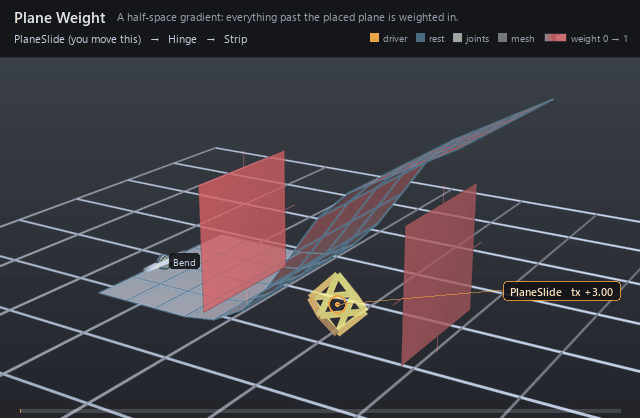

#  Plane Weight

*A half-space gradient: everything past the placed plane is weighted in.*

| | |
|---|---|
| **Node type** | `RigExecPlaneWeight` |
| **Example** | [plane_weight.usda](../examples/plane_weight.usda) |

On this page:

- [Overview](#overview)
- [How it works](#how-it-works)
- [Wiring](#wiring)
- [Parameters](#parameters)
- [Example](#example)
- [Tips](#tips)
- [See also](#see-also)

## Overview



A generated weight field whose distance is the **signed** local
coordinate along `rigExec:planeAxis`, so a band straddling zero authors a
gradient *across* the plane rather than a band mirrored on both sides of
it — "everything above this height", "everything past this line". The
plane is a `RigExecXformable`, so it is placed by the same avars a control
is and can be driven by one, and the drawn guide is two rectangles, one at
`inputs:falloffMin` and one at `inputs:falloffMax`. It is infinite by
default; `rigExec:planeBounds = "bounded"` clips the field to the
`inputs:extentU` x `inputs:extentV` rectangle, which is the difference
between a half-space and a patch.

Gradient across a plane: d is the SIGNED local coordinate
along rigExec:planeAxis (spec section 4.1, volumetric extension).

Signed rather than absolute so a falloffMin/falloffMax pair
straddling zero authors a gradient ACROSS the plane -- the useful
planar-falloff behaviour -- rather than a band mirrored on both sides
of it. An author who wants the mirrored band places the plane at the
band's centre with falloffMin = 0, or composes two planes with
`min`.

The plane is infinite by default. rigExec:planeBounds = `bounded`
clips it to the rectangle inputs:extentU x inputs:extentV, which is
the difference between "everything above this height" and "this
patch of the surface".

## How it works

The packet is built in the geometry (point-chain) phase, as the
envelope of whichever mover binds it through `rigExec:weightObject`: the
volume's posed frame comes in as its `computePointFrame`, gets its scale
and shear removed so the field matches the rigid guide, and is inverted to
carry each sampled point into plane-local space. The weight is then the
shared remap of the signed axis coordinate `d` —
`u = clamp01((d - falloffMin) / (falloffMax - falloffMin))`, lerped by
`inputs:invert`, run through the baked `rigExec:falloffProfile` table as
`1 - u`, and scaled by `inputs:strength` — so the field is fully ON at
`falloffMin` and fully OFF at `falloffMax`. With `bounded`, a point outside
the in-plane rectangle gets exactly zero instead, with no edge ramp. Which
points are measured is `rigExec:samplePhase`: `reference` (the default)
measures the authored base points, `current` the points as they stand at
that mover's position in the stack.

## Wiring

| Relationship | Points to | Required |
|---|---|---|
| `rigExec:weightTarget` | Exact points property this field covers; must match the target of the mover that binds it. | yes |
| (placement) | No wiring: the volume's own posed frame, from its avars (optionally connected to a control's, as in the example) or from an xformable namespace parent it rides. | - |
| `rigExec:sampleSource` | Optional static points to measure against instead of the weighted domain; ignored when `rigExec:samplePhase` is `current`. | no |
| (bound by) | A mover's `rigExec:weightObject` applies this field. | - |

## Parameters

### Volume weight

#### `purpose`

*Type:* `uniform token`. *Default:* `"guide"`.

Render purpose, overriding UsdGeomImageable's `default`
fallback for the same reason RigExecJoint does: an influence
volume is a DIAGNOSTIC, drawn when a viewer asks for guides, and
the stock attribute keeps the drawing and the bounds from
disagreeing.

#### `rigExec:weightTarget`

*Relationship.*

Canonical prim or exact property carrying the weighted domain.

#### `rigExec:representation`

*Type:* `uniform token`. *Default:* `"dense"`.

Valid values: `dense`.

A generated field has a value at every element, so dense
is the only representation it can honestly publish. Declared
anyway, and rejected rather than coerced when authored otherwise,
because the packet contract carries it and a combine has to match
representations across its inputs.

#### `rigExec:rangePolicy`

*Type:* `uniform token`. *Default:* `"clamp"`.

Valid values: `strict`, `clamp`.

Defaults to clamp rather than the strict used by the
authored weight objects: inputs:strength and inputs:invert are
animatable, and an artist scrubbing strength past one should see
the field saturate, not invalidate the rig mid-drag.

#### `inputs:falloffMin`

*Type:* `float`. *Default:* `0`.

Distance at which the field is fully ON. In the volume's
local units after inputs:scaleX/Y/Z, so for a sphere it is simply
the inner radius.

#### `inputs:falloffMax`

*Type:* `float`. *Default:* `1`.

Distance at which the field is fully OFF; the outer
radius for a sphere.

falloffMax < falloffMin is legal and flips the ramp -- the signed
denominator does it with no special case. falloffMax exactly
equal to falloffMin is the one degenerate case, and means a hard
step at that distance.

#### `inputs:invert`

*Type:* `float`. *Default:* `0`.

Exchanges the two ends of the band. A float rather than a
bool so it can be animated or driven like any other avar: it
LERPS between the two ramps, so an animated invert sweeps through
a flat field at 0.5 instead of popping.

#### `inputs:strength`

*Type:* `float`. *Default:* `1`.

Final multiplier on the remapped weight. Deliberately not
clamped by the kernel -- rigExec:rangePolicy is the authority on
out-of-range weights, and silently clamping here would hide a
strict-policy violation.

#### `rigExec:falloffProfile`

*Type:* `uniform token`. *Default:* `"smooth"`.

Valid values: `linear`, `smooth`, `easeIn`, `easeOut`, `constant`, `curve`.

Named analytic remap of the normalized band parameter, or
`curve` to use the spline authored on rigExec:falloffCurve. Every
profile pins f(0) = 0 and f(1) = 1, so switching profiles never
moves the band's endpoints -- only its shape between them.

The presets are baked to the same lookup table the curve is
resampled into, so there is exactly one remap path in the hot
loop whether the author picked a preset or drew a curve.

#### `rigExec:falloffCurve`

*Type:* `float`. *Default:* `0`.

Falloff shape as an authored Ts spline over x in [0, 1],
read when rigExec:falloffProfile is `curve`. x is the ramp
parameter -- 1 at falloffMin, 0 at falloffMax -- and the value is
the weight.

This is a STRUCTURAL read, resampled to a lookup table once per
binding epoch, NOT a per-frame exec input: an exec computation
resolves an attribute at one time, and a curve needs the whole
function. The animatable knobs are falloffMin/Max, invert, and
strength; the curve is a rig-authoring parameter, which is also
what keeps the field epoch-shape-stable (spec section 4.1).

Held extrapolation outside [0, 1] is the Ts default and is
exactly right here, so a curve authored over a shorter span still
yields a total field.

#### `rigExec:samplePhase`

*Type:* `uniform token`. *Default:* `"reference"`.

Valid values: `reference`, `current`.

Which points the distance function measures against.

`reference` samples the STATIC authored base points, so the field
is computed once per epoch and a point keeps the weight its bind
pose earned -- the behaviour of a painted map, and what a matrix
mover wants so that its own output cannot feed back into its own
weights.

`current` samples the points AS THEY STAND at this operation's
position in the mover stack, so the volume grabs whatever is
inside it right now. That is the dynamic behaviour, and it is
order dependent by construction: the same volume placed at two
points in the stack legitimately yields two different fields.

#### `rigExec:sampleSource`

*Relationship.*

Optional explicit static points source to measure
against, overriding rigExec:weightTarget for SAMPLING only. The
weighted domain stays the weightTarget, so this is how a volume
weights one mesh by another mesh's shape -- typically an
unposed reference copy. Ignored when samplePhase is `current`.

#### `guide:drawMode`

*Type:* `uniform token`. *Default:* `"wire"`.

Valid values: `wire`, `geometry`, `none`.

wire draws the falloffMin and falloffMax iso-surfaces as
curves, widthed by guide:wireWidth; geometry draws them solid;
none suppresses the guide without disturbing the field.

#### `guide:wireWidth`

*Type:* `double`. *Default:* `0.05`.

Width authored onto the wire curves; see RigExecControl.

#### `guide:displayColor`

*Type:* `color3f`. *Default:* `(1.0, 0.2, 0.2)`.

Red by convention, matching the influence overlay the
results scene index paints onto the weighted geometry so the
volume and the region it grabs read as one object.

#### `guide:displayOpacity`

*Type:* `float`. *Default:* `0.35`.

### Transform provider

#### `rest:tx`

*Type:* `double`. *Default:* `0`.

#### `rest:ty`

*Type:* `double`. *Default:* `0`.

#### `rest:tz`

*Type:* `double`. *Default:* `0`.

#### `rest:rx`

*Type:* `double`. *Default:* `0`.

#### `rest:ry`

*Type:* `double`. *Default:* `0`.

#### `rest:rz`

*Type:* `double`. *Default:* `0`.

#### `rest:space`

*Type:* `matrix4d`. *Default:* `( (1, 0, 0, 0), (0, 1, 0, 0), (0, 0, 1, 0), (0, 0, 0, 1) )`.

Bind transform relative to the namespace frame provider's rest frame; always orthonormalized. A provider with no RigExec ancestor resolves against identity, so its rest:space is its local-to-world bind transform.

#### `default:tx`

*Type:* `double`. *Default:* `0`.

#### `default:ty`

*Type:* `double`. *Default:* `0`.

#### `default:tz`

*Type:* `double`. *Default:* `0`.

#### `default:rx`

*Type:* `double`. *Default:* `0`.

#### `default:ry`

*Type:* `double`. *Default:* `0`.

#### `default:rz`

*Type:* `double`. *Default:* `0`.

#### `default:space`

*Type:* `matrix4d`. *Default:* `( (1, 0, 0, 0), (0, 1, 0, 0), (0, 0, 1, 0), (0, 0, 0, 1) )`.

Local-to-world zero position for posing. Its computed fallback
is compose(default translation/XYZ rotation) * rest * inverse(parent
rest) * parent:defaultSpace. The rest is unaffected by default edits.
A connection is authoritative, including identity. Otherwise a
non-identity authored matrix overrides the computed fallback; an
identity value selects that fallback.

#### `posed:space`

*Type:* `matrix4d`. *Default:* `( (1, 0, 0, 0), (0, 1, 0, 0), (0, 0, 1, 0), (0, 0, 0, 1) )`.

Final local-to-world transform. For a joint this is
supplied by the compiler's private solver binding (view-free
extraction); it may also be authored or
connected directly. Unwired xformables follow the parent chain
with rest offsets and avars.

#### `posed:defaultSpace`

*Type:* `matrix4d`. *Default:* `( (1, 0, 0, 0), (0, 1, 0, 0), (0, 0, 1, 0), (0, 0, 0, 1) )`.

Controller-adjusted zero pose; falls back to avars:defaultSpace.
Used by the local-avars pose path before parent motion. A connection
overrides the fallback, as does a non-identity authored matrix.

#### `avars:tx`

*Type:* `double`. *Default:* `0`.

#### `avars:ty`

*Type:* `double`. *Default:* `0`.

#### `avars:tz`

*Type:* `double`. *Default:* `0`.

#### `avars:rx`

*Type:* `double`. *Default:* `0`.

#### `avars:ry`

*Type:* `double`. *Default:* `0`.

#### `avars:rz`

*Type:* `double`. *Default:* `0`.

#### `avars:rspin`

*Type:* `double`. *Default:* `0`.

#### `avars:rotationOrder`

*Type:* `token`. *Default:* `"XYZ"`.

Valid values: `XYZ`, `XZY`, `YXZ`, `YZX`, `ZXY`, `ZYX`.

#### `avars:defaultSpace`

*Type:* `matrix4d`. *Default:* `( (1, 0, 0, 0), (0, 1, 0, 0), (0, 0, 1, 0), (0, 0, 0, 1) )`.

Zero pose supplied to avar evaluation; falls back to the
computed default:space. A connection or non-identity authored matrix
selects another zero pose.

#### `avars:unitScaleFactor`

*Type:* `double`. *Default:* `1`.

Multiplier converting translation avars into local distance units before the selected default and parent transforms. Rotations and scales are unaffected.

#### `parent:space`

*Type:* `matrix4d`. *Default:* `( (1, 0, 0, 0), (0, 1, 0, 0), (0, 0, 1, 0), (0, 0, 0, 1) )`.

Selected parent's posed local-to-world space. Falls back to
the nearest namespace provider's computePointFrame; identity when
there is none. Connections (including identity) or a non-identity
authored matrix select a different parent space.

#### `parent:defaultSpace`

*Type:* `matrix4d`. *Default:* `( (1, 0, 0, 0), (0, 1, 0, 0), (0, 0, 1, 0), (0, 0, 0, 1) )`.

Selected parent's default local-to-world space. Falls back
to the nearest namespace provider's computeDefaultFrame. Connections
(including identity) or a non-identity authored matrix override it.
The avar pose is avars * posed:defaultSpace * inverse(parent:defaultSpace)
* parent:space, in row-vector convention.

### Node parameters

#### `rigExec:planeAxis`

*Type:* `uniform token`. *Default:* `"y"`.

Valid values: `x`, `y`, `z`.

Local axis the signed distance is measured along. Y by
default, matching the planar-shape convention the control guides
already use (circle and box are drawn in the local XZ plane with
normal +Y).

#### `rigExec:planeBounds`

*Type:* `uniform token`. *Default:* `"unbounded"`.

Valid values: `unbounded`, `bounded`.

Whether the field extends forever across the plane, or
stops at the inputs:extentU x inputs:extentV rectangle.

`unbounded` is the default because it is the behaviour a
half-space falloff wants and the one every plane weight authored
before this property existed had. `bounded` zeroes the field
outside the rectangle -- HARD, with no edge ramp, which is what
was asked for and what makes the region exactly the drawn one.
Softening the border is composition's job: multiply the bounded
plane by a sphere or a second plane and the edge gets whatever
falloff that volume has.

Structural rather than animatable: it selects which field
function runs, so it is hashed into the binding-epoch digest
alongside rigExec:planeAxis. The extents themselves are ordinary
per-frame floats.

#### `inputs:extentU`

*Type:* `float`. *Default:* `1`.

Half-extent of the bounded rectangle along the first
IN-PLANE axis, U = (planeAxis + 1) % 3.

Separate from the falloff band on purpose, and the separation is
the whole point: falloffMin/falloffMax are distances ALONG the
axis and say where the gradient starts and stops, while the
extents are the size ACROSS it and say how far the sheet reaches.
They are different directions and different quantities. Deriving
one from the other -- which the guide used to do, sizing its
drawn square from the band -- makes scrubbing the falloff appear
to resize the plane, and leaves no way at all to say "this
influence ends at the edge of this patch".

The extents size the drawn guide whether or not the field is
bounded, so an unbounded plane still gets a square an artist can
aim; only rigExec:planeBounds decides whether that square is a
boundary or a label. A non-positive or non-finite extent is
rejected when bounded (there is no such rectangle), exactly as
inputs:scaleX/Y/Z is on the other shapes.

#### `inputs:extentV`

*Type:* `float`. *Default:* `1`.

Half-extent along the second in-plane axis,
V = (planeAxis + 2) % 3. See inputs:extentU.

The (axis+1, axis+2) convention is shared with the guide drawing
code, so U and V mean the same pair of directions everywhere:
for the default planeAxis = y they are Z and X.

## Example

A 13-column strip is moved by one matrix mover reading a joint at
its root, and the
Bend control holds a constant 35 degrees for the whole shot — the only
animation in the file is the PlaneSlide control's `avars:tx`, which the
plane weight's own `avars:tx` is connected to. `rigExec:planeAxis = "x"`
with `falloffMin = 1.5` / `falloffMax = -1.5` hands the joint everything
past the plane, so sliding the handle from x = 0.6 out to 4.2 and back
walks the fold along the strip while the hinge angle never changes.

Open it live with:

```bat
bin\launch_usdview.bat docs\examples\plane_weight.usda
```

Re-render the GIF above with:

```bat
python docs/render_media.py --page plane_weight
```

## Tips

- The band and the extents are different directions: `inputs:falloffMin`/`falloffMax` are distances ALONG `rigExec:planeAxis`, `inputs:extentU`/`extentV` are half-sizes ACROSS it (U = axis+1, V = axis+2, so Z and X for the default `y`). Scrubbing the band slides the two drawn rectangles apart without resizing them; only the extents resize them.
- `bounded` is hard — a point one epsilon outside the rectangle gets zero, not a ramped-down weight. Soften the border by multiplying the bounded plane with a sphere in a RigExecCombineWeight; the edge then inherits that volume's falloff.
- `rigExec:planeAxis` and `rigExec:planeBounds` are structural — they select which field function runs and are hashed into the binding epoch — while `inputs:extentU`/`extentV` are ordinary per-frame floats you can animate without recompiling.

## See also

- [Sphere Weight](sphere_weight.md)
- [Combine Weight](combine_weight.md)
- [Matrix Mover](matrix_mover.md)

---

[RigExec nodes](../index.md)
