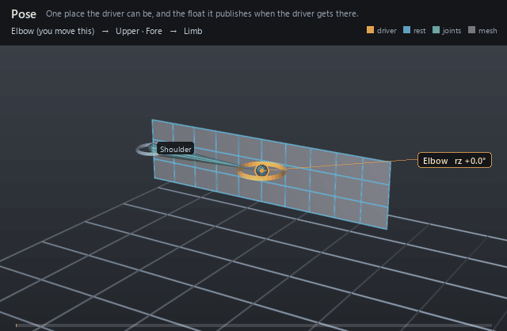

#  Pose

*One place the driver can be, and the float it publishes when the driver gets there.*

| | |
|---|---|
| **Node type** | `RigExecPose` |
| **Example** | [pose_interpolator.usda](../examples/pose_interpolator.usda) |

On this page:

- [Overview](#overview)
- [How it works](#how-it-works)
- [Wiring](#wiring)
- [Parameters](#parameters)
- [Example](#example)
- [Tips](#tips)
- [See also](#see-also)

## Overview



A pose is a single authored sample of its interpolator's pose space:
where the driver stands, how wide that pose's influence reaches, and the
`outputs:weight` a blend channel connects to. Its weight is 1 when the
driver stands exactly on the pose and, after the interpolator's
normalization, a share of the total elsewhere — negative where the solve
says lean *away* from this pose. Poses are prims parented under their
interpolator rather than parallel arrays on it, so a layer can retune one
pose's radius, or switch it off, without restating the other seven.

One authored pose of a RigExecPoseInterpolator, and the float it
publishes.

A pose is a place the driver can be, plus how wide its influence reaches.
Its outputs:weight is what a RigExecBlendInput's inputs:weight connects
to; the weight is 1 when the driver stands exactly on this pose and
(after normalization) shares the rig with its neighbours elsewhere.

Poses are children of their interpolator rather than a parallel array on
it so that each one composes independently -- a layer can retune one
pose's radius, or disable it, without restating the other seven. That is
the same reason RigExecBlendSample is a prim and not an array entry.

## How it works

Six of the pose's attributes are read at compile time, when the
interpolator builds and inverts its RBF matrix once: `rigExec:rotation`
(the driver's local rotation relative to its own rest, in the driver's
parent frame), `rigExec:translation`, `rigExec:poseType`, the two radii,
and `inputs:enabled` all feed that solve, and those same six are the
pose's share of the epoch digest, so editing any of them recompiles the
interpolator. The other three — `rigExec:falloff`,
`rigExec:poseControls` and `rigExec:poseControlValues` — are provenance
that evaluation never reads, and the translation pair is dropped unless
the interpolator sets `rigExec:enableTranslation`, which the evaluation
phase warns it does not measure. Evaluation happens in the pose-interpolator
phase — after the complete pose walk, every constraint included, and
before the geometry chains that consume the weights — where the
interpolator measures its driver's final local rotation against every
pose and publishes one float per pose into both the resolved-input map a
consumer reads through and the rig pose's `movedProperties` map. The metric is
the pose's own: a `swing` or `twist` pose is judged on that half of the
driver's rotation, split about the interpolator's `rigExec:twistAxis`,
while a `whole` pose is judged on the entire rotation.

## Wiring

| Relationship | Points to | Required |
|---|---|---|
| (child of) | The `RigExecPoseInterpolator` that solves it. A pose anywhere else is never read, and a non-`RigExecPose` child of an interpolator is a compile error. | yes |
| `rigExec:poseControls` | The exact control *properties* that put the rig into this pose, parallel to `rigExec:poseControlValues`. Authoring data for a shape editor; nothing in evaluation reads it. | no |
| `outputs:weight` | Written by the interpolator every evaluation; a `RigExecBlendInput`'s `inputs:weight` connects *to* it. An authored connection on it is a compile error. | - |

## Parameters

### Interpolator settings

#### `rigExec:driver`

*Relationship.*

The driver, at most one target: a RigExecJoint (or any
RigExecXformable) whose LOCAL rotation -- its pose relative to its own
rest, in its parent's frame -- is what every pose is measured against.

LOCAL, not world, and relative to rest rather than absolute: the rest
orientation is the joint orient the authored data removes from
poseRotation, so a driver sitting at its rest measures as identity and
the neutral pose reads 1.000 with the rig standing still.

#### `rigExec:kernel`

*Type:* `uniform token`. *Default:* `"gaussian"`.

Valid values: `gaussian`, `linear`.

How a pose's weight falls away with distance. The conventional tool's
interpolation attribute: 0 is linear, 1 is gaussian. On the shipped biped 16 interpolators
are gaussian and 53 linear.

Gaussian never quite reaches zero, so a little of every pose survives
everywhere -- a soft blend. Linear reaches zero AT the radius and has
compact support, so past the radius a pose is not nearly off, it is
off, which is what makes the coverage floor in rbf.h worth
measuring.

#### `rigExec:enableRotation`

*Type:* `bool`. *Default:* `true`.

enableRotation: measure the driver's rotation.

Honoured rather than assumed. On the shipped biped the two channels
are mutually exclusive -- 39 interpolators rotation, 28 translation --
and reading a translation interpolator as a rotation makes every one
of its poses identity, so it solves degenerate and drives nothing.

#### `rigExec:enableTranslation`

*Type:* `bool`. *Default:* `false`.

enableTranslation: measure the driver's translation as
well, in the driver's own frame. Radians and centimetres cannot be
added, so each channel is divided by its own radius first and the two
are combined as a right-angled triangle (rbf.h RigExecRbfCombine).

#### `rigExec:allowNegativeWeights`

*Type:* `bool`. *Default:* `true`.

allowNegativeWeights. A negative weight is not an
error: it falls out of the matrix inverse and means lean AWAY from
this pose. Clamping them is what produces the soft, muddy blend that
makes a pose fail to reach its own shape, so the default keeps them.
The clamp this selects is max(0, w) applied AFTER normalization, never
before and never inside the solve.

#### `rigExec:normalize`

*Type:* `bool`. *Default:* `true`.

Divide the weights by their SUM, so they stay a partition of
unity. By their sum and not by the sum of magnitudes, because a
negative weight is a real instruction. Where the sum is smaller than
1e-6 there is nothing to divide by and the weights are left alone,
which is what falling away to nothing outside the poses should look
like (rbf.py:964-987).

#### `rigExec:regularization`

*Type:* `float`. *Default:* `0`.

regularization, added to the matrix diagonal before
inverting. Trades exactness at the poses for a calmer result between
them, and rescues a solve whose poses sit so close together that the
matrix is singular. Zero on every interpolator of the shipped
biped.

#### `rigExec:twistAxis`

*Type:* `uniform token`. *Default:* `"X"`.

Valid values: `X`, `Y`, `Z`.

The axis a twist pose spins about, in the DRIVER's own frame.
driverTwistAxis (0 X, 1 Y, 2 Z), and X on every body
interpolator of the shipped biped because the bind skeleton aims +X
down the bone.

Read only by poses whose rigExec:poseType is swing or twist; a whole
pose measures the entire rotation and never splits it.

#### `inputs:enabled`

*Type:* `bool`. *Default:* `true`.

Shape-preserving enable. A disabled interpolator publishes
zero on every pose rather than holding its last value: a corrective
that is off has to be off, not frozen.

### Node parameters

#### `rigExec:poseType`

*Type:* `uniform token`. *Default:* `"swing"`.

Valid values: `swing`, `twist`, `whole`.

poseType (1 swing, 2 twist, 0 whole): WHICH PART of
the driver's rotation this pose is measured against.

The metric belongs to the pose and not to the interpolator because one
driver usually carries both at once and they mean different things: a
neck that has twisted has not bent, and its bend shapes should stay at
zero. Measuring the whole rotation instead leaks about 0.05 of every
swing pose into a pure twist on the shipped biped
(rbf.py:1030-1038).

#### `rigExec:rotation`

*Type:* `quatf`. *Default:* `(1, 0, 0, 0)`.

Where the driver stands in this pose: its LOCAL rotation
relative to its own rest, in the driver's parent frame.

REBASED. The authored poseRotation is measured from whatever
configuration the rig happened to be in when the poses were captured,
which on this character is 3 to 10 degrees off the bind pose -- a
wrist FK control reading 10 degrees, an elbow 4.7. This port's drivers
DO read identity at bind, so the neutral quaternion is taken out of
every pose (neutral^-1 * pose) before it is authored here. It is a rigid rotation applied to all
of them, so every pairwise distance and therefore the whole solve is
unchanged; only the point the poses are measured FROM moves, which is
the thing that was wrong. Skipping it moved the skin about two
millimetres.

Measured against this port's own drivers it lands at 0.00 degrees on
the elbow, the knee and the toe and 1.64 on the shoulder;
tools/biped/verify_psd.py prints the angle per pose, which is the
fidelity number.

#### `rigExec:translation`

*Type:* `float3`. *Default:* `(0, 0, 0)`.

The driver's translation in this pose, in CENTIMETRES, in the
driver's own frame. Read only when the interpolator has
rigExec:enableTranslation on; an interpolator with no authored
translations has nothing to say about translation, and saying every
pose is equally close would peg its weights at 1/n
(rbf.py:431-436).

#### `rigExec:rotationRadius`

*Type:* `float`. *Default:* `0`.

How far in RADIANS the driver may stray before this pose's
kernel has fallen away -- one falloff width, this pose's own.

FITTED, NOT EXPORTED. the conventional tool does not write out the width it solves
with: it writes rigExec:falloff, which its own documentation calls a
share relative to the closest other pose, and a poseRotationFalloff it
ignores for every non-independent pose -- which is all of them on this
rig. So the shape of the rule is preserved and the size is not
recoverable, and one scale for the whole rig does not work because the
pose layouts are not alike: the thigh has poses 25 to 150 degrees
apart, the shoulder eight with pairs 45 apart, the index three in a
line. Narrow enough for the shoulder leaves the thigh with a hole in
the middle of every swing; wide enough for the thigh sends the
shoulder's weights to 9.

RigExecRbfFitWidth therefore fits it per interpolator to two
requirements, in order: no dead zone (the kernels sum to at least 0.5
everywhere between the poses), then the least overshoot among the
widths that manage it. A painted rigExec:falloff other than the default 0.3
default is applied on top as falloff/0.3.

Zero means measure one from the poses, and is what an editor should
author when it wants the fit back rather than a number it invented.

#### `rigExec:translationRadius`

*Type:* `float`. *Default:* `0`.

The same width for the translation channel, in CENTIMETRES.

It is NOT the rotation radius and must not be borrowed from it: a
brow's poses sit millimetres apart and a rotation width would swallow
every one of them. Fitted by the same swept scale, because the metric
already divides each channel by its own width -- the shape of the pose
space is fixed by the RATIO of the two and only its overall size is
free (rbf.py:223-352).

#### `rigExec:falloff`

*Type:* `float`. *Default:* `0.3`.

poseFalloff, kept as provenance and as the editable
dial: the share the artist painted on top of the fitted width, where
0.3 is the default and means just reach the closest other pose. 0.3
on every pose of the shipped biped except the clavicles, which are
0.5.

The radii above already carry it (falloff/0.3, floored at 0.05), so it
is not applied a second time at runtime. It is here so that an editor
changing it can re-derive them, and so that a rig whose radii were
hand-tuned still says what it started from.

#### `rigExec:poseControls`

*Relationship.*

The exact control PROPERTIES that put the rig into this pose
-- </Rig/Controls/arm_l_fk_shoulder_l_bind.avars:ry> and the like --
parallel to rigExec:poseControlValues. Properties rather than prims
because a control carries nine channels and a pose usually sets one.

The same thing is carried per pose, and it is what lets
a shape editor jump the rig to a pose to sculpt against it. It is
authoring data: nothing in evaluation reads it, and a pose with none
is still a valid pose.

#### `rigExec:poseControlValues`

*Type:* `double[]`. *Default:* `[]`.

The value for each target of rigExec:poseControls, in OUR
units and from OUR zero: degrees for a rotation avar, centimetres for
a translation one, measured from the rig's rest rather than from
the authored data's.

The authored numbers are absolute and in radians, and their zero is the
configuration the poses were captured in rather than the bind pose.
Measured: driving this rig with those absolute values reaches the
authored quaternion to 45.4 degrees on the shoulder and 10.0 on the
wrist; driving it with (pose - neutral) reaches 1.64 and 0.00. So the
subtraction happens once, in tools/biped/build_psd.py, and what is
stored is what an editor can set directly.

#### `inputs:enabled`

*Type:* `bool`. *Default:* `true`.

Shape-preserving enable. A disabled pose publishes zero and
is left out of the solve entirely rather than solved and then
silenced: leaving it in would keep it in every other pose's matrix
row, so switching one pose off would quietly change all the others.

#### `outputs:weight`

*Type:* `float`. *Default:* `0`.

How much this pose counts, for wherever the driver is now.
The output a RigExecBlendInput's inputs:weight connects to.

1 with the driver standing on this pose, and elsewhere a share of the
interpolator's normalized total -- which may be negative when
rigExec:allowNegativeWeights is on, and should be: that is the
instruction to lean away from a pose, and clamping it is what makes a
blend muddy.

## Example

The `ElbowSwing` interpolator carries two poses — `neutral` at
identity and `bent` at 80 degrees about Z — and the bent pose's
`outputs:weight` is the only thing wired into the corrective blend
channel. Measured on the stage, the bent pose publishes 0.000 with the
arm straight, 0.423 at frame 1004 three frames into the bend, and 1.000
at frame 1008 when the elbow reaches the pose exactly.

Open it live with:

```bat
bin\launch_usdview.bat docs\examples\pose_interpolator.usda
```

Re-render the GIF above with:

```bat
python docs/render_media.py --page pose
```

## Tips

- Author a non-zero `rigExec:rotationRadius` by hand. The evaluator hands the per-pose radii straight to the solver, and a width of zero makes every non-zero distance infinite, so the pose's kernel is dead: on a two-pose test rig the zero-radius pose published 0.000 at every frame, including the one where the driver reached it.
- `inputs:enabled = false` drops the pose out of the solve entirely rather than solving it and silencing the result — the remaining poses re-solve as if it had never been authored — and the disabled pose publishes a hard zero whatever else the interpolator does.
- `rigExec:poseType` defaults to `swing`, which measures the driver's rotation with its twist about `rigExec:twistAxis` removed. Use `whole` when one pose should account for the entire rotation. A swing pose captured from a driver that only twists measures as identical to neutral, and an interpolator whose poses are all coincident under its enabled channels is reported degenerate and pegs every weight at 1/n.

## See also

- [Pose Interpolator](pose_interpolator.md)
- [Blend Input](blend_input.md)
- [Blend Shape Mover](blendshape_mover.md)

---

[UsdRig](../index.md)
