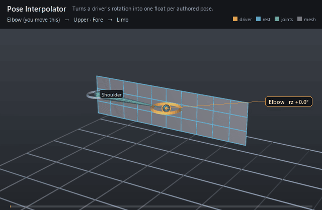

#  Pose Interpolator

*Turns a driver's rotation into one float per authored pose.*

| | |
|---|---|
| **Node type** | `RigExecPoseInterpolator` |
| **Example** | [pose_interpolator.usda](../examples/pose_interpolator.usda) |

On this page:

- [Overview](#overview)
- [How it works](#how-it-works)
- [Wiring](#wiring)
- [Parameters](#parameters)
- [Example](#example)
- [Tips](#tips)
- [See also](#see-also)

## Overview



A pose interpolator is pose-space deformation's measuring device: one
driver joint in, one weight per authored `RigExecPose` child out. Each pose
records where the driver stands — a quaternion measured in the driver's own
parent frame, relative to the driver's rest — plus how wide its influence
reaches, and the interpolator publishes each pose's share of wherever the
driver is now. It writes no transform and no points, which is why it lives
in its own scope rather than under `Movers`; what makes it useful is that a
`RigExecBlendInput` connects its `inputs:weight` to a pose's
`outputs:weight`, so a corrective shape can be retargeted or layered without
touching the interpolator that fires it.

A pose interpolator: one driver joint in, one weight per
authored RigExecPose child out.

WHY A DRIVER JOINT AND NOT THE CONTROL THE ANIMATOR MOVES. A corrective
wants to fire on one piece of a limb's motion and not another -- a wrist
that twists should not trigger the shape for a wrist that bends. the conventional tool
builds that split out of the HIERARCHY rather than out of maths: it parks
a hidden joint under the bone that already carries the twist and
orient-constrains it to the bone that carries everything, so the parent
subtracts the twist back out and the driver's LOCAL rotation is the swing
alone. Point it the other way and the
same subtraction yields the twist. This port keeps those joints --
shoulder_?_driver, wristSwing_?_driver and the rest, authored by
build_biped_rigexec.add_pose_drivers -- so the weights come out of the
same arithmetic the conventional tool used rather than something that resembles it.

The maths is a radial basis function and lives in libs/rigExecMath/rbf.h,
natively ported and pinned against
it at 3.41e-11 over 13,400 evaluations (tests/fixtures/psd_parity.json).
The solve is a per-interpolator CONSTANT -- invert the matrix of every
pose's kernel value at every other pose -- so it happens once and only the
kernel row is per-frame. Nothing on this prim is that inverted matrix,
because the matrix is a function of the poses, the per-pose radii, the
kernel and the regularization, all of which ARE here: re-deriving it at
compile time is exact, and storing it would be a second copy to keep in
step.

The falloff width the fit solved with is not carried in the data, so the radii on the
poses were FITTED by RigExecRbfFitWidth rather than read -- see rigExec:rotationRadius on RigExecPose
for what that means for anyone editing one.

The prim is not a mover: it writes no transform and no points. It
publishes a float per pose and a RigExecBlendInput's inputs:weight
connects to it, which is what makes a corrective independently
composable -- a layer can retarget one shape's channel without touching
the interpolator that drives it.

## How it works

The maths is a radial basis function (`libs/rigExecMath/rbf.h`). Compile
reads the driver, the kernel, the channel switches and every enabled pose's rotation,
type and radius, and inverts the kernel matrix once — it is a pure function
of the authored poses, so nothing on the prim stores it. Evaluation happens
in its own phase, after the whole pose walk and before the geometry chains
(`rigEvaluator.cpp:11990-11998`): it takes the driver's final and rest
frames, forms `delta = restLocal⁻¹ · (parent⁻¹ · world)`
(`rigEvaluator.cpp:3073-3076`), runs one kernel row through the inverted
matrix, and publishes a `float` on each pose's `outputs:weight` into both the
resolved-input table a consumer reads through and the pose's moved-property
map (`rigEvaluator.cpp:3019-3026`). A driver with no published final frame
is diagnosed and the interpolator publishes zeros rather than quietly
measuring a rest (`rigEvaluator.cpp:3048-3056`).

## Wiring

| Relationship | Points to | Required |
|---|---|---|
| `rigExec:driver` | Exactly one `RigExecJoint` or `RigExecControl` whose local rotation every pose is measured against. | yes |
| `RigExecPose` children | One prim per pose, directly under the interpolator; any other child type is a compile error. | yes |
| `<pose>.outputs:weight` | Read by a consumer — a `RigExecBlendInput`'s `inputs:weight` connects to it. The pose's own `outputs:weight` must carry no authored connection. | - |
| `rigExec:poseControls` | Authoring provenance on each pose: the control properties that put the rig into it. Never read at evaluation. | no |

## Parameters

### Pose

#### `rigExec:poseType`

*Type:* `uniform token`. *Default:* `"swing"`.

Valid values: `swing`, `twist`, `whole`.

poseType (1 swing, 2 twist, 0 whole): WHICH PART of
the driver's rotation this pose is measured against.

The metric belongs to the pose and not to the interpolator because one
driver usually carries both at once and they mean different things: a
neck that has twisted has not bent, and its bend shapes should stay at
zero. Measuring the whole rotation instead leaks about 0.05 of every
swing pose into a pure twist on the shipped biped
(rbf.py:1030-1038).

#### `rigExec:rotation`

*Type:* `quatf`. *Default:* `(1, 0, 0, 0)`.

Where the driver stands in this pose: its LOCAL rotation
relative to its own rest, in the driver's parent frame.

REBASED. The authored poseRotation is measured from whatever
configuration the rig happened to be in when the poses were captured,
which on this character is 3 to 10 degrees off the bind pose -- a
wrist FK control reading 10 degrees, an elbow 4.7. This port's drivers
DO read identity at bind, so the neutral quaternion is taken out of
every pose (neutral^-1 * pose) before it is authored here. It is a rigid rotation applied to all
of them, so every pairwise distance and therefore the whole solve is
unchanged; only the point the poses are measured FROM moves, which is
the thing that was wrong. Skipping it moved the skin about two
millimetres.

Measured against this port's own drivers it lands at 0.00 degrees on
the elbow, the knee and the toe and 1.64 on the shoulder;
tools/biped/verify_psd.py prints the angle per pose, which is the
fidelity number.

#### `rigExec:translation`

*Type:* `float3`. *Default:* `(0, 0, 0)`.

The driver's translation in this pose, in CENTIMETRES, in the
driver's own frame. Read only when the interpolator has
rigExec:enableTranslation on; an interpolator with no authored
translations has nothing to say about translation, and saying every
pose is equally close would peg its weights at 1/n
(rbf.py:431-436).

#### `rigExec:rotationRadius`

*Type:* `float`. *Default:* `0`.

How far in RADIANS the driver may stray before this pose's
kernel has fallen away -- one falloff width, this pose's own.

FITTED, NOT EXPORTED. the conventional tool does not write out the width it solves
with: it writes rigExec:falloff, which its own documentation calls a
share relative to the closest other pose, and a poseRotationFalloff it
ignores for every non-independent pose -- which is all of them on this
rig. So the shape of the rule is preserved and the size is not
recoverable, and one scale for the whole rig does not work because the
pose layouts are not alike: the thigh has poses 25 to 150 degrees
apart, the shoulder eight with pairs 45 apart, the index three in a
line. Narrow enough for the shoulder leaves the thigh with a hole in
the middle of every swing; wide enough for the thigh sends the
shoulder's weights to 9.

RigExecRbfFitWidth therefore fits it per interpolator to two
requirements, in order: no dead zone (the kernels sum to at least 0.5
everywhere between the poses), then the least overshoot among the
widths that manage it. A painted rigExec:falloff other than the default 0.3
default is applied on top as falloff/0.3.

Zero means measure one from the poses, and is what an editor should
author when it wants the fit back rather than a number it invented.

#### `rigExec:translationRadius`

*Type:* `float`. *Default:* `0`.

The same width for the translation channel, in CENTIMETRES.

It is NOT the rotation radius and must not be borrowed from it: a
brow's poses sit millimetres apart and a rotation width would swallow
every one of them. Fitted by the same swept scale, because the metric
already divides each channel by its own width -- the shape of the pose
space is fixed by the RATIO of the two and only its overall size is
free (rbf.py:223-352).

#### `rigExec:falloff`

*Type:* `float`. *Default:* `0.3`.

poseFalloff, kept as provenance and as the editable
dial: the share the artist painted on top of the fitted width, where
0.3 is the default and means just reach the closest other pose. 0.3
on every pose of the shipped biped except the clavicles, which are
0.5.

The radii above already carry it (falloff/0.3, floored at 0.05), so it
is not applied a second time at runtime. It is here so that an editor
changing it can re-derive them, and so that a rig whose radii were
hand-tuned still says what it started from.

#### `rigExec:poseControls`

*Relationship.*

The exact control PROPERTIES that put the rig into this pose
-- </Rig/Controls/arm_l_fk_shoulder_l_bind.avars:ry> and the like --
parallel to rigExec:poseControlValues. Properties rather than prims
because a control carries nine channels and a pose usually sets one.

The same thing is carried per pose, and it is what lets
a shape editor jump the rig to a pose to sculpt against it. It is
authoring data: nothing in evaluation reads it, and a pose with none
is still a valid pose.

#### `rigExec:poseControlValues`

*Type:* `double[]`. *Default:* `[]`.

The value for each target of rigExec:poseControls, in OUR
units and from OUR zero: degrees for a rotation avar, centimetres for
a translation one, measured from the rig's rest rather than from
the authored data's.

The authored numbers are absolute and in radians, and their zero is the
configuration the poses were captured in rather than the bind pose.
Measured: driving this rig with those absolute values reaches the
authored quaternion to 45.4 degrees on the shoulder and 10.0 on the
wrist; driving it with (pose - neutral) reaches 1.64 and 0.00. So the
subtraction happens once, in tools/biped/build_psd.py, and what is
stored is what an editor can set directly.

#### `inputs:enabled`

*Type:* `bool`. *Default:* `true`.

Shape-preserving enable. A disabled pose publishes zero and
is left out of the solve entirely rather than solved and then
silenced: leaving it in would keep it in every other pose's matrix
row, so switching one pose off would quietly change all the others.

#### `outputs:weight`

*Type:* `float`. *Default:* `0`.

How much this pose counts, for wherever the driver is now.
The output a RigExecBlendInput's inputs:weight connects to.

1 with the driver standing on this pose, and elsewhere a share of the
interpolator's normalized total -- which may be negative when
rigExec:allowNegativeWeights is on, and should be: that is the
instruction to lean away from a pose, and clamping it is what makes a
blend muddy.

### Node parameters

#### `rigExec:driver`

*Relationship.*

The driver, at most one target: a RigExecJoint (or any
RigExecXformable) whose LOCAL rotation -- its pose relative to its own
rest, in its parent's frame -- is what every pose is measured against.

LOCAL, not world, and relative to rest rather than absolute: the rest
orientation is the joint orient the authored data removes from
poseRotation, so a driver sitting at its rest measures as identity and
the neutral pose reads 1.000 with the rig standing still.

#### `rigExec:kernel`

*Type:* `uniform token`. *Default:* `"gaussian"`.

Valid values: `gaussian`, `linear`.

How a pose's weight falls away with distance. The conventional tool's
interpolation attribute: 0 is linear, 1 is gaussian. On the shipped biped 16 interpolators
are gaussian and 53 linear.

Gaussian never quite reaches zero, so a little of every pose survives
everywhere -- a soft blend. Linear reaches zero AT the radius and has
compact support, so past the radius a pose is not nearly off, it is
off, which is what makes the coverage floor in rbf.h worth
measuring.

#### `rigExec:enableRotation`

*Type:* `bool`. *Default:* `true`.

enableRotation: measure the driver's rotation.

Honoured rather than assumed. On the shipped biped the two channels
are mutually exclusive -- 39 interpolators rotation, 28 translation --
and reading a translation interpolator as a rotation makes every one
of its poses identity, so it solves degenerate and drives nothing.

#### `rigExec:enableTranslation`

*Type:* `bool`. *Default:* `false`.

enableTranslation: measure the driver's translation as
well, in the driver's own frame. Radians and centimetres cannot be
added, so each channel is divided by its own radius first and the two
are combined as a right-angled triangle (rbf.h RigExecRbfCombine).

#### `rigExec:allowNegativeWeights`

*Type:* `bool`. *Default:* `true`.

allowNegativeWeights. A negative weight is not an
error: it falls out of the matrix inverse and means lean AWAY from
this pose. Clamping them is what produces the soft, muddy blend that
makes a pose fail to reach its own shape, so the default keeps them.
The clamp this selects is max(0, w) applied AFTER normalization, never
before and never inside the solve.

#### `rigExec:normalize`

*Type:* `bool`. *Default:* `true`.

Divide the weights by their SUM, so they stay a partition of
unity. By their sum and not by the sum of magnitudes, because a
negative weight is a real instruction. Where the sum is smaller than
1e-6 there is nothing to divide by and the weights are left alone,
which is what falling away to nothing outside the poses should look
like (rbf.py:964-987).

#### `rigExec:regularization`

*Type:* `float`. *Default:* `0`.

regularization, added to the matrix diagonal before
inverting. Trades exactness at the poses for a calmer result between
them, and rescues a solve whose poses sit so close together that the
matrix is singular. Zero on every interpolator of the shipped
biped.

#### `rigExec:twistAxis`

*Type:* `uniform token`. *Default:* `"X"`.

Valid values: `X`, `Y`, `Z`.

The axis a twist pose spins about, in the DRIVER's own frame.
driverTwistAxis (0 X, 1 Y, 2 Z), and X on every body
interpolator of the shipped biped because the bind skeleton aims +X
down the bone.

Read only by poses whose rigExec:poseType is swing or twist; a whole
pose measures the entire rotation and never splits it.

#### `inputs:enabled`

*Type:* `bool`. *Default:* `true`.

Shape-preserving enable. A disabled interpolator publishes
zero on every pose rather than holding its last value: a corrective
that is off has to be off, not frozen.

## Example

An Elbow control closes a skinned 30-quad strip to 40 degrees, holds
there, closes to 80, holds again and opens; two matrix movers skin the strip
to the Upper and Fore joints. The interpolator watches the **Fore joint** —
not the Elbow control the animator keys — and carries three poses, `neutral`
at identity, `half` at 40 degrees and `bent` at 80, each 0.7 radians wide,
which is the spacing between them. Watch the three floats trade: at rest
`neutral` reads 1.000 and `half` and `bent` 0.000; a third of the way in they
split 0.529 / 0.601 / 0.000; on the first hold `half` reads 1.000 alone; on
the second `bent` reads 1.000 and the others 0.000. Only `bent.outputs:weight`
is connected to the blend channel, so the corrective swells on the outside of
the elbow exactly when that one float does — nothing at the `half` hold, full
at the `bent` hold.

Open it live with:

```bat
bin\launch_usdview.bat docs\examples\pose_interpolator.usda
```

Re-render the GIF above with:

```bat
python docs/render_media.py --page pose_interpolator
```

## Tips

- Author a non-zero `rigExec:rotationRadius` on every pose, roughly the angle between neighbouring poses. A per-pose zero is used literally rather than fitted (`rbf.cpp:992-1001`, `rbf.cpp:407-413`), and an interpolator whose radii are all zero reads 1 only when the driver stands exactly on a pose and 0 everywhere else.
- Drive from a joint whose parent already carries the motion you do not want measured: the phase measures the driver's rotation relative to its rest in its nearest frame-publishing ancestor's frame, so the parent subtracts its own share back out. Measuring against anything other than the immediate namespace parent is reported as a warning.
- `rigExec:enableTranslation` is not measured by this phase — it warns and judges the poses on rotation alone (`rigEvaluator.cpp:2852-2862`). Disabling a whole interpolator publishes zeros, while disabling one pose drops it out of the solve entirely so the other poses' weights change.
- A radius wider than the pose spacing makes the Gaussian rows overlap enough that the inverse pushes a far pose negative between two near ones. `rigExec:allowNegativeWeights = 0` clamps that lobe; leave it on only when a consumer wants the extrapolation.

## See also

- [Blend Input](blend_input.md)
- [Blend Shape Mover](blendshape_mover.md)
- [Joint](joint.md)

---

[RigExec nodes](../index.md)
