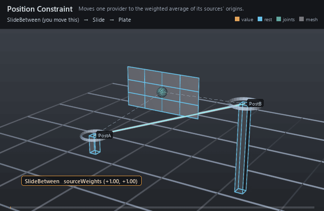

#  Position Constraint

*Moves one provider to the weighted average of its sources' origins.*

| | |
|---|---|
| **Node type** | `RigExecPositionConstraint` |
| **Example** | [position_constraint.usda](../examples/position_constraint.usda) |

On this page:

- [Overview](#overview)
- [How it works](#how-it-works)
- [Wiring](#wiring)
- [Parameters](#parameters)
- [Example](#example)
- [Tips](#tips)
- [See also](#see-also)

## Overview



FBX-style position: the constraint takes the origins of the ordered
`rigExec:sources`, averages them by `inputs:sourceWeights`, adds
`inputs:translationOffset`, and writes that point onto the single provider
named by `rigExec:moves`. Rotation and scale are untouched — this operator
owns the translation channel only. It is how a prop is pinned between two
hands, how a hip rides between two feet, and — with an animated weight
array — how either of those hands off to the other.

FBX-style position constraint. It blends the ordered source
translations, applies inputs:translationOffset, masks the result per
axis, and blends it over the incoming pose by the common MoverAPI
envelope.

## How it works

Every source-blending constraint runs in the pose phase, in the
composed order of the `Movers` namespace, so it revises a provider that
earlier solvers and constraints have already posed. Each evaluation it
resolves the current frame of every `rigExec:sources` target, reads
`inputs:sourceWeights` raw off the attribute at that frame's time, and
accumulates `sum(origin * weight) / sum(weight)` — the weights are
normalized, so they are ratios, not percentages. `inputs:translationOffset`
is added to that blended point, the `inputs:affectTranslation*` mask selects
which axes are claimed, and the common `RigExecMoverAPI` envelope
(`inputs:defaultWeight`, or a bound `rigExec:weightObject`) lerps the result
over the incoming origin. Only the origin changes; the frame's other
landmarks are carried along with it.

## Wiring

| Relationship | Points to | Required |
|---|---|---|
| `rigExec:sources` | Ordered transform providers whose origins are blended; the order pairs with `inputs:sourceWeights`. | yes |
| `rigExec:moves` | Exactly one provider to reposition, or one `<mesh>.points` property for the geometry domain. | yes |
| `inputs:sourceWeights` | One float per source. Empty means every source at equal, full weight. | no |
| `rigExec:weightObject` | Optional envelope field; replaces `inputs:defaultWeight` when bound. | no |

## Parameters

### Common mover envelope

#### `rigExec:moves`

*Relationship.*

Reserved write-set relationship: exact prim/property targets.

#### `inputs:enabled`

*Type:* `bool`. *Default:* `true`.

Shape-preserving enable. Disabled movers pass their preceding
revision through unchanged (value-only edit).

#### `inputs:defaultWeight`

*Type:* `float`. *Default:* `1`.

Normalized common mover envelope in [0, 1]. With no bound
rigExec:weightObject it broadcasts over every logical element: zero
passes the incoming value through bit-for-bit and one applies the
mover's full-strength result.

#### `rigExec:weightObject`

*Relationship.*

Optional compatible total weight field, at most one target.
When bound, the weight object's values (including its own sparse or
constant fallback) supply the common envelope instead of
inputs:defaultWeight. Target, domain, and cardinality must match each
mover application; an incompatible binding is a compile error. A
multi-target mover may bind only a constant operation envelope whose
weightTarget is the mover prim itself; that one value broadcasts to
every application of the atomic mover.

### Constraint base

#### `rigExec:locked`

*Type:* `uniform bool`. *Default:* `false`.

Authoring lock metadata for DCC interchange. Evaluation
remains active while locked; use RigExecMoverAPI inputs:enabled or
inputs:defaultWeight to disable or blend the operation.

#### `inputs:affectTranslationX`

*Type:* `bool`. *Default:* `true`.

Per-axis translation mask. Ignored groups are a compile error.

#### `inputs:affectTranslationY`

*Type:* `bool`. *Default:* `true`.

#### `inputs:affectTranslationZ`

*Type:* `bool`. *Default:* `true`.

#### `inputs:affectRotationX`

*Type:* `bool`. *Default:* `true`.

Per-axis rotation mask. Ignored groups are a compile error.

#### `inputs:affectRotationY`

*Type:* `bool`. *Default:* `true`.

#### `inputs:affectRotationZ`

*Type:* `bool`. *Default:* `true`.

#### `inputs:affectScaleX`

*Type:* `bool`. *Default:* `true`.

Per-axis scale mask. Ignored groups are a compile error.
RigExecParentConstraint overrides the default to false to match the
FBX runtime, which leaves scale off unless it is asked for.

#### `inputs:affectScaleY`

*Type:* `bool`. *Default:* `true`.

#### `inputs:affectScaleZ`

*Type:* `bool`. *Default:* `true`.

#### `inputs:translationOffset`

*Type:* `double3`. *Default:* `(0, 0, 0)`.

Additive translation offset applied after the source blend.

#### `inputs:rotationOffset`

*Type:* `double3`. *Default:* `(0, 0, 0)`.

Additive Euler rotation offset in degrees, applied after the blend.

#### `inputs:scaleOffset`

*Type:* `double3`. *Default:* `(0, 0, 0)`.

ADDITIVE scale offset applied after the blend, which is why
its identity is (0, 0, 0) and not (1, 1, 1): the kernel computes
blendedScale + offset. A multiplicative offset would be a different
operator, not a different default.

#### `rigExec:rotationOrder`

*Type:* `uniform token`. *Default:* `"XYZ"`.

Valid values: `XYZ`, `XZY`, `YXZ`, `YZX`, `ZXY`, `ZYX`.

Euler order for the operators that compose a rotation.
Authoring it on one that does not is a compile error.

### Ordered sources

#### `rigExec:sources`

*Relationship.*

Ordered transform sources. Order is preserved through
composition because it identifies entries in every parallel source
array.

#### `inputs:sourceWeights`

*Type:* `float[]`. *Default:* `[]`.

Per-source weights parallel to rigExec:sources. An empty
array gives every source equal, full weight. A non-empty array must
have exactly one entry per source.

### Node parameters

## Example

Two posts stand at different heights and a plate hangs between them.
The joint's rest sits exactly at the posts' midpoint, so an even blend leaves
it there and every bit of motion you see is the blend: `inputs:sourceWeights`
starts even at (1, 1) — the blue ghost is that even-blend frame, the plate
parked over the midpoint — then swings to (1, 0), to (0, 1), and back to even,
so the plate departs from its rest in both directions with nothing else in the
rig animated. The pale line between the two post tops is the segment the source
origins define; `inputs:translationOffset` of (0, 0.9, 0) is the visible gap
between that line and the joint, which is the whole of "maintain offset" here
— there is no such switch.

Open it live with:

```bat
bin\launch_usdview.bat docs\examples\position_constraint.usda
```

Re-render the GIF above with:

```bat
python docs/render_media.py --page position_constraint
```

## Tips

- Weights are ratios, not percentages: the blend divides by their total, so (1, 0) and (5, 0) give the same answer. Only their relative size matters, and nothing needs to sum to one.
- All-zero weights are an exact pass-through, not a collapse to the origin — but a negative weight invalidates the solve instead of being clamped, so keep animated weights at or above zero.
- There is no maintain-offset switch: author `inputs:translationOffset`, which is added after the blend. `inputs:rotationOffset`, the `affectRotation*`/`affectScale*` masks and `rigExec:rotationOrder` are compile errors here, not silent no-ops — this operator writes translation only.

## See also

- [Aim Constraint](aim_constraint.md)
- [Parent Constraint](parent_constraint.md)
- [Matrix Mover](matrix_mover.md)

---

[UsdRig](../index.md)
