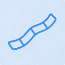
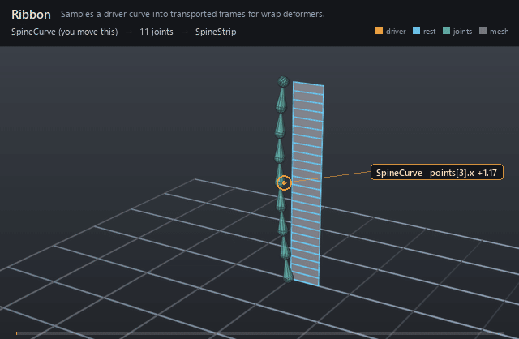

#  Ribbon

*Samples a driver curve into transported frames for wrap deformers.*

| | |
|---|---|
| **Node type** | `RigExecRibbon` |
| **Example** | [ribbon.usda](../examples/ribbon.usda) |

On this page:

- [Overview](#overview)
- [How it works](#how-it-works)
- [Wiring](#wiring)
- [Parameters](#parameters)
- [Example](#example)
- [Tips](#tips)
- [See also](#see-also)

## Overview



Turns a native B-spline driver into a run of evenly spaced,
rotation-minimizing frames. A curve mover then rides geometry along those
frames, so a strip keeps its length and cross-section while the driver
bends — the classic spine/tentacle rig. The mover reads the frame array
off this prim directly; naming a joint per sample on `rigExec:joints` is
optional, and buys a posed chain that constraints and matrix movers can
read like any other joint.

Samples a native UsdGeomBasisCurves.points driver, constructs
transported frames, and optionally conforms to a native mesh surface.
Publishes computePointFrameArray (spec section 4.1).

## How it works

All of it is pose phase: the solve is one branch of the
pose bake (`libs/rigExec/bakedPose.cpp:2552`), and `RigExecRibbon` is one
of the six baked solver types (`libs/rigExec/bakedProgram.cpp:124`). The
compiler resolves `rigExec:driverCurve` to the target's native `points`
attribute and the solve reads two values of it — the live one and the
bind-time (default) one — then samples both at equal arc length
(`libs/rigExecMath/geometryKernels.cpp:549`) and transports a
rotation-minimizing frame along each, publishing the posed frames paired
with their rests as one `computePointFrameArray`. Each
`rigExec:joints` entry takes one element of that array as its whole posed
frame, handed to exec as an override on the joint
(`libs/rigExec/rigEvaluator.cpp:10512-10515`). Because the driver is scene
data rather than a control-driven curve, the solve cannot see mover output
(`libs/rigExec/computations.cpp:1032`); what a wrap measures against is
the bind-time curve.

## Wiring

| Relationship | Points to | Required |
|---|---|---|
| `rigExec:driverCurve` | Native BasisCurves supplying the spine path; without it the solver publishes no frames rather than erroring. | yes |
| `rigExec:startFrame` | Joint provider naming the run's base; declared for authoring intent, read by no computation. | no |
| `rigExec:endFrame` | Joint provider naming the run's tip; the same. | no |
| `rigExec:twistFrames` | Twist solver named as the run's unwind; the same. | no |
| `rigExec:joints` | Ordered joints posed along the run, one per sample. | no |

## Parameters

### Node parameters

#### `purpose`

*Type:* `uniform token`. *Default:* `"guide"`.

Render purpose, overriding UsdGeomImageable's `default`
fallback: joint and solver guides are DIAGNOSTICS, drawn when a
viewer asks for guides.

This is the stock attribute rather than a RigExec-specific token so
that the bounds and the drawing cannot disagree: UsdGeomBBoxCache
classifies a prim's extent by this exact attribute, and the results
scene index stamps the same resolved value onto the guide it
synthesizes. A control keeps the inherited `default` -- it is the
rig's interaction surface, not a diagnostic -- and authoring
`guide` on one moves both its drawing and its bounds together.

#### `rigExec:driverCurve`

*Relationship.*

#### `rigExec:startFrame`

*Relationship.*

#### `rigExec:endFrame`

*Relationship.*

#### `rigExec:twistFrames`

*Relationship.*

#### `rigExec:sampleCount`

*Type:* `uniform int`. *Default:* `5`.

#### `rigExec:parameterization`

*Type:* `uniform token`. *Default:* `"arcLength"`.

Valid values: `arcLength`, `parametric`.

#### `rigExec:frameTransport`

*Type:* `uniform token`. *Default:* `"rotationMinimizing"`.

Valid values: `rotationMinimizing`.

#### `rigExec:driverCurveReadPhase`

*Type:* `uniform token`. *Default:* `"base"`.

Valid values: `base`, `final`.

#### `rigExec:surfaceReadPhase`

*Type:* `uniform token`. *Default:* `"base"`.

Valid values: `base`, `final`.

#### `rigExec:joints`

*Relationship.*

Ordered output joints posed along the ribbon (view-free
extraction). The compiler authors each joint's
one aggregate element.

#### `rigExec:jointElements`

*Type:* `uniform int[]`. *Default:* `[]`.

Optional aggregate element index per rigExec:joints entry
(parallel array). When absent/empty, element = list position.

#### `guide:radius`

*Type:* `double`. *Default:* `1.0`.

Radius of the sphere and cone drawn at each aggregate
element: the exact counterpart of RigExecJoint's guide:radius,
including the rule that zero or negative draws no guides at all,
which is how a solver's diagnostics are turned off.

Without it the elements are stuck at Hydra's fallback radius of
1.0. That is proportionate on an asset authored at tens of units
and several times the size of the whole character on one authored
at one unit -- the joints were given this knob for exactly that
reason and the aggregate solvers were not, so turning guide
display on for a small asset buried it in solver geometry.

#### `guide:displayColor`

*Type:* `color3f`. *Default:* `(0.3, 0.6, 1.0)`.

#### `guide:displayOpacity`

*Type:* `float`. *Default:* `0.5`.

## Example

A 24-quad strip stands seven units tall beside an invisible
four-CV B-spline driver — offset a half-width along the bind binormal, so
the driver run and the nine joint guides on it sit clear of the mesh
instead of inside it — and the driver's control points swing on a
staggered cycle. The strip curls up one side until its tip has travelled
2.2 units across, dropped 2.2 and swung 1.0 toward camera around frame
1006; it sweeps back through upright near frame 1012, at its deepest
point toward camera (2.8 units, frame 1013); then it whips 4.0 units out
the other way by frame 1018 and recovers, closing the loop exactly at
frame 1024. The out-of-plane half of that swing is the part worth
watching: it is authored a quarter cycle out of phase with the sideways
sweep, so the driver is never planar and the rotation-minimizing frames
visibly roll as the strip travels — a planar driver would bend without
ever twisting. Only the two upper control points carry that Z, and the
upper one carries nearly all of it: the first tangent is set by CV0 and
CV2, and the seed normal is the world axis least parallel to it, so a Z
component there large enough to beat the X component would pick a
different axis and roll the whole wrap 90 degrees.
`rigExec:sampleCount` is nine, a curve mover in `ribbon` mode rides the
strip along the run through its `primvars:st` bind coordinates, and a
nine-joint chain named on `rigExec:joints` takes the same nine samples so
the run reads as a dense spine running up the edge of the bending
ribbon.

Open it live with:

```bat
bin\launch_usdview.bat docs\examples\ribbon.usda
```

Re-render the GIF above with:

```bat
python docs/render_media.py --page ribbon
```

## Tips

- Never bind the driver perfectly straight. The seed normal is the world axis least parallel to the first tangent, picked once per curve, and a tie is broken by declaration order X, Y, Z (`libs/rigExecMath/geometryKernels.cpp:583-592`), so a straight bind against bent poses picks a different axis for the rest than for the pose and rolls the whole wrap 90 degrees. Rest it at a lean and keep the leaning component of the first tangent larger than the other one all the way through the animation.
- `rigExec:startFrame`, `rigExec:endFrame` and `rigExec:twistFrames` are declared but never read: the solve's only inputs are the driver points and `rigExec:sampleCount` (`libs/rigExec/moverKernels.cpp:1203-1208`, `libs/rigExec/bakedPose.cpp:475`). What actually pins the run is the bind-time driver curve.
- `rigExec:sampleCount` is the run's cardinality. Below two the solver publishes no frames at all (`libs/rigExec/solverKernels.cpp:28`) and no joint element can bind, and time-sampling it is rejected at compile (`libs/rigExec/rigEvaluator.cpp:4589`).

## See also

- [Curve Mover](curve_mover.md)
- [Twist Distribution](twist_distribution.md)
- [Joint](joint.md)

---

[UsdRig](../index.md)
