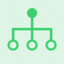

#  Rig Root

*The prim that makes a namespace a rig: partition, discovery root, evaluation unit.*

| | |
|---|---|
| **Node type** | `RigExecRoot` |
| **Example** | [two_bone_ik.usda](../examples/two_bone_ik.usda) |

On this page:

- [Overview](#overview)
- [How it works](#how-it-works)
- [Wiring](#wiring)
- [Parameters](#parameters)
- [Example](#example)
- [Tips](#tips)
- [See also](#see-also)

## Overview

Every rig is one `RigExecRoot` prim and everything composed
beneath it. The root declares no membership lists: a `RigExecControl` under it
is a control, a `RigExecJoint` is a joint output, a placed volume prim is a
weight field, and a prim carrying `rigExec:moves` under the root's `Movers`
child is a mover. It is what a host activates — one rig, or every
`RigExecRoot` on the stage — and it is the unit that compiles, publishes a
generation, and carries the pose diagnostics. It is Imageable but deliberately
not Xformable, so guide bounds propagate up to the enclosing asset for camera
framing while the rig itself never adds a transform.

Character root: partition and namespace root for control,
joint, and mover discovery (spec section 4.1). Publishes
computeDiagnostics. It is Imageable (but deliberately not Xformable) so
bounds from guide-only controls and joints propagate through the rig root
to the enclosing asset for host camera framing.

The rig declares no membership lists. Controls, joints, and movers are
all discovered from the composed namespace beneath it: a RigExecControl
is a control, a RigExecJoint is a joint output, and a prim carrying
rigExec:moves is a mover. Operator wiring (a solver's ordered
rigExec:joints and rigExec:controls) is the graph, and the rig is where
that graph is rooted -- not a second place to restate it.

## How it works

Nothing on the root evaluates per frame; it is read during the
evaluator's compile phase, in the discover-and-validate pass. Compile walks the
composed namespace beneath the root and collects controls, joints, pose
interpolators, placed volume weights, and aggregate solvers by prim type
anywhere under it, then walks the WHOLE RIG in reverse-sibling post-order —
descendants before their parent, and the *bottom* sibling branch in usdview
first — to number ONE pose stack of joint-writing solvers and frame
constraints, of which the `<rig>/Movers` mover stack is a restriction; the walk uses the standard
`UsdPrimRange` predicate, so a deactivated or unloaded branch is simply not
part of the rig and changing that is a structural (epoch-rebuilding) edit
rather than a value edit. A rig that finds no controls, joints, volume weights,
and no movers at all is a compile error ("Rig publishes no outputs"), and every
mover target is checked against the root's *parent* prim, which is the rig
asset and the boundary of what the rig may write. `uniform bool rigExec:baked`
is re-read at the tail of each compile and only asks for the baked program: an
explicit `SetEvaluationMode` call or a non-empty `RIGEXEC_EVALUATION_MODE`
outranks it, an epoch the program cannot express falls back to the dynamic path
with a note on the published pose, and both paths publish the same values.

## Wiring

| Relationship | Points to | Required |
|---|---|---|
| (namespace) | Everything composed beneath the root is the rig; controls, joints, solvers, and weight volumes are discovered by prim type. | - |
| `Movers` child | The scope the mover stack is walked from: only prims under `<rig>/Movers` are compiled as movers. | no |
| (parent prim) | The rig root's parent is the asset: movers may only target prims under it, and geometry lives there too. | - |

## Parameters

### Node parameters

#### `rigExec:partition`

*Type:* `uniform token`. *Default:* `""`.

#### `rigExec:baked`

*Type:* `uniform bool`. *Default:* `false`.

Asks the evaluator to answer this rig through its BAKED
PROGRAM -- the flattened, epoch-constant form of the rig -- instead
of through OpenExec and the in-memory pose walk. It is a request and
never an assertion: the program is built only for an epoch it can
express, every generation it cannot answer falls back to the dynamic
path, and both paths publish the same values. So setting it can
change how fast a frame arrives and not what the frame is. A rig
that asked and fell back says so once per generation, as a plain
diagnostic on the pose naming the first reason.

Uniform because it is a decision about the whole compiled epoch --
which path evaluates the rig -- and not a channel an animator keys.

It is the WEAKEST of the three ways the mode is chosen, and is
consulted only when neither stronger one has spoken:
an explicit RigExecRigEvaluator::SetEvaluationMode call (a tool that
chose deliberately) outranks it, and so does a non-empty
RIGEXEC_EVALUATION_MODE in the environment (a session-wide override,
including =dynamic, which the parity suites rely on being able to
force onto any stage they open). Absent or false, and with neither
of those set, the rig evaluates dynamically.

#### `rigExec:asset`

*Type:* `uniform asset`. *Default:* `@@`.

Baked-playback selector: when set, hosts that can play a
.rigexec file (usdview through rigExecImaging, the Godot player)
answer this rig from the binary instead of evaluating it, and when
unset the rig evaluates live. The path resolves like any asset
attribute -- relative to the layer that authors it -- and names a
single .rigexec file with no sidecar.

Uniform because it is a decision about the whole rig -- which
source answers it -- and not a channel an animator keys. Setting
it can change how fast a frame arrives and not what the frame is:
the binary is bit-identical to the baked path by construction, and
a host that cannot open the file it names evaluates live and says
so, rather than rendering a rig it did not evaluate.

## Example

Every shipped example is one of these: `two_bone_ik.usda` puts a
`RigExecRoot` named `Rig` inside the `IkAsset` Xform, with `Controls`,
`Solvers`, `Joints`, `Weights`, and `Movers` scopes beneath it and the deformed
cards in a sibling `Geom` scope. Only `Movers` is a name the compiler knows —
the rest are ordinary `Scope` prims kept for readability — and the geometry sits
under `IkAsset` because that parent is what bounds the rig's write set.

Open it live with:

```bat
bin\launch_usdview.bat docs\examples\two_bone_ik.usda
```

## Tips

- Keep the deformed geometry inside the same asset prim as the rig: a mover whose target is outside the rig root's parent fails compile with "targets outside the rig asset".
- Order two movers that write the same target — or a solver against a constraint, or two solvers against each other, which are all steps of ONE pose stack — by arranging them in namespace: nesting, or `reorder nameChildren` on their parent. The bottom composed sibling executes first, the compiler reads the final composed order and nothing about how it arose, and nothing else breaks a tie. Put `Solvers` at the bottom of the rig root for the classic "solve, then revise" shape.
- `rigExec:baked` has to be *authored* to be heard (the check is `HasAuthoredValue`), it is only a request, and it is the weakest of the three ways the mode is chosen.

## See also

- [Control](control.md)
- [Joint](joint.md)
- [Matrix Mover](matrix_mover.md)

---

[UsdRig](../index.md)
