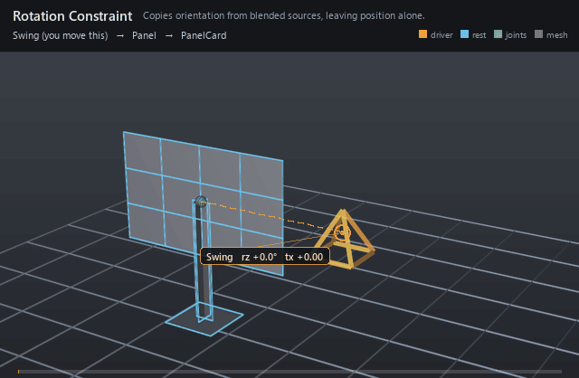

#  Rotation Constraint

*Copies orientation from blended sources, leaving position alone.*

| | |
|---|---|
| **Node type** | `RigExecRotationConstraint` |
| **Example** | [rotation_constraint.usda](../examples/rotation_constraint.usda) |

On this page:

- [Overview](#overview)
- [How it works](#how-it-works)
- [Wiring](#wiring)
- [Parameters](#parameters)
- [Example](#example)
- [Tips](#tips)
- [See also](#see-also)

## Overview



FBX-style rotation copy: the prim named by `rigExec:moves` takes its
orientation from the blended `rigExec:sources`, while its translation,
scale, and shear pass through untouched. That split is the whole point —
a panel bolted to a post can turn with a distant handle without drifting
off the post. Per-axis masks and a degrees offset shape which part of the
source orientation is actually copied.

FBX-style rotation constraint. It blends the ordered source
orientations, applies the authored Euler offset and axis masks, and
blends the result over the incoming pose by the common MoverAPI
envelope.

## How it works

It runs in the pose phase, on the single composed mover walk, after the
constrained provider's incoming frame is known. The kernel decomposes
that incoming frame, converts each source's orientation to Euler degrees
in `rigExec:rotationOrder`, and accumulates weighted *shortest* per-axis
deltas against the first positive-weight source, so the fully constrained
result depends only on the sources. `inputs:rotationOffset` is added in
degrees, the `inputs:affectRotation*` mask picks which axes are written,
and the common mover envelope (`inputs:defaultWeight`, or a bound
`rigExec:weightObject`) blends per axis between the incoming Euler and the
target one. Only the rotation of the decomposed frame is replaced before
the frame is rebuilt, which is why the origin and scale survive.

## Wiring

| Relationship | Points to | Required |
|---|---|---|
| `rigExec:sources` | Ordered transform providers whose orientations are blended. | yes |
| `rigExec:moves` | Exactly one transform-provider prim to re-orient. | yes |
| `inputs:sourceWeights` | Per-source weights parallel to `rigExec:sources`; empty means every source at full weight. | no |
| `rigExec:weightObject` | Weight field supplying the envelope instead of `inputs:defaultWeight`. | no |

## Parameters

### Common mover envelope

#### `rigExec:moves`

*Relationship.*

Reserved write-set relationship: exact prim/property targets.

#### `inputs:enabled`

*Type:* `bool`. *Default:* `true`.

Shape-preserving enable. Disabled movers pass their preceding
revision through unchanged (value-only edit).

#### `inputs:defaultWeight`

*Type:* `float`. *Default:* `1`.

Normalized common mover envelope in [0, 1]. With no bound
rigExec:weightObject it broadcasts over every logical element: zero
passes the incoming value through bit-for-bit and one applies the
mover's full-strength result.

#### `rigExec:weightObject`

*Relationship.*

Optional compatible total weight field, at most one target.
When bound, the weight object's values (including its own sparse or
constant fallback) supply the common envelope instead of
inputs:defaultWeight. Target, domain, and cardinality must match each
mover application; an incompatible binding is a compile error. A
multi-target mover may bind only a constant operation envelope whose
weightTarget is the mover prim itself; that one value broadcasts to
every application of the atomic mover.

### Constraint base

#### `rigExec:locked`

*Type:* `uniform bool`. *Default:* `false`.

Authoring lock metadata for DCC interchange. Evaluation
remains active while locked; use RigExecMoverAPI inputs:enabled or
inputs:defaultWeight to disable or blend the operation.

#### `inputs:affectTranslationX`

*Type:* `bool`. *Default:* `true`.

Per-axis translation mask. Ignored groups are a compile error.

#### `inputs:affectTranslationY`

*Type:* `bool`. *Default:* `true`.

#### `inputs:affectTranslationZ`

*Type:* `bool`. *Default:* `true`.

#### `inputs:affectRotationX`

*Type:* `bool`. *Default:* `true`.

Per-axis rotation mask. Ignored groups are a compile error.

#### `inputs:affectRotationY`

*Type:* `bool`. *Default:* `true`.

#### `inputs:affectRotationZ`

*Type:* `bool`. *Default:* `true`.

#### `inputs:affectScaleX`

*Type:* `bool`. *Default:* `true`.

Per-axis scale mask. Ignored groups are a compile error.
RigExecParentConstraint overrides the default to false to match the
FBX runtime, which leaves scale off unless it is asked for.

#### `inputs:affectScaleY`

*Type:* `bool`. *Default:* `true`.

#### `inputs:affectScaleZ`

*Type:* `bool`. *Default:* `true`.

#### `inputs:translationOffset`

*Type:* `double3`. *Default:* `(0, 0, 0)`.

Additive translation offset applied after the source blend.

#### `inputs:rotationOffset`

*Type:* `double3`. *Default:* `(0, 0, 0)`.

Additive Euler rotation offset in degrees, applied after the blend.

#### `inputs:scaleOffset`

*Type:* `double3`. *Default:* `(0, 0, 0)`.

ADDITIVE scale offset applied after the blend, which is why
its identity is (0, 0, 0) and not (1, 1, 1): the kernel computes
blendedScale + offset. A multiplicative offset would be a different
operator, not a different default.

#### `rigExec:rotationOrder`

*Type:* `uniform token`. *Default:* `"XYZ"`.

Valid values: `XYZ`, `XZY`, `YXZ`, `YZX`, `ZXY`, `ZYX`.

Euler order for the operators that compose a rotation.
Authoring it on one that does not is a compile error.

### Ordered sources

#### `rigExec:sources`

*Relationship.*

Ordered transform sources. Order is preserved through
composition because it identifies entries in every parallel source
array.

#### `inputs:sourceWeights`

*Type:* `float[]`. *Default:* `[]`.

Per-source weights parallel to rigExec:sources. An empty
array gives every source equal, full weight. A non-empty array must
have exactly one entry per source.

### Node parameters

## Example

A Swing control both rolls about Z and slides to the right; a rotation
constraint copies its orientation onto the Panel joint, and a matrix mover
skins a twelve-quad card to that joint. The card turns about the post it
sits on and never follows the control's translation, because the
constraint writes the rotation channel only.

Open it live with:

```bat
bin\launch_usdview.bat docs\examples\rotation_constraint.usda
```

Re-render the GIF above with:

```bat
python docs/render_media.py --page rotation_constraint
```

## Tips

- Rotation is the only channel this operator writes: authoring `inputs:affectTranslation*`, `inputs:affectScale*`, `inputs:translationOffset`, or `inputs:scaleOffset` on it is a compile error rather than a silent no-op.
- A zero envelope is an exact pass-through — `inputs:enabled = false` or `inputs:defaultWeight = 0` leaves the incoming pose bit-for-bit, and the sources are not even resolved.
- Blending two sources works per Euler component against the first positive-weight source, so keep `rigExec:rotationOrder` matched to how the sources are keyed and their per-axis values within half a turn of each other.

## See also

- [Aim Constraint](aim_constraint.md)
- [Position Constraint](position_constraint.md)
- [Matrix Mover](matrix_mover.md)

---

[RigExec nodes](../index.md)
