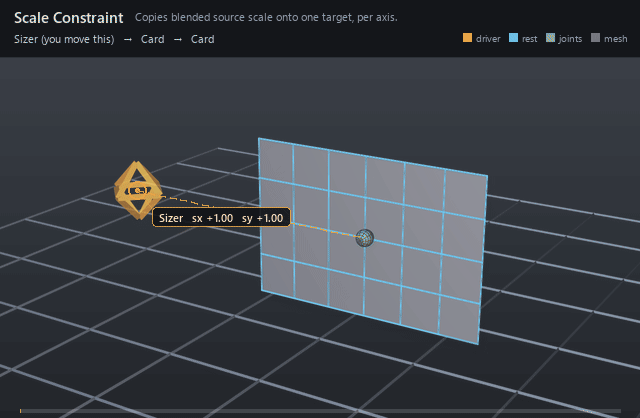

#  Scale Constraint

*Copies blended source scale onto one target, per axis.*

| | |
|---|---|
| **Node type** | `RigExecScaleConstraint` |
| **Example** | [scale_constraint.usda](../examples/scale_constraint.usda) |

On this page:

- [Overview](#overview)
- [How it works](#how-it-works)
- [Wiring](#wiring)
- [Parameters](#parameters)
- [Example](#example)
- [Tips](#tips)
- [See also](#see-also)

## Overview



FBX-style scale: the transform named by `rigExec:moves` takes its
scale from the weighted average of the ordered `rigExec:sources`, and
nothing else about it changes. It is how a prop inherits a character's
size, and -- one constraint per moved transform, every one of them naming
the same source -- how a single master "size" handle scales several parts
of a rig in lock-step.
Because only the scale channel is written, the target swells and shrinks
about its own pivot instead of drifting.

FBX-style scale constraint. It blends the ordered source scales,
applies inputs:scaleOffset and the per-axis masks, and blends the result
over the incoming pose by the common MoverAPI envelope.

## How it works

The constraint runs in the pose phase, on the transform provider
named by `rigExec:moves`. Each evaluation decomposes every source frame,
accumulates its scale weighted by the parallel `inputs:sourceWeights`
(an empty array weights every source fully), divides by the total weight,
adds the ADDITIVE `inputs:scaleOffset`, and writes that value into the
decomposed scale of the incoming frame — one axis at a time, only where
`inputs:affectScaleX/Y/Z` is on. The common mover envelope
(`inputs:defaultWeight`, or a bound `rigExec:weightObject`) then mixes the
candidate over the incoming scale, so a zero envelope is an exact
pass-through. Translation, rotation and shear of the moved frame are
carried through untouched, and downstream skinning reading the joint at
`final` picks the new scale up automatically.

## Wiring

| Relationship | Points to | Required |
|---|---|---|
| `rigExec:sources` | Ordered transform providers whose scales are blended into the goal. | yes |
| `rigExec:moves` | Exactly one transform provider to rescale (pose phase). | yes |
| `inputs:sourceWeights` | Per-source weights parallel to `rigExec:sources`; empty means all-equal. | no |
| `rigExec:weightObject` | Weight field supplying the envelope instead of `inputs:defaultWeight`. | no |

## Parameters

### Common mover envelope

#### `rigExec:moves`

*Relationship.*

Reserved write-set relationship: exact prim/property targets.

#### `inputs:enabled`

*Type:* `bool`. *Default:* `true`.

Shape-preserving enable. Disabled movers pass their preceding
revision through unchanged (value-only edit).

#### `inputs:defaultWeight`

*Type:* `float`. *Default:* `1`.

Normalized common mover envelope in [0, 1]. With no bound
rigExec:weightObject it broadcasts over every logical element: zero
passes the incoming value through bit-for-bit and one applies the
mover's full-strength result.

#### `rigExec:weightObject`

*Relationship.*

Optional compatible total weight field, at most one target.
When bound, the weight object's values (including its own sparse or
constant fallback) supply the common envelope instead of
inputs:defaultWeight. Target, domain, and cardinality must match each
mover application; an incompatible binding is a compile error. A
multi-target mover may bind only a constant operation envelope whose
weightTarget is the mover prim itself; that one value broadcasts to
every application of the atomic mover.

### Constraint base

#### `rigExec:locked`

*Type:* `uniform bool`. *Default:* `false`.

Authoring lock metadata for DCC interchange. Evaluation
remains active while locked; use RigExecMoverAPI inputs:enabled or
inputs:defaultWeight to disable or blend the operation.

#### `inputs:affectTranslationX`

*Type:* `bool`. *Default:* `true`.

Per-axis translation mask. Ignored groups are a compile error.

#### `inputs:affectTranslationY`

*Type:* `bool`. *Default:* `true`.

#### `inputs:affectTranslationZ`

*Type:* `bool`. *Default:* `true`.

#### `inputs:affectRotationX`

*Type:* `bool`. *Default:* `true`.

Per-axis rotation mask. Ignored groups are a compile error.

#### `inputs:affectRotationY`

*Type:* `bool`. *Default:* `true`.

#### `inputs:affectRotationZ`

*Type:* `bool`. *Default:* `true`.

#### `inputs:affectScaleX`

*Type:* `bool`. *Default:* `true`.

Per-axis scale mask. Ignored groups are a compile error.
RigExecParentConstraint overrides the default to false to match the
FBX runtime, which leaves scale off unless it is asked for.

#### `inputs:affectScaleY`

*Type:* `bool`. *Default:* `true`.

#### `inputs:affectScaleZ`

*Type:* `bool`. *Default:* `true`.

#### `inputs:translationOffset`

*Type:* `double3`. *Default:* `(0, 0, 0)`.

Additive translation offset applied after the source blend.

#### `inputs:rotationOffset`

*Type:* `double3`. *Default:* `(0, 0, 0)`.

Additive Euler rotation offset in degrees, applied after the blend.

#### `inputs:scaleOffset`

*Type:* `double3`. *Default:* `(0, 0, 0)`.

ADDITIVE scale offset applied after the blend, which is why
its identity is (0, 0, 0) and not (1, 1, 1): the kernel computes
blendedScale + offset. A multiplicative offset would be a different
operator, not a different default.

#### `rigExec:rotationOrder`

*Type:* `uniform token`. *Default:* `"XYZ"`.

Valid values: `XYZ`, `XZY`, `YXZ`, `YZX`, `ZXY`, `ZYX`.

Euler order for the operators that compose a rotation.
Authoring it on one that does not is a compile error.

### Ordered sources

#### `rigExec:sources`

*Relationship.*

Ordered transform sources. Order is preserved through
composition because it identifies entries in every parallel source
array.

#### `inputs:sourceWeights`

*Type:* `float[]`. *Default:* `[]`.

Per-source weights parallel to rigExec:sources. An empty
array gives every source equal, full weight. A non-empty array must
have exactly one entry per source.

### Node parameters

## Example

A 6x4 quad card is skinned rigidly to one joint sitting at its
centre, and a Sizer control off to the left animates only `avars:sx` and
`avars:sy`. The scale constraint copies that scale onto the joint with
`affectScaleZ` off, so the card stretches to 1.8x wide and 1.3x tall,
collapses to about half size, and returns — growing and shrinking in
place while its centre never moves.

Open it live with:

```bat
bin\launch_usdview.bat docs\examples\scale_constraint.usda
```

Re-render the GIF above with:

```bat
python docs/render_media.py --page scale_constraint
```

## Tips

- `inputs:scaleOffset` is ADDITIVE: its identity is (0, 0, 0), not (1, 1, 1), because the kernel computes blended scale + offset (`RigExecApplyScaleConstraint`, libs/rigExecMath/solvers.cpp:945).
- Only the scale channel is honored — authoring `inputs:translationOffset`, `inputs:rotationOffset`, any `inputs:affectTranslation*`/`inputs:affectRotation*`, or `rigExec:rotationOrder` on a scale constraint is a compile error, never a silent no-op.
- Several sources average, they do not multiply: two equally weighted sources at scale 2 and 1 land the target at 1.5. Use `inputs:sourceWeights` to bias between them.

## See also

- [Aim Constraint](aim_constraint.md)
- [Control](control.md)
- [Matrix Mover](matrix_mover.md)

---

[RigExec nodes](../index.md)
