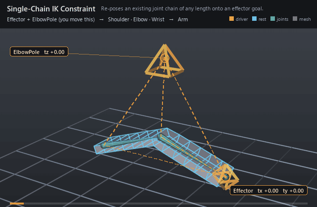

#  Single-Chain IK Constraint

*Re-poses an existing joint chain of any length onto an effector goal.*

| | |
|---|---|
| **Node type** | `RigExecSingleChainIkConstraint` |
| **Example** | [single_chain_ik_constraint.usda](../examples/single_chain_ik_constraint.usda) |

On this page:

- [Overview](#overview)
- [How it works](#how-it-works)
- [Wiring](#wiring)
- [Parameters](#parameters)
- [Example](#example)
- [Tips](#tips)
- [See also](#see-also)

## Overview



FBX-style single-chain IK, and the only IK in RigExec that is a
**constraint** rather than a solver: it does not publish a frame array that
joints extract from, it revises the joint frames that are already there.
Name the two endpoints — `rigExec:firstJoint` and `rigExec:endJoint` — and the
chain between them is inferred from namespace nesting, so the same node drives
a two-joint chain or a ten-joint one. The first joint's origin stays planted,
every segment keeps its length, and the end joint lands on the effector
whenever the goal is in reach.

FBX-style single-chain IK constraint. The first and end joints
identify an inclusive namespace joint chain, the effector supplies the
goal transform, and the pole may come from an authored asset-space point
or an ordered blend of pole-vector objects. It does not use generic
rigExec:sources.

## How it works

The constraint runs in the pose phase, ordered BELOW the
geometry movers in the Movers stack — the hierarchy runs bottom-up, so the
chain is solved before the skin movers read it at their `final` transform
read phase. At compile time it walks `endJoint`'s ancestors up to
`firstJoint` to infer the ordered chain, and `rigExec:moves` must restate that
complete set. Each evaluation it reads the chain's current frames and the
effector's frame, solves the positions with deterministic FABRIK inside the
plane chosen by `rigExec:solverMode` (`rotatePlane` uses the pole point and
`inputs:twistDegrees`; `singleChain` takes the plane from the effector's own
orientation and ignores both), then rebuilds each non-end frame with its X axis
aimed at the next solved joint and writes the whole chain back atomically — a
failed solve passes every joint through untouched rather than half-posing the
limb. `rigExec:evaluationMode` decides whether the segment lengths come from
the joints' rests (`neverTS`, the default) or from their animated translation
and scale.

## Wiring

| Relationship | Points to | Required |
|---|---|---|
| `rigExec:firstJoint` | Joint that anchors the chain; its origin never moves. | yes |
| `rigExec:endJoint` | Final joint of the chain, nested under the first. | yes |
| `rigExec:effector` | Single transform provider supplying the IK goal. | yes |
| `rigExec:moves` | Every joint of the inferred chain, restated exactly. | yes |
| `rigExec:poleVectorObjects` | Providers blended into the pole point when `poleVectorMode` is `object`; unused by `singleChain`. | no |
| `rigExec:weightObject` | Constant one-element weight field targeting the constraint prim, supplying the envelope instead of `inputs:defaultWeight`. | no |

## Parameters

### Common mover envelope

#### `rigExec:moves`

*Relationship.*

Reserved write-set relationship: exact prim/property targets.

#### `inputs:enabled`

*Type:* `bool`. *Default:* `true`.

Shape-preserving enable. Disabled movers pass their preceding
revision through unchanged (value-only edit).

#### `inputs:defaultWeight`

*Type:* `float`. *Default:* `1`.

Normalized common mover envelope in [0, 1]. With no bound
rigExec:weightObject it broadcasts over every logical element: zero
passes the incoming value through bit-for-bit and one applies the
mover's full-strength result.

#### `rigExec:weightObject`

*Relationship.*

Optional compatible total weight field, at most one target.
When bound, the weight object's values (including its own sparse or
constant fallback) supply the common envelope instead of
inputs:defaultWeight. Target, domain, and cardinality must match each
mover application; an incompatible binding is a compile error. A
multi-target mover may bind only a constant operation envelope whose
weightTarget is the mover prim itself; that one value broadcasts to
every application of the atomic mover.

### Constraint base

#### `rigExec:locked`

*Type:* `uniform bool`. *Default:* `false`.

Authoring lock metadata for DCC interchange. Evaluation
remains active while locked; use RigExecMoverAPI inputs:enabled or
inputs:defaultWeight to disable or blend the operation.

#### `inputs:affectTranslationX`

*Type:* `bool`. *Default:* `true`.

Per-axis translation mask. Ignored groups are a compile error.

#### `inputs:affectTranslationY`

*Type:* `bool`. *Default:* `true`.

#### `inputs:affectTranslationZ`

*Type:* `bool`. *Default:* `true`.

#### `inputs:affectRotationX`

*Type:* `bool`. *Default:* `true`.

Per-axis rotation mask. Ignored groups are a compile error.

#### `inputs:affectRotationY`

*Type:* `bool`. *Default:* `true`.

#### `inputs:affectRotationZ`

*Type:* `bool`. *Default:* `true`.

#### `inputs:affectScaleX`

*Type:* `bool`. *Default:* `true`.

Per-axis scale mask. Ignored groups are a compile error.
RigExecParentConstraint overrides the default to false to match the
FBX runtime, which leaves scale off unless it is asked for.

#### `inputs:affectScaleY`

*Type:* `bool`. *Default:* `true`.

#### `inputs:affectScaleZ`

*Type:* `bool`. *Default:* `true`.

#### `inputs:translationOffset`

*Type:* `double3`. *Default:* `(0, 0, 0)`.

Additive translation offset applied after the source blend.

#### `inputs:rotationOffset`

*Type:* `double3`. *Default:* `(0, 0, 0)`.

Additive Euler rotation offset in degrees, applied after the blend.

#### `inputs:scaleOffset`

*Type:* `double3`. *Default:* `(0, 0, 0)`.

ADDITIVE scale offset applied after the blend, which is why
its identity is (0, 0, 0) and not (1, 1, 1): the kernel computes
blendedScale + offset. A multiplicative offset would be a different
operator, not a different default.

#### `rigExec:rotationOrder`

*Type:* `uniform token`. *Default:* `"XYZ"`.

Valid values: `XYZ`, `XZY`, `YXZ`, `YZX`, `ZXY`, `ZYX`.

Euler order for the operators that compose a rotation.
Authoring it on one that does not is a compile error.

### Node parameters

#### `rigExec:firstJoint`

*Relationship.*

Single first joint of the inclusive IK chain.

#### `rigExec:endJoint`

*Relationship.*

Single final joint of the inclusive IK chain.

#### `rigExec:effector`

*Relationship.*

Single transform provider supplying the IK goal.

#### `rigExec:poleVectorObjects`

*Relationship.*

Ordered pole-vector transform providers used in object mode.

#### `inputs:poleVectorWeights`

*Type:* `float[]`. *Default:* `[]`.

Weights parallel to rigExec:poleVectorObjects. An empty
array gives every pole-vector object equal, full weight.

#### `inputs:poleVector`

*Type:* `double3`. *Default:* `(0, 1, 0)`.

Absolute asset-space pole point used in vector mode.

#### `inputs:twistDegrees`

*Type:* `double`. *Default:* `0`.

#### `rigExec:solverMode`

*Type:* `uniform token`. *Default:* `"rotatePlane"`.

Valid values: `rotatePlane`, `singleChain`.

#### `rigExec:poleVectorMode`

*Type:* `uniform token`. *Default:* `"vector"`.

Valid values: `vector`, `object`.

#### `rigExec:evaluationMode`

*Type:* `uniform token`. *Default:* `"neverTS"`.

Valid values: `neverTS`, `autoDetect`, `alwaysTS`.

Controls whether animated per-chain translation and scale
contribute to IK solve lengths, following Autodesk EvaluateTSAnim:
neverTS ignores animated T/S and uses rest-derived lengths, autoDetect
uses current T/S when animation is detected, and alwaysTS always uses
the current T/S.

## Example

A flat two-segment arm lies along +X with a shoulder, an elbow, and a
wrist; the diamond effector control swings up and back over the frame range and
the wrist tracks it exactly, folding the plank at the elbow. The pole control
above the elbow is the pole-vector object, and it sits at z = 0 so the elbow
always breaks upward in the XY plane. Two matrix movers skin the one mesh from
the two bones through dense static weights that partition the points at the
elbow column.

Open it live with:

```bat
bin\launch_usdview.bat docs\examples\single_chain_ik_constraint.usda
```

Re-render the GIF above with:

```bat
python docs/render_media.py --page single_chain_ik_constraint
```

## Tips

- `solverMode = "singleChain"` ignores the pole and `inputs:twistDegrees` entirely — the effector's orientation picks the bend plane — and the pole relationships are not even bound in that mode, so leftover pole wiring cannot break the compile.
- There is no stretch or softness dial: segment lengths are preserved exactly, and a goal past full reach returns the chain straightened down the root-to-goal ray. Reach for Two-Bone IK when you want stretch.
- Do not author the inherited `inputs:affect*` masks or the `inputs:translationOffset`/`rotationOffset`/`scaleOffset` values here, and do not author `rigExec:rotationOrder`: this operator honors no channel group, and any authored opinion — even one equal to the default — is a compile error.

## See also

- [Two-Bone IK](two_bone_ik.md)
- [Aim Constraint](aim_constraint.md)
- [Joint](joint.md)

---

[RigExec nodes](../index.md)
