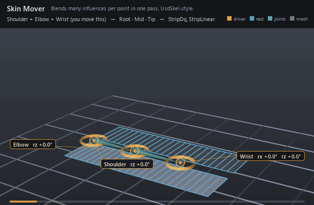

#  Skin Mover

*Blends many influences per point in one pass, UsdSkel-style.*

| | |
|---|---|
| **Node type** | `RigExecSkinMover` |
| **Example** | [skin_mover.usda](../examples/skin_mover.usda) |

On this page:

- [Overview](#overview)
- [How it works](#how-it-works)
- [Wiring](#wiring)
- [Parameters](#parameters)
- [Example](#example)
- [Tips](#tips)
- [See also](#see-also)

## Overview



Character skinning in a single node: `rigExec:influences` lists the
joints, and the UsdSkel-shaped `rigExec:jointIndices` /
`rigExec:jointWeights` arrays say which of them move each point and by
how much. A stack of matrix movers applies one influence at a time over
the preceding revision, which matches a skinCluster only where a point
has exactly one influence; the skin mover gathers every influence of a
point and blends them together, so shared points bend smoothly instead
of hinging. `rigExec:skinningMethod` picks the blend: `classicLinear`
for linear blend skinning, `dualQuaternion` for the volume-preserving
one.

Multi-influence skinning of an exact native point3f[] points
property in ONE pass: every influence's matrix is gathered per point and
blended by that point's authored weights, then the result is mixed with
the common MoverAPI envelope.

RigExecMatrixMover applies one influence per mover, sequentially, each
from the PRECEDING revision. That is exact for a point with a single
influence and diverges from a skinCluster everywhere weights blend, so a
skinned character needs this mover: the same jointIndices / jointWeights
layout UsdSkel uses, with the influence list in rigExec:influences
standing in for UsdSkel's joint order.

classicLinear: p' = p + sum_i w_i (T_i p - p) = (1 - sum_i w_i) p +
sum_i w_i T_i p. With weights that sum to one this is exactly linear blend
skinning; a shortfall keeps the rest point in proportion, so a partially
weighted point stays put rather than collapsing toward the origin.
dualQuaternion blends the influences' rigid motions as dual quaternions
(shortest arc, one normalisation, so a twisted joint keeps its volume
instead of candy-wrapping) and their scale and shear linearly in each
joint's pre-rotation frame, so squash-and-stretch survives; the same
weight shortfall enters that blend as an identity influence, so a
partially weighted point is likewise held toward rest.

## How it works

The mover is one revision in its target's point chain, so it runs in
the mover-application walk after solving: it reads
every influence's `computeMatrix` (the rest-to-posed map) at
`rigExec:transformReadPhase`, gathers `rigExec:elementSize` index/weight
slots per point in point order, and accumulates them — `classicLinear`
sums `w_k T_k p` and leaves the weight shortfall `1 - sum w_k` on the
rest point, while `dualQuaternion` splits each influence once per
evaluation into a pre-rotation stretch and a unit dual quaternion,
blends along the shortest arc with one normalisation, and enters the
same shortfall as an identity influence. The resulting points are then
mixed against the incoming revision by the common mover envelope —
`inputs:defaultWeight`, or a bound `rigExec:weightObject` — so the
envelope fades the whole skin, not one influence. The layout's element
shape, index range and non-negative finite weights are checked at
compile and again whenever the cached layout is resolved, and the
influence matrices are checked every frame (finite, affine); a mismatch
fails the application rather than skinning a truncated array.

## Wiring

| Relationship | Points to | Required |
|---|---|---|
| `rigExec:influences` | Ordered joints or controls the indices address; at least one, and each must be a catalogued provider. | yes |
| `rigExec:moves` | The one exact `points` property to skin. | yes |
| `rigExec:jointIndices` / `rigExec:jointWeights` | Parallel per-point arrays, `elementSize` slots per point in point order. | yes |
| `rigExec:weightObject` | Optional field supplying the envelope instead of `inputs:defaultWeight`; fades the whole skin. | no |

## Parameters

### Common mover envelope

#### `rigExec:moves`

*Relationship.*

Reserved write-set relationship: exact prim/property targets.

#### `inputs:enabled`

*Type:* `bool`. *Default:* `true`.

Shape-preserving enable. Disabled movers pass their preceding
revision through unchanged (value-only edit).

#### `inputs:defaultWeight`

*Type:* `float`. *Default:* `1`.

Normalized common mover envelope in [0, 1]. With no bound
rigExec:weightObject it broadcasts over every logical element: zero
passes the incoming value through bit-for-bit and one applies the
mover's full-strength result.

#### `rigExec:weightObject`

*Relationship.*

Optional compatible total weight field, at most one target.
When bound, the weight object's values (including its own sparse or
constant fallback) supply the common envelope instead of
inputs:defaultWeight. Target, domain, and cardinality must match each
mover application; an incompatible binding is a compile error. A
multi-target mover may bind only a constant operation envelope whose
weightTarget is the mover prim itself; that one value broadcasts to
every application of the atomic mover.

### Node parameters

#### `rigExec:influences`

*Relationship.*

Ordered GfMatrix4d providers (computeMatrix), one per
influence. rigExec:jointIndices index this list. Named influences,
not joints: rigExec:joints is a solver's output claim, and this mover
only reads.

#### `rigExec:jointIndices`

*Type:* `int[]`. *Default:* `[]`.

Per-point influence indices into rigExec:influences,
rigExec:elementSize entries per point in point order (UsdSkel's
primvars:skel:jointIndices layout).

#### `rigExec:jointWeights`

*Type:* `float[]`. *Default:* `[]`.

Per-point influence weights parallel to rigExec:jointIndices.
Finite and non-negative; not renormalized.

#### `rigExec:elementSize`

*Type:* `uniform int`. *Default:* `1`.

Influences per point.

#### `rigExec:skinningMethod`

*Type:* `uniform token`. *Default:* `"classicLinear"`.

Valid values: `classicLinear`, `dualQuaternion`.

#### `rigExec:transformReadPhase`

*Type:* `uniform token`. *Default:* `"base"`.

Valid values: `base`, `preceding`, `final`.

Which revision of every influence's matrix is read.

## Example

Two identical 24-quad ribbons lie flat in the floor on either side of
one three-joint chain, and each is skinned by ONE skin mover. Both
movers name the same `rigExec:influences` and carry the same
`rigExec:jointIndices` / `rigExec:jointWeights` — two influence slots
per point, ramping 1 → 0 linearly across each span, so the bend draws as
a curve rather than a crease at the joints. The only difference between
them is `rigExec:skinningMethod`: the bright ribbon is
`dualQuaternion`, the dim one `classicLinear`. Where the wrist rolls 45°
the linear ribbon's cross-section pinches from its rest width of 1.500
to 1.386 and its tip falls short of the arc; the dual-quaternion ribbon
holds 1.500 at every column.

Open it live with:

```bat
bin\launch_usdview.bat docs\examples\skin_mover.usda
```

Re-render the GIF above with:

```bat
python docs/render_media.py --page skin_mover
```

## Tips

- `rigExec:elementSize` is the same for every point: pad a point that needs fewer influences with a zero weight. Weights are never renormalized, and a sum below one holds the point toward its rest position in proportion rather than dragging it to the origin.
- Influences must be RigExec provider prims (controls or joints), not arbitrary matrix attributes, and the read phase accepts only `base` or `final` even though the schema lists `preceding`; read `final` so constraints that revise a joint are included.
- `classicLinear` has the SIMD path and is the cheaper blend; `dualQuaternion` is scalar but keeps volume through twists, which is what a candy-wrapped wrist or the pinch at a bent elbow is missing.

## See also

- [Matrix Mover](matrix_mover.md)
- [FK Chain](fk_chain.md)
- [Joint](joint.md)

---

[RigExec nodes](../index.md)
