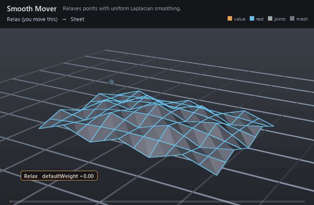

#  Smooth Mover

*Relaxes points with uniform Laplacian smoothing.*

| | |
|---|---|
| **Node type** | `RigExecSmoothMover` |
| **Example** | [smooth_mover.usda](../examples/smooth_mover.usda) |

On this page:

- [Overview](#overview)
- [How it works](#how-it-works)
- [Wiring](#wiring)
- [Parameters](#parameters)
- [Example](#example)
- [Tips](#tips)
- [See also](#see-also)

## Overview



One full Laplacian step over the mesh's own edge adjacency, blended
through the common envelope. It settles lattice falloff, melts sculpt
pops, and rounds low-poly cages — anywhere high-frequency shape needs
taking down without leaving the mover stack.

Moves exactly one exact native UsdGeomPointBased points
property through uniform-weight Laplacian smoothing with fixed edge
adjacency taken from the destination's standard topology (spec
section 7.6 revised: the former post-mover smooth operation as a
first-class mover). The common MoverAPI envelope blends the full
Laplacian step over the incoming points.

## How it works

It runs as one point revision in the mover stack, its place in the
order taken from its position in the composed namespace like every other
mover. Each point moves toward the average of its edge neighbors
(uniform weights, fixed adjacency built from the destination prim's own
`faceVertexCounts` / `faceVertexIndices`); the envelope mixes that full
step over the incoming points. One iteration is a low-pass filter, so
detail at the sampling limit of the cage goes first and broad shape
survives nearly untouched — at envelope 1 a symmetric spike collapses
exactly to its neighbors' centroid, so partial envelopes are the normal
working range. Points with no neighbors are left alone, and invalid
topology passes straight through.

## Wiring

| Relationship | Points to | Required |
|---|---|---|
| `rigExec:moves` | Exact points property to relax. | yes |

## Parameters

### Common mover envelope

#### `rigExec:moves`

*Relationship.*

Reserved write-set relationship: exact prim/property targets.

#### `inputs:enabled`

*Type:* `bool`. *Default:* `true`.

Shape-preserving enable. Disabled movers pass their preceding
revision through unchanged (value-only edit).

#### `inputs:defaultWeight`

*Type:* `float`. *Default:* `1`.

Normalized common mover envelope in [0, 1]. With no bound
rigExec:weightObject it broadcasts over every logical element: zero
passes the incoming value through bit-for-bit and one applies the
mover's full-strength result.

#### `rigExec:weightObject`

*Relationship.*

Optional compatible total weight field, at most one target.
When bound, the weight object's values (including its own sparse or
constant fallback) supply the common envelope instead of
inputs:defaultWeight. Target, domain, and cardinality must match each
mover application; an incompatible binding is a compile error. A
multi-target mover may bind only a constant operation envelope whose
weightTarget is the mover prim itself; that one value broadcasts to
every application of the atomic mover.

### Node parameters

## Example

A 12×8 sheet is authored crumpled: a fine egg-crate quilt riding on a
broad swell. As the mover's `inputs:defaultWeight` spline ramps 0 → 1 → 0
the single Laplacian step irons the quilt down to a fifth of its
amplitude and then lets it crumple back, while the swell keeps 94% of
its height — the frequency split made visible.
The border ring creeps inward as it relaxes because boundary points have
fewer neighbors to average.

Open it live with:

```bat
bin\launch_usdview.bat docs\examples\smooth_mover.usda
```

Re-render the GIF above with:

```bat
python docs/render_media.py --page smooth_mover
```

## Tips

- Chain smooth after lattice or blendshape passes to settle their high frequencies.
- The mover has no parameters of its own: drive strength with the envelope or a weight object.
- Adjacency is the destination's own topology, so open borders drift inward toward their neighbors; bind a per-point weight object holding the border at 0 to pass those points through untouched.

## See also

- [Lattice Mover](lattice_mover.md)
- [Volume Correct Mover](volume_correct_mover.md)
- [Blendshape Mover](blendshape_mover.md)

---

[RigExec nodes](../index.md)
