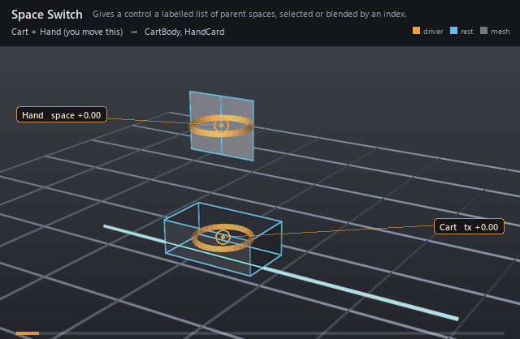

#  Space Switch

*Gives a control a labelled list of parent spaces, selected or blended by an index.*

| | |
|---|---|
| **Node type** | `RigExecSpaceSwitch` |
| **Example** | [space_switch.usda](../examples/space_switch.usda) |

On this page:

- [Overview](#overview)
- [How it works](#how-it-works)
- [Wiring](#wiring)
- [Parameters](#parameters)
- [Example](#example)
- [Tips](#tips)
- [See also](#see-also)

## Overview



A space switch replaces one control's PARENT SPACE with
one of an ordered list of sources — world, the chest, the head — chosen by
a live index. It does not write the control's pose: the control keeps
composing from its own avars, so it still drags, still carries its
namespace children, and its avars read as offsets in whichever space is
selected. A whole-number index selects a space exactly; a fractional one
blends the two it lies between, so a switch can be eased instead of
stepped.

A labelled list of parent spaces for one xformable, with a live
index selecting between them.

It is NOT a pose constraint: it does not write the target's pose. It
replaces the target's PARENT SPACE, which is the whole point -- the
control keeps composing from its own avars, so it still drags, still
carries its namespace children, and its avars still read as local
offsets in whatever space is selected.

The composition, in row-vector convention, is

world = avars * default:space * inverse(source default:space)
          * source posed:space

which is the ordinary xformable ladder with the namespace parent's pair
of spaces swapped for the selected source's pair. Both halves come from
the same source, so at rest the two cancel and EVERY space gives the
same answer: adding or changing a space switch cannot move a rig at
rest, and cannot move it at all while the selected source is unposed.
Switching mid-pose DOES move the control; matching the pose across
a switch is a tool's job, not the engine's.

A source that is not an xformable provider -- the RigExecRoot itself is
the idiomatic one -- contributes identity, which is how "world" is
spelled without inventing a prim to stand for it.

The inherited per-axis masks apply to the delta the space contributes,
expressed in the TARGET's own default frame, so masking translation off
leaves an orient-only space that rotates the control about its own
pivot, and masking rotation off leaves a point-only one. The inherited
inputs:sourceWeights plays no part here -- inputs:activeSpace is the
selector -- and authoring it is a compile error rather than a silent
no-op.

## How it works

The switch is read at compile time and changes how its target
composes. In row-vector convention the target's world matrix is
`avars * default:space * inverse(source default:space) * source posed:space`:
the ordinary transform ladder with the namespace parent's pair of spaces
swapped for the selected source's pair. Both halves come from the same
source, so at rest they cancel and every space gives the same answer —
adding a switch never moves a rig at rest. A source that is not a frame
provider (the `RigExecRoot` itself is the idiomatic one) contributes
identity, which is how "world" is spelled. The inherited per-axis masks
act on the delta the space contributes, expressed in the target's own
default frame, and `rigExec:rotationFilters` can pass only the twist of a
source's rotation about `rigExec:twistAxis`, or only the swing, by an
exact swing-twist decomposition. The index is an ordinary per-frame input:
the dynamic path, the baked program, the frame cache and a `.rigexec`
binary all re-read it every frame, and keying it re-runs only the compose
of the switched control's subtree.

## Wiring

| Relationship | Points to | Required |
|---|---|---|
| `rigExec:target` | The one control (or other transform provider) whose parent space is switched. Zero or several is a compile error. | yes |
| `rigExec:sources` | The spaces, in index order. The rig root (or any prim that is not a frame provider) means world. | yes |
| `rigExec:activeSpaceAttribute` | A float or double property supplying the index, normally an avar on the control itself; when authored it wins over `inputs:activeSpace`. | no |
| `rigExec:space` | The master whose rest-to-posed motion carries the whole rig, so a rotation filter does not discard it. | no |

## Parameters

### Constraint base

#### `rigExec:locked`

*Type:* `uniform bool`. *Default:* `false`.

Authoring lock metadata for application interchange. Evaluation
remains active while locked; use RigExecMoverAPI inputs:enabled or
inputs:defaultWeight to disable or blend the operation.

#### `inputs:affectTranslationX`

*Type:* `bool`. *Default:* `true`.

Per-axis translation mask. Ignored groups are a compile error.

#### `inputs:affectTranslationY`

*Type:* `bool`. *Default:* `true`.

#### `inputs:affectTranslationZ`

*Type:* `bool`. *Default:* `true`.

#### `inputs:affectRotationX`

*Type:* `bool`. *Default:* `true`.

Per-axis rotation mask. Ignored groups are a compile error.

#### `inputs:affectRotationY`

*Type:* `bool`. *Default:* `true`.

#### `inputs:affectRotationZ`

*Type:* `bool`. *Default:* `true`.

#### `inputs:affectScaleX`

*Type:* `bool`. *Default:* `true`.

Per-axis scale mask. Ignored groups are a compile error.
RigExecParentConstraint overrides the default to false to match the
FBX runtime, which leaves scale off unless it is asked for.

#### `inputs:affectScaleY`

*Type:* `bool`. *Default:* `true`.

#### `inputs:affectScaleZ`

*Type:* `bool`. *Default:* `true`.

#### `inputs:translationOffset`

*Type:* `double3`. *Default:* `(0, 0, 0)`.

Additive translation offset applied after the source blend.

#### `inputs:rotationOffset`

*Type:* `double3`. *Default:* `(0, 0, 0)`.

Additive Euler rotation offset in degrees, applied after the blend.

#### `inputs:scaleOffset`

*Type:* `double3`. *Default:* `(0, 0, 0)`.

ADDITIVE scale offset applied after the blend, which is why
its identity is (0, 0, 0) and not (1, 1, 1): the kernel computes
blendedScale + offset. A multiplicative offset would be a different
operator, not a different default.

#### `rigExec:rotationOrder`

*Type:* `uniform token`. *Default:* `"XYZ"`.

Valid values: `XYZ`, `XZY`, `YXZ`, `YZX`, `ZXY`, `ZYX`.

Euler order for the operators that compose a rotation.
Authoring it on one that does not is a compile error.

### Ordered sources

#### `rigExec:sources`

*Relationship.*

Ordered transform sources. Order is preserved through
composition because it identifies entries in every parallel source
array.

#### `inputs:sourceWeights`

*Type:* `float[]`. *Default:* `[]`.

Per-source weights parallel to rigExec:sources. An empty
array gives every source equal, full weight. A non-empty array must
have exactly one entry per source.

### Node parameters

#### `rigExec:target`

*Relationship.*

The one RigExecXformable whose parent space is switched.
Exactly one target; zero or several is a compile error.

#### `rigExec:space`

*Relationship.*

The prim whose movement away from its rest carries the
whole rig -- normally a TRS master.

A switch composes its target over the target's DEFAULT ancestors,
so a master's motion reaches a switched control only INSIDE the
source's motion. With rigExec:rotationFilters left at `all` that
is harmless: the mask is the identity and the carry passes
through. Ask for `twist` or `swing` and the filter throws the
master's rotation away along with the part it was told to drop.

Naming the space runs the filter on the master-free motion and
re-applies the carry afterwards, so only the source's own
rotation is ever filtered. The space used is
rest-inverse-times-posed, so a master sitting at its rest
contributes identity and a rig that names nothing is unchanged.

A RELATIONSHIP, not a connection to `posed:space`, for the same
reason as RigExecTwoBoneIk: a control's posed space is computed,
never authored, so an attribute connection to it resolves to the
unauthored identity and the filter silently keeps eating the
carry.

#### `rigExec:spaceLabels`

*Type:* `uniform token[]`. *Default:* `[]`.

UI labels parallel to rigExec:sources. Empty falls back to
the source prims' names. A non-empty array must have exactly one
entry per source.

#### `inputs:activeSpace`

*Type:* `double`. *Default:* `0`.

Index into rigExec:sources, clamped to the list. A whole
number selects that space exactly; a fractional value blends the two
it lies between, so a switch can be eased rather than stepped.
Ignored when rigExec:activeSpaceAttribute names a property.

#### `rigExec:activeSpaceAttribute`

*Relationship.*

Optional single float or double PROPERTY supplying the
index, so the animator-facing channel can live on the control itself
-- `space:active` beside its avars -- rather than on this prim. When
authored it is authoritative and inputs:activeSpace is ignored.

#### `rigExec:rotationFilters`

*Type:* `uniform token[]`. *Default:* `[]`.

Valid values: `all`, `twist`, `swing`, `orient`.

Optional per-source rotation filter, parallel to
rigExec:sources. Empty, or "all", passes the source's rotation
through whole.

"twist" passes only the source's rotation ABOUT rigExec:twistAxis
and drops everything else; "swing" passes only the remainder. The
split is the exact swing-twist decomposition of the source's
rotation delta, not an Euler mask, so it stays well behaved at
large angles where per-axis masking does not.

This is what a pole vector living in its hand's or foot's space
wants: the elbow should follow the forearm's TWIST and must not
swing around with the wrist, because a pole that swings with the
thing it aims is a pole that fights the animator.

Translation and scale are unaffected: the pole still follows the
hand's position.

"orient" makes the source a rotation-only space: the target takes
the source's whole rotation, and its position stays where its
namespace parent carries it, as if the space were not switched. A
shoulder, neck or head held to the world turns with the world and
still rides on the body.

#### `rigExec:twistAxis`

*Type:* `double3`. *Default:* `(1, 0, 0)`.

Twist axis for rigExec:rotationFilters, in the SOURCE's own
rest axes -- the limb axis for a wrist or an ankle. One axis serves
every filtered source; a switch needing two would be two switches.

## Example

A cart slides along a track and a hand control floats above
it. The hand is the cart's sibling, not its child, so in namespace it lives
in world space; the `HandSpaces` switch lists world (the rig root) and the
cart, and reads its index from the hand's own `avars:space`. For the first
eleven frames the index is 0 and the cart drives away beneath a hand that
stays put. Over the next twelve the index eases from 0 to 1 and the hand
glides across onto the cart — halfway at the midpoint, because a fractional
index blends the two spaces. From then on the hand rides the cart out and
home again, and with the cart back at rest both spaces agree, so the loop
closes where it began.

Open it live with:

```
bin/usdview.sh docs/examples/space_switch.usda
bin\launch_usdview.bat docs\examples\space_switch.usda
```

Re-render the GIF above with:

```bat
python docs/render_media.py --page space_switch
```

## Tips

- Switching mid-pose moves the control: the same avars now mean an offset in a different space. Matching the pose across a switch is a tool's job (key the avars at the switch frame), not the evaluator's.
- Put the index on the control the animator already selects, through `rigExec:activeSpaceAttribute` — an `avars:space` channel keys, shows in the avar editor and undoes like any other avar.
- `inputs:sourceWeights` has no meaning here — the index is the selector — and authoring it is a compile error rather than a silent no-op.
- A pole vector that should follow a hand's twist but not its swing takes `rigExec:rotationFilters = ["all", "twist"]` with `rigExec:twistAxis` along the forearm.
- Two switches that each need the other composed first are a cycle and refuse to compile; a switch that reads a space below it in namespace is fine.

## See also

- [Control](control.md)
- [Parent Constraint](parent_constraint.md)
- [Two-Bone IK](two_bone_ik.md)

---

[RigExec](../index.md)
