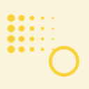
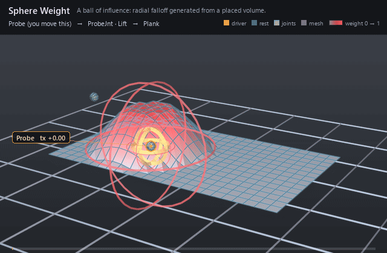

#  Sphere Weight

*A ball of influence: radial falloff generated from a placed volume.*

| | |
|---|---|
| **Node type** | `RigExecSphereWeight` |
| **Example** | [sphere_weight.usda](../examples/sphere_weight.usda) |

On this page:

- [Overview](#overview)
- [How it works](#how-it-works)
- [Wiring](#wiring)
- [Parameters](#parameters)
- [Example](#example)
- [Tips](#tips)
- [See also](#see-also)

## Overview



The weight nobody paints. A sphere weight is a placed volume that
*generates* a scalar field instead of storing one: every point of the
target gets the weight its distance from the volume's origin earns,
ramped between `inputs:falloffMin` (fully on) and `inputs:falloffMax`
(fully off). Because it is a `RigExecXformable`, it is one selectable,
framable prim positioned by the same avars as a control or joint — so a
sphere authored inside a joint rides that joint with nothing wired, and
the region a mover grabs can be animated by moving the ball. Per-axis
`inputs:scaleX/Y/Z` turn the iso-surfaces into ellipsoids.

Radial falloff about the volume's placed origin:
d = |(px/sx, py/sy, pz/sz)| in rigid volume-local space, so
inputs:falloffMin/falloffMax are the inner and outer radii and
inputs:scaleX/Y/Z make the iso-surfaces ellipsoidal (spec section
4.1, volumetric extension).

## How it works

The prim publishes a weight packet that the bound mover consumes as
its envelope during the geometry (point-chain) phase. Each evaluation it
takes its own posed frame from `computePointFrame`, strips scale and
shear so the field matches the rigid guide that is drawn, divides local
coordinates by `inputs:scaleX/Y/Z`, and measures
`d = |(px/sx, py/sy, pz/sz)|` for every element of
`rigExec:weightTarget` — or of `rigExec:sampleSource`, when authored,
which changes *what is measured* without changing what is weighted.
`d` is normalized across the falloff band, exchanged end-for-end by
`inputs:invert`, remapped through the falloff lookup table, multiplied by
`inputs:strength`, and bounded by `rigExec:rangePolicy` (`clamp` by
default, so scrubbing strength saturates instead of invalidating the
rig). `rigExec:samplePhase` chooses the points measured: `reference`
(the default) uses the STATIC authored base points, so a point keeps
the weight its bind pose earned and a mover's own output cannot feed
back into its own weights; `current` re-measures the points as they
stand at that position in the mover stack. The band, invert and strength
are live per-frame inputs; `rigExec:falloffProfile` and `rigExec:falloffCurve` are
structural and are baked to one lookup table per binding epoch.

## Wiring

| Relationship | Points to | Required |
|---|---|---|
| `rigExec:weightTarget` | Exact points property this generated field covers; must be the same target the bound mover moves. | yes |
| `rigExec:sampleSource` | Static points to measure against instead of the target — typically an unposed reference copy. The weighted domain stays the target. | no |
| (placement) | No wiring: the volume is posed by its own `rest:space` and avars, or follows its namespace-parent xformable when unwired. | - |
| (bound by) | A mover's `rigExec:weightObject` applies this field. | - |

## Parameters

### Volume weight

#### `purpose`

*Type:* `uniform token`. *Default:* `"guide"`.

Render purpose, overriding UsdGeomImageable's `default`
fallback for the same reason RigExecJoint does: an influence
volume is a DIAGNOSTIC, drawn when a viewer asks for guides, and
the stock attribute keeps the drawing and the bounds from
disagreeing.

#### `rigExec:weightTarget`

*Relationship.*

Canonical prim or exact property carrying the weighted domain.

#### `rigExec:representation`

*Type:* `uniform token`. *Default:* `"dense"`.

Valid values: `dense`.

A generated field has a value at every element, so dense
is the only representation it can honestly publish. Declared
anyway, and rejected rather than coerced when authored otherwise,
because the packet contract carries it and a combine has to match
representations across its inputs.

#### `rigExec:rangePolicy`

*Type:* `uniform token`. *Default:* `"clamp"`.

Valid values: `strict`, `clamp`.

Defaults to clamp rather than the strict used by the
authored weight objects: inputs:strength and inputs:invert are
animatable, and an artist scrubbing strength past one should see
the field saturate, not invalidate the rig mid-drag.

#### `inputs:falloffMin`

*Type:* `float`. *Default:* `0`.

Distance at which the field is fully ON. In the volume's
local units after inputs:scaleX/Y/Z, so for a sphere it is simply
the inner radius.

#### `inputs:falloffMax`

*Type:* `float`. *Default:* `1`.

Distance at which the field is fully OFF; the outer
radius for a sphere.

falloffMax < falloffMin is legal and flips the ramp -- the signed
denominator does it with no special case. falloffMax exactly
equal to falloffMin is the one degenerate case, and means a hard
step at that distance.

#### `inputs:invert`

*Type:* `float`. *Default:* `0`.

Exchanges the two ends of the band. A float rather than a
bool so it can be animated or driven like any other avar: it
LERPS between the two ramps, so an animated invert sweeps through
a flat field at 0.5 instead of popping.

#### `inputs:strength`

*Type:* `float`. *Default:* `1`.

Final multiplier on the remapped weight. Deliberately not
clamped by the kernel -- rigExec:rangePolicy is the authority on
out-of-range weights, and silently clamping here would hide a
strict-policy violation.

#### `rigExec:falloffProfile`

*Type:* `uniform token`. *Default:* `"smooth"`.

Valid values: `linear`, `smooth`, `easeIn`, `easeOut`, `constant`, `curve`.

Named analytic remap of the normalized band parameter, or
`curve` to use the spline authored on rigExec:falloffCurve. Every
profile pins f(0) = 0 and f(1) = 1, so switching profiles never
moves the band's endpoints -- only its shape between them.

The presets are baked to the same lookup table the curve is
resampled into, so there is exactly one remap path in the hot
loop whether the author picked a preset or drew a curve.

#### `rigExec:falloffCurve`

*Type:* `float`. *Default:* `0`.

Falloff shape as an authored Ts spline over x in [0, 1],
read when rigExec:falloffProfile is `curve`. x is the ramp
parameter -- 1 at falloffMin, 0 at falloffMax -- and the value is
the weight.

This is a STRUCTURAL read, resampled to a lookup table once per
binding epoch, NOT a per-frame exec input: an exec computation
resolves an attribute at one time, and a curve needs the whole
function. The animatable knobs are falloffMin/Max, invert, and
strength; the curve is a rig-authoring parameter, which is also
what keeps the field epoch-shape-stable (spec section 4.1).

Held extrapolation outside [0, 1] is the Ts default and is
exactly right here, so a curve authored over a shorter span still
yields a total field.

#### `rigExec:samplePhase`

*Type:* `uniform token`. *Default:* `"reference"`.

Valid values: `reference`, `current`.

Which points the distance function measures against.

`reference` samples the STATIC authored base points, so the field
is computed once per epoch and a point keeps the weight its bind
pose earned -- the behaviour of a painted map, and what a matrix
mover wants so that its own output cannot feed back into its own
weights.

`current` samples the points AS THEY STAND at this operation's
position in the mover stack, so the volume grabs whatever is
inside it right now. That is the dynamic behaviour, and it is
order dependent by construction: the same volume placed at two
points in the stack legitimately yields two different fields.

#### `rigExec:sampleSource`

*Relationship.*

Optional explicit static points source to measure
against, overriding rigExec:weightTarget for SAMPLING only. The
weighted domain stays the weightTarget, so this is how a volume
weights one mesh by another mesh's shape -- typically an
unposed reference copy. Ignored when samplePhase is `current`.

#### `guide:drawMode`

*Type:* `uniform token`. *Default:* `"wire"`.

Valid values: `wire`, `geometry`, `none`.

wire draws the falloffMin and falloffMax iso-surfaces as
curves, widthed by guide:wireWidth; geometry draws them solid;
none suppresses the guide without disturbing the field.

#### `guide:wireWidth`

*Type:* `double`. *Default:* `0.05`.

Width authored onto the wire curves; see RigExecControl.

#### `guide:displayColor`

*Type:* `color3f`. *Default:* `(1.0, 0.2, 0.2)`.

Red by convention, matching the influence overlay the
results scene index paints onto the weighted geometry so the
volume and the region it grabs read as one object.

#### `guide:displayOpacity`

*Type:* `float`. *Default:* `0.35`.

### Transform provider

#### `rest:tx`

*Type:* `double`. *Default:* `0`.

#### `rest:ty`

*Type:* `double`. *Default:* `0`.

#### `rest:tz`

*Type:* `double`. *Default:* `0`.

#### `rest:rx`

*Type:* `double`. *Default:* `0`.

#### `rest:ry`

*Type:* `double`. *Default:* `0`.

#### `rest:rz`

*Type:* `double`. *Default:* `0`.

#### `rest:space`

*Type:* `matrix4d`. *Default:* `( (1, 0, 0, 0), (0, 1, 0, 0), (0, 0, 1, 0), (0, 0, 0, 1) )`.

Bind transform relative to the namespace frame provider's rest frame; always orthonormalized. A provider with no RigExec ancestor resolves against identity, so its rest:space is its local-to-world bind transform.

#### `default:tx`

*Type:* `double`. *Default:* `0`.

#### `default:ty`

*Type:* `double`. *Default:* `0`.

#### `default:tz`

*Type:* `double`. *Default:* `0`.

#### `default:rx`

*Type:* `double`. *Default:* `0`.

#### `default:ry`

*Type:* `double`. *Default:* `0`.

#### `default:rz`

*Type:* `double`. *Default:* `0`.

#### `default:space`

*Type:* `matrix4d`. *Default:* `( (1, 0, 0, 0), (0, 1, 0, 0), (0, 0, 1, 0), (0, 0, 0, 1) )`.

Local-to-world zero position for posing. Its computed fallback
is compose(default translation/XYZ rotation) * rest * inverse(parent
rest) * parent:defaultSpace. The rest is unaffected by default edits.
A connection is authoritative, including identity. Otherwise a
non-identity authored matrix overrides the computed fallback; an
identity value selects that fallback.

#### `posed:space`

*Type:* `matrix4d`. *Default:* `( (1, 0, 0, 0), (0, 1, 0, 0), (0, 0, 1, 0), (0, 0, 0, 1) )`.

Final local-to-world transform. For a joint this is
supplied by the compiler's private solver binding (view-free
extraction); it may also be authored or
connected directly. Unwired xformables follow the parent chain
with rest offsets and avars.

#### `posed:defaultSpace`

*Type:* `matrix4d`. *Default:* `( (1, 0, 0, 0), (0, 1, 0, 0), (0, 0, 1, 0), (0, 0, 0, 1) )`.

Controller-adjusted zero pose; falls back to avars:defaultSpace.
Used by the local-avars pose path before parent motion. A connection
overrides the fallback, as does a non-identity authored matrix.

#### `avars:tx`

*Type:* `double`. *Default:* `0`.

#### `avars:ty`

*Type:* `double`. *Default:* `0`.

#### `avars:tz`

*Type:* `double`. *Default:* `0`.

#### `avars:rx`

*Type:* `double`. *Default:* `0`.

#### `avars:ry`

*Type:* `double`. *Default:* `0`.

#### `avars:rz`

*Type:* `double`. *Default:* `0`.

#### `avars:rspin`

*Type:* `double`. *Default:* `0`.

#### `avars:rotationOrder`

*Type:* `token`. *Default:* `"XYZ"`.

Valid values: `XYZ`, `XZY`, `YXZ`, `YZX`, `ZXY`, `ZYX`.

#### `avars:defaultSpace`

*Type:* `matrix4d`. *Default:* `( (1, 0, 0, 0), (0, 1, 0, 0), (0, 0, 1, 0), (0, 0, 0, 1) )`.

Zero pose supplied to avar evaluation; falls back to the
computed default:space. A connection or non-identity authored matrix
selects another zero pose.

#### `avars:unitScaleFactor`

*Type:* `double`. *Default:* `1`.

Multiplier converting translation avars into local distance units before the selected default and parent transforms. Rotations and scales are unaffected.

#### `parent:space`

*Type:* `matrix4d`. *Default:* `( (1, 0, 0, 0), (0, 1, 0, 0), (0, 0, 1, 0), (0, 0, 0, 1) )`.

Selected parent's posed local-to-world space. Falls back to
the nearest namespace provider's computePointFrame; identity when
there is none. Connections (including identity) or a non-identity
authored matrix select a different parent space.

#### `parent:defaultSpace`

*Type:* `matrix4d`. *Default:* `( (1, 0, 0, 0), (0, 1, 0, 0), (0, 0, 1, 0), (0, 0, 0, 1) )`.

Selected parent's default local-to-world space. Falls back
to the nearest namespace provider's computeDefaultFrame. Connections
(including identity) or a non-identity authored matrix override it.
The avar pose is avars * posed:defaultSpace * inverse(parent:defaultSpace)
* parent:space, in row-vector convention.

### Node parameters

#### `inputs:scaleX`

*Type:* `float`. *Default:* `1`.

Per-axis divisor applied to the local coordinate before
the radial distance, so the iso-surfaces are ellipsoids. Three
separate floats rather than a vec3, per the Ir alignment. A
non-positive or non-finite value on any axis is rejected and the
packet is invalid, rather than silently collapsing the volume.

#### `inputs:scaleY`

*Type:* `float`. *Default:* `1`.

#### `inputs:scaleZ`

*Type:* `float`. *Default:* `1`.

## Example

A 24 x 14 quad plank is lifted by one matrix mover whose joint holds a
static one-unit rise — no animation on the deformation at all. The only
spline in the file slides the Probe control along the plank, and the
sphere authored inside the probe joint rides it, so the region the mover
grabs travels and a bump walks back and forth. The plank is wider than
the ball and the travel stops short of both ends, so the field never
runs off an edge: it stays a complete red disc ringed by grey. The two
concentric red wire rings are the band's own iso-surfaces — the inner
one is `inputs:falloffMin` 0.6, where the field is fully on and the
plank is lifted the whole unit, and the outer one is
`inputs:falloffMax` 1.6, where it is fully off; `linear` between them
so the ramp reads as an even slope rather than a plateau with an
edge.

Open it live with:

```bat
bin\launch_usdview.bat docs\examples\sphere_weight.usda
```

Re-render the GIF above with:

```bat
python docs/render_media.py --page sphere_weight
```

## Tips

- Author the volume *inside* the joint or control it should follow: an unwired xformable takes its namespace parent's posed space, so a ball of influence needs no constraint and no wiring.
- Size the ball with `inputs:falloffMin`/`inputs:falloffMax` and `inputs:scaleX/Y/Z`, never with a scale in the transform — the placement has its scale and shear removed before the field is built, so a scale inherited from the volume's parent changes neither the field nor the drawn guide and simply does nothing. A non-positive or non-finite axis scale invalidates the packet outright.
- `falloffMax` *below* `falloffMin` flips the ramp with no special case — that is the hole-instead-of-ball idiom. The two exactly equal is the one degenerate case and means a hard step at that radius.

## See also

- [Static Weight](static_weight.md)
- [Dynamic Weight](dynamic_weight.md)
- [Matrix Mover](matrix_mover.md)

---

[UsdRig](../index.md)
