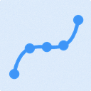
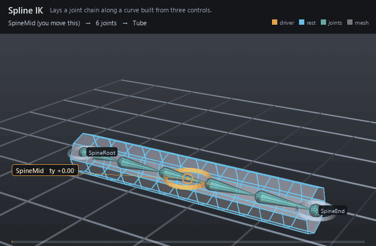

#  Spline IK

*Lays a joint chain along a curve built from three controls.*

| | |
|---|---|
| **Node type** | `RigExecSplineIk` |
| **Example** | [spline_ik.usda](../examples/spline_ik.usda) |

On this page:

- [Overview](#overview)
- [How it works](#how-it-works)
- [Wiring](#wiring)
- [Parameters](#parameters)
- [Example](#example)
- [Tips](#tips)
- [See also](#see-also)

## Overview



The spine and neck solver: three controls shape an open degree-2
four-CV B-spline, and the ordered `rigExec:joints` chain is laid along it
by arc length. The curve is built from the posed control frames rather
than read from the stage, so unlike a Ribbon it needs no native driver
curve and a control-driven pose reaches it directly. Each joint aims +X
at its successor, a twist linear in arc position is added, and
`rigExec:volumeWeights` thins the off-axis handles as the curve
stretches.

Control-driven spline IK for a spine or neck: the counterpart of
The spline IK solver as the biped uses it. Three control
frames (root, mid, end) shape an open degree-2 four-CV B-spline; the
ordered rigExec:joints chain is laid along it by arc length, each joint
aims +X at its successor with its rest up carried by the minimal
rotation, a twist linear in arc position is added (root roll, end
twist), and a linear volume-preservation scale thins (stretch) or
thickens (squash) each joint's Y/Z handles. Publishes
computePointFrameArray with one element per rigExec:joints entry.

Unlike RigExecRibbon, whose driver curve is native scene data and is
therefore invisible to control-driven movers, this solver builds the
curve itself from the posed control frames and lives entirely in the
pose phase.

Rest: the rest CVs are the rest origins of joints [0], [1], [N-2],
[N-1]; cv0/cv1 are carried by the root control's rest->pose map,
cv2/cv3 by the end control's, and cv1/cv2 additionally receive the mid
control's translation offset relative to its follow point (its rest
origin carried by root and end, blended by inputs:midFollowWeight).
The curve interpolates only cv0 and cv3, so interior joints carry a
small rest residual that a maintained offset downstream absorbs.

## How it works

Everything happens in the pose phase. Each evaluation reads the posed
and rest frames of the three controls and the rest frames of every joint
on `rigExec:joints`, rebuilds the rest curve from the rest origins of
joints [0], [1], [N-2], [N-1], then carries cv0/cv1 by the root control's
rest→pose map and cv2/cv3 by the end control's, adding the mid control's
translation offset from its follow point to cv1 and cv2. Joint *i* is
placed at arc distance `ratio * (rest spacing before i)` with `ratio =
posed arc length / rest arc length` (`rigExec:restLength` picks whether
that reference length is the rest curve or the rest chain), gets
`roll + twist * t_i` about its aim axis, and carries scale `s_y = s_z =
1 - w_i * preserveVolume * (ratio - 1)` on its Y/Z handles. The result is
published as `computePointFrameArray`, one frame per `rigExec:joints`
entry, which the bound joints extract view-free.

## Wiring

| Relationship | Points to | Required |
|---|---|---|
| `rigExec:rootControl` | Provider carrying cv0 and cv1 and the root roll. | yes |
| `rigExec:midControl` | Provider whose translation offset bends cv1 and cv2. | yes |
| `rigExec:endControl` | Provider carrying cv2 and cv3 and the end twist. | yes |
| `rigExec:joints` | Ordered chain, root to tip: the solve's cardinality and its rest CVs. Naming a joint another step also writes stacks the two, and the last writer in that stack supplies the joint's base frame. The rest CVs and rest spacing come from the frames the joints carry ON ENTRY, so a step below this one that moves a joint changes the rest curve it solves against. | yes |

## Parameters

### Node parameters

#### `purpose`

*Type:* `uniform token`. *Default:* `"guide"`.

Render purpose, overriding UsdGeomImageable's `default`
fallback: joint and solver guides are DIAGNOSTICS, drawn when a
viewer asks for guides.

This is the stock attribute rather than a RigExec-specific token so
that the bounds and the drawing cannot disagree: UsdGeomBBoxCache
classifies a prim's extent by this exact attribute, and the results
scene index stamps the same resolved value onto the guide it
synthesizes. A control keeps the inherited `default` -- it is the
rig's interaction surface, not a diagnostic -- and authoring
`guide` on one moves both its drawing and its bounds together.

#### `rigExec:rootControl`

*Relationship.*

Control carrying the curve start (cv0, cv1) and the root roll.

#### `rigExec:midControl`

*Relationship.*

Control whose translation offset from its follow point bends
the interior (cv1, cv2). Its rotation and scale are ignored.

#### `rigExec:endControl`

*Relationship.*

Control carrying the curve end (cv2, cv3) and the end twist.

#### `rigExec:joints`

*Relationship.*

Ordered chain, root to tip, posed by this solve (view-free
extraction). The chain IS the solver's cardinality: it produces
exactly one frame per entry, and the rest CVs and segment spacing
are measured from these joints' rest frames on every evaluation.

#### `rigExec:jointElements`

*Type:* `uniform int[]`. *Default:* `[]`.

Optional chain slot per rigExec:joints entry (parallel
array). When absent/empty, slot = list position. When present it
must be a permutation of [0, N): every slot filled exactly once.

#### `rigExec:volumeWeights`

*Type:* `uniform float[]`. *Default:* `[]`.

Per-joint squash/stretch weight w_i, parallel to
rigExec:joints (in chain-slot order). Empty means zero everywhere
(no thinning). Reference: spine [0.1429, 0.2857, 0.4286, 0.5,
0.3571, 0.2143, 0.0714], neck [0.16, 0.32, 0.4, 0.24, 0.08].

#### `rigExec:restLength`

*Type:* `uniform token`. *Default:* `"curve"`.

Valid values: `curve`, `chain`.

What the stretch ratio is measured against. `curve`: the
rest curve's arc length, so ratio == 1 at rest (read
curveInfo.arcLength; the last joint then overshoots the curve end
by the chain/curve difference, absorbed by maintained offsets).
`chain`: the sum of rest segment lengths, so the chain spans the
curve exactly.

#### `inputs:preserveVolume`

*Type:* `double`. *Default:* `1`.

Strength of the linear volume preservation in [0, 1]:
s_y = s_z = 1 - w_i * preserveVolume * (ratio - 1), s_x = 1.
Zero leaves every handle at rest length; ratio < 1 thickens.

#### `inputs:midFollowWeight`

*Type:* `double`. *Default:* `0.5`.

Blend of the mid control's follow point between its rest
origin carried by the root control (0) and by the end control (1):
a parentConstraint with maintainOffset on both parents.

#### `inputs:roll`

*Type:* `double`. *Default:* `0`.

Additional roll in DEGREES about every joint's +X aim,
added to the root control's own twist about the rest chain axis
(the handle's roll).

#### `inputs:twist`

*Type:* `double`. *Default:* `0`.

Additional twist in DEGREES, linear in arc position from 0
at the root to the full value at the curve end, added to the end
control's twist minus the root's (the handle's twist).

#### `rigExec:rootTangent`

*Type:* `uniform token`. *Default:* `"rigid"`.

Valid values: `rigid`, `aim`.

How cv1, the root's tangent CV, is posed. `rigid`: carried
by the root control like cv0 (a spine, clusters 0-1 under
hip_swivel_grp). `aim`: turned about cv0 by the minimal rotation
from the root control's posed chain axis onto the chord to the end
CV after the length floor, so the curve leaves the root pointing at
the end -- a neck, whose cluster[1] sits under a joint at the
neck control aimed at the head. Adds no twist; the mid control's offset
is applied on top.

#### `inputs:minLengthRatio`

*Type:* `double`. *Default:* `0`.

Length floor as a fraction of the rest root->end chord; 0
switches it off. Below it the end CVs (cv2, cv3) are held that far
ahead of cv0 along the root control's posed chain axis, so a chest
or head driven down onto its root neither shrinks the chain past
the floor nor folds it back through the root -- the end joint then
overshoots its control. The mid control's follow point, the twist
and the volume ratio read the control frames and are unaffected.
The classical spline IK has no floor; this is a deliberate departure, and
animatable per shot like every input.

#### `guide:radius`

*Type:* `double`. *Default:* `1.0`.

Radius of the sphere and cone drawn at each aggregate
element: the exact counterpart of RigExecJoint's guide:radius,
including the rule that zero or negative draws no guides at all,
which is how a solver's diagnostics are turned off.

Without it the elements are stuck at Hydra's fallback radius of
1.0. That is proportionate on an asset authored at tens of units
and several times the size of the whole character on one authored
at one unit -- the joints were given this knob for exactly that
reason and the aggregate solvers were not, so turning guide
display on for a small asset buried it in solver geometry.

#### `guide:displayColor`

*Type:* `color3f`. *Default:* `(0.3, 0.6, 1.0)`.

#### `guide:displayOpacity`

*Type:* `float`. *Default:* `0.5`.

## Example

A six-joint chain rests straight along a 6-unit tube with controls at
its root, middle and tip. The mid control lifts 2.4 units and comes back:
the curve arches, the chain stretches from 1.2 to 1.6 units per segment
to keep pace with the longer arc, and the volume weights pinch the tube
by about 26 percent at the crown against the straight rest cage beneath
it. Nothing but that one control is keyed.

Open it live with:

```bat
bin\launch_usdview.bat docs\examples\spline_ik.usda
```

Re-render the GIF above with:

```bat
python docs/render_media.py --page spline_ik
```

## Tips

- The mid control contributes translation only — its rotation and scale are ignored. It offsets from a follow point that `inputs:midFollowWeight` blends between its rest origin carried by the root control (0) and by the end control (1), so an unkeyed mid still rides between the two ends.
- `rigExec:restLength` = `curve` makes the stretch ratio exactly 1 at rest; `chain` makes the chain span the curve exactly. The two only differ when the rest chain is not itself the rest curve — a straight rest chain (like the docs example) gives identical results, a curved rest spine does not.
- `inputs:minLengthRatio` floors the chain: below that fraction of the rest root→end chord the end CVs are held that far ahead of cv0 along the root's posed chain axis, so an end control driven down onto its root cannot fold the curve back through it. The biped spine and neck both run at 0.5; the default 0 switches it off.

## See also

- [Ribbon](ribbon.md)
- [Two-Bone IK](two_bone_ik.md)
- [Twist Distribution](twist_distribution.md)

---

[RigExec nodes](../index.md)
