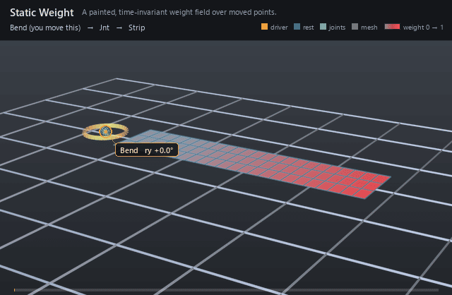

#  Static Weight

*A painted, time-invariant weight field over moved points.*

| | |
|---|---|
| **Node type** | `RigExecStaticWeight` |
| **Example** | [static_weight.usda](../examples/static_weight.usda) |

On this page:

- [Overview](#overview)
- [How it works](#how-it-works)
- [Wiring](#wiring)
- [Parameters](#parameters)
- [Example](#example)
- [Tips](#tips)
- [See also](#see-also)

## Overview



The paint layer of rigging: one scalar per moved point, authored once
and held for the shot. Constant representation broadcasts a single value
to a whole target; dense lists every element; sparse lists painted
indices over a default. Bound through a mover's `rigExec:weightObject`,
it scales that mover's effect per point.

Time-invariant constant, dense, or sparse authored weight field;
every target element resolves to an explicit value or the authored
sparse default (spec section 4.1).

## How it works

The field resolves inside the mover walk, in the pass that assembles
the revision consuming it: every target element gets an explicit value
(or the sparse default), and that array is published as the mover's
envelope in place of `inputs:defaultWeight` for that application. The
fields are time-invariant by contract — time samples or connections on
`rigExec:values`, `rigExec:indices`, `rigExec:defaultWeight`,
`rigExec:representation`, or `rigExec:rangePolicy` fail the pose — and
`strict` rejects a value outside [0, 1] where `clamp` bounds it.

## Wiring

| Relationship | Points to | Required |
|---|---|---|
| `rigExec:weightTarget` | Exact points property this field covers; must match the target of the mover that binds it. | yes |
| (bound by) | A mover's `rigExec:weightObject` applies this field. | - |

## Parameters

### Weight field

#### `rigExec:weightTarget`

*Relationship.*

Canonical prim or exact property carrying the weighted
domain. For a constant envelope over an atomic multi-target mover,
this is the mover prim itself.

#### `rigExec:representation`

*Type:* `uniform token`. *Default:* `"constant"`.

Valid values: `constant`, `dense`, `sparse`.

#### `rigExec:rangePolicy`

*Type:* `uniform token`. *Default:* `"strict"`.

Valid values: `strict`, `clamp`.

### Node parameters

#### `rigExec:values`

*Type:* `uniform float[]`. *Default:* `[]`.

#### `rigExec:indices`

*Type:* `uniform int[]`. *Default:* `[]`.

#### `rigExec:defaultWeight`

*Type:* `uniform float`. *Default:* `0`.

## Example

One joint rotates 0 → 50 → 0 degrees while a dense field over a
16 × 4 strip holds the four root columns at 0 and ramps to 1 at the tip,
so the bend grows along the strip and the root never leaves the ground —
paint, not animation, shaping the deformation. The docs renderer tints
the strip by the field the mover actually consumed, grey at weight 0 and
red at weight 1, so the fixed ramp is visible while the pose swings
through it.

Open it live with:

```bat
bin\launch_usdview.bat docs\examples\static_weight.usda
```

Re-render the GIF above with:

```bat
python docs/render_media.py --page static_weight
```

## Tips

- Dense suits small ordered targets; sparse suits hero meshes where most verts sit at the default.
- A dense field must author exactly one value per target element and leave `rigExec:defaultWeight` at 0 — the canonical encoding — or the pose fails rather than padding.
- A constant field of 1.0 is the rigid-attachment idiom: full follow, no paint.

## See also

- [Dynamic Weight](dynamic_weight.md)
- [Matrix Mover](matrix_mover.md)
- [Blendshape Mover](blendshape_mover.md)

---

[RigExec nodes](../index.md)
