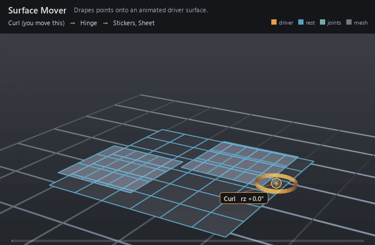

#  Surface Mover

*Drapes points onto an animated driver surface.*

| | |
|---|---|
| **Node type** | `RigExecSurfaceMover` |
| **Example** | [surface_mover.usda](../examples/surface_mover.usda) |

On this page:

- [Overview](#overview)
- [How it works](#how-it-works)
- [Wiring](#wiring)
- [Parameters](#parameters)
- [Example](#example)
- [Tips](#tips)
- [See also](#see-also)

## Overview



Conforms sticker patches to a moving mesh: every moved point is pulled
onto the closest point of the driver's triangulated surface, and the
common envelope blends that contact back over the incoming points. Use it
for decals, clothing patches, and anything that must finish flush against
deforming skin. In v0.1 `rigExec:mode` selects no numeric difference —
`attach` and `project` both project at full strength — so the mover is a
contact pass, not a slide-along-the-surface follow.

Reads standard mesh properties for attachment/projection/
sliding and surface-driven correction and writes an exact native
UsdGeomPointBased points property (spec sections 4.1, 7.5).

## How it works

The mover is one revision in its target's point chain, so it runs in
the mover-application walk after solving and after every earlier revision
on that chain. It reads the driver prim's `points` at
`rigExec:surfaceReadPhase` plus its `faceVertexCounts` /
`faceVertexIndices`, fans every face into a triangle fan, and takes the
closest point over all of them per moved point; the envelope then blends
that candidate over the incoming revision, and the compiler re-synthesizes
authored `normals` and `extent` afterwards. The search carries no
frame-to-frame state, so a point roughly a facet away from the driver
tracks it smoothly while a point far away can flip between near-tied
facets and pop.

## Wiring

| Relationship | Points to | Required |
|---|---|---|
| `rigExec:surface` | Native mesh prim supplying the driver surface; without it the mover is inert, not an error. | yes |
| `rigExec:moves` | Exact points property to drape. | yes |
| `rigExec:surfaceReadPhase` | `base` for the driver's authored points, `final` when the driver is itself rigged. | no |

## Parameters

### Common mover envelope

#### `rigExec:moves`

*Relationship.*

Reserved write-set relationship: exact prim/property targets.

#### `inputs:enabled`

*Type:* `bool`. *Default:* `true`.

Shape-preserving enable. Disabled movers pass their preceding
revision through unchanged (value-only edit).

#### `inputs:defaultWeight`

*Type:* `float`. *Default:* `1`.

Normalized common mover envelope in [0, 1]. With no bound
rigExec:weightObject it broadcasts over every logical element: zero
passes the incoming value through bit-for-bit and one applies the
mover's full-strength result.

#### `rigExec:weightObject`

*Relationship.*

Optional compatible total weight field, at most one target.
When bound, the weight object's values (including its own sparse or
constant fallback) supply the common envelope instead of
inputs:defaultWeight. Target, domain, and cardinality must match each
mover application; an incompatible binding is a compile error. A
multi-target mover may bind only a constant operation envelope whose
weightTarget is the mover prim itself; that one value broadcasts to
every application of the atomic mover.

### Node parameters

#### `rigExec:surface`

*Relationship.*

Native mesh prim supplying the driver surface.

#### `rigExec:mode`

*Type:* `uniform token`. *Default:* `"attach"`.

Valid values: `attach`, `project`.

#### `rigExec:surfaceReadPhase`

*Type:* `uniform token`. *Default:* `"base"`.

Valid values: `base`, `preceding`, `final`.

## Example

A 6x6 quad sheet hinges up about its camera-right edge and back under
one `avars:rz` control, and two sticker patches sharing one mesh ride it,
floating 1.4 above the sheet at rest. `FollowSheet` carries the patches
roughly along with the same joint through a per-point weight, and
`DrapeStickers` then projects them onto the sheet read at `final`, which
is why the drape stays smooth: every sticker point starts within a facet
of the surface. The 0.75 envelope stops each patch a steady distance
above the sheet rather than landing it coplanar, which is what keeps it
out of a z-fight with the surface it landed on — and what you see moving
is that standoff staying parallel to the sheet as the sheet bends away
underneath it. `FollowSheet` is nested inside `DrapeStickers` and
`BendSheet` is authored last, because movers run in reverse composed
namespace order with descendants ahead of their parent.

Open it live with:

```bat
bin\launch_usdview.bat docs\examples\surface_mover.usda
```

Re-render the GIF above with:

```bat
python docs/render_media.py --page surface_mover
```

## Tips

- Keep the moved points close to the driver — roughly a facet or less. The closest-point search runs per point per frame with no continuity, so distant points sit on near-ties between facets and jump when the winner changes; a rough matrix-mover follow ahead of the drape is the fix.
- Read the driver at `final` when the driver mesh is itself moved by the rig, and at `base` when it carries authored point animation; `base` on a rigged driver drapes onto the undeformed surface.
- `rigExec:mode` is inert in v0.1: the kernel pins the operation to full-strength projection for both tokens, so `attach` does not yet transport points along the surface. Shape the result with the common envelope instead — below 1 it leaves a standoff and stops the patch z-fighting with the surface it landed on.

## See also

- [Matrix Mover](matrix_mover.md)
- [Lattice Mover](lattice_mover.md)
- [Static Weight](static_weight.md)

---

[RigExec nodes](../index.md)
