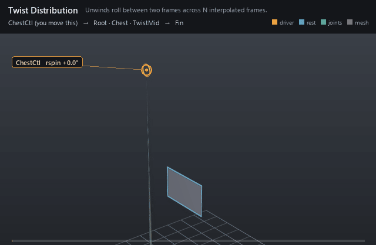

#  Twist Distribution

*Unwinds roll between two frames across N interpolated frames.*

| | |
|---|---|
| **Node type** | `RigExecTwistDistribution` |
| **Example** | [twist_distribution.usda](../examples/twist_distribution.usda) |

On this page:

- [Overview](#overview)
- [How it works](#how-it-works)
- [Wiring](#wiring)
- [Parameters](#parameters)
- [Example](#example)
- [Tips](#tips)
- [See also](#see-also)

## Overview



Takes the twist between a start and an end provider and spreads it
over a graduated run of frames — the standard forearm/spine setup where
the middle of a limb should turn half as far as the end. Output joints
can index any single frame of the run without listing all of them.

Distributes unwrapped twist over N frames between start and end
providers. Publishes computePointFrameArray.

## How it works

The solver unwraps the endpoint twist, distributes it with minimum
energy over `rigExec:count` frames weighted by `rigExec:weights`, and
optionally adds `inputs:twistTurns` of extra aim-axis winding (integers
preserve the endpoints; fractions animate). Each claimed joint rides the
frame picked by its `rigExec:jointElements` entry.

## Wiring

| Relationship | Points to | Required |
|---|---|---|
| `rigExec:start` | Provider holding the zero-twist end. | yes |
| `rigExec:end` | Provider holding the full-twist end. | yes |
| `rigExec:joints` | Joints posed by picked distributed frames. | no |

## Parameters

### Node parameters

#### `purpose`

*Type:* `uniform token`. *Default:* `"guide"`.

Render purpose, overriding UsdGeomImageable's `default`
fallback: joint and solver guides are DIAGNOSTICS, drawn when a
viewer asks for guides.

This is the stock attribute rather than a RigExec-specific token so
that the bounds and the drawing cannot disagree: UsdGeomBBoxCache
classifies a prim's extent by this exact attribute, and the results
scene index stamps the same resolved value onto the guide it
synthesizes. A control keeps the inherited `default` -- it is the
rig's interaction surface, not a diagnostic -- and authoring
`guide` on one moves both its drawing and its bounds together.

#### `rigExec:start`

*Relationship.*

#### `rigExec:end`

*Relationship.*

#### `rigExec:count`

*Type:* `uniform int`. *Default:* `1`.

#### `rigExec:weights`

*Type:* `uniform float[]`. *Default:* `[]`.

#### `inputs:twistTurns`

*Type:* `double`. *Default:* `0`.

Signed additional aim-axis revolutions beyond the principal
endpoint twist. Integer values preserve endpoint orientations while
carrying multi-revolution winding; fractional values support animated
winding and add the corresponding rotation at the end. The additional
angle at sample k is 360 * inputs:twistTurns * weight[k] degrees.

#### `rigExec:distribution`

*Type:* `uniform token`. *Default:* `"minimumEnergy"`.

Valid values: `minimumEnergy`.

#### `rigExec:joints`

*Relationship.*

Ordered output joints posed by the distributed twist frames
(view-free extraction). The compiler authors each joint's
one aggregate element.

#### `rigExec:jointElements`

*Type:* `uniform int[]`. *Default:* `[]`.

Optional aggregate element index for each rigExec:joints
entry (parallel array). When absent/empty, element = list position.
Lets a joint bind a specific distributed frame (e.g. the middle of
an N-frame twist) without listing every element, matching the
deleted view's arbitrary-element selection.

#### `guide:radius`

*Type:* `double`. *Default:* `1.0`.

Radius of the sphere and cone drawn at each aggregate
element: the exact counterpart of RigExecJoint's guide:radius,
including the rule that zero or negative draws no guides at all,
which is how a solver's diagnostics are turned off.

Without it the elements are stuck at Hydra's fallback radius of
1.0. That is proportionate on an asset authored at tens of units
and several times the size of the whole character on one authored
at one unit -- the joints were given this knob for exactly that
reason and the aggregate solvers were not, so turning guide
display on for a small asset buried it in solver geometry.

#### `guide:displayColor`

*Type:* `color3f`. *Default:* `(0.3, 0.6, 1.0)`.

#### `guide:displayOpacity`

*Type:* `float`. *Default:* `0.5`.

## Example

The chest spins 90 degrees about the spine axis while the root stays
put. A mid-spine joint rides the middle of three distributed frames and
turns half as far, swinging the fin card it skins.

Open it live with:

```bat
bin\launch_usdview.bat docs\examples\twist_distribution.usda
```

Re-render the GIF above with:

```bat
python docs/render_media.py --page twist_distribution
```

## Tips

- Drive the end with `avars:rspin` (roll about the bone axis), not a tilt: only axial roll becomes distributed twist.
- Feed the run to a Ribbon as `twistFrames` so a spine strip inherits the same unwind.

## See also

- [Ribbon](ribbon.md)
- [Joint](joint.md)
- [FK Chain](fk_chain.md)

---

[UsdRig](../index.md)
