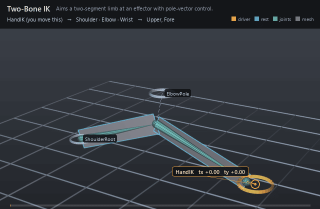

#  Two-Bone IK

*Aims a two-segment limb at an effector with pole-vector control.*

| | |
|---|---|
| **Node type** | `RigExecTwoBoneIk` |
| **Example** | [two_bone_ik.usda](../examples/two_bone_ik.usda) |

On this page:

- [Overview](#overview)
- [How it works](#how-it-works)
- [Wiring](#wiring)
- [Parameters](#parameters)
- [Example](#example)
- [Tips](#tips)
- [See also](#see-also)

## Overview



Analytic two-bone inverse kinematics for arms and legs. The root
stays planted on its control, the end joint reaches for the effector
control, and the pole control picks which way the middle joint bends.
Bone lengths are measured from the bound joints' rests on every
evaluation — there is nothing absolute to author or keep in sync.

Analytic two-bone IK with pole, stretch, softness, and preferred
bend. Publishes computePointFrameArray of [root, mid, end] frames.

## How it works

Each evaluation measures root-to-mid and mid-to-end from the
frames the joints carry on entry to this solver — their `rest:space` rests
unless a step below it in the pose stack already wrote them — plus the length
offsets, then solves the two-bone chain in the plane through the pole. `inputs:stretch` lets the chain elongate toward
out-of-reach goals under `rigExec:stretchPolicy`, and
`rigExec:unreachablePolicy` with `inputs:softness` shapes the lock-up as
the goal leaves reach.

## Wiring

| Relationship | Points to | Required |
|---|---|---|
| `rigExec:effectorControl` | Control supplying the end-goal position. | yes |
| `rigExec:poleControl` | Control defining the bend plane. | yes |
| `rigExec:rootControl` | Control planting the chain root. | yes |
| `rigExec:joints` | Three nested joints: root, mid, end — the chain this solver measures and writes. It is an ordered write, not an exclusive claim: another step may write the same joints, and the last writer in the stack supplies their base frame. The solver measures the two bones from the frames the joints carry ON ENTRY, so a step BELOW it that moves one of them re-proportions the limb rather than only re-orienting it. | yes |

## Parameters

### Node parameters

#### `purpose`

*Type:* `uniform token`. *Default:* `"guide"`.

Render purpose, overriding UsdGeomImageable's `default`
fallback: joint and solver guides are DIAGNOSTICS, drawn when a
viewer asks for guides.

This is the stock attribute rather than a RigExec-specific token so
that the bounds and the drawing cannot disagree: UsdGeomBBoxCache
classifies a prim's extent by this exact attribute, and the results
scene index stamps the same resolved value onto the guide it
synthesizes. A control keeps the inherited `default` -- it is the
rig's interaction surface, not a diagnostic -- and authoring
`guide` on one moves both its drawing and its bounds together.

#### `rigExec:rootControl`

*Relationship.*

#### `rigExec:effectorControl`

*Relationship.*

#### `rigExec:poleControl`

*Relationship.*

#### `rigExec:upperLengthOffset`

*Type:* `double`. *Default:* `0`.

Delta added to the measured upper length. The upper
bone is measured from the bound joints' rest positions (root to mid)
and this offset adjusts it -- zero leaves the measured bone
length exact. This is the only control over the upper bone's
length: the bone itself is always the measured rest distance.

#### `rigExec:lowerLengthOffset`

*Type:* `double`. *Default:* `0`.

Delta added to the measured lower length. The lower
bone is measured from the bound joints' rest positions (mid to end)
and this offset adjusts it -- zero leaves the measured bone
length exact. This is the only control over the lower bone's
length: the bone itself is always the measured rest distance.

#### `rigExec:stretchPolicy`

*Type:* `uniform token`. *Default:* `"uniformSegments"`.

Valid values: `uniformSegments`.

#### `rigExec:unreachablePolicy`

*Type:* `uniform token`. *Default:* `"clampWithSoftness"`.

Valid values: `clampWithSoftness`.

#### `rigExec:preferredBendRadians`

*Type:* `double`. *Default:* `0`.

#### `inputs:stretch`

*Type:* `float`. *Default:* `1`.

Permitted stretch beyond full reach, in [0, 1].

#### `inputs:softness`

*Type:* `float`. *Default:* `0`.

Soft-reach fraction of the chain length.

#### `rigExec:joints`

*Relationship.*

Ordered output joints [root, mid, end] posed by this solve
(view-free extraction). Position is the element index; the compiler
binds each joint to one aggregate element.

#### `guide:radius`

*Type:* `double`. *Default:* `1.0`.

Radius of the sphere and cone drawn at each aggregate
element: the exact counterpart of RigExecJoint's guide:radius,
including the rule that zero or negative draws no guides at all,
which is how a solver's diagnostics are turned off.

Without it the elements are stuck at Hydra's fallback radius of
1.0. That is proportionate on an asset authored at tens of units
and several times the size of the whole character on one authored
at one unit -- the joints were given this knob for exactly that
reason and the aggregate solvers were not, so turning guide
display on for a small asset buried it in solver geometry.

#### `guide:displayColor`

*Type:* `color3f`. *Default:* `(0.3, 0.6, 1.0)`.

#### `guide:displayOpacity`

*Type:* `float`. *Default:* `0.5`.

## Example

A two-card arm bends as its hand effector swings in and lifts. The
effector rests just inside full reach so the arm holds a slight natural
bend; the pole above the elbow keeps the bend plane facing the camera.

Open it live with:

```bat
bin\launch_usdview.bat docs\examples\two_bone_ik.usda
```

Re-render the GIF above with:

```bat
python docs/render_media.py --page two_bone_ik
```

## Tips

- Keep the pole on the side you want the joint to favor; the solver builds a right-handed bend basis, so pole-above bends keep +Z-facing cards front-facing.
- Rest the effector just inside full reach: exactly straight is a singularity where the bend plane is undefined.
- Move a joint rest and the limb re-proportions itself — IK never caches bone lengths.

## See also

- [FK Chain](fk_chain.md)
- [Blend Point Frames](blend_point_frames.md)
- [Aim Constraint](aim_constraint.md)

---

[RigExec nodes](../index.md)
