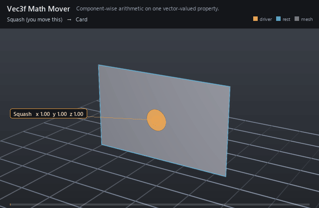

#  Vec3f Math Mover

*Component-wise arithmetic on one vector-valued property.*

| | |
|---|---|
| **Node type** | `RigExecVec3fMathMover` |
| **Example** | [vec3f_math_mover.usda](../examples/vec3f_math_mover.usda) |

On this page:

- [Overview](#overview)
- [How it works](#how-it-works)
- [Wiring](#wiring)
- [Parameters](#parameters)
- [Example](#example)
- [Tips](#tips)
- [See also](#see-also)

## Overview



Float math lifted to three components: add, multiply, clamp, remap,
or blend over an exact vector-valued attribute. The target does not have
to be typed `float3` — every GfVec3f-backed scalar role is accepted
(`float3`, `vector3f`, `point3f`, `normal3f`, `color3f`), because a mover
offsetting a vector and one offsetting a colour are doing the identical
arithmetic. Native transform ops are the natural targets: revising an
Xform's `xformOp:scale` carries its whole subtree without touching a
point. Watch the precision — UsdGeom authors a scale op as `float3` but
a translate op as `double3` by default, and a `double3` target is a
compile error, so a translate this mover drives has to be authored at
float precision.

Statically typed add, multiply, clamp, remap, or blend over an
exact float3/vector-valued property target (spec section 4.1).

Every operation is component-wise, which is why the bounds are float3
rather than float. Remap and common MoverAPI-envelope semantics match
RigExecFloatMathMover.

## How it works

Each evaluation reads the mover's authored inputs, computes
`r = op(incoming)` per component, and mixes the result back over the
incoming value through the common envelope,
`incoming + defaultWeight × (r − incoming)`, one component at a time — so
a zero envelope is an exact pass-through and one applies the operation
outright. `add` and `multiply` use `inputs:value`, `blend` replaces the
incoming value with it, and `clamp`/`remap` use the `inputs:min` and
`inputs:max` bounds, which are `float3` precisely so the three components
can be bounded differently. `remap` normalizes `[min, max]` to `[0, 1]`
without clamping (a degenerate `min == max` yields 0).

Inputs may be CONNECTED rather than authored locally: the read follows
the connection chain and resolves the source at the evaluated time, which
is what lets an animator channel published on a control drive the mover.
The whole property chain still owes exec nothing, so it resolves BEFORE
exec runs and its result is handed back as the attribute's own value; a
chain whose input is produced by another property chain is ordered after
its producer.

## Wiring

| Relationship | Points to | Required |
|---|---|---|
| `rigExec:moves` | Exactly one exact vector-valued property to revise (`float3`, `vector3f`, `point3f`, `normal3f`, `color3f`). | yes |
| `inputs:value.connect` | Optional connection supplying the operand from another `float3` attribute — a control's animated channel, say — instead of an authored constant. | no |
| `rigExec:weightObject` | Optional one-element weight field supplying the envelope instead of `inputs:defaultWeight`. | no |

## Parameters

### Common mover envelope

#### `rigExec:moves`

*Relationship.*

Reserved write-set relationship: exact prim/property targets.

#### `inputs:enabled`

*Type:* `bool`. *Default:* `true`.

Shape-preserving enable. Disabled movers pass their preceding
revision through unchanged (value-only edit).

#### `inputs:defaultWeight`

*Type:* `float`. *Default:* `1`.

Normalized common mover envelope in [0, 1]. With no bound
rigExec:weightObject it broadcasts over every logical element: zero
passes the incoming value through bit-for-bit and one applies the
mover's full-strength result.

#### `rigExec:weightObject`

*Relationship.*

Optional compatible total weight field, at most one target.
When bound, the weight object's values (including its own sparse or
constant fallback) supply the common envelope instead of
inputs:defaultWeight. Target, domain, and cardinality must match each
mover application; an incompatible binding is a compile error. A
multi-target mover may bind only a constant operation envelope whose
weightTarget is the mover prim itself; that one value broadcasts to
every application of the atomic mover.

### Node parameters

#### `rigExec:operation`

*Type:* `uniform token`. *Default:* `"add"`.

Valid values: `add`, `multiply`, `clamp`, `remap`, `blend`.

#### `inputs:value`

*Type:* `float3`. *Default:* `(0, 0, 0)`.

#### `inputs:min`

*Type:* `float3`. *Default:* `(0, 0, 0)`.

#### `inputs:max`

*Type:* `float3`. *Default:* `(1, 1, 1)`.

## Example

A Squash control sits on the card as a solid disc guide in the
card's own plane, and publishes one animator channel — a `float3`
`inputs:squash` keyed (1, 1, 1) → (1.45, 0.6, 1) → (0.72, 1.5, 1) → back.
The mover's `inputs:value` is connected to that channel and multiplies it
onto the card Xform's `xformOp:scale`, so the card squashes wide and
stretches tall around the handle while its authored scale stays
(1, 1, 1) and no point is ever touched.

Open it live with:

```bat
bin\launch_usdview.bat docs\examples\vec3f_math_mover.usda
```

Re-render the GIF above with:

```bat
python docs/render_media.py --page vec3f_math_mover
```

## Tips

- Connect `inputs:value` to a channel on a control to make the handle, not the mover, the thing an animator keys — the read follows the connection at the evaluated time.
- A vector channel carries time SAMPLES, not a spline: USD splines are scalar-valued, so `.spline` is for the avars and a `float3` channel is keyed with `.timeSamples`.
- Clamp and remap bounds are per component, so one mover can bound an asymmetric 3D range — and `remap` does not clamp, so compose a clamp mover after it when you want the result bounded.
- `multiply` at full envelope hands the operand through outright when the incoming value is (1, 1, 1); switch the operation to `add` and the same channel becomes an offset on a float-precision translate op (the default `xformOp:translate` is `double3`, which the mover rejects).

## See also

- [Float Math Mover](float_math_mover.md)
- [Matrix Math Mover](matrix_math_mover.md)
- [Control](control.md)

---

[UsdRig](../index.md)
