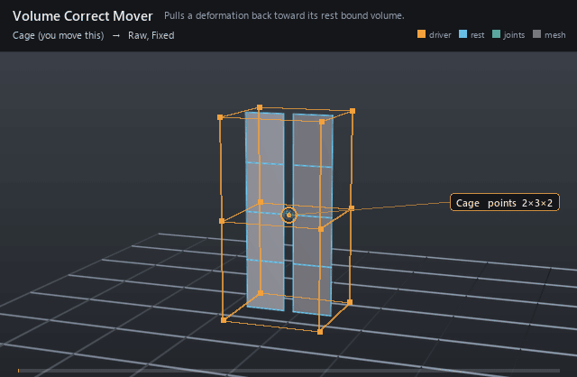

#  Volume Correct Mover

*Pulls a deformation back toward its rest bound volume.*

| | |
|---|---|
| **Node type** | `RigExecVolumeCorrectMover` |
| **Example** | [volume_correct_mover.usda](../examples/volume_correct_mover.usda) |

On this page:

- [Overview](#overview)
- [How it works](#how-it-works)
- [Wiring](#wiring)
- [Parameters](#parameters)
- [Example](#example)
- [Tips](#tips)
- [See also](#see-also)

## Overview



Volume preservation as a post-pass: after a bulge, stretch, or squash
deforms the points, this mover pulls them back toward the rest bound
volume so bellies don't gain girth they shouldn't. It reacts to whatever
ran before it in the chain — it has no driver of its own.

Moves exactly one exact native UsdGeomPointBased points
property by uniform centroid scaling toward the authored rest bound
volume (spec section 7.6 revised: the former post-mover volumeCorrect
operation as a first-class mover). The common MoverAPI envelope blends
full bound-volume restoration over the incoming points.

## How it works

The mover compares the incoming (already deformed) points against
the rest bound volume and revises them toward it, mixed through the
common envelope. Nest it outside the deformer it corrects (deepest runs
first) so the correction sees the full deformation.

## Wiring

| Relationship | Points to | Required |
|---|---|---|
| `rigExec:moves` | Exact points property to correct. | yes |

## Parameters

### Common mover envelope

#### `rigExec:moves`

*Relationship.*

Reserved write-set relationship: exact prim/property targets.

#### `inputs:enabled`

*Type:* `bool`. *Default:* `true`.

Shape-preserving enable. Disabled movers pass their preceding
revision through unchanged (value-only edit).

#### `inputs:defaultWeight`

*Type:* `float`. *Default:* `1`.

Normalized common mover envelope in [0, 1]. With no bound
rigExec:weightObject it broadcasts over every logical element: zero
passes the incoming value through bit-for-bit and one applies the
mover's full-strength result.

#### `rigExec:weightObject`

*Relationship.*

Optional compatible total weight field, at most one target.
When bound, the weight object's values (including its own sparse or
constant fallback) supply the common envelope instead of
inputs:defaultWeight. Target, domain, and cardinality must match each
mover application; an incompatible binding is a compile error. A
multi-target mover may bind only a constant operation envelope whose
weightTarget is the mover prim itself; that one value broadcasts to
every application of the atomic mover.

### Node parameters

## Example

One cage bulges two slabs side by side: the grey slab shows the raw
lattice bulge while the orange slab runs the same bulge through the
corrector, so the pair shows exactly what the correction takes away.

Open it live with:

```bat
bin\launch_usdview.bat docs\examples\volume_correct_mover.usda
```

Re-render the GIF above with:

```bat
python docs/render_media.py --page volume_correct_mover
```

## Tips

- Partial envelopes (0.3–0.6) usually look more organic than full correction.
- Order matters: the corrector must run after the deformer it tames — nest the deformer inside it.

## See also

- [Lattice Mover](lattice_mover.md)
- [Smooth Mover](smooth_mover.md)
- [Matrix Mover](matrix_mover.md)

---

[RigExec nodes](../index.md)
