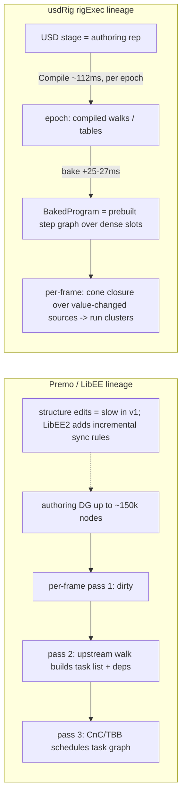

# Gap analysis: usdRig rigExec evaluation engine vs DreamWorks Premo / LibEE

Date: 2026-09-15
Status: analysis only — no code changed.

## 1. Purpose and method

Compare the current evaluation engine (`libs/rigExec`: `rigEvaluator`, `bakedProgram`,
`bakedSchedule`, `libs/rigExecMath`, imaging bridge) against the publicly documented
behavior of DreamWorks **Premo** and its dependency-graph engine **LibEE / LibEE 2**, as
assembled in the Premo research brief (Google Doc, tabs: Summary, Evaluation engine,
Interactivity (Premonition), Recreation checklist, Parallelism & exec graphs, Joint
hierarchy, Direct manipulators).

Method: the brief's **"Recreation checklist"** tab is used as the gap matrix (§4) — its
items are exactly the axes the brief itself says a clean-room recreation should be
scored against. Each item is scored **Implemented / Partial / Missing /
Divergent-by-design** with `file:line` evidence from this repository. Line numbers are
as read 2026-09-15; expect minor drift.

Honest-scoring rules applied:

- Patent claims (US9,135,739; US10,297,064) are treated as design targets, not shipping
  behavior, per the brief's own citation-hygiene note.
- The LibEE-2-class dual representation is scored **separation implemented, incremental
  sync missing** (§4, §5.4): the repo demonstrably has separate authoring and evaluation
  representations, but every structural notice rebuilds the evaluation side wholesale;
  the reference model requires incremental connect/disconnect/add/remove/set
  synchronization rules, and no authoring-op benchmark exists.

## 2. Engine orientation: which lineage we sit in

Premo/LibEE and usdRig converge on the same end-state — *a task/dependency graph executed
in parallel over pre-resolved data* — but they arrive from opposite directions:

- **LibEE** is a *runtime task-list* engine: topology is fixed during animation work;
  each edit re-runs dirty → task-list build → scheduler, with cached task lists for
  repeated animator controls. Structure editing was deliberately slow in v1 and became a
  first-class target in LibEE 2 (DigiPro 2018, ~100× authoring-ops claim, patent
  US10,297,064 dual representation).
- **usdRig rigExec** is a *bake-compiled* engine in the Presto/OpenExec
  Compile→(Schedule)→Evaluate lineage: per-frame work is almost never a graph walk. The
  dynamic mode walks compiled structures built at Compile; the baked mode runs a
  pre-built step graph. Structure changes are handled by *recompiling the epoch*, not by
  incremental sync.

Both land on the same evaluation-representation features LibEE touts — chain fusion,
lazy work selection, low scheduling overhead — but rigExec gets them nearly for free
from bake-time, pays for them with bake-on-edit cost, and therefore has the *inverse*
performance profile of LibEE v1: fast eval, expensive structural edits (full epoch
recompile ~112–137 ms, §3).

## 3. Performance baseline (measured in-repo)

From `reports/biped-rig-evaluation-speedups.md`, `reports/rigexec-perf-CHANGES.md`,
`reports/rigexec-perf2-CHANGES.md`, `reports/perf-implementation-results.md`,
`docs/baked-step-graph.md` (biped unless noted, min-of-5 in-tree):

| Measure | Original | Dynamic (compiled) | Baked |
|---|---|---|---|
| Compile | ~490 ms | 112–118 ms | 137–139 ms (bake +25–27 ms) |
| Animated frame | ~56 ms | 7.14 ms | **0.71 ms** |
| Static frame | ~30 ms | 7.14 ms | 0.63 ms |
| First frame | 20 ms | 11.3 ms | 2.3 ms |
| 9-mesh frame | 21.5 ms | 9.4 ms | 2.7 ms |
| Gizmo drag step | — | 9.3 ms | 1.4 ms |
| Merged-tree serial frame | — | — | 588 µs (drag median 551–602 µs) |

This is an **in-repo baseline, not a normalized cross-system comparison** with the
brief's headline numbers (≥15 fps full-fidelity character, 7–8× on 16 cores): the
measured asset is this repo's biped, not a complexity-equivalent DreamWorks hero
(the brief cites up to ~150k nodes), and the machines differ. What it does establish:
on this rig class frame cost is no longer the interactive-budget bottleneck — the
gaps below (edit-time recompiles, no async boundary, no Premonition/multi-frame
throughput) are.

## 4. Gap matrix vs the brief's "Recreation checklist"

### 4.1 Core evaluation

| Checklist item | Verdict | Evidence / notes |
|---|---|---|
| DG with nodes, typed attributes, connections, static dirty rules | **Partial** | Nodes/attrs/connections exist as USD prims + typed `VtValue` packets with strict schema resolution (`schemaAuthoring.h:3-7`). But there are no *static dirty rules*: every `Usd.Notice.ObjectsChanged` sets `_structureDirty` and drops the caches (`rigEvaluator.cpp:1516-1526`); dirtiness is settled by digest recompute, not by incremental dirty propagation. |
| Non-recursive eval: build task DAG, then schedule | **Implemented (moved to bake time)** | No recursion in either path. Baked: step graph prebuilt at bake, per-frame cone closure + run (`RigExecBakedProgram::Run` = `bakedProgram.cpp:1949-2230`; its serial prologue begins :2090. Clusters: `bakedSchedule.cpp:629-759`). Dynamic: Kahn levels + compiled walks (`_poseSteps`, `_chainLevels`) with persistent per-target VdfNetworks, not a per-frame build. |
| Pluggable thread pool with nested parallelism (graph + node) | **Partial** | Nested parallelism exists (graph level: parallel chain levels `rigEvaluator.cpp:6294`, baked clusters; node level: `WorkParallelForN` grain 512 / threshold 4096 in LBS + envelope blend). But the pool is *not pluggable*: everything is pinned to `pxr/Work` (TBB) — the same studio-wide-TBB composability bet LibEE made, minus the own-pool abstraction. |
| Schedule chains as single tasks for locality | **Implemented** | Baked cluster build absorbs single-pred/single-succ steps and packs to a grain (`bakedSchedule.cpp:629-759`, cost model `a+b×size`). Dynamic chain walk runs each chain end-to-end on one thread with per-chain buffers merged in chain order. This is LibEE chain fusion under a different construction site. |
| Switch/selector prune passes before main schedule | **Divergent-by-design** | rigExec has no switch/selector node type to prune; IK/FK etc. are solver batches, not branches. The over-compute LibEE's prune pass fights is instead avoided by baked per-frame cone closure (only clusters reachable from value-changed sources run) — different mechanism, same goal. See next row. |
| External dirty / input-affects / output-affected-by caches (US9,135,739-class) | **Partial** | Closest equivalents: baked *capture index* (per-frame value-change detection → cluster cone; a notice hitting the index rebuilds the program, a miss leaves it standing); `_solverInputBatches` ≈ input-change list (prim → affected batches). **No output-dependency list**, and no task-list cache keyed by animator control — the LibEE "few unique traversed paths" win. Baked cone closure recomputes selection every frame, but at cluster granularity and cheaply. |
| Lazy pull: compute only dirty ∩ affecting(requested) | **Partial** | The baked path *is* this, at cluster granularity: run-set = cone(value-changed sources). The dynamic path is full-graph push with value-equality skips (identical republish doesn't re-execute; solver batch/seed/guide reuse on unchanged values) — correct but over-computes relative to the LibEE formulation. |
| Thread-safety declarations + typed locks + global MT kill switch | **Partial** | Kill switch: **yes** — `RIGEXEC_ENABLE_PARALLEL_EVAL` (`parallel.cpp:12-29`) gates every rigExec parallel region; `PXR_WORK_THREAD_LIMIT` and `VDF_ENABLE_PARALLEL_EVALUATION_ENGINE` cover the exec/VDF layers. Declarations + typed locks: **no** — no per-operator category metadata. Policy is *parallel-by-refusal*: steps take no locks; safety is decided up front by classification (`_IsChainLevelParallelSafe`, `rigEvaluator.cpp:6491`) and by baked refusal rules. |
| Ban GIL languages inside operator compute | **Implemented** | Zero Python on any compute path (`rbf.h:17-18` — RBF was ported to C++ rather than bridged through Python; `python/_rigexec.cpp:586-600` — whole-Compile/Evaluate GIL release, required to avoid a TBB lazy-plugin-load deadlock). Python exists only authoring-side, in offline tools, and in UI panels. Stronger than the LibEE rule because there is no seam to violate. |

### 4.2 Animator app behaviors

| Checklist item | Verdict | Evidence / notes |
|---|---|---|
| Direct-manipulation posing on deformed mesh | **Implemented** | Gizmo drag evaluates live against the deformed result: uncommitted values go to Hydra only, release authors once (`docs/viewport-gizmos.md:83-110`); rig-control drags ride `SetInteractiveOverrides` (`rigEvaluator.h:418-424`), one program build per whole drag. TouchPose plugins pose by picking regions on the *deformed* mesh. Missing vs Premo: no stylus/pressure surface, no skeleton-vs-surface control levels. |
| UI thread never blocked on full-graph eval (async/subscription boundary) | **Missing (divergent)** | The imaging bridge is synchronous evaluate-then-publish on the caller thread (`libs/rigExecImaging/bridge.cpp:1327-1350, 1441-1459`; registry serializes under one mutex, `registry.h:187`). No async/deferred/best-effort path exists anywhere (searched; only TBB regions inside a call). Premo made this decoupling a headline architectural claim. At 0.63–1.4 ms baked frames the UI thread *is* effectively unblocked in practice — the boundary is absent by construction, not by design. |
| Premonition-like neighbor-frame warming after edits | **Missing** | Repo-wide search for adjacent/neighbor/prefetch/lookahead/pose-cache finds nothing: `rigExecPose --frames` evaluates sequentially; no background-frame executor; the solver snapshot cache only answers *same time + same inputs*. Post-drag idle time is never spent precomputing neighbors. This is the largest single animator-experience gap (§5.2). |
| Scrub/playback from pose cache | **Missing** | Scrub is caller-driven: every frame change re-evaluates (`rigExecUsdview.py` `_OnFrameChanged` → `SetTime`), deduped only for identical stage+time with nothing dirty (`registry.cpp:435-444`). No result store keyed by frame; playback re-runs the evaluator per frame. |
| Multi-character scenes; optional multi-frame throughput mode | **Partial** | Multi-character: N RigSessions, one evaluator each, but `SetTime` loops them **serially under one mutex** (`registry.cpp:156-234, 428-465`), and two rigs may not publish the same path. No multi-frame throughput mode at all; the brief's ~12–15× concurrent-frame experiment has no analogue. |

### 4.3 Rigging

| Checklist item | Verdict | Evidence / notes |
|---|---|---|
| C++ operator SDK with safe studio/math API facade | **Partial** | Compute registration is C++-only (`EXEC_REGISTER_COMPUTATIONS_FOR_SCHEMA` in `computations.cpp`/`moverKernels.cpp`); authoring is gated by the strict `SchemaPrim` contract (rejects undeclared names/types, `schemaAuthoring.h:3-7`) and `RigBuilder` handles. Missing: a *third-party* operator SDK — no plugin manifest for new computations; all ops ship in-tree. |
| Hierarchy-Model-like bundle type for joints | **Missing** | Joints are discrete `RigExecJoint` prims; `rigExec:joints` is an **ordered relationship on aggregate solver prims** naming their output joints (`plugin/rigExecSchema/resources/generatedSchema.usda:591`; resolved per-solver at `rigEvaluator.cpp:2119-2123`; `rigBuilder.h:167-169`) — no rig-root bundle. The pose publishes per-joint frame maps. There is no atomic hierarchy-bundle data type flowing through compute — the biggest *data-model* divergence from the 2019 Hierarchy Models design (§5.4). |
| Profiling UI: concurrency timeline + critical path | **Partial** | Machine-readable data exists: Chrome trace with per-thread X events, per-phase scopes, baked step intervals replayed in step order (`libs/rigExec/profiler.h`), plus the schedule's critical-path **estimate** from the step-cost model printed as `serial/criticalPath (Nx)` headroom (`bakedSchedule.cpp:594-649, 2174-2180`; per-cluster *timing stamps* are stamped only when the parallel executor runs, `bakedProgramImpl.h:802-806`). The critical path is therefore an estimate, not a measured profile. Missing: the product UI — explicitly deferred: "RigExec emits machine-readable traces; a product profiler UI is deferred" (`docs/spec.md:2093`). Concurrency-over-time view, critical-path highlight, average-concurrency metric, component coloring, before/after compare were all done by hand in `reports/`. |
| TD guidance/docs: express limb/hair/cloth parallelism in topology | **Missing** | TD docs exist (biped rig, gizmos, control guides, curvenets) and `docs/baked-step-graph.md` documents the ordering contract, but nothing teaches the LibEE discipline: build rigs so independent parts land off the critical path. No guidance mapping rig structure → cluster parallelism exists (§5.4). |
| Support layered deformer stacks for non-destructive upgrades | **Implemented** | Mover chains / deformer stacks layer non-destructively (blend, twist, ribbon, curvenet, constraint deltas as stacked steps); the Hidden World "stacked deformers over legacy rigs" pattern maps onto existing movers + blend inputs. |

### 4.4 Dual representation (LibEE 2 class)

| Checklist item | Verdict | Evidence / notes |
|---|---|---|
| Authoring graph (editable) separate from evaluation task graph | **Implemented** | Three-stage separation: USD stage (authoring, fully editable) → Compile epoch (in-memory compiled graph, `_poseSteps`/`_chainLevels`/VdfNetworks) → BakedProgram (dense-slot SSA step graph = the evaluation rep, `bakedProgramImpl.h`). This is structurally the patent's authoring-rep / eval-rep split. |
| Incremental sync rules on connect/disconnect/add/remove/set | **Missing** | The reference model *synchronizes* the eval rep on each authoring transition. rigExec instead **rebuilds wholesale**: any structure notice marks the epoch dirty and the next `Evaluate` recompiles (`rigEvaluator.cpp:1516-1526`, digest check; bake-only invalidation rebuilds the whole program, adopting current geometry state). There is no per-transition update rule for connect/disconnect/add/remove/set. Consequence: bake-on-edit costs a full Compile (~112–137 ms) — LibEE v1's "fast eval, slow edits" trade, not LibEE 2's. |
| Shortcut / chain-combine optimizations | **Partial** | Chain combining exists at bake (single-pred/single-succ absorb + grain packing, `bakedSchedule.cpp:629-759`) and in the dynamic chain walk. Dependency *shortcuts* (skip provably-identity passes) and selector planning have no analogue; refusals (connected default/posed/rest:space providers, unplaceable overrides, exec-seeded+Xform-derived volume, intervening/animated Xform above a provider) drop those rigs to the dynamic path instead of planning around them. |
| Benchmark authoring ops vs single-rep baseline | **Missing** | No authoring-op benchmark exists (add control / connect / reparent / delete → wall time to next live frame). Compile time is the only proxy (~112–137 ms biped). Without it, the LibEE 2 ~100× claim cannot be positioned against — measure before investing in sync rules (§7 P3). |

**Score per the advisory: separation implemented; incremental sync and authoring
benchmarks missing.** Do not describe rigExec's baked program as "LibEE-2-class"
without that qualifier.

### 4.5 Soft targets

| Checklist item | Verdict | Evidence / notes |
|---|---|---|
| FBX (or glTF) ingest with correct thread-safety marking | **Missing** | No FBX/glTF/Alembic reader anywhere; "FBX" in-tree means behavioral constraint-semantics parity only. Biped demo stages were generated off-repo. If added, they'd enter as the first *Type-Unsafe-class* source, which the current declaration model lacks (§4.1). |
| USD export/import experiments for hierarchy bundles | **Divergent** | usdRig is USD-native end to end — it *is* the "USD as interchange" endpoint the 2019 Hierarchy Models talk aspired to. The unexercised half is bundle-granularity export/import (joint lists exist; a bundle type does not, §4.3). |
| Plugin/command/notification framework | **Partial** | Notification: Usd/Tf notice observation is first-class. Command system / generic plugin API: absent (usdview Hydra plugins and the schema plugin exist; no extension point for computations). |

### 4.6 Score summary

| Group | Implemented | Partial | Missing | Divergent |
|---|---|---|---|---|
| Core evaluation | 3 | 5 | 0 | 1 |
| Animator app | 1 | 1 | 3 | 0 |
| Rigging | 1 | 2 | 2 | 0 |
| Dual representation | 1 | 1 | 2 | 0 |
| Soft targets | 0 | 1 | 1 | 1 |

The engine core has **substantial overlap** with the LibEE checklist but material
gaps remain inside it (static dirty rules, task-list / output-dependency caches,
thread-safety metadata, pluggable pool). The outright *Missing* cells cluster in
**animator-app interactivity** and **edit-time (LibEE 2) behavior** — exactly the two
axes Premo marketed on.

## 5. Deep dives on the load-bearing gaps

### 5.1 The parallelism story is inverted — and the repo says so in writing

LibEE's headline: graph-level MT on 16 cores, ≥15 fps achieved by *spreading one frame
across cores*. rigExec's measured reality (`docs/baked-step-graph.md`): the baked
executor's **default is serial**, because parallel was slower on every measured rig —
narrow steps double in cost when the work arena wakes, and the big skin cluster
(26,276 verts × 137 influences) is *not cut* by the cutter, with all chunks becoming
ready at the same level (40/45 of 45). The frame is memory-bandwidth-bound on this
machine (arm64, 1 GPU host); `RIGEXEC_ENABLE_PARALLEL_EVAL` off costs the 9-mesh rig
9.4 → 14.3 ms, so kernel-level MT still pays there — but graph-level MT, the LibEE
win, currently does not.

Diagnosis, in LibEE's own vocabulary: biped-rig graph parallelism is limited by (a)
skin sitting whole on the critical path — the exact "merge repeated node groups into
custom nodes / cut the big node" problem from the Watt notes, and (b) rig topology that
does not split independent parts wide enough to pay dispatch. The LibEE answer was
sociotechnical: *teach TDs to author parallelism into topology and show them the
critical path in a visualizer*. rigExec has raw material — the Chrome trace and the
schedule's critical-path *estimate* from the cost model (per-cluster timing stamps
exist only for parallel runs) — but neither the cutter split of big kernels nor the
TD-facing guidance/visualizer loop (§4.3 rows 3–4).

### 5.2 Premonition: the missing second engine

Premo's interactivity claim rests on two mechanisms: LibEE for the live frame, and
Premonition spending *idle* multicore filling adjacent frames into memory after each
edit, so scrub/playback reads a pose cache (public detail is thin; Pixar's Background
Execution is the better-documented sibling). rigExec has neither half: evaluation is
synchronous per requested frame, and idle time is never spent.

The good news from §3: on this rig class a baked frame costs 0.6–2.7 ms, so engine
speed is not what blocks a "Premonition-lite." The **threading design is the open
problem, not an implementation detail**: background frames must not run through the
registry's single mutex — that serializes them with the UI's own evaluations and can
*block the UI*, the exact gap being closed. Two requirements are explicitly
**unresolved** and constitute the design work of this item: (a) isolated
evaluator/program state a background executor can drive without touching the UI's
live state (per-frame-resettable state, private snapshot arena) — which is precisely
the multi-frame throughput mode, so that mode is the prerequisite and lands first;
and (b) cancellation/generation checks that drop in-flight background work the
moment a new edit invalidates it. Only then does the remainder reduce to scheduling,
a (time, control-state-digest)-keyed snapshot store, and a per-rig byte cap with LRU
eviction (per-frame store bytes are **unmeasured** — cap sizing must follow
measurement; type names alone bound nothing. The store is also most of the
"scrub/playback from pose cache" checklist row). Public
Premonition detail is thin on frame-order and memory policy; `docs/spec.md` §13.4
already demands partial-evaluation overhead be measured, not assumed.

### 5.3 Edit-time cost: bake-on-edit is today's "slow to edit" tax

LibEE v1's one acknowledged weakness became LibEE 2's entire reason to exist. rigExec
today sits on the v1 side of that trade, with a different mechanism: structural edit →
digest miss → full epoch recompile (~112 ms dynamic; +25–27 ms bake; measured ceilings
missed by 2–16%), and the baked program likewise rebuilds wholesale when a notice hits
its capture index. For animator-scale value edits this is invisible (capture-index miss
leaves the program standing; per-frame cost 0.7 ms). For *rigging* edits it is the
dominant latency — 112–137 ms is a visible hitch per add/connect/delete, versus the
LibEE 2 claim of ~100× faster authoring ops.

Two cheap mitigations before any sync-rule rewrite: (1) lazy first bake (defer the
25–27 ms build to the first baked Evaluate, already a tracked deferred item), and (2)
the known ~85 ms per-Compile prim index (untraced schedule/request bookkeeping,
`reports/biped_eval_trace_analysis.md` §8; `reports/perf-implementation-results.md` §5).
Together they address the constant terms. True LibEE-2-style *incremental* epoch update
(rule-driven eval-rep sync on authoring transitions) remains the only way to change the
asymptotics — and per §4.4 it should be preceded by an authoring-op benchmark so the
100× target is measurable.

### 5.4 Hierarchy Models: the data-model divergence

Premo's 2019 move was to stop treating joints as first-class DG objects: a **Hierarchy
Model** carries the whole joint bundle as one value through the graph; ops act on the
bundle (constrain N joints in one node, re-parent, pivot arbitrary joints, IK/FK/blend
as flowchart ops); downstream consumers read one output; joints get deformed like
points by SIMD geometry libraries. usdRig is the opposite pole: joints are individual
USD prims, the pose is per-joint frame maps, and ops are per-joint or per-named-chain
(`FkChain`, `TwoBoneIk`, `TwistDistribution`).

The slot-per-prim model is genuinely good at USD-native interop (composition, layering,
references are the rig's bones — the side-split reference pattern in `docs/biped-rig.md`
has no Premo analogue). But it pays where LibEE/HM wins: per-joint connection bookkeeping
at Compile, no bundle-granularity SIMD "deform joints as points", and rig semantics
expressed implicitly in wiring rather than as inspectable flowchart states. An
`HierarchyFrames` packed `VtValue` (array of point frames + per-joint attribute arrays)
would fit *inside* the existing slot model — solver batches and BlendPointFrames already
think in whole-chain arrays — so this is a data-type + schema project, not an engine
rewrite. Priority is honest: nothing measured in `reports/` currently hurts because of
its absence.

### 5.5 Thread-safety declarations: cheap now, unaffordable later

LibEE declared node categories (Reentrant / Threadsafe / Type-Unsafe / Group-Unsafe /
Globally-Unsafe) and typed-locked unsafe nodes; production collapsed to Threadsafe,
Type-Unsafe, Globally-Unsafe. rigExec's equivalent policy is implicit: *steps take no
locks, period*; parallel-safety is decided by refusal classification, and the whole
engine has one kill switch. That works while every operator is in-tree and lock-free —
it cannot survive third-party operators or any I/O-ish node (an FBX reader is exactly
LibEE's Type-Unsafe exemplar). The declaration system is cheap to add precisely
*because* the no-lock rule already holds — provided it is **fail-closed**: require
an explicit category at the registration site (reject untagged registrations, or
classify omitted/unknown metadata as Globally-Unsafe = serialized / dynamic-path
only); never default to `Threadsafe`, since an omitted third-party declaration must
not become a race. `Threadsafe` stays an explicit opt-in, and the classifier gains a
declarative input instead of a hard-coded one.

## 6. Divergences that are deliberate (not gaps to close)

1. **Byte-identical parity gate.** `dynamic == baked == reference` bit-exactness (epoch
   digest pinned across all perf waves) is a stronger correctness contract than LibEE
   ever claimed. It explains: SSE2-only SIMD with scalar-identical ARM fallback, NEON
   deliberately deferred (~0.1 ms not worth breaking the gate), and the baked refusal
   table.
2. **USD as the authoring rep.** LibEE owns its scene model; rigExec's authoring graph
   *is* the composed USD stage. Consequences: notices instead of internal change
   journals; composition/reference layering as free rig features; no custom file format.
   A Premo recreation would *want* what usdRig gets for free here.
3. **Bake-compiled schedule instead of per-frame task-list build.** Prebuilt step graph
   + per-frame cone closure replaces LibEE's three passes; scheduling overhead is a
   bake-time cost, not a frame-time cost. On this rig class that is the right trade —
   it is what makes the 0.71 ms frame possible single-core.
4. **TBB via `pxr/Work`, no own pool or CnC layer.** LibEE ran Concurrent Collections on
   raw TBB; rigExec inherits OpenUSD's Work dispatcher/`WorkParallelForN`. Loses
   fine-grained CnC-style scheduling controls; gains zero extra threading dependencies
   and automatic composability with all of OpenUSD.
5. **Whole-Compile/Evaluate GIL release** rather than merely "no Python in operators":
   required by the TBB lazy-plugin-load deadlock (`python/_rigexec.cpp:586-600`), and it
   makes the GIL-ban structurally enforced.
6. **Refusal-over-fallback at bake.** Where LibEE 2's patent *plans around* awkward
   constructs (selectors, simulation), rigExec declines to bake them and runs the
   (correct, slower) dynamic path — a contract, documented in `docs/baked-step-graph.md`,
   not an oversight.

## 7. Prioritized opportunities

| # | Move | Closes | Cost / first step |
|---|---|---|---|
| P0 | **Connected-space providers + intervening/animated-Xform correction** — the *missing-feature* refusal cluster: per `docs/baked-step-graph.md:933-937` connected-space providers are "the only missing feature the fixture suites still reach," and the Xform correction "need[s] the same rework." (The table's remaining refusal classes — unplaceable overrides, exec-seeded+Xform-derived volume collision, `docs/baked-step-graph.md:835-843` — are deliberate negatives where dynamic fallback is the *correct* answer, not gaps.) | Keeps hero rigs on the 0.7 ms path | Medium; design already specced in the next-group handoff |
| P1 | **Multi-frame throughput mode, then Premonition-lite**: parallel adjacent-frame evaluation into a bounded (time, digest)-keyed snapshot store; scrub/playback reads it | 3 of 5 Animator-app rows + the brief's 12–15× throughput axis | Medium; **prerequisite design unresolved**: isolated evaluator/program state + cancellation/generation checks (§5.2, §8), then store/eviction policy |
| P1 | **Lazy first bake** (move 25–27 ms off Compile) | Edit hitch, constant term | Small; tracked since perf wave 2 |
| P1 | **Per-Compile prim index** (~85 ms of untraced schedule/request bookkeeping) | Edit hitch, dominant constant term | Medium; `biped_eval_trace_analysis.md` §8 |
| P2 | **Concurrency visualizer** on existing trace data (timeline, critical-path highlight, avg concurrency, component colors, before/after) + **TD parallelism guidance doc** | Both Rigging-UI rows; the LibEE discipline loop | Small–medium; Chrome trace + schedule cost-model critical-path estimate already emitted (UI itself deferred per `docs/spec.md:2093`) |
| P2 | **Skin-cluster cutting** (split the 26k×137 skin step in the cluster graph) — evaluate against the memory-bandwidth finding before coding | Graph-level MT headroom on large meshes | Investigate first; may be machine-bound, not schedule-bound |
| P2 | **Thread-safety category declarations** at `EXEC_REGISTER` sites — fail-closed: explicit category required at registration; untagged → rejected or Globally-Unsafe (serialized), **never** default `Threadsafe` | Last sub-row of the MT checklist; future-proofs third-party ops | Small while the no-lock rule still holds |
| P3 | **Authoring-op benchmark** (add/connect/reparent → next live frame), then evaluate **incremental epoch recompile** (LibEE-2 sync rules) against it | The 100×-claim comparison; currently an explicit non-goal | Benchmark small; rewrite large — do not start without the benchmark |
| P3 | **`HierarchyFrames` bundle type** packed `VtValue` + ops/consumers that speak it | Hierarchy-Model row | Large; no measured pain justifies it yet |
| P3 | **FBX/glTF ingest** *with* thread-safety marking (needs the P2 declaration row first) | Soft-target row; pairs with HM interchange story | Medium; import-to-USD only, never in-frame |
| P3 | **System tuning**: allocator A/B, affinity, performance P-states (brief: ~20% free) | Constant factor everywhere | Cheap experiments; ARM-host caveats |

## 8. Non-goals / risks

- Do **not** import Presto/OpenExec internals as "Premo" (the brief's own hygiene rule);
  usdRig is already closer to that lineage anyway.
- Do not use leaked Premo assets/binaries as reference material, and do not assume a
  "Eureka" lineage — the publicly documented predecessor is Emo (brief non-goals).
- Premonition-lite needs **isolation, not a shared mutex**: background frames must
  not traverse the registry serialization point (that would block the UI thread —
  the gap being closed). Isolated evaluator/program state plus
  cancellation/generation checks are **unresolved requirements** and are the design
  work of the P1 item, not implementation afterthoughts.
- Parallel cluster execution against the memory-bandwidth wall may stay a net loss on this host; gate any re-enable behind per-rig measurement, as baked-step-graph already does.
- NEON stays deferred until the byte-identity gate gains an explicit tolerance story.
- Incremental epoch recompute is the **highest-scope** parity risk here — NEON
  (preceding bullet) and any parallel/skin-split rework that can reorder
  diagnostics or counters are the named smaller ones — hence benchmark-first, P3.

## 9. Sources

- Premo/LibEE brief (public sources only): Watt & Cutler et al., DigiPro 2012 + Intel/
  DW course notes; Bryson & Papp, DigiPro 2018 (LibEE 2); patents US9,135,739 (dirty /
  input-change / output-dependency lists), US10,297,064 (multi-rep DG), US9,892,528
  (temporal deps, claim walk incomplete), US2014/0035922 (parallel-DG visualization);
  SIGGRAPH 2014 Premo + parallel-rigs talks; Hierarchy Models (SIGGRAPH 2019); fxguide/
  The Verge coverage (Premonition, UI decoupling, fps targets). Patent claims are treated
  as targets, per the brief's citation-hygiene note.
- This repo: `reports/biped-rig-evaluation-speedups.md`, `reports/rigexec-perf-CHANGES.md`,
  `reports/rigexec-perf2-CHANGES.md`, `reports/perf-implementation-results.md`,
  `reports/biped_eval_trace_analysis.md`, `reports/biped_parallel_scheduling_analysis.md`,
  `docs/baked-step-graph.md`, `docs/viewport-gizmos.md`, `docs/standalone-runtime.md`,
  `docs/execusd-api-notes.md`; code anchors inline in §4–§6 (line numbers as read
  2026-09-15).

*Re-verify anchors before citing this doc elsewhere: `grep` the symbols named, don't
trust line numbers after any refactor.*

