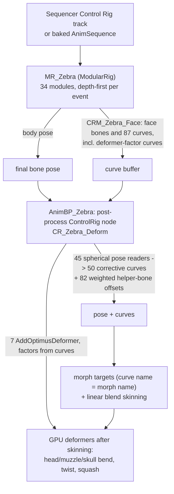

# Gap analysis: usdRig vs the ZebraSample Unreal character rigs

Date: 2026-09-16
Status: analysis only; no engine code changed. One tool was added
([`tools/ueDumpRigs.py`](../../tools/ueDumpRigs.py)) to extract the Unreal rigs as text.

Companion files:

- [`reports/ue-zebrasample/ue-rig-analysis.md`](../../reports/ue-zebrasample/ue-rig-analysis.md):
  the Unreal side. It covers 83 asset summaries and 375 operator and setup features, each described
  precisely enough to re-implement, plus the analysts' open questions.
- [`reports/ue-zebrasample/gap-catalog.md`](../../reports/ue-zebrasample/gap-catalog.md): every
  one of the 269 gap rows in full. Each row gives the UE behaviour, the usdRig mapping, the gap,
  the porting impact, the recommendation, `file:line` evidence, and the verifier's review.
- [`reports/ue-zebrasample/probes/`](../../reports/ue-zebrasample/probes/): the runtime probes
  that decided the contested claims (Appendix B).

## 1. Purpose and method

**Question.** The UE 5.8 sample project *ZebraSample* ships two production character rigs,
**Zebra** (full biped) and **Monster** (bust creature), built with Epic's Fortnite modular
Control Rig stack. What would usdRig have to gain to express those rigs, body and face, with
animator-equivalent results? And which of the gaps are real, rather than differences in how the
same thing is authored?

**Extraction.** `.uasset` packages are binary, so the only reliable reader is the editor. The
extraction ran `UnrealEditor-Cmd -run=pythonscript` with `tools/ueDumpRigs.py` (Appendix A) and
dumped every rig asset to text:

- the authored hierarchy, plus the *runtime* hierarchy of a live `ModularRig` instance after its
  construction event (almost every control is spawned there);
- every RigVM graph, with unit struct, dispatch or function reference, unlinked input defaults,
  and links;
- the editor's own `generate_python_commands()` rebuild script;
- T3D exports, including the HLSL of all 17 Optimus deformer graphs;
- skeletal mesh, skeleton, animation and sequence summaries.

Semantics were read from the engine sources that ship with the launcher build (`ControlRig`,
`RigVM`, `DeformerGraph`, `DirectMeshControl`, `IKRig`).

**Analysis pipeline.** Four stages; every stage after the first read the usdRig source, not just
its docs.

1. **Catalogue and describe.**
   - Three agents catalogued usdRig's capabilities (164 entries, with limitations and explicit
     non-goals).
   - Seven agents described the UE rigs.
   - A completeness critic checked their features against the asset index and the unit and
     function usage counts; an eighth agent filled the 11 topics it flagged (375 features in
     total).
2. **Map to verdicts.** Seven group analysts mapped the UE features to usdRig verdicts and cited
   code they opened, producing 249 rows.
3. **Adversarial review.** Seven independent verifiers tried to overturn every verdict and
   severity.
   - They changed 34 rows (15 verdicts) and added 20 rows the analysts had missed.
   - Several of them used runtime probes against the current build.
4. **Probe and reconcile.**
   - Three probe agents tested the four claims the report rests on hardest (Appendix B).
   - Five rows were then reconciled where the probes contradicted them. Each is marked
     *reconciled after probes* in the catalogue.

**Verdicts** use the same vocabulary as
[`evaluation-engine-gaps-vs-premo-libee.md`](evaluation-engine-gaps-vs-premo-libee.md):

- **Implemented:** equivalent semantics today, possibly authored differently.
- **Partial:** some of it exists; the missing options or semantics are named.
- **Missing:** nothing equivalent exists.
- **Divergent-by-design:** usdRig deliberately does it differently, with a cited non-goal.
- **Not-applicable:** UE plumbing with no rigging meaning.

**Severity** is about porting Zebra/Monster with animator-equivalent results:

- **blocker:** the rig cannot work.
- **major:** visible behaviour or a key animator workflow is lost.
- **minor:** a workaround exists.
- **cosmetic.**

**Evidence conventions.**

- Repository paths are relative to the repo root; the probes are under
  `reports/ue-zebrasample/probes/`.
- `<dump>/<Asset>/<file>` is output of `tools/ueDumpRigs.py`, for example
  `<dump>/Game__Assets__Zebra__Rig__MR_Zebra/runtime_hierarchy.txt`.
- `<UE>/` is the engine install.
- Line numbers were read on 2026-09-16 at `8b312ae`, except that `libs/rigExec/moverGraph.cpp`
  includes an uncommitted working-tree edit that shifts its later lines by +25. Expect drift.

## 2. What the Zebra and Monster rigs are

### 2.1 Assets

| Asset | Role | Scale |
|---|---|---|
| `MR_Zebra` (`/Game/Assets/Zebra/Rig`) | Animator rig: a Modular Rig whose own graph is empty | 34 module instances. At runtime: 359 controls, 326 nulls, 423 bones (371 skeleton + 52 rig-created), 958 curves, 149 connectors |
| `CRM_Zebra_Face` | Face module inside `MR_Zebra` (ControlRigRuntimeAsset) | 107 controls, 23 local functions, 88 member variables. Units: 90 `SetCurveValue`, 60 `ModifyTransforms`, 34 `ParentConstraint`, 11 `SphericalPoseReader` |
| `CR_Zebra_Deform` | Post-process rig run by `AnimBP_Zebra` on the final pose; no controls | 45 `SphericalPoseReader`, 82 `ModifyTransforms`, 54 `SetCurveValue`, 7 `AddOptimusDeformer` |
| `MR_Monster`, `CRM_Monster_Face`, `CR_Monster_Deform` | Bust creature: same Fortnite modules, a forked face with the deformer stack inline, a 4-reader post-process rig | 7 modules, 177 controls. The face has 13 readers, 88 `ModifyTransforms`, 117 `SetCurveValue` and 9 `AddOptimusDeformer` |
| `MR_FN_Biped`, `MR_FN_BipedDMC` | Fortnite biped templates that Zebra and Monster were derived from | 48 modules (49 in `MR_FN_BipedDMC`, which adds `CRM_FN_DMC`), 283 controls |
| 13 Fortnite modules (`CRM_FN_*`) | Root, Body, Spine (also Neck), FkChain, FkArray, IkFk2Bones, Foot, LimbTwist, BipedStretchFeedback, Prop, Pin, ProxyControl, DMC | Fully procedural. Construction graphs of up to 480 nodes (IkFk2Bones; Spine 439) |
| 5 function libraries (`CRFL_*_v001`) | Control, Debug, Hierarchy, Math, Module helpers | 91 distinct functions are referenced across all rigs; 33 come from these libraries, the rest are module- or face-local |
| 8 + 9 Optimus deformer graphs | Head, muzzle, mouth and skull-top **bend, twist and squash/stretch**, layered on skinning | All 17 reduce to 3 engine kernels plus a normals pass |
| `SKM_Zebra`, `SKM_Zebra_Hi`, `SKM_Monster` | Meshes | 132 / 130 / 79 morph targets. 34k / 132k / 108k vertices. Zebra has 49 body correctives and 83 face shapes; Monster's shapes are face-only |
| `IK_Zebra`, `RTG_UEFN_to_Zebra`, physics assets | Retargeting and physics | The retargeter is broken as shipped (missing source rig and meshes) |
| Level sequences | Animation via `MovieSceneControlRigParameterTrack` on `MR_Zebra` / `MR_Boombox` | Absolute blend, with space-channel step keys |

Across all rigs the graphs use **221 distinct RigVM unit/dispatch types (4,526 nodes)**. The most
frequent Control Rig units (`RigUnit_*`) are listed below. Core RigVM nodes are excluded, although
several are used more: Sequence 240, ArrayGetAtIndex 211, ArrayIterator 168, Branch 153,
DoubleMul 150.

| Unit | Uses |
|---|---|
| `GetTransform` | 367 |
| `SetCurveValue` | 261 |
| `ModifyTransforms` | 234 |
| `HierarchyAddControlTransform` | 127 |
| `SetTransform` | 119 |
| `GetCurveValue` | 104 |
| `HierarchyAddNull` | 96 |
| `SphericalPoseReader` | 73 |
| `ParentConstraint` | 69 |
| `HierarchyAddAnimationChannelFloat` | 53 |
| `GetBoolAnimationChannelFromItem` | 49 |

### 2.2 How they evaluate



The Monster rig runs its nine deformers from inside the face module, not the post-process rig.
The post-process rig only drives the trapezius helpers.

Three properties of the UE design matter most for usdRig:

1. **Everything is procedural.** The modular host graph is empty. Each module's *Construction*
   event spawns its controls, channels, nulls and rig bones from connectors and per-instance
   config, then caches their keys in member variables. The static hierarchy is just skeleton
   bones, the imported mesh-socket nulls (8 foot pivots), curves and connectors.
2. **Imperative, interleaved per-frame logic.** A forward solve freely alternates between reading
   a pose, computing scalars, and writing transforms or curves, in one pass. The face and the
   post-process rigs are built on exactly that pattern: read a pose or a control value, remap it,
   then apply a weighted offset or set a curve.
3. **A scalar curve bus between rigs.** The face writes curves; the post-process rig reads some of
   them back (deformer factors) and writes more (correctives). Curves whose names match morph
   targets drive those morphs implicitly.

## 3. Summary of findings

### 3.1 Scores

| Group | Rows | Impl. | Partial | Missing | Divergent | N/A | Blocker | Major | Minor | Cosmetic |
|---|---|---|---|---|---|---|---|---|---|---|
| G1 Modular system | 40 | 0 | 26 | 4 | 5 | 5 | 0 | 5 | 25 | 10 |
| G2 Structure, construction, runtime | 44 | 7 | 18 | 7 | 9 | 3 | 0 | 11 | 25 | 8 |
| G3 Controls and animator UX | 39 | 3 | 23 | 8 | 3 | 2 | 0 | 6 | 25 | 8 |
| G4 Spaces, FK, constraints, inverse | 40 | 6 | 21 | 6 | 5 | 2 | 0 | 9 | 26 | 5 |
| G5 IK, spine, twist, foot | 34 | 7 | 20 | 3 | 2 | 2 | 0 | 8 | 22 | 4 |
| G6 Pose readers, correctives, face | 43 | 6 | 31 | 4 | 1 | 1 | 2 | 20 | 20 | 1 |
| G7 GPU deformers, DMC | 29 | 2 | 16 | 7 | 3 | 1 | 0 | 6 | 17 | 6 |
| **Total** | **269** | **31** | **155** | **39** | **28** | **16** | **2** | **65** | **160** | **42** |

"Partial" dominates for a reason: usdRig usually has the *operator* but not the *option*, or the
*value* but not the *path* to where UE uses it. The two blockers and most of the majors trace
back to a handful of cross-cutting causes (§3.2). Fixing those causes, rather than the 269 rows
one by one, is what makes the rigs portable.

### 3.2 The load-bearing gaps

In order of how much of the rigs each one unlocks:

1. **Evaluation is not the single ordered stack the spec defines** (§6.1). `spec.md` §4.2 orders
   every mover, IK included, in one reverse-sibling post-order, and binds each read by phase at
   the consumer's position. The implementation splits the work into four phases:
   - math movers run before exec, off authored values, ignoring their stack position
     (`rigEvaluator.cpp:10236-10245`, probe C1c);
   - solvers are placed by data dependency, not hierarchy (`rigEvaluator.cpp:5851-5944`), so a
     mover can never read a pre-IK value;
   - pose interpolators publish after the whole pose walk (`rigEvaluator.cpp:11666-11675`);
   - geometry chains run last.

   The consequences:
   - A stack that reads a joint before its IK and then moves the IK goal is rejected as a cycle
     (probe `order_read_first`).
   - A pose-derived value reaches blend-shape weights, but not a constraint, solver or offset.
     Wired there, it is **silently** read as the upstream authored fallback, 0 (probe C2).
   - This one design gap blocks all 82 `CR_Zebra_Deform` helper-bone offsets, the soft-eye and
     jaw-open face logic, and the thresholded and `min`-combined correctives.
2. **Double avars cannot feed float logic** (§6.2). Every scalar-logic input is `float`
   (`FloatMathMover`, `inputs:defaultWeight`, `BlendInput.inputs:weight`), but control avars are
   `double`.
   - UE's face pads, lid sliders, squash controls and foot rocker all feed their translations or
     rotations into curve logic. None of that can be wired.
   - Probe C3a: connecting `inputs:value` to a double avar compiles and **silently** uses the
     mover's own authored value, while the same connection on `inputs:defaultWeight` is a compile
     error.
   - Both blocker rows (`G6-control-channel-read`, `G6-lid-layers`) trace to this gap.
3. **No parametric deformers** (§6.3). The revision-op set is frozen at 13 ops
   (`moverGraph.h:59-73`), none of them bend, twist or squash/stretch. That loses all 16 deformer
   instances that give Zebra and Monster their cartoon head, muzzle, mouth and skull deformation.
   Derived normals also discard authored normal offsets and tangents.
4. **No spherical/cone pose reader** (§6.4). UE's 73 `SphericalPoseReader`s use elliptical inner
   and outer regions with per-quadrant scale factors, one-sided readers, and an explicit reference
   parent. usdRig's `RigExecPoseInterpolator` can only approximate a circular cone, and publishes
   too late (item 1).
5. **No space-switching schema** (§6.5). There is no labelled space list, active-space channel,
   default-parent designation or switch compensation. `inputs:sourceWeights` is read raw and cannot
   be connected (`rigEvaluator.cpp:9403-9427`). UE sequences key spaces as step channels.
6. **No module, connector or construction layer** (§6.6). This is by design: dynamic topology
   is a v1 non-goal (`docs/spec.md:58`). The consequence is that porting needs an offline
   generator library and a UE importer, and neither exists. The biped's generator
   (`tools/biped`) is referenced by the docs but is not in the checkout.
7. **No inverse or matching tooling** (§6.7): no backwards solve / bake-to-controls, IK↔FK snap,
   pole-vector snap, spine back-fit or key-on-switch. `rigexec.solve_parameters` is a generic
   damped least-squares solver, not a matching workflow.
8. **Animator UX pieces the rigs depend on**:
   - channel hosts (one channel shown and keyed on many controls);
   - per-channel limits and locks;
   - bool-driven hide/show;
   - control value types (rotator, bool, int, enum);
   - shape offsets and a shape library;
   - proxy/driven-list controls;
   - stepped keying of switches from the panels.
9. **Solver option deltas** (§6.8):
   - `TwoBoneIk` soft IK combined with stretch *pops* at full extension and has no stretch cap
     (probe C4a).
   - `SplineIk` is a degree-2 curve over rest joints with no length-preserving fit, where UE uses a
     cubic Bézier through the controls.
   - `TwistDistribution` also distributes swing (probe C4c), where UE's LimbTwist distributes
     twist only.

### 3.3 What already maps well

- **Rigid follow and control stacks.**
  - Controls driving bones, bones following virtual bones, root/body/prop stacks, orient-only space
    nulls and FK chains through driven bones all map to `RigExecParentConstraint` /
    `PositionConstraint` plus namespace propagation.
  - Unclaimed joints and controls nested under a **solver-posed** joint follow it, provided their
    own `parent:space` is unauthored (probe `reports/ue-zebrasample/probes/g2review/probe_follow2.py`).
    That covers sockets, helper bones and deformer frames under the head or foot.
- **Weighted additive local offsets** (UE `ModifyTransforms` AdditiveLocal) already exist as a
  self-sourced `RigExecParentConstraint`: stacked, local-frame, bakeable (probe C1a). The missing
  pieces are slerp blending, a clamp policy, quaternion offsets, and the pose-derived weight from
  item 1.
- **Scalar logic on animator float channels.** Pre-exec `FloatMathMover` chains reproduce
  add/multiply/clamp/remap (and `min` via a connected `max`), and drive constraint weights in the
  same evaluation (probe C1c). UE's *Expression Shape Logic*, eye convergence and deformer-factor
  remaps port exactly, once item 2 lets controls feed them.
- **Blend shapes and skinning.**
  - Sparse `UsdSkelBlendShape` samples, independently composed channels, pose-driven corrective
    weights (`RigExecPose` → `BlendInput`), and morph-then-skin order.
  - LBS/DQS with any influence count.
  - The UE USD export of Monster (UsdSkel plus 79 BlendShapes) is directly consumable, given an
    importer.
- **Core solvers.** Analytic two-bone IK with pole, softness and stretch; IK/FK blend; FABRIK;
  spline IK; aim with up-vector modes; the FBX Aim/Position/Rotation/Scale/Parent/SingleChainIK
  constraints (no Character constraint, by design).
- **Reuse and variation through USD composition.** References, variants (DMC or neck mode, LOD),
  deactivation, relocates, and reference-based left/right mirroring.
- **Deformer stack mechanics.** Mover order, a shared per-point envelope (exactly UE's
  `lerp(P, P', mask)`), connectable parameters, and automatic normals and extent maintenance.
  Only the kernels are missing.
- **Direct Mesh Control, in spirit.** TouchPose regions bound to controls, picked on the deformed
  mesh. DMC is disabled or unresolved in the shipped rigs anyway.
- **Sequencer animation data.** The 9 transform channels plus rotation order map to double avars
  with `avars:rotationOrder` in a shot layer. The shipped sequences use only absolute blending.

### 3.4 Silent failures found along the way

All but one of these are defects worth fixing regardless of any UE port; the `BlendInput` clamp is
specified behaviour, listed because it is equally silent. Each was reproduced by a probe.

| Where | What happens | Probe |
|---|---|---|
| Float math-mover `inputs:value/min/max` connected to a `double` attribute | Compiles and silently uses the mover's own authored value, or the schema default. `inputs:defaultWeight` rejects the same wiring at compile: `_ValidateScalarConnection` (`rigEvaluator.cpp:525-569`) is only called for MoverAPI envelopes and `DynamicWeight` inputs (`:3639`, `:781`) | C3a |
| A pose-walk input (constraint weight, solver float) connected to `RigExecPose.outputs:weight` | Compiles and reads the upstream authored value (0). Only connections *on* `outputs:weight` are rejected (`rigEvaluator.cpp:2578-2585`) | C2 |
| A second target on a `RigExecSplineIk` control slot, or an extra control relationship | Silently ignored; which target wins depends on target order | C4b |
| A math mover placed *after* a constraint that reads its target | The constraint still sees the math mover's result, because property chains always run before exec; the stack order is ignored (spec §4.2 says it should read the preceding revision) | C1c |
| A constraint placed before an IK solver in the stack, reading the IK's joints | Always reads the post-IK value, because solvers are scheduled by data dependency. If a later mover feeds the IK, compile reports a dependency cycle instead of the spec's pre-IK read | `order/` |
| `RigExecPoseInterpolator` `rigExec:enableTranslation` | Warning only; translation is evaluated as zero, so translation-distinguished poses can never be reached (`rigEvaluator.cpp:2552-2562`) | C3c |
| `BlendInput` weights outside `[0, lastActivation]` | Silently clamped (`moverGraph.cpp:1868-1871`). This is the specified v0.1 behaviour (`spec.md:1323`), not a bug, but no diagnostic is emitted, and UE parity needs a spec change (negative / extrapolated weights). A constraint whose `inputs:defaultWeight` is outside `[0,1]` is instead skipped entirely (its offset drops to zero), with a per-frame diagnostic | C3b, C1b |
| Plain `UsdGeomXform` null under a solver-posed joint, read as a constraint source | Stays at its unsolved frame while Hydra draws it moved | `reports/ue-zebrasample/probes/g2review/probe_follow3.py` |

## 4. Architecture comparison

| Concern | UE Control Rig (ZebraSample) | usdRig | Consequence |
|---|---|---|---|
| Rig construction | Construction event spawns elements at load/connect time | Static composed USD; dynamic topology is a non-goal (`spec.md:58`) | Offline generators plus importer (§6.6) |
| Logic model | Imperative RigVM graphs: branches, loops, locals, arbitrary get/set | Declarative operators in a compiled DAG; no general node graph (`spec.md:60`) | UE graphs must be *lowered* to operator prims |
| Per-frame ordering | Read-pose, compute and write interleave freely | **Spec:** one hierarchy-ordered mover stack with phase-bound reads (`spec.md` §4.2). **Implementation:** property chains → pose walk (dependency-ordered solvers, hierarchy-ordered constraints) → pose interpolators → geometry | Build the spec's single stack (§6.1) |
| State | Member variables and metadata persist between evaluations; `IsInteracting` gates logic | Stateless per frame; hidden previous-frame state rejected (`spec.md:59, 1048-1051`) | Interaction features become tool-side (§6.7) |
| Scalar types | RigVM math in `double`, curve/weight pins `float`, linked by implicit casts; curves are a global float bus | Exact-typed connections; avars `double`, logic `float` | Typing bridge (§6.2) |
| Deformation | GPU compute graphs after skinning; morphs by curve name | CPU mover chains (SIMD LBS); explicit connections | Nonlinear kernels plus binding by importer (§6.3) |
| Correctives | Post-process rig on the final pose, curves by name | Pose interpolators → BlendInput; nothing can write joints after a pose-derived read | Movers placed after the animator stack, once the stack is unified (§6.1) |
| Reuse | Modules, connectors, rules, config overrides, bindings, function libraries | USD references, variants, overrides, relocates | Declared module/connector APIs (§6.6) |
| Animation data | Sequencer control-rig tracks, space channels, selection sets | Avars with Ts splines / time samples in shot layers | Importer, space channel, stepped keying |

## 5. Gap matrix

The tables list the **blocker and major** rows per group. The 202 minor and cosmetic rows, and
every row's full text, are in the
[gap catalog](../../reports/ue-zebrasample/gap-catalog.md).

### 5.1 G1: modular rig system

usdRig has no module, connector, rule, binding or construction concept, so the modular layer has
to become offline authoring (§6.6). USD composition already supplies the reuse mechanics. What is
missing is a declared interface, and the relationship forwarding that would let a referenced
module keep its internal wiring.

| Row | Verdict | Sev. | Effort | What usdRig lacks or does differently |
|---|---|---|---|---|
| [`G1-face-forward-order`](../../reports/ue-zebrasample/gap-catalog.md#g1-face-forward-order) | Partial | major | L | Pose-derived scalars cannot gate later constraints: FloatMathMover runs before exec, pose interpolators after the walk |
| [`G1-ikfk-module-config`](../../reports/ue-zebrasample/gap-catalog.md#g1-ikfk-module-config) | Partial | major | L | TwoBoneIk lacks PV Twist Follow, IK End Align, segment scale; Default IK/FK space map to weight/sourceWeights defaults |
| [`G1-metadata-bus-runtime-flags`](../../reports/ue-zebrasample/gap-catalog.md#g1-metadata-bus-runtime-flags) | Partial | major | L | IK Solve maps to float envelope or bool inputs:enabled; no event requests for Match IK/FK, Key Controls, IsInteracting |
| [`G1-movable-pivot-state`](../../reports/ue-zebrasample/gap-catalog.md#g1-movable-pivot-state) | Divergent-by-design | major | M | No hidden state or interaction events; Spine/Body movable pivots need animatable pivot-offset controls, not rest edits |
| [`G1-stateful-module-variables`](../../reports/ue-zebrasample/gap-catalog.md#g1-stateful-module-variables) | Divergent-by-design | major | M | No state channels (hidden state rejected): Jaw lag, Root snap, Prop pivot compensation, Body aim buffers unreproducible |

### 5.2 G2: rig structure, construction, libraries and runtime integration

The element model can carry the *static result* of the UE construction graphs. Four things are
missing:

- null, socket, curve-set and typed-channel element kinds;
- a way to write joints after a pose-derived read (the unified stack, §6.1);
- a skeleton importer;
- UE-compatible naming.

The IK Rig, the retargeter (broken as shipped) and the physics assets (unused by the animation
path) have no counterpart, but they matter little for this port.

| Row | Verdict | Sev. | Effort | What usdRig lacks or does differently |
|---|---|---|---|---|
| [`G2-deformer-function-libraries`](../../reports/ue-zebrasample/gap-catalog.md#g2-deformer-function-libraries) | Missing | major | L | No shared deform-function library; frozen 13-op RigExecRevisionOp set has no bend/twist/squash kernels (G7) |
| [`G2-mirror-metadata`](../../reports/ue-zebrasample/gap-catalog.md#g2-mirror-metadata) | Missing | major | M | No per-control mirror axis, L/R counterpart link or pose mirror/flip tool; RigExecControlAPI defers mirror metadata |
| [`G2-control-type-census`](../../reports/ue-zebrasample/gap-catalog.md#g2-control-type-census) | Partial | major | M | RigExecControl is always a full 9-channel transform; no rotator/bool/int/enum control types; channelRole is inert |
| [`G2-postprocess-pass`](../../reports/ue-zebrasample/gap-catalog.md#g2-postprocess-pass) | Partial | major | L | No post-pose transform phase, so pose-driven helper-bone offsets cannot run; RigExecPose corrective weights can |
| [`G2-runtime-layering`](../../reports/ue-zebrasample/gap-catalog.md#g2-runtime-layering) | Partial | major | M | Pose DAG, pose interpolators, then blend-before-skin order maps; helper-offset pass and post-skin deformers missing |
| [`G2-sequencer-channels`](../../reports/ue-zebrasample/gap-catalog.md#g2-sequencer-channels) | Partial | major | L | Avars tx..sz + avars:rotationOrder map the 9 channels; no typed enum/bool/int channels, UE importer or space-switch keys |
| [`G2-skeleton-import`](../../reports/ue-zebrasample/gap-catalog.md#g2-skeleton-import) | Partial | major | M | No skeleton/UsdSkel/FBX importer or resync; joints must be authored as nested RigExecJoint rest:space via AddJoint |
| [`G2-construction-event`](../../reports/ue-zebrasample/gap-catalog.md#g2-construction-event) | Divergent-by-design | major | XL | OpenExec cannot spawn prims; construction becomes offline RigExecRigBuilder authoring with no rebuild-on-change |
| [`G2-stateful-interaction`](../../reports/ue-zebrasample/gap-catalog.md#g2-stateful-interaction) | Divergent-by-design | major | M | No interaction signal, rig-requested auto-key or persistent state by design; interaction is tool-side only |
| [`G2-usd-export-import`](../../reports/ue-zebrasample/gap-catalog.md#g2-usd-export-import) | Divergent-by-design | major | M | UsdSkel bridge is a non-goal: no UsdSkel-to-RigExecJoint converter or SkelAnimation export; blend/skin data reads direct |
| [`G2-import-data-gaps`](../../reports/ue-zebrasample/gap-catalog.md#g2-import-data-gaps) | Not-applicable | major | S | Not applicable: truncated face arrays and missing sequencer keys are source-data gaps any importer must fill |

`G1-construction-offline` (minor) and `G2-construction-event` (major) describe the same
divergence from two sides. The verifiers rated them differently: the rig still evaluates without
a generator layer, but it cannot be rebuilt when a connection or config changes. Read the
construction layer as **major** for any workflow that re-rigs.

### 5.3 G3: controls, animation channels and animator UX

The basic control layer ports:

- controls nest by namespace;
- custom channels are custom avars;
- rotation orders are per prim;
- IK/FK fading is built in.

What the rigs depend on beyond that is missing or partial: channel hosting, limits and locks,
bool-driven hide/show, control value types, shape offsets and library, proxy controls, and
stepped keying. Most of it is codeless, imaging-only or tooling-only. Two changes touch
evaluation: limit clamping in `computePointFrame`, and lossless bool/float/double coercion
(§6.2).

| Row | Verdict | Sev. | Effort | What usdRig lacks or does differently |
|---|---|---|---|---|
| [`G3-channel-hosts`](../../reports/ue-zebrasample/gap-catalog.md#g3-channel-hosts) | Missing | major | S | No channel-host concept: Avar Editor shows only the focus prim's avars; picker buttons cycle defaults, never key |
| [`G3-control-limits`](../../reports/ue-zebrasample/gap-catalog.md#g3-control-limits) | Missing | major | M | No per-avar min/max, clamp or lock; FloatMathMover clamps floats only; slider ranges hard-coded; no limit drawing |
| [`G3-body-layout`](../../reports/ue-zebrasample/gap-catalog.md#g3-body-layout) | Partial | major | L | Maps to nested RigExecControls and avars; controls under solver-posed joints follow; relays only for Xform-null parents |
| [`G3-bool-vis-switches`](../../reports/ue-zebrasample/gap-catalog.md#g3-bool-vis-switches) | Partial | major | M | Only guide:displayOpacity is channel-drivable (float or double source; bools rejected); visibility is not |
| [`G3-shape-transform-offset`](../../reports/ue-zebrasample/gap-catalog.md#g3-shape-transform-offset) | Partial | major | S | Only positive guide:scaleX/Y/Z; no shape offset/rotation (guide:offsetX/Y/Z) or mirrored scale; co-pivot guides overlap |
| [`G3-switch-keying`](../../reports/ue-zebrasample/gap-catalog.md#g3-switch-keying) | Partial | major | S | No panel keys stepped switches: Avar Editor writes bool/token defaults, picker a float default, float dials get AutoEase |

For `G3-body-layout`: the probes show that controls nested under solver-posed joints *do* follow
(the row carries a reconciliation note). The relay links in that row are needed only for controls
hanging from **plain Xform** nulls, from joints that another solver owns, or with an authored
`parent:space` (§3.3).

### 5.4 G4: spaces, FK, constraints, inverse and matching

The forward rigid-follow side maps well, but it relies on offsets the converter has to bake:

- there is no maintain-offset option;
- per-source offsets carry no scale;
- rotation averaging works per Euler component;
- masks and offsets are asset-space only.

Space switching is the largest structural gap on the forward side. Everything inverse is
missing.

| Row | Verdict | Sev. | Effort | What usdRig lacks or does differently |
|---|---|---|---|---|
| [`G4-backsolve-analytic`](../../reports/ue-zebrasample/gap-catalog.md#g4-backsolve-analytic) | Missing | major | L | No inverse graph, per-operator inverse or bake-to-controls tool; rigexec.solve_parameters is only a generic LM solver |
| [`G4-backsolve-spine`](../../reports/ue-zebrasample/gap-catalog.md#g4-backsolve-spine) | Missing | major | M | No RigExecSplineIk back-fit or runtime control-offset rewrite (default:* is authoring-only); solve_parameters could fit |
| [`G4-ikfk-snap`](../../reports/ue-zebrasample/gap-catalog.md#g4-ikfk-snap) | Missing | major | M | No IK/FK match data, pole-vector helper or snap tool; picker has only zero_ctrls, gizmo avar inversion is reusable |
| [`G4-module-events-match-limb`](../../reports/ue-zebrasample/gap-catalog.md#g4-module-events-match-limb) | Missing | major | M | No module event or command system beyond picker zero_ctrls; the IK/FK dial is keyed by an external script |
| [`G4-available-spaces-switching`](../../reports/ue-zebrasample/gap-catalog.md#g4-available-spaces-switching) | Partial | major | L | No space-switch schema or switch compensation; sourceWeights not connectable; only a picker-cycled float dial |
| [`G4-expression-weighted-parents`](../../reports/ue-zebrasample/gap-catalog.md#g4-expression-weighted-parents) | Partial | major | L | sourceWeights not connectable, double avars can't feed float chains, pose-interpolator weights publish after pose walk |
| [`G4-modify-transforms`](../../reports/ue-zebrasample/gap-catalog.md#g4-modify-transforms) | Partial | major | L | Stacked local offsets exist (self-sourced ParentConstraint, probe C1a); pose-reader weights cannot reach it (probe C2) |
| [`G4-seq-space-keys`](../../reports/ue-zebrasample/gap-catalog.md#g4-seq-space-keys) | Partial | major | M | No space-channel type or switch-with-compensation/bake tool; stepped playback via held Ts knots on defaultWeight dials |
| [`G4-space-dependency-cycles`](../../reports/ue-zebrasample/gap-catalog.md#g4-space-dependency-cycles) | Partial | major | M | Prop-hand and arm-IK space constraints form a compile cycle; weights can't gate deps, no diagnostic names the pair |

### 5.5 G5: IK, spine/neck, twist and foot

The core solvers exist, and the biped already uses UE-like patterns. The gaps are solver
*models* (§6.8) and the scalar plumbing that reads control rotations into pivot, roll and blend
channels (§6.2).

| Row | Verdict | Sev. | Effort | What usdRig lacks or does differently |
|---|---|---|---|---|
| [`G5-ikfk-match`](../../reports/ue-zebrasample/gap-catalog.md#g5-ikfk-match) | Missing | major | L | No IK/FK snap, PV snap, back-solves or auto-matching; evaluation cannot write control values, so tool-time only |
| [`G5-spine-squetch`](../../reports/ue-zebrasample/gap-catalog.md#g5-spine-squetch) | Missing | major | M | No operator publishes the SplineIk stretch ratio as a float; BlendInput silently clamps negative weights to 0 |
| [`G5-twist-volume-correctives`](../../reports/ue-zebrasample/gap-catalog.md#g5-twist-volume-correctives) | Missing | major | L | No post-pose joint corrective: RigExecPose weights feed only geometry; approximate via MatrixMover or baked shapes |
| [`G5-foot-roll-bank`](../../reports/ue-zebrasample/gap-catalog.md#g5-foot-roll-bank) | Partial | major | M | Rocker rotation cannot be read (no double math mover or clamped remap); roll needs float dial + twin RotationConstraints |
| [`G5-soft-ik-stretch`](../../reports/ue-zebrasample/gap-catalog.md#g5-soft-ik-stretch) | Partial | major | M | TwoBoneIk stretches only past full reach (pop at dist==chain when soft); no 4x cap, stretchPolicy token never read |
| [`G5-spine-curve`](../../reports/ue-zebrasample/gap-catalog.md#g5-spine-curve) | Partial | major | M | SplineIk is a degree-2 B-spline on rest joint origins, not a cubic Bezier on control positions; End rotation bends it |
| [`G5-spine-fit-orient`](../../reports/ue-zebrasample/gap-catalog.md#g5-spine-fit-orient) | Partial | major | M | SplineIk always stretches (no length-preserving fit or Stretch lerp) and uses chord aim + swing-twist, not slerped up |
| [`G5-twist-distribution`](../../reports/ue-zebrasample/gap-catalog.md#g5-twist-distribution) | Partial | major | M | RigExecTwistDistribution also spreads swing, lerps positions start-end and ignores joint rests; fixes cost constraints |

### 5.6 G6: pose readers, correctives, shapes and face logic

usdRig covers the *output* end of the UE corrective pipeline: sparse shapes, channel composition,
connection-driven weights, pre-exec scalar chains. The *input* end is missing:

- a reader with UE's geometry;
- scalars that are pose-derived **and** reach transforms;
- control avars readable as scalars.

The face modules lean on all three.

| Row | Verdict | Sev. | Effort | What usdRig lacks or does differently |
|---|---|---|---|---|
| [`G6-control-channel-read`](../../reports/ue-zebrasample/gap-catalog.md#g6-control-channel-read) | Partial | **blocker** | M | No double avar to float bridge; a RigExecControl-driven interpolator reads rotation post-walk only, translation unread |
| [`G6-lid-layers`](../../reports/ue-zebrasample/gap-catalog.md#g6-lid-layers) | Partial | **blocker** | M | Layers map to self-sourced ParentConstraints per bone; Euler blend not slerp, quat offsets need Euler, no slider read |
| [`G6-jaw-open-logic`](../../reports/ue-zebrasample/gap-catalog.md#g6-jaw-open-logic) | Missing | major | M | Blocked: jaw value B is pose-derived and cannot feed later movers until the stack is unified (report 6.1) |
| [`G6-monster-trap`](../../reports/ue-zebrasample/gap-catalog.md#g6-monster-trap) | Missing | major | S | No path: offset weight is a clavicle pose measurement and nothing publishes a scalar inside the pose walk |
| [`G6-soft-eyes`](../../reports/ue-zebrasample/gap-catalog.md#g6-soft-eyes) | Missing | major | M | Eye-direction weights cannot be published inside the pose walk; only a constant-weight ParentConstraint approximation |
| [`G6-additive-local-offset`](../../reports/ue-zebrasample/gap-catalog.md#g6-additive-local-offset) | Partial | major | L | Self-sourced RigExecParentConstraint gives stacked local offsets; Euler not slerp; w outside [0,1] skips it |
| [`G6-brow-main`](../../reports/ue-zebrasample/gap-catalog.md#g6-brow-main) | Partial | major | S | Diagonal frame goes in rest rotation; no avar read, Y lock or bool vis; R mirror needs rotated frame and negated gains |
| [`G6-brow-micro`](../../reports/ue-zebrasample/gap-catalog.md#g6-brow-micro) | Partial | major | S | Helper slides map to self-sourced ParentConstraint translationOffsets; brow curve weights need the missing control read |
| [`G6-combo-min`](../../reports/ue-zebrasample/gap-catalog.md#g6-combo-min) | Partial | major | M | No min op or BlendInput min mode; pose-derived values cannot feed math movers until the stack is unified |
| [`G6-corner-logic`](../../reports/ue-zebrasample/gap-catalog.md#g6-corner-logic) | Partial | major | S | add/multiply/clamp chains are exact, but pad translation avars can't be read; curl works only as a post-walk twist pose |
| [`G6-deform-exec-order`](../../reports/ue-zebrasample/gap-catalog.md#g6-deform-exec-order) | Partial | major | L | No read-pose to scalar to modify-pose slot: walk holds only solvers/constraints, chains run before, interpolators after |
| [`G6-deformer-channel-mapping`](../../reports/ue-zebrasample/gap-catalog.md#g6-deformer-channel-mapping) | Partial | major | S | Remap chain blocked by double avar read; signed head_twist cannot come from an interpolator; deformer absent (G7) |
| [`G6-elbow-knee-readers`](../../reports/ue-zebrasample/gap-catalog.md#g6-elbow-knee-readers) | Partial | major | M | Hinge approximated by linear RBF pose; pose-derived Remap(0.4..1) cannot feed pre-exec FloatMathMover chains |
| [`G6-face-correctives`](../../reports/ue-zebrasample/gap-catalog.md#g6-face-correctives) | Partial | major | M | Products of control curves map to multiply chains; JN-based products blocked as JN is pose-derived; weights over 1 clamp |
| [`G6-foot-values`](../../reports/ue-zebrasample/gap-catalog.md#g6-foot-values) | Partial | major | M | Foot control rotation avars are double and cannot feed float chains; twist interpolator is post-walk; no Euler reorder |
| [`G6-jaw-open-reader`](../../reports/ue-zebrasample/gap-catalog.md#g6-jaw-open-reader) | Partial | major | S | 1-pose linear RBF on the jaw can drive the jaw_open BlendInput; no in-walk reader or elliptical factors for other users |
| [`G6-lip-roll`](../../reports/ue-zebrasample/gap-catalog.md#g6-lip-roll) | Partial | major | M | Pre-exec chains + self-sourced ParentConstraints work; needs a clamp mover; Euler blend diverges from slerp at 70-90 deg |
| [`G6-lip-tweakers`](../../reports/ue-zebrasample/gap-catalog.md#g6-lip-tweakers) | Partial | major | M | 4-source ParentConstraint with sourceWeights covers nulls; no offset from a control's live local transform for tweaks |
| [`G6-shoulder-clavicle-readers`](../../reports/ue-zebrasample/gap-catalog.md#g6-shoulder-clavicle-readers) | Partial | major | M | Curves map to approximated RBF readers; 35 helper-bone offsets blocked as pose weights publish only after the walk |
| [`G6-spherical-pose-reader`](../../reports/ue-zebrasample/gap-catalog.md#g6-spherical-pose-reader) | Partial | major | L | Only a 1-pose linear swing RigExecPoseInterpolator cone; no elliptical quadrant factors, one-sided or back-pole=0 rule |
| [`G6-thigh-readers`](../../reports/ue-zebrasample/gap-catalog.md#g6-thigh-readers) | Partial | major | S | Pelvis is the namespace parent and cross-side wiring works; skewed thigh-in reader and pose-derived weights block parity |
| [`G6-threshold-remap`](../../reports/ue-zebrasample/gap-catalog.md#g6-threshold-remap) | Partial | major | L | FloatMathMover remap lacks target range/clamp and runs pre-exec, so a chain fed by a pose output reads authored 0 |

### 5.7 G7: GPU deformers and Direct Mesh Control

The layering mechanics map cleanly; the kernels do not exist. The generic deformer-graph
authoring model is divergent by design (`spec.md:60`), and GPU execution is optional, deferred
work (`spec.md` §7.8). Both cost performance and a small mapping table, not behaviour, because all
17 graphs reduce to three kernels plus a normals pass.

| Row | Verdict | Sev. | Effort | What usdRig lacks or does differently |
|---|---|---|---|---|
| [`G7-bend-deformer`](../../reports/ue-zebrasample/gap-catalog.md#g7-bend-deformer) | Missing | major | L | No bend mover or posed handle-frame input in the frozen RigExecRevisionOp set; ribbon CurveMover only runs pre-skin |
| [`G7-squash-stretch-deformer`](../../reports/ue-zebrasample/gap-catalog.md#g7-squash-stretch-deformer) | Missing | major | M | No banded squash/stretch kernel (ZBias, XYBias, sine bulge); VolumeCorrectMover is only a global AABB scale |
| [`G7-twist-deformer`](../../reports/ue-zebrasample/gap-catalog.md#g7-twist-deformer) | Missing | major | S | No per-point twist op about a handle axis; TwistDistribution only publishes joint frames, CurveMover ribbon approximates |
| [`G7-control-to-factor-remap`](../../reports/ue-zebrasample/gap-catalog.md#g7-control-to-factor-remap) | Partial | major | S | Double avars:tx/tz/rz cannot feed a float FloatMathMover remap (exact-type connections, no double math mover) |
| [`G7-normals-keep-input`](../../reports/ue-zebrasample/gap-catalog.md#g7-normals-keep-input) | Partial | major | M | Derived RecomputeNormals replaces authored normals; no offset preservation, faceVarying, primvars:normals or tangents |
| [`G7-zebra-monster-stacks`](../../reports/ue-zebrasample/gap-catalog.md#g7-zebra-monster-stacks) | Partial | major | M | Nulls, remaps, order and masks are expressible except the kernels; double-avar drivers blocked, nulls need rest:space |

## 6. Deep dives

### 6.1 One hierarchy-ordered stack, as the spec defines it

**The intended model.** `docs/spec.md` §4.2 defines execution as a single stack. Every mover
under `<rig>/Movers` gets an ordinal from the reverse-sibling post-order of the composed
namespace. For movers `m1…mn`, target values revise as `S0 → S1 → … → Sn`, and each read is bound
by its phase at the consuming mover's ordinal:

- `preceding` reads the revision just before that ordinal;
- `final` reads the value after every writer, and is legal only when every writer precedes the
  reader;
- `base` reads the authored value.

The spec says the same thing again at `spec.md:1132` ("a mover that reads another moved target
binds the latest version preceding its ordinal"). It also makes IK part of the stack: a
two-bone IK "may publish frames as a provider or atomically move named joint targets"
(`spec.md:241`, `:323`).

Under that model, math movers, readers and IK solvers all fire in hierarchy order with
constraints and deformers. Take a mover that reads an Xform under an IK's influence and sits
*before* the IK in the stack:

1. The mover receives the **pre-IK** revision of that Xform.
2. The IK fires later and writes the new revision.
3. Only movers after the IK see the post-IK value.

**The UE rigs need exactly this.** `CR_Zebra_Deform`'s forward solve is a serial chain, repeated
45 times: `SphericalPoseReader` → (on 5 readers, `Remap`/`Min`) → `SetCurveValue`, followed by up
to eight `ModifyTransforms(AdditiveLocal, Weight = reader)` on helper joints (`def_strap_*`,
`def_chest_*`, twist bones). The face follows the same read-compute-write pattern:

- **Jaw open.** A cone reader on the jaw → `Jaw Normalize = 4·B` → smile-masked lip-corner pulls.
- **Soft eyes.** Eye-direction readers → lid bone offsets.

In both, the weights are pose-derived and the writes are transforms, interleaved in one pass.

**What the implementation does instead.** It does not evaluate one stack. It runs four phases,
and only constraints keep their hierarchy order.

1. **Math movers run first, off authored values.**
   - `FloatMathMover`, `Vec3fMathMover` and `MatrixMathMover` are grouped per target, sorted by
     their own data dependencies, and evaluated before exec runs
     (`rigEvaluator.cpp:5240-5260`, `:10236-10245`). Their results are fed to exec as value
     overrides.
   - Their position relative to other movers is ignored. Probe C1c: a math mover placed *after*
     a constraint still revises the weight that constraint reads.
   - They cannot read any transform, before or after a solve.
2. **Solvers are not movers.** They live under `<rig>/Solvers` and are placed in the pose walk by
   data dependency (`rigEvaluator.cpp:5851-5944`):
   - a solver waits on every constraint that targets an ancestor of its inputs;
   - a constraint waits on every solver that owns one of its sources;
   - hierarchy position plays no part.

   The consequences show in the `order/` probes (Appendix B):
   - A constraint reading an IK ankle always gets the **post-IK** value, (0,1,3). The rest value,
     (0,0,0), cannot be read.
   - Your example stack fails to compile. `ReadAnkle` fires first and reads the ankle, then
     `MoveEffector` moves the IK goal. The spec's model would give the pre-IK read, then the goal
     move, then the IK. Instead compile reports `pose dependency cycle among: MoveEffector ->
     ReadAnkle -> LegIK -> MoveEffector`.
   - The same two movers in the opposite order compile.
3. **Pose interpolators run after the whole pose walk** (`rigEvaluator.cpp:11666-11675`). Their
   floats reach `BlendInput` weights, but nothing in phase 2. Wiring them there is silently wrong
   (probe C2).
4. **Geometry chains run last.** They are the only part that follows the spec's revision-chain
   model literally.

The operator side is not what blocks the UE pattern: a self-sourced `RigExecParentConstraint`
already applies UE's AdditiveLocal offset, stacked in mover order and bakeable (probe C1a).
What blocks it is the phase split.

**Recommendation: build the spec's single stack.**

1. **Solvers become ordered movers.** `TwoBoneIk`, `FkChain`, `SplineIk`, `TwistDistribution`
   and `BlendPointFrames` take an ordinal, either as the spec's atomic-bundle movers
   (`rigExec:moves` equal to the joints they pose) or through a mover that places a solver.
   - A solver that only feeds another solver (IK → IK/FK blend) stays a non-mover provider.
     Under the spec such a provider has no ordinal and may read only `base` or acyclic `final`.
2. **Math movers and pose readers join the same walk.** They are evaluated at their ordinal, and
   their inputs may read transforms and avars.
   - A pose-derived scalar is then just a read of a revision; no special phase is needed.
   - `RigExecPoseInterpolator` and the proposed `RigExecSphericalPoseReader` (§6.4) become
     movers that write float outputs at their ordinal.
   - The typed reads come from §6.2.
3. **Dependencies come from phase-bound reads, not from ownership.**
   - A `preceding` read at ordinal *k* binds to the last writer of that value *before k*, or to
     its base. It adds no edge to later writers, so the probe's stack compiles.
   - `final` keeps today's "after every writer" meaning, and cycles are still rejected.
   - Namespace propagation becomes revision-aware: a descendant read at ordinal *k* sees its
     ancestors' revisions up to *k*.
4. **Keep parallelism where the reads allow it.** The spec already says "overlapping writes
   serialize; disjoint chains remain parallel". Chains whose read and write sets are disjoint
   still run concurrently.
   - The baked program is SSA over dense slots, which is the spec's `S0…Sn` already.
   - Transform providers need a slot per revision, not one final frame per provider.
5. **Migration.** Today's rigs (the biped) rely on implicit dependency order.
   - A tool can compute that order once, assign solver ordinals, and author
     `reorder nameChildren` pins.
   - Stages that already pass `rigExecPose --mode parity` then evaluate identically.
6. **Until the stack exists, fail loudly.** Reject, at compile time:
   - any pose-walk input connected to a value published later (probe C2);
   - a math mover whose position contradicts a constraint that reads its target (probe C1c).

Companion pieces the UE logic needs inside that stack:

- a `remapRange` op (source range → target range, clamp flag);
- explicit `min`/`max` ops;
- a `rigExec:weightPolicy = clamp | bypass` on constraints (`bypass` is today's behaviour: an
  out-of-range weight skips the constraint), because UE clamps;
- slerp envelopes on constraints, because UE slerps and usdRig blends Euler components
  (`solvers.cpp:779-800`). Reuse `rigExec:rotationBlend` from `RigExecBlendPointFrames`
  (`shortestArc`, `schema.usda:626-627`, adding an `euler` token for today's behaviour) and its
  slerp kernel rather than inventing a new attribute.

With the single stack and these pieces, the following all become expressible:

- `CR_Zebra_Deform` and `CR_Monster_Deform`: the post-process layer is simply movers placed
  after the animator stack, with no separate rig or phase;
- soft eyes and jaw-open;
- the threshold and `min` correctives;
- mutually referencing space lists.

The rows this covers are `G6-deform-exec-order`, `G2-postprocess-pass`, `G4-modify-transforms`,
`G5-twist-volume-correctives`, `G6-combo-min`, `G6-threshold-remap`, `G6-soft-eyes`,
`G6-jaw-open-logic`, `G6-monster-trap`, `G1-face-forward-order` and
`G4-space-dependency-cycles`. Several catalogue rows propose a third pose-step kind or a separate
`PostPose` phase; this section supersedes those recommendations.

The spine *Squetch* curve is a different case: it only drives a morph, so ordering alone does not
fix it. It needs a chain/stretch-ratio reader and negative `BlendInput` activations
(`G5-spine-squetch`, `G7-pose-derived-scalar-squetch`).

None of this adds hidden state: every value is a same-evaluation function of earlier revisions,
which `spec.md:1048-1051` permits.

### 6.2 Scalar typing: controls as scalar sources

**The UE pattern.** The face's 2-D corner pads, brow pads, lid sliders, squeeze pad, squash
controls, foot rocker and spine *Distribute Rotation* all do the same thing:
`GetTransform(control, Local)` → take a translation or Euler component → remap/clamp → curve,
weight, or another control's channel. RigVM math nodes work in `double`, while curve, weight and
pose-reader pins are `float`; RigVM links the two with implicit floating-point casts.

**usdRig today.**

- Avars are `double`. Every scalar-logic input is `float`.
- `_ValidateScalarConnection` (`rigEvaluator.cpp:525-569`) requires exact types, and it is
  called only for MoverAPI envelopes and `DynamicWeight` inputs.
- On `FloatMathMover.inputs:value`, a double source is silently replaced by the authored value
  (probe C3a).
- `RigExecPoseInterpolator` can read a control's *rotation*, but only after the pose walk, and it
  ignores translation (probe C3c).

**Recommendation.**

1. Accept `float ← double` and `double ← float` in `_ValidateScalarConnection`, and apply the
   check to **all** scalar inputs, not just envelopes and weight drivers. Convert in
   `RigExecResolvedInputs::GetAttribute` (`moverGraph.h:314-378`) and in the baked resolver, with
   a finite-range check. The imaging bridge already does this for `guide:displayOpacity`
   (`_HeldScalar`, `libs/rigExecImaging/bridge.cpp:224`), which reads float or double sources;
   that is the precedent to generalise.
2. Add a `RigExecDoubleMathMover` so logic can *write* avars. It is needed for Distribute Rotation,
   segment scale into FK translation, and pivot channels.
3. Add a pre-exec channel reader, or `rigExec:component` metadata on the connection, that
   exposes a control's local Euler component in a chosen rotation order, or its twist about an
   axis, as a float. It depends only on avars, so it runs in the property-chain phase, with no
   scheduling change.
4. Accept bool sources for opacity, visibility and blend weights (`G3-typed-channels`), so the 69
   bool channels in `MR_Zebra` port one-to-one.

Items 1 and 3 together turn the two blockers into ports; `G6-lid-layers` also needs the
untruncated lid tables from a re-dump (`G2-import-data-gaps`). Items 2 and 3 remove most of the
relay-prim workarounds recorded in G5.

### 6.3 Parametric deformers (bend, twist, squash/stretch)

**The UE pattern.** Each graph runs *Read Skinned Mesh* → an engine function (`DG_Function_Bend`,
`_Twist` or `_SquashStretch`) → *Compute Normals Keep Input* → *Write*. Each graph has two
variables: an origin `Transform` from a null parented to the head, and a factor driven by a
curve. The vertex mask comes from *Skin Weights as Vertex Mask* over a bone list.

The kernels are Barr-style (see `<dump>/…ZebraMuzzleBend_DeformerGraph/kernels.hlsl`):

- **Bend** is a rotation arc over a `[low, high]` band of `LengthToBend` along local +Z, with
  rigid continuation outside the band.
- **Twist** is a linear angle ramp about +Z.
- **Squash/stretch** is a banded Z scale with an XY bulge (sine profile), plus `XYBias` and a
  Bezier-remapped `ZBias`.

**usdRig today.** The mover pipeline already does everything around the kernel:

- ordering;
- a per-point envelope (`lerp(P, P', w)`, exactly UE's mask blend);
- connectable parameters;
- posed frames available to geometry;
- automatic normals and extent maintenance.

What is missing is the kernel: `RigExecRevisionOp` is a frozen 13-op enum (`moverGraph.h:59-73`).
Derived normals are also a full recompute that discards authored normal offsets and ignores
tangents and faceVarying normals (`G7-normals-keep-input`, `G7-skinned-tangent-frame`).

**Recommendation.**

- **Schema.** An abstract `RigExecNonlinearMover` with:
  - `rel rigExec:handle` (a posed frame, `final` read phase);
  - `inputs:length`, `inputs:lowBound`, `inputs:highBound`, `inputs:factor`;
  - three concrete types adding `maxAngle` (bend, twist) and `xyBias`/`zBias` (squash).
- **Kernels.** Three ops in `geometryKernels.cpp`, with SSE and support-skip on zero weights,
  plus their baked lowering.
- **Masks.** A `RigExecSkinMaskWeight` weight object that derives UE's bone-list mask from the
  `SkinMover` layout, with the same root/leaf expansion.
- **Normals.** A `rigExec:normalsPolicy = recompute | preserveAuthoredOffset` policy with
  faceVarying support.
- **Validation.** Golden tests against UE vertex samples at a few factor values, because the
  squash kernel's `ZBias` and bulge formula must match exactly.

GPU execution can stay future work: at 34k/132k vertices, the CPU cost is a profiling question,
not a correctness one.

### 6.4 Spherical pose reader

`RigUnit_SphericalPoseReader` works as follows:

1. It measures the driver's `DriverAxis` in a cone frame. That frame is the driver's **rest**
   transform relative to the reference parent (or its hierarchy parent), post-rotated by
   `RotationOffset`, and carried by the parent's **current** transform. The cone centre is the
   frame's +Z.
2. It projects that direction onto the azimuthal plane of the cone centre.
3. It evaluates an inner ellipse and an outer ellipse. Each has four quadrant scale factors
   (+W, −W, +H, −H), and the factors may be 0 (one-sided) or above 1 (extrapolated).
4. It returns 1 inside the active region, falls off to 0 at the outer ellipse, and returns 0 at
   the back pole.

Zebra uses 45 of these in its post-process rig and 11 in its face; Monster uses 17. usdRig's
`RigExecPoseInterpolator` can approximate one reader with a one-pose linear kernel over a swing
metric. That gives a circular cone, uses a quaternion swing distance (which reads larger
off-plane), and has no active plateau or explicit reference parent (`G6-spherical-pose-reader`).

**Recommendation:** a dedicated `RigExecSphericalPoseReader`, a typed non-mover prim with:

- `rel rigExec:driver` and `rel rigExec:referenceParent`;
- `inputs:driverAxis` and `inputs:rotationOffset`, the offset applied on top of the driver's
  rest-local frame;
- an active size and a falloff size, each with 4 scale factors (no `[0,1]` clamp);
- flip options;
- `float outputs:weight`.

It is evaluated as a mover at its ordinal in the single stack (§6.1). A `RigExecTwistReader` (signed twist/swing angles,
positive/negative split) is evaluated the same way and reuses the existing swing-twist code
(`rbf.h:206-207`). Until the reader exists, an importer can fit `RigExecPose` radii per reader by
sampling the UE kernel. That is good enough for curve-only readers, but not for the one-sided
shoulder and clavicle ones.

### 6.5 Space switching

The UE mechanism works in four steps:

1. For each space target, construction spawns a null under that target at the control parent's
   initial transform.
2. `AddAvailableSpaces` registers the nulls with labels.
3. Sequencer *space channels* key `Parent | World | ControlRig(element)` as **step** keys.
4. `SwitchParent` re-parents with maintained global transform.

This affects 26 controls in Zebra: 22 transform controls (limb IK, FK orient spaces, spine and
neck, body, prop, root) plus the 4 limb PV controls.

usdRig can express a *fixed* weighted parent (`RigExecParentConstraint` sources, with the
converter baking the offsets). It cannot express three things:

- a labelled list with an **active index**;
- **compensation** when the index changes;
- **connectable** `inputs:sourceWeights`, which are read raw (`rigEvaluator.cpp:9403-9427`) and
  interpolate linearly between samples.

Mutually referencing spaces add a separate problem: the prop follows the hands while the arm IK
follows the prop. Those form a compile cycle in a static DAG (`G4-space-dependency-cycles`).

**Recommendation.** Add `RigExecSpaceSwitch`, inheriting `RigExecSourceConstraint`, with:

- `rigExec:spaceLabels`;
- `int inputs:activeSpace` (held values; −1 = namespace default);
- `rigExec:defaultSpace`;
- `rigExec:spaceMode = full | orient | point`;
- optional per-channel weights;
- ordering hints for cyclic pairs, plus a diagnostic naming the pair that cannot be ordered.

Add `rigExec:maintainOffset = none | rest | default | delta` to source constraints, so space
nulls need no baked numbers and survive rest edits. Compensation is tooling:
`python/rigexec/spaces.py switch_space(…, compensate=True, frame_range)` evaluates world frames,
re-keys avars and keys `activeSpace`, and is exposed as a picker command. The UE sequence
importer maps space keys onto `activeSpace`.

### 6.6 Modules, connectors and construction become an offline layer

Dynamic topology is a v1 non-goal (`spec.md:58`), and it should stay one: the static epoch is
what makes the baked program possible (0.7 ms/frame on the biped). The UE construction layer
therefore has to become **deterministic offline generators**, plus an importer that turns the
Zebra/Monster dumps into USD. Four pieces are needed.

1. **Declared interfaces (codeless).**
   - `RigExecModuleAPI` carries class, version, parent module and a `module:config:*` namespace.
   - A multiple-apply `RigExecConnectorAPI` carries targets, kind, optional, array, element types
     and rule.
   - Reading operator relationships through `GetForwardedTargets` lets a referenced module route
     its internal wiring through its connector. A probe (`reports/ue-zebrasample/probes/g1/g1_probe2.py`) confirmed that
     USD remaps forwarding through references and drops out-of-scope targets.
2. **Generators.** `python/rigexec/modules/` holds one pure function per Fortnite module class:
   Root, Body, Spine (neck as a variant), FkChain, FkArray, IkFk2Bones, Foot, LimbTwist, Prop, Pin,
   ProxyControl, DMC, and the two face modules. Each takes
   `(stage, moduleScope, connectors, config)`, writes its own sublayer, and records provenance.
   An assembler walks modules in parent order and authors `reorder nameChildren` pins. Mover
   order is the reverse-sibling post-order of the Movers namespace (children first, bottom sibling
   first; `README.md`, "Movers and execution order"), so the pins list modules in reverse
   execution order.
3. **Importer.**
   - Reads `tools/ueDumpRigs.py` output.
   - Resolves connectors, per-instance config and bindings. `ConfigOverrides` exports as `()`, so
     the values come from the preview instance sub-objects in `asset.t3d`.
   - Follows exec links rather than node presence. Several shipped nodes are inert (`G6-inert-nodes`).
   - Prunes dead UE connection entries. usdRig fails compile on a missing target
     (`G1-connection-list-hygiene`).
   - Carries a quirk table with reproduce/fix flags (`G1-authoring-quirks`).
   - Needs a skeleton importer (`G2-skeleton-import`) and UE-compatible naming helpers
     (`G2-naming-helpers`).
4. **Oracle tests.** Generate each module against a Manny-layout fixture, and compare control,
   null and joint names and counts with `<dump>/FortniteRigs__Templates__MR_FN_Biped/runtime_hierarchy.txt`.

Things that remain **divergent by design** and should be ported as tooling:

- hidden per-frame state: the *Jaw Normalize* one-frame lag, the root first-frame snap, pivot
  compensation;
- `IsInteracting` gating;
- rig-requested auto-key.

The usdRig-native alternatives are same-evaluation dependencies, and gizmo/picker transactions
that author compensated values (`G1-stateful-module-variables`, `G3-movable-pivot`,
`G2-stateful-interaction`).

### 6.7 Inverse solves and matching

The UE modules' *Backwards Solve* events and *To IK / To FK / Key Controls* user events, together
with the `AAU_Biped` "Match Limb" editor action, provide four workflows:

- bake-to-controls;
- continuous or explicit IK↔FK snapping, including pole-vector placement and foot pivot reset;
- spine back-fit by tangent-ray intersection;
- key-on-switch.

usdRig has only `rigexec.solve_parameters` (dense damped least squares), with no match data and
no UI.

**Recommendation.** Add a codeless multiple-apply `RigExecMatchAPI` on controls. Each named set
(`backSolve`, `toFk`, `toIk`) carries:

- a source relationship;
- an offset;
- a mode (`full | rotate | translate | zero | poleVector | rayIntersectMidpoint`);
- `after` ordering (foot after leg).

`python/rigexec/match.py` would evaluate the rig and author the matched avars; a
`match_limb` / `key set` command in the picker and Avar Editor would call it. Evaluation stays
stateless and one-directional. The "continuous auto-match" can be approximated acyclically
(`G4-ikfk-auto-matching`) or shown as display-only guides.

### 6.8 Solver model deltas

**Two-bone soft IK with stretch** (`solvers.cpp:135-158`):

- *The pop.* `inputs:softness` is a fraction of the chain length, so `soft = softness·chain`.
  Soft IK eases reach to `chain − soft·e⁻¹` at full extension, and stretch starts only once
  `factor > 1`. So the end joint jumps by `softness·chain·e⁻¹` (0.1·2·e⁻¹ = 0.0736 for a 2-unit
  chain) as the goal crosses the chain length, and there is no stretch cap (probe C4a).
- *UE's behaviour.* It scales both bones continuously from the soft distance and caps stretch
  at 4×.
- *Recommendation.* Add a `softScale` stretch policy, `inputs:maxStretch`, and upper/lower segment
  scale inputs (`G5-soft-ik-stretch`, `G5-segment-scale`).

**Spline spine:**

- *UE's behaviour.* A cubic Bézier through `[start driver, mid, mid, end]` control positions, a
  length-preserving front fit lerped by *Stretch*, tangent frames with a slerped up-vector, and
  end-control orientation overrides.
- *usdRig's model.* `RigExecSplineIk` is a degree-2 curve over rest-joint CVs with chord aim,
  linear twist and volume thinning, with exactly 3 control slots (probe C4b).
- *Recommendation.* Add `curveModel = controlBezier`, `inputs:stretch`,
  `placement = chordPercent`, `frameModel = tangentSlerpUp`, and start/end orientation options.

**Limb twist:**

- *UE's behaviour.* It distributes *twist only*, keeps each twist bone's own rest position and
  orientation, and uses separate translate weights.
- *usdRig's model.* `RigExecTwistDistribution` distributes swing too (probe C4c), places samples
  on the start–end line, and gives every sample the start's rest axes.
- *Recommendation.* Add `distribute = twistOnly` and `placement = boundJointRest`.

**Smaller items:**

- signed primary/secondary axes on `TwoBoneIk`;
- an end-orientation control and a mid-offset control;
- FABRIK `orientMode = preserveOffset` plus tolerance and iteration inputs;
- `avars:pivotX/Y/Z` for UE's *Rotate Around Free Pivot*. An exact bakeable three-null
  construction already exists (`G5-free-pivot`), but it is verbose.

## 7. Porting blueprint

How each UE asset would land in usdRig, and what blocks it.

| UE asset / module | usdRig construct | Blocked by |
|---|---|---|
| Skeleton import (371 / 165 bones), curves | Nested `RigExecJoint` rest frames; a `curves:` float scope | Skeleton importer (§6.6) |
| `CRM_FN_Root` (Global/Local/Root, Bake Root On) | Nested controls; the enum becomes an int channel with label metadata | Enum channel (G3); root-motion bake (§6.7) |
| `CRM_FN_Body` (orbit, body, aim, movable pivot) | Controls plus `ParentConstraint`/`AimConstraint` | Movable pivot becomes a tool (§6.6); pivot avars |
| `CRM_FN_Spine` / Neck | `RigExecSplineIk` + FK trio + Sec FK layer | Spine curve/fit models (§6.8); FkChain `baseChain` layering (`G5-spine-secfk-layer`); Distribute Rotation (§6.2) |
| `CRM_FN_IkFk2Bones` ×4 | Virtual-bone joints, `TwoBoneIk` + `FkChain` + `BlendPointFrames`, PV constraints | Soft-stretch/segment scale, end align (§6.8); spaces (§6.5); matching (§6.7) |
| `CRM_FN_Foot` ×2 | Pivot control stack under the leg IK; FABRIK + aim | Rocker/roll scalar reads (§6.2) |
| `CRM_FN_LimbTwist` ×8 | `TwistDistribution` + position constraints | Twist-only / rest-preserving mode (§6.8) |
| `CRM_FN_FkChain` ×8, `FkArray` ×6 | `FkChain` / per-bone controls with orient-space constraints | Control-to-joint offsets on FkChain (`G4-fk-chain-construction`); spaces |
| `CRM_FN_Prop` | Control stack + weighted aim | Spaces; change-pivot tool |
| `CRM_Zebra_Face` (107 controls, 23 functions) | Controls under the head; `FloatMathMover` chains; self-sourced `ParentConstraint` layers; multi-source lip/lid constraints; `BlendInput`s | **Scalar typing (§6.2)**; the single ordered stack (§6.1); limits/hosts/bool vis (G3); slerp blending |
| `CRM_Monster_Face` (+9 deformers inline) | As above, plus nonlinear movers in the face scope | As above, plus §6.3 |
| `CR_Zebra_Deform` (45 readers, 82 offsets, 7 deformers) | Reader movers → math movers → self-sourced offset constraints and `BlendInput`s, in stack order; nonlinear movers after the `SkinMover` | **§6.1, §6.4, §6.3** |
| `CR_Monster_Deform` (4 readers) | As above | §6.1, §6.4 |
| Optimus graphs (17) | `RigExecBend/Twist/SquashStretchMover` + `RigExecSkinMaskWeight` | §6.3 |
| DMC (`CRM_FN_DMC`, `RunDMC`) | TouchPose regions per layer, IK/FK-selected | Touch layers, surface gizmo display (minor) |
| `MR_Boombox` + character | Separate `RigExecRoot`s | Cross-rig attach needs the multipass of `spec.md` §6.2 |
| Level sequences | Shot layer: avar splines, `activeSpace` keys, selection sets as collections or picker buttons | Sequence importer (`G2-sequencer-channels`) |
| Post-process ABPs | Folded into the character rig as movers placed after the animator stack | §6.1 (no separate rig or phase needed) |

## 8. Recommended roadmap

Effort uses the catalogue scale: S ≈ days, M ≈ 1–2 weeks, L ≈ several weeks, XL ≈ a quarter.

| Priority | Item | Rows unlocked | Effort |
|---|---|---|---|
| **P0** | Fix the silent failures in §3.4: validate all scalar connections, reject late-published sources in the pose walk and math movers whose stack position is contradicted, report extra SplineIk targets, measure or reject `enableTranslation`, diagnose plain-Xform constraint sources under solver-posed joints | trust in every later port | S |
| **P0** | Scalar typing bridge: `float↔double` connections, `RigExecDoubleMathMover`, channel reader, bool coercion (§6.2) | both blockers, ~12 majors in G5/G6/G7 | M |
| **P1** | The spec's single ordered stack: solvers as ordered (bundle) movers, math movers and readers evaluated at their ordinal inside exec, phase-bound reads and revision-aware propagation, plus a migration tool; `remapRange`/`min`/`max`, clamp and slerp envelope options (§6.1) | the whole post-process layer, space cycles, ~11 majors | XL |
| **P1** | `RigExecSphericalPoseReader` + `RigExecTwistReader` (§6.4), a chain/stretch-ratio reader, and a spec change for negative/extrapolated `BlendInput` weights | 73 readers, `G5-spine-squetch`, `G6-blend-weight-range` | L |
| **P1** | Nonlinear movers + skin-mask weight + normals policy (§6.3) | 16 deformers, 6 majors | L |
| **P1** | Control UX: limits and locks, channel hosts, `guide:visible`, shape transform and shape source, control types, stepped keying (G3) | animator parity, 6 majors | M |
| **P2** | `RigExecSpaceSwitch` + `maintainOffset` + space tooling (§6.5) | 3 majors, sequencer space keys | L |
| **P2** | Solver options: soft-stretch/segment scale/end align, spine Bézier/fit, twist-only distribution, pivot avars (§6.8) | 7 majors | L |
| **P2** | Module/connector APIs, relationship forwarding, generator library, UE importer, skeleton importer, and an untruncated re-dump (`G2-import-data-gaps`) (§6.6) | the port itself | XL |
| **P3** | `RigExecMatchAPI` + matching and bake-to-controls tools (§6.7) | 6 majors (inverse workflows) | L |
| **P3** | Mirroring metadata + pose mirror tool; selection sets; display names; shape library content | `G2-mirror-metadata` (major; the same gap is rated minor as `G1-`/`G3-mirror-metadata`), minor UX | M |
| Later | GPU mover segments; FBIK / retarget chains; cross-rig multipass; stage-free deformer runtime | outside this port's needs | XL |

The P0 and P1 items are also the ones that make the existing biped simpler. The biped currently
works around the typing wall with float dials and twin rotation constraints, and bakes offsets
the evaluator could compute.

## 9. Documentation and code discrepancies found in usdRig

These are independent of the UE port; each was checked in the source.

- **Stale propagation wording.** `docs/biped-rig.md:136-141`, `libs/rigExecRigging/rigBuilder.h:200-206`
  and `schema.usda:484-489` say namespace pose does not propagate through a solver-posed joint.
  Probes show that unclaimed joints and controls nested *under* a solver-posed joint follow it
  (`commitConstraintFrames`, `rigEvaluator.cpp:10661-10751`). The wording is accurate only for
  descendants that own their pose: joints bound to another solver, or providers with a connected
  or non-identity `parent:space` (`rigEvaluator.cpp:10590-10610`). The "control guides do not travel with the arm" note
  should be re-measured.
- **Ordering model vs implementation.** Three statements describe one logical order, but the
  implementation runs property chains, dependency-ordered solvers and pose interpolators as
  separate phases (§6.1):
  - `spec.md` §4.2 and `spec.md:1132` ("binds the latest version preceding its ordinal");
  - the README's "Movers and execution order";
  - the statement that TwoBoneIk may "atomically move named joint targets" (`spec.md:241`, `:323`).
    That form is not built: solvers pose joints only through `rigExec:joints`.

  The README's architecture sketch ("evaluator-side ordered … property chains") and `README.md:47`
  ("one compiled dependency order") describe the implementation, not the spec.
- **Schema class count.** `README.md:377` says the schema has 44 classes; `schema.usda` declares
  54.
- **Stale example docs.** `examples/README.md` is stale in three places: attribute names for
  example 01, absolute bone lengths for 03 and ArmRig (now rejected), and the "at least one joint"
  rule.
- **Undeclared TwoBoneIk attribute.** `TwoBoneIk` reads `rigExec:jointElements`
  (`computations.cpp:857`), which the schema declares only on other solvers.
- **Lattice basis never read.** `RigExecLatticeMover` declares `rigExec:basis = "bspline"`
  (`schema.usda:2152`), but the kernel is always global Bernstein.
- **Surface attach mode.** `RigExecSurfaceMover` mode `attach` evaluates identically to
  `project`, and there is no triangle/barycentric bind.
- **Curvenet docs.**
  - `docs/curvenet.md` documents `rigExec:restPose` and `rigExec:curvenetReadPhase` on the Profile
    Mover; neither is in the schema.
  - `rigExec:derived = off` (`docs/curvenet.md:456`) is not implemented.
- **Shape Editor sparse mode.** `plugin/shapeEditor/shapeEditorUI.py:234` requests
  `evaluation_mode = "sparse"`, which `_ParseMode` rejects (`python/_rigexec.cpp:559-571`); the
  exception is swallowed.
- **Gizmo multi-prim editing.** `docs/viewport-gizmos.md:49` says exactly one prim is edited, but
  `gizmoUI` builds a `GroupTarget` for multi-selection.
- **Missing scripts.** Scripts the docs reference are absent from the checkout: `tools/biped/*`
  (generator, split/verify layers, limb frames, exec stack), and the `import_touch` CLI.

## 10. UE-side quirks a port must decide on

The analysts found authoring defects in the shipped assets. An importer should carry a
reproduce/fix switch for each; full lists are in the catalogue (`G1-authoring-quirks`,
`G6-curve-morph-mapping`) and in the analysis's open questions.

- **Correctives overwrite.** The face's *Correctives* function writes `wide_open_c_r` twice, so
  `frown_wide_c_r` is never set. *Lip Roll Ot Bt* writes `lip_roll_in_bt_l`.
- **Monster face parent.** `MR_Monster` leaves the Face module's optional `Parent` connector
  unconnected (`MR_Zebra` connects it to `head`), so the Monster face root does not follow the
  head.
- **Dead connections.** `MR_Zebra`'s connection list has stale entries, and some keys match only
  case-insensitively.
- **Dangling DMC shapes.** `ModularRigGizmoLibrary_DMC` points 8 shapes and its X-ray material at
  a non-existent `/EpicControlRig/` mount.
- **Asymmetric correctives.** Several left/right corrective settings are asymmetric
  (`thigh_bk_r` offset, shoulder-forward `def_strap_r` +60° vs `def_strap_l` +30°). They are probably mistakes; reproduce them for
  parity.
- **Unused and broken assets.** `ZebraMuzzleTwist_DeformerGraph` and `SK_ZebraHi` are unused.
  `RTG_UEFN_to_Zebra` references a missing source rig and meshes.

## 11. Limits of this analysis

- **Nothing ran in Unreal beyond the dump.** UE semantics come from the dumped graphs and engine
  source. The analysts flagged open questions, such as enum value order, RigVM local-variable
  lifetime and one-frame lags. They are listed in the analysis document.
- **Gaps in the dump.**
  - `ConfigOverrides` does not text-export; per-module config was recovered from preview-instance
    sub-objects.
  - Runtime-asset rigs cannot be instantiated from Python, so their runtime hierarchies come from
    `MR_Zebra`/`MR_Monster`.
  - Sequencer channel keys, `DG_DirectMeshControl`, and the engine `Modules58` Root/AddControl
    modules are binary-only.
  - The analysed dump truncated 69 member-variable records at 500 characters, including the face
    lid tables (`tools/ueDumpRigs.py` now writes them in full); skeleton curve metadata and
    AnimSequence vector curves were not captured.
  - A re-dump for these is listed in `G2-import-data-gaps`.
- **Verdict reliability.** Verdicts rest on reading the usdRig source, with runtime probes for the
  contested ones. Most other rows were not executed.
- **Severity is judgement.** It is scaled to animator-equivalent results for *these two rigs*; a
  different target rig would weigh rows differently.
- **Effort is order of magnitude only.**

## Appendix A: reproducing the dump

```bat
set UE_DUMP_OUT=C:\tmp\ue_dump
"C:\Program Files\Epic Games\UE_5.8\Engine\Binaries\Win64\UnrealEditor-Cmd.exe" ^
  "<ZebraSample>\ZebraSample.uproject" -run=pythonscript ^
  -script="<repo>\tools\ueDumpRigs.py" ^
  -EnablePlugins=PythonScriptPlugin,EditorScriptingUtilities -unattended -nop4 -nosplash -NoSound
```

- **Runtime.** About 25 s for the whole project (28 MB of text). `UE_DUMP_ONLY=<substring>`
  restricts the run.
- **Exit status.** The commandlet exits non-zero because of engine asset-load warnings that are
  unrelated to the dump. Check `_log.txt` for `DONE`.
- **Coverage.** The script discovers every project plugin that holds content (`/FortniteRigs`
  here). Plugin content must be scanned synchronously in commandlet mode, and the script does
  that.

## Appendix B: runtime probes

The probes ran against the build in `build/`. Stages and scripts are in
[`reports/ue-zebrasample/probes/`](../../reports/ue-zebrasample/probes/). Run
`build/rigExecPose.exe <stage> --joints --targets --mode parity`, or the Python scripts under
`bin/_env.sh`. The `g2review` scripts set up their own plugin path; run them with
`PXR_PLUGINPATH_NAME` unset.

| Id | Claim | Result |
|---|---|---|
| C1a | Self-sourced `ParentConstraint` = stacked additive **local** offset; children follow; baked = dynamic | Confirmed (J moves along its local X; stack order matters; parity 0) |
| C1b | Weight outside `[0,1]` | Constraint bypassed: w = 1.5 leaves J at its unconstrained frame (y = 1.0, vs 2.0 at w = 1), with a per-frame diagnostic; UE clamps to 1 |
| C1c | Constraint weight driven by a pre-exec `FloatMathMover` chain | Works in the same evaluation, animated, no lag; chains always run first regardless of stack position |
| C2 | Constraint / `BlendPointFrames` weight connected to `RigExecPose.outputs:weight` | Compiles; **silently** reads the pose's authored value (0) |
| C3a | `FloatMathMover.inputs:value` ← double avar | Compiles; **silently** uses its own authored value; `inputs:defaultWeight` ← double is a compile error |
| C3b | `BlendInput` weight −0.5 / 1.5 | Silently clamped to `[0, lastActivation]` |
| C3c | Pose interpolator with a control driver | Rotation measured; translation evaluated as 0 (warning only) |
| C4a | `TwoBoneIk` soft + stretch | Jump of `softness·chain·e⁻¹` at dist = chain (0.0736 at softness 0.1, chain 2); no stretch cap (5× follows) |
| C4b | `SplineIk` with 4 controls | Extra targets silently ignored, order-dependent |
| C4c | `TwistDistribution` under pure bend | Intermediate joints take `w·45°` swing, zero twist; distributes swing |
| order | Mover order vs IK order (`order/gen_order.py`, `run_order.py`) | A constraint reading the IK ankle always gets the post-IK value (0,1,3). Read-ankle-then-move-goal fails compile with a pose dependency cycle. Move-goal-then-read-ankle compiles. Dynamic and baked modes agree |
| follow | Joint/control nested under a `TwoBoneIk` end joint | Follows the solve in dynamic, baked and parity modes; a plain Xform null read as a constraint source does not |
