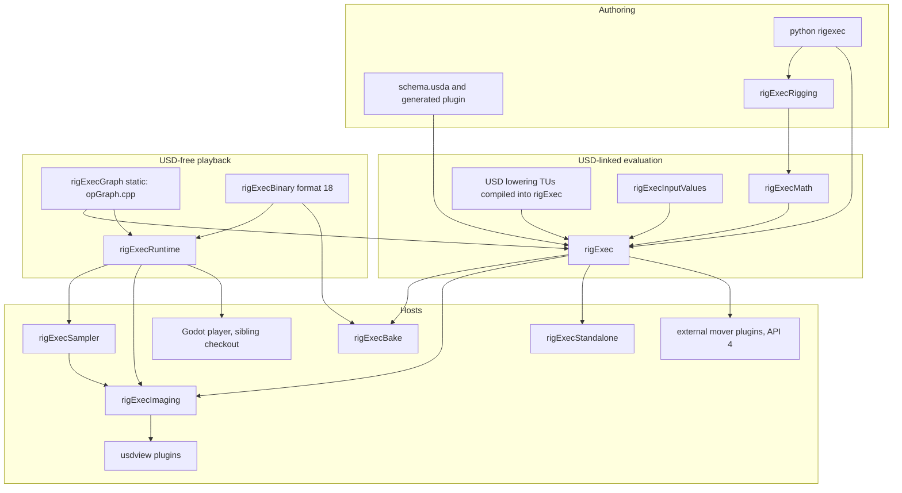
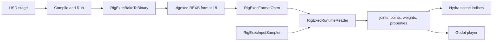

# RigExec v4 architecture review

Reviewed the `rigexec-format-v4` tip `f85109c` ("Expose live evaluator graph and operation thread timings") against `main` at `5ded2be`. This is a read of the tree and of open pull requests [#6](https://github.com/n-burk/usdRig/pull/6), [#7](https://github.com/n-burk/usdRig/pull/7), [#9](https://github.com/n-burk/usdRig/pull/9), and [#10](https://github.com/n-burk/usdRig/pull/10). No product code, schema, or test was changed, and the C++ suite was not re-run for this note. Timings and crash counts below are the ones those pull requests already reported.

`STATUS.md` marks every layer Prototype except Touch Pose and the picker, which are Beta. No layer is Stable. That matches the code: the evaluation model on this branch is coherent, and the on-disk contract is exact and brittle.

## 1. Overall structure

The build is one CMake project (`CMakeLists.txt`) against an unchanged OpenUSD 26.08 install with OpenExec. C++17. Shared libraries turn on `CMAKE_WINDOWS_EXPORT_ALL_SYMBOLS` (`CMakeLists.txt:12`), so a Windows build exports every symbol the compiler can see.

### Libraries and what they are allowed to know

| Target | Kind | Links | Role |
|---|---|---|---|
| `rigExecGraph` | static | nothing | USD-free operation compiler and executor. The target is only `libs/rigExecGraph/opGraph.cpp` (`CMakeLists.txt:52-61`). |
| `rigExecMath` | static | `arch`, `tf`, `gf`, `vt` | Solver, deformation, weight, and SIMD kernels. Stage-free. Still a Gf/Vt client (`CMakeLists.txt:64-79`). |
| `rigExecInputValues` | static, private | `vt`, `sdf`, `ts` | Value codec for input replay. Linked privately into `rigExec` so only two codec functions are exported (`CMakeLists.txt:82-88`, `204`). |
| `rigExec` | shared | graph, math, `plug`, `sdf`, `usd`, `usdGeom`, `usdSkel`, `work`, `exec`, `execUsd`, `ef`, `vdf` | Scene binding, compiled program, scheduling, invalidation, frame cache. Also compiles the USD lowering files that live under `libs/rigExecGraph/` (`CMakeLists.txt:91-202`). |
| `rigExecRigging` | shared | math, `sdf`, `tf`, `gf`, `vt`, `usd` | C++ authoring. Does not link `rigExec` (`CMakeLists.txt:225-233`). |
| `rigExecBake` | shared | `rigExec`, `rigExecBinary` | One-time capture of a compiled program into `.rigexec` (`CMakeLists.txt:348-364`). |
| `rigExecBinary` | static | FlatBuffers headers, LZMA | Format 18 validator, packer, and the `RXEL` transport (`CMakeLists.txt:290-296`). No USD. |
| `rigExecRuntime` | static | `rigExecBinary`, `rigExecGraph` | Playback. The comment at `libs/rigExecRuntime/runtime.h:1-15` is the contract: no USD headers, no USD library. |
| `rigExecSampler` | static | runtime, `usd`, `sdf`, `tf`, `gf` | Pushes stage samples into a runtime reader. The runtime stays USD-free (`CMakeLists.txt:335-346`). |
| `rigExecImaging` | shared | public `rigExec` plus Hydra/`usdImaging`; private runtime and sampler | Scene indices, playback, frame-cache publication (`CMakeLists.txt:235-269`). |
| `rigExecStandalone` | shared | `rigExec`, `exec`, `esf`, `usd`, `sdf` | Experimental rigpack / Esf adapter. A different product from `.rigexec` (`CMakeLists.txt:211-223`). |

`usdSkel` is on `rigExec` for `UsdSkelBlendShape` only (`CMakeLists.txt:199-200`).

The name `rigExecGraph` is two different things. The static library is the USD-free compiler in `opGraph.cpp` / `opGraph.h`. The directory `libs/rigExecGraph/` also holds scene descriptors, USD scene access, and per-domain lowering (`sceneProgramLowering.cpp`, `constraintSceneLowering.cpp`, `geometrySceneLowering.cpp`, and the rest of that list in `CMakeLists.txt:105-135`). Those files are members of the `rigExec` shared library. A reader who treats the directory as the dependency boundary will think the runtime can see USD types. It cannot: `rigExecRuntime` links only the static graph target.



FlatBuffers 25.12.19 is vendored and asserted by the generated headers (`CMakeLists.txt:271-278`). LZMA is a private static library (`CMakeLists.txt:280-288`) used only by the transport envelope.

### USD schemas and plugins

`libs/rigExecSchema/schema.usda` is the source. `plugin/rigExecSchema/resources` is generated. This branch's schema has the 47 types shared with `main` (`RigExecRoot` through the touch-region types; the class list starts at `schema.usda:95`). It does not have the eight types `main` added in `5ded2be` (section 5).

OpenExec schema computations are registered from the USD library with `EXEC_REGISTER_COMPUTATIONS_FOR_SCHEMA` (`libs/rigExec/computations.cpp:1-6`, and the same macro at the bottom of the built-in mover translation units). Those registrations are what the standalone adapter reuses. The character evaluator's production loop does not ask OpenExec to produce the pose. `RigExecRigEvaluator::Evaluate` settles an epoch and runs the compiled program (`libs/rigExec/rigEvaluator.cpp:180-294`). If that program is missing, the pose comes back invalid with a reason (`rigEvaluator.cpp:265-268`). There is no second evaluator.

Viewer plugins sit beside the library:

- `plugin/rigExecUsdview` is the editor UI and the Qt-free interaction models.
- `plugin/touchPose` and `plugin/shapeEditor` are optional viewport tools.
- `plugin/usdNoodles` is the bundled node editor. Its license stays with it.
- `libs/rigExecImaging/sceneIndexPlugin.cpp:20-51` inserts four Hydra filters (prune, xform override, binding resolve, results) through `UsdImagingSceneIndexPlugin`. The chain is created unbound and later attached to a stage by the imaging registry.

### The `.rigexec` binary

`libs/rigExecBinary/rigexec.fbs` is one FlatBuffer (file identifier `REXB`) holding a static graph, its tables, and the input list. Nothing in the file varies with time; an input's default is the value at bake time (`rigexec.fbs:1-7`). `RigExecFormatVersion` is 18 (`libs/rigExecBinary/format.h:516-519`). Enums are append-only (`rigexec.fbs:33-34`). Matrices are row-major, USD row-vector convention, translation in row 3 (`rigexec.fbs:35-36`).

A nested presentation is a second FlatBuffer, identifier `REXP`, version 1, carried in the file's `presentation` field and never interpreted by `rigExecRuntime` (`docs/specs/rigexec-presentation.md:8-19`). An optional `RXEL` / `Z1` LZMA envelope wraps the FlatBuffer for transport (`libs/rigExecBinary/transport.cpp:12`, `41-45`). `RigExecFormatOpen` peels exactly one envelope (`format.cpp:6236-6241`). A buffer whose first four bytes are `REXB` is the old sectioned container and is refused with "not a v4 .rigexec (old REXB container); rebake" (`format.cpp:6243-6247`). A FlatBuffer carries `REXB` at bytes 4-7; any other identifier is refused (`format.cpp:6249-6251`). The version probe then runs inside `_OpenAligned` (`format.cpp:6177-6190`).

### Baking, imaging, movers, Godot

`RigExecBakeToBinary` (`libs/rigExecBake/bake.h:54-67`) compiles, checks that the epoch is expressible, evaluates once at the bake time with every operation forced, and serializes. The bytes are opened again before the bake returns (`bake.h:39-41`). Interactive overrides must not be standing. A plugin mover that cannot encode its payload fails the bake.

`rigExecImaging` publishes the live pose through the scene-index chain and can also drive a `.rigexec` playback session through the private runtime dependency. Playback sessions do not consult the frame cache (`docs/concepts/frame-cache-warming.md:79-80`).

External movers are shared libraries discovered through OpenUSD plug metadata. `RIGEXEC_MOVER_PLUGIN_API_VERSION` is 4 in both `cmake/rigExecMoverPlugin.cmake:6` and `libs/rigExec/movers/moverRegistry.h:257`. The CMake helper links `rigExec::rigExec`, forces `-ffp-contract=off` off MSVC, and writes `Info.RigExecMoverPlugin` (`rigExecMoverPlugin.cmake:9-40`).

The Godot player is not in this checkout. This repo's contract with it is the runtime comment that a host may schedule clusters itself (`runtime.h:12-15` names Godot's `WorkerThreadPool`), the compile-flag comment that the Godot extension copies the runtime's floating-point flags (`CMakeLists.txt:325-327`), and the packaged tutorial under `docs/examples/godot_rolling_ball.zip` plus `docs/concepts/tutorial-godot-baked-rig.md`. The presentation spec says the add-on verifies the nested `REXP` buffer again before reading it (`docs/specs/rigexec-presentation.md:49-60`).

`export_baked` in `python/rigexec/bake.py:8-17` is a third artifact: a flattened USD stage of sampled points and `xformOp:transform:baked` matrices, with runtime schemas stripped. It is not a `.rigexec` file.

## 2. Data flow

### Authoring to a compiled program

Authoring writes ordinary USD. `libs/rigExecRigging` and the pybind module `python/_rigexec.cpp` (the `Rig`, `Pose`, and per-type handles exported from `python/rigexec/__init__.py:162-179`) create and connect prims. Evaluation reads. It does not author the source stage (`docs/specs/spec.md:16-18`, `python/rigexec/bake.py:13`).

`RigExecRigEvaluator::Compile` (`libs/rigExec/rigEvaluator.h:346`) builds scene descriptors and lowers them through the per-domain lowering in `libs/rigExecGraph/`. `RigExecCompileOpGraph` (`libs/rigExecGraph/opGraph.h:60-68`) binds reads to producers, computes one canonical order, and records cycles. `RigExecLowerOpClusters` (`opGraph.h:75-77`) coarsens linear chains whose intermediate values have no outside readers, so a cluster boundary does not invent a cross-branch dependency. Zero grain is singleton clusters.

`Evaluate` then calls `RigExecBakedProgram::Run` (`rigEvaluator.cpp:279-282`). `Run` executes that same graph. Parallel mode, when the frozen-serial flag is clear, installs a `WorkDispatcher` as the graph's `dispatch` callback (`libs/rigExec/bakedOpGraph.cpp:598-607`). Otherwise the same `RigExecExecuteOpGraph` call runs on the calling thread (`opGraph.h:125-134`). Changed leaves activate downstream operations. A clean retained output stops the wave. Serial and parallel share the readiness rules (`docs/concepts/baked-vs-dynamic.md:15-20`).

Cyclic components are set aside and their outputs cleared (`baked-vs-dynamic.md:23-27`, `opGraph.h:50-51`). An unsupported declaration or a failed compile is an invalid pose with a reason.

### Bake to format 18 to runtime



The bake writes the program, not a sampled animation (`bake.h:1-11`). Clients drive the file by `SetInput` / `SetInputArray` (`runtime.h:129-176`). `Execute` replays the cluster DAG (`runtime.h:213-215`). A fresh reader executes bake-time defaults, which reproduce the rig at the bake time (`runtime.h:106-112`).

`rigExecPose --verify-binary` is the parity gate: dynamic, baked, and binary results are bit-identical for the same input values (`runtime.h:8-11`). `rigExecSampler` is the in-process way a USD host feeds the same inputs without linking USD into the runtime.

Imaging chooses a source. `rigExec:asset` selects a `.rigexec` playback asset. With no asset, the host evaluates the scene program (`baked-vs-dynamic.md:51-54`). That choice is which bytes supply the inputs. It is not a second evaluation policy.

The standalone rigpack path does not join this picture. `docs/specs/standalone-runtime.md:1-18` describes an `ExecSystem` over an owned scene database, with an explicit and smaller capability list (provider frames, some solvers, weight packets). Whole-rig mover revisions are rejected there. It links the USD libraries. Stage independence in that adapter is the absence of a `UsdStage`, not a USD-free binary.

### Edit-time incremental path

Structural edits rebuild the compiled declarations. Value edits do not. `ClassifyNoticeDisposition` (`libs/rigExec/rigEvaluatorNotices.cpp:147-175`) sorts a stage notice against the standing program: `Patched` for a default-only avar edit the program can apply in place, `Edited` for a value edit the program can route, `Stale` when the capture index says the program itself is wrong, and `StampBumped` when the edit is real but unrouted, so the next generation runs every cluster once (`rigEvaluator.h:308-320`). The notice callback does not evaluate.

The frame cache keys a pose by `(bindingEpochDigest, controlStateDigest)`, not by time (`libs/rigExec/frameCache.h:1-14`). Time is stored on the entry as a warming hint. A scrub across identical control values hits. A control edit changes the digest of every affected frame, so the old entries become unreachable and LRU drops them. The store is sixteen shards. Lookup copies a shared handle under the shard lock and copies the pose outside it. Publish builds the entry before taking the lock (`frameCache.h:15-22`). The published pose is bit-identical to a live evaluation of those inputs, or it is not served (`docs/concepts/frame-cache-warming.md:29-34`).

Cones are the invalidation index. `RigExecBakedBuildCones` records, once at build, the downstream clusters of each cluster (`libs/rigExec/bakedSchedule.h:113-124`). The executor then closes over successor adjacency. There is no second closure and no dense all-pairs step table. Versioned pose storage leaves each version where its writer put it, so a cluster does not have to re-run merely to refresh a value nobody changed.

`RigExecBackgroundScheduler` (`libs/rigExec/backgroundScheduler.h:1-27`) warms neighbors of the playhead on a small pool (default two workers, cap four, `backgroundScheduler.h:52-60`). Workers run the serial executor on a frozen snapshot. They must not call `Work` / TBB: a nested parallel region would jump back onto the normal-priority arena (`backgroundScheduler.h:6-8`, `libs/rigExec/parallel.h:21-26`). The playhead always evaluates on the calling thread and is never taken from the pool. An edit bumps a generation. Queued jobs for the old generation are dropped, and a finished job rechecks the generation before publish.

`RIGEXEC_FRAME_CACHE` defaults to on. `warm-off` serves hits and fills nothing. `off` skips the cache. `RIGEXEC_ENABLE_PARALLEL_EVAL=0` also disables background fill (`backgroundScheduler.h:21-27`, `libs/rigExec/parallel.cpp:10-27`). `RIGEXEC_FRAME_CACHE_VERIFY=1` is the shadow mode that live-evaluates every hit.

Step bodies are a no-mutex zone. `RigExecBakedRunStepBody` marks the thread, and the read funnels report a stage read under that mark (`libs/rigExec/bodyPurity.h:1-12`). Samples are taken on the owning thread before dispatch (`AGENTS.md:46-61`). Profiling of a step is two timestamps stored on the step; the epilogue replays them, because a profile scope that takes locks is not allowed inside the body (`bakedSchedule.h:152-159`).

Upstream inputs are the edit-time extension that lets a scene index push values into the live evaluator, the frozen jobs, the frame-cache key, and binary playback. They are admitted on the evaluator (`rigEvaluator.cpp:261-264`) and restored around a bake (`bake.h:43-45`, `63-65`).

## 3. Boundaries and contracts

### Public surface

The install rule copies every `*.h` under the library directories into the SDK (`CMakeLists.txt:2136-2144`). That includes `bakedProgramImpl.h` (about 5,300 lines), the generated FlatBuffers headers, and `runtime.h`, whose public class carries methods commented as test-only (`runtime.h:234-268`: family masks, step traces, SIMD flags, partition-staleness queries).

What callers actually use is smaller:

- Authoring: `rigExecRigging` plus the Python names in `__all__`.
- Evaluation: `RigExecRigEvaluator::Compile` / `Evaluate` and the pose.
- Bake: `RigExecBakeToBinary`, the `rigExecBake` tool, and `export_baked` for the flattened USD cache.
- Playback: `RigExecRuntimeReader` in `runtime.h`.
- Plugins: `RigExecMoverHandler` and `rigexec_add_mover_plugin`.
- Imaging: the scene-index plugin and `RigExecImaging_LiveDebugJsonForStage` (`docs/concepts/live-evaluator-inspection.md:8-13`), which reads an already-active session on the owner thread and does not evaluate.

`STATUS.md:14-24` says none of this is stable. The install rule does not say that. An installed tree looks like an SDK.

### Format and ABI

Format 18 is an exact match. `RigExecFormatValidate` rejects any other `formatVersion` (`format.cpp:1016-1020`). `RigExecFormatOpen` checks the version from the root table before the verifier, so a foreign file is reported as a version problem (`format.cpp:6177-6190`). The message for every other FlatBuffer `formatVersion` is one sentence (`format.cpp:6155-6163`):

> unsupported .rigexec format version N (this reader reads 18); re-export: graph clavicle and limb records

A newer file gets "rebake" instead of "re-export". There is no minor-tolerant reader. The `static_assert` next to the message exists so a version bump has to rewrite that sentence. The sentence currently describes only the 17-to-18 delta (auto-clavicle records carry `has_limb`, `rigexec.fbs:900-920`, and limb twist / single-chain fields on the solver and constraint tables). It is what a format-4 file would be told as well.

The presentation's own `version` is 1 and is independent (`docs/specs/rigexec-presentation.md:28`). A format-18 program can carry a version-1 presentation. A format-17 program is refused before the presentation is considered.

On the wire, scalar floats and doubles are banned inside tables because the FlatBuffers builder omits a field equal to its default, and that would turn `-0.0` into `+0.0` (`rigexec.fbs:8-14`). Values are a tag plus raw bits. `RigExecFormatWrite` is a pure function of the unpacked file (`format.h:557-558`).

ABI is not versioned. Shared libraries export all symbols. A mover plugin must be built with the same compiler, the same OpenUSD, and the same RigExec SDK as the host (`moverRegistry.h:249-256`). API 4 added sampled external inputs, detached `compileScene`, and explicit phased oracle lookups. Libraries built for API 1, 2, or 3 are refused by the loader and have to be rebuilt (`docs/concepts/external-movers.md:14-16`, `RigExecLoadMoverPlugins` at `moverRegistry.h:266-271`).

### Plugin contract

A points mover supplies `declareExternalInputs`, `assembleExternal`, and `applyExternal`. Declaration order is assembly order and runtime input order. `assembleExternal` must not touch a stage, a registry, or mutable shared state. `applyExternal` is a pure, thread-safe function of the payload and the preceding points (`moverRegistry.h:204-225`). The engine owns enable, envelope, and failure. `encodeExternal` / `encodeExternalEpoch` split that payload into epoch bytes (identical on every baked frame) and per-frame bytes. The playback half is `runtimeKernel`, installed with `SetExternalKernel` (`runtime.h:217-231`). A file whose kernel was not installed passes those points through, and every `Execute` names the missing type.

One gap is stated on the reader (`runtime.h:147-149`): a plugin mover applies the payload captured at bake, so an input it reads does not reach that mover's output during playback. Declared inputs work for the USD evaluator. They do not yet move a plugin deformation in the binary.

### Threading, ownership, lifetimes

| Zone | Rule |
|---|---|
| Owning / UI thread | Samples USD, compiles, evaluates the playhead, publishes to Hydra, runs authoring and UI callbacks (`AGENTS.md:57-69`). |
| Operation bodies, kernels, frozen-worker arena | No mutexes, no shared mutable caches, no stage access (`AGENTS.md:46-55`, `bodyPurity.h`). |
| `RigExecRuntimeReader` | No locks. One reader per thread, or the caller synchronizes (`runtime.h:12-15`). `Execute` itself walks clusters serially; the host may run independent clusters in parallel. |
| Frame cache | Shard locks cover pointer swaps only (`frameCache.h:15-22`). |
| Background scheduler | Lock order is the publish fence, then the scheduler mutex, then cache shards (`backgroundScheduler.h:434-442`). The scheduler lock is not held across evaluation. |
| Mover registry | One process-wide mutex. Handlers live in a `deque` so earlier pointers stay valid (`libs/rigExec/movers/moverRegistry.cpp:34-45`). A plugin library must remain loaded for the life of every evaluator (`moverRegistry.h:262`). `schemaType` on the handler points at the string owned by the same entry (`moverRegistry.cpp:24-31`). |

`RigExecRigEvaluator` is a `TfWeakBase` (`rigEvaluator.h:336`). The runtime reader owns its `RrProgram` and deletes copy and assignment (`runtime.h:113-119`). Array input views stay valid until the next set or reset of that input (`runtime.h:186-189`). Bake results own their bytes.

The frozen worker's private arena is the ownership answer for background evaluation: an immutable snapshot, not a live evaluator behind a lock (`AGENTS.md:57-61`).

### Determinism and bit-exactness

Three separate mechanisms, all required:

1. Floating-point contraction is off for every non-MSVC target (`CMakeLists.txt:21-31`). The runtime target repeats `-fno-fast-math -ffp-contract=off`, and MSVC gets `/fp:precise` (`CMakeLists.txt:325-333`). The comment says the Godot extension copies that list. Clang on ARM64 contracts by default, and the comment names the suites that then drift by an ulp (`RuntimeMath`, `RuntimePose`, `RuntimeGeometry`, `ImagingPlayback`, `verify_binary`, the RBF oracle).
2. `libs/rigExecRuntime/runtimeMath.h:1-16` is an operational mirror of the Gf subset the kernels use, including Gf's quirks (division by a reciprocal, short-vector normalize). The header includes no USD. `testRigExecRuntimeMath` links USD only into the test and compares randomized bit patterns.
3. The frame cache, the format writer, and the schedule report are defined as pure functions of their inputs (`frameCache.h:5-8`, `format.h:557-558`, `bakedSchedule.h:176-181`). Serial and parallel execution use the same graph. Cluster timing is reduced after the dispatcher joins (`bakedOpGraph.cpp:614-624`), so a profile record does not add a synchronization edge to readiness.

The guarantee is bit-identical results across the native program, a frozen job, and `RigExecRuntimeReader` for the same input bits, on a build that keeps those flags. It is not a promise that a file written by an older version will open, and it is not a promise that a fast-math build of the Godot extension will match.

## 4. Risks and smells

### The dangling `initializer_list` is still on this branch

`RigExecLowerSceneConstraint` walks affect-channels like this (`libs/rigExecGraph/constraintSceneLowering.cpp:102-110`):

```cpp
const char *channel = /* Translation, Scale, or Rotation */;
for (const char *name :
        parent ? std::initializer_list<const char *>{"Translation", "Rotation", "Scale"}
               : std::initializer_list<const char *>{channel})
```

A range-for extends the life of the range temporary. It does not extend the life of the array behind an `initializer_list` that was only a temporary inside a conditional. `name` is a dangling pointer. Building `inputs:affect` + `name` + axis then calls `strlen` on it. Draft PR #7 records the result: on this branch the C++ gate was 58 passed, 2 failed, and 103 segfaults, including `testRigExecBinary`, `testRigExecConstraints`, and the `rigExecPose` smoke step on `examples/rigexec_flat.usda`. The fix (a local array that outlives the loop) is not in `f85109c`.

The same family shows up once more, with a narrower blast radius. `libs/rigExec/rigEvaluatorValidation.cpp:1033-1036` keeps a function-local `static const std::initializer_list<const char *>` of Euler order names and later passes it to `_TokenIsOneOf` (`rigEvaluatorPose.cpp:216-222`). Copying an `initializer_list` copies the pointer, not the array. A `static` local often survives in practice because compilers give that array static storage, which is why the gcc gate did not die here. The language rule is the same one that crashed the constraint lowerer. The call-site braced lists passed straight into `_TokenIsOneOf`, and the `face` lambda in `libs/rigExecImaging/bridge.cpp:509-515` that takes `initializer_list` by value for the duration of the call, are fine.

A search of `libs/` found no second range-for over a conditional `initializer_list`. The registry's `schemaType.c_str()` is owned by the entry that holds the handler, and the deque keeps those entries put (`moverRegistry.cpp:24-45`). That pattern is the one to copy.

### Layering

- USD lowering and the USD-free compiler share a directory and not a target. Safe today because the runtime's link line is narrow. Easy to break with one extra `#include` in `opGraph.cpp` (that file's includes are the standard library only).
- `rigExecMath` is stage-free and still a Gf client. The runtime therefore reimplements the subset in `runtimeMath.h` (about 2,500 lines) and reimplements step bodies as ports (`runtime.h:6-7`: "the step bodies are ports of the baked program's, one family per .cpp"). Parity holds because of the flags and the tests, not because there is one source of the arithmetic.
- `rigExec` contains the production evaluator and the judges: `goldenPose.cpp`, `goldenSuite.cpp`, `bakedExecCrossCheck.cpp`, `oracleInputs.cpp` are on the shared-library source list (`CMakeLists.txt:97-103`). Judges then ship in every consumer of `rigExec`.
- `rigExecImaging` privately linking the runtime is the right direction for playback. The public link to `rigExec` means every Hydra consumer also links OpenExec and `usdSkel`.

### Global state

- The mover registry and the plugin loader are function-local statics with mutexes (`moverRegistry.cpp:40-57`). Registration from static initializers in each mover translation unit (`RIGEXEC_REGISTER_MOVER` at `moverRegistry.h:286-288`) depends on those TUs being linked in.
- `RIGEXEC_ENABLE_PARALLEL_EVAL` is a `TfEnvSetting` read on each call (`parallel.cpp:10-27`). The baked schedule mode is documented as read once (`bakedSchedule.h:28-32`).
- Standalone interns schema identities once per process under a mutex because Exec keeps the keys after the database dies (`docs/specs/standalone-runtime.md:75-77`).
- Frame-cache and scheduler locks are explicit and ordered. Operation bodies stay out of them. Imaging's order is the scheduler fence, then the context mutex, then noted-root and warm-index locks, then the directory mutex as a leaf (`libs/rigExecImaging/registry.h:63-73`).
- `RigExecImagingRegistry::GetInstance()` is a legacy process-wide handle. It owns no stage and forwards to whichever context was activated most recently (`registry.h:44-62`). A host that activates a second stage through that entry point leaves the first context evaluating. Stage-aware callers use `ForStage`. `RigExecTouchPoseHighlights::GetInstance()` is a second process-wide object.

### Error handling

Bake, format open, and the runtime reader return `false` and a `std::string` reason, and leave the previous good state in place (`bake.h:54-61`, `runtime.h:111-112`, `format.cpp:6204-6211`). Validation failures name the table, the index, and the field (`format.h:532-540`). The Python bake raises and replaces the destination only after every sample succeeds (`python/rigexec/bake.py:19-21`). Purity violations are a `TF_VERIFY` in debug and a counter when `RIGEXEC_PURITY_AUDIT` is on (`bodyPurity.h:26-28`). Exceptions are confined to allocation around format open and the transport encoder. That split is consistent. The cost is that every new entry point has to grow another `std::string *error` and another early return. `format.cpp` is about 6,700 lines of that style in one validator.

### Performance

The hot design points are already called out next to the code:

- Geometry kernels go parallel at 4,096 points with a grain of 512 (`parallel.h:29-38`). Smaller meshes stay serial on purpose.
- Background fill is two below-normal workers, a neighbor radius of 8, and a per-rig job cap of 96 (`backgroundScheduler.h:52-73`). The playhead is never queued.
- Cache memory is bounded (256 MiB per rig in the warming doc). Lookup does not evaluate under the lock.
- Every `RigExecFormatOpen` validates the whole file, including a linear walk of skin layouts (`format.h:544-555`). That is the right cost for an untrusted file and a real cost for tests that open thousands of mutated buffers (`testRigExecFormat`).

The suite is the operational hotspot. This branch registers 185 `add_test` commands and then sets every one of them to `TIMEOUT 120` (`CMakeLists.txt:2104-2106`). CI runs `ctest -R '^testRigExec' -E 'Cones_|ExampleParity'` (`.github/workflows/usdrig.yml:294-296`). Cone-verify doubles and example parity stay out of the gate. PR #7, after the crash fix and with the timeout raised, reported 163/163 in about 1,252 seconds of ctest time, with several cases between 100 and 221 seconds (`testRigExecBakedModeScopedClears` 221 seconds, both imaging frame-cache processes above 130 seconds). On a 120-second cap those cases die even when they pass. PR #9, stacked on #7, folds the serial, fine-cluster, scoped-clear, and default-mode processes into the primary binaries and reports 150/150 in about 593 seconds on one run and 735 seconds on another. The assertions stay; the process count drops. PR #6 adds `ctest -j` to the build helper, a `slow` label, and ccache, and speeds the one-loop retirement scan and the format corruption walk. Its CI failed in the `rigExecPose` smoke step for the same null `inputs:affect` that #7 fixes.

`docs/concepts/frame-cache-warming.md:94` still names `testRigExecImagingFrameCacheDefault`. That process exists on this branch. PR #9 deletes it as a duplicate of `testRigExecImagingFrameCache` once the environment is left at the defaults. Until #9 lands, the doc and the suite agree.

### Vestigial surface

- `SlotDomain::Snapshots` and `StepKind::SnapshotFinals` are reserved and refused (`rigexec.fbs:106-117`). That is intentional tombstone space, not dead code.
- PR #10's description still talks about a temporary Computed section that carries per-frame slot values. The tip of the branch is the later work: one validated FlatBuffer, head ops in the shared step graph, and a reader that computes the graph. There is no `Computed` table in `rigexec.fbs`.
- Head-tier names remain in `bakedSchedule.h` (`RigExecBakedValidateHeadTier`, `RigExecBakedHeadSeeds`) after the commit that removed the retired head classification. The comments say head classification does not constrain order. The names still read as a second scheduler.
- `libs/rigExec/backgroundScheduler.h:75-80` repeats the generation-fence comment verbatim.
- `libs/rigExec/bakedProgram.h:1-15` still says a feature the program cannot express "stays on the dynamic path" and that the program is a second implementation beside per-frame OpenExec requests. `Evaluate` does not do that. A missing program returns an invalid pose and the refusal reasons (`rigEvaluator.cpp:265-268`, `344-349`). The same "dynamic path" wording is still scattered through the evaluator, the baked program, and the notice handler. `AGENTS.md:32-38` is the rule that matches the code: one loop, and a failed compile is an invalid pose. The header comments will send a porter looking for a fallback that is gone.

## 5. Readiness to merge into main

PR #10 is `rigexec-format-v4` into `main`. GitHub marks it dirty. The branch is 70 commits ahead of the merge-base `344746d`. `main` is one commit ahead: `5ded2be`, "new mover functionality and warmup async" (71 files, +7,674 / −180).

### What main added that this branch does not have

Eight schema classes exist only on `main`:

- `RigExecArmatureParent`, `RigExecBoneFrame`, `RigExecConstraintFrame`, `RigExecCopyFrame`, `RigExecMappedFrame`
- `RigExecSkinInfluence`, `RigExecLayeredSkinMover`, `RigExecSurfaceBindingMover`

With them came affine-frame kernels (`affineFrameKernels.cpp`), an armature mover, a surface-binding mover, lattice and surface-snap kernels, Delta Mush settings (`RigExecDeltaMushSettings` on `main`), gizmo deferred-release tests, and a different warming design. `main`'s container treats revision ops 19, 20, and 21 as wire aliases for extended surface, Delta Mush, and lattice records, and sets `extendedDeformerSemantics` when the op is at least 19 (`main`'s `libs/rigExecBinary/container.h` and `geometry.cpp`). This branch's mover translation units for those three deformers are shorter (88, 199, and 172 lines against 149, 297, and 276 on `main`) and do not carry that settings struct.

Warming diverges in the same commit. `main` fills the cache from a private captured stage (`fallbackStage.cpp`) and still documents a dynamic-run switch. This branch warms only a frozen program on the shared graph (`docs/concepts/frame-cache-warming.md:36-39`, `backgroundScheduler.h:4-8`). Porting the fallback means reimplementing it as frozen input capture, or dropping private-stage warming on purpose.

The external-mover guide is a contract break inside the same commit. `main`'s `docs/concepts/external-movers.md` still says plugin API 2, with stage reads inside `assembleExternal`. This branch's copy says API 4, declared inputs, and no stage access (`docs/concepts/external-movers.md:14-28`, `moverRegistry.h:249-257`). A plugin built to the `main` page will not load here.

Those nodes are not in this branch's `schema.usda`. A merge that keeps `main`'s behavior has to re-lower the new types and the extended deformer settings onto the v4 operation graph, the format-18 tables, and the runtime step bodies, and has to pick one warming design. A merge that drops them deletes a committed feature from `main`.

### Why the merge is dirty

`git merge-tree` of `main` into this branch reports 17 content conflicts and 6 modify/delete conflicts. The modify/delete set is the sectioned container and the capture path this branch removed while `main` extended them: `libs/rigExecBake/capture.cpp`, `libs/rigExecBinary/container.h`, `libs/rigExecBinary/geometry.cpp`, `libs/rigExecBinary/geometry.h`, `libs/rigExec/frozenGeometry.cpp`, and `libs/rigExec/rigEvaluatorGeometryEvaluation.cpp`.

The content conflicts are `CMakeLists.txt`, `docs/concepts/external-movers.md`, `docs/concepts/frame-cache-warming.md`, `docs/index.md`, `docs/operator_notes.py`, `libs/rigExec/moverGraph.cpp`, `libs/rigExec/rigEvaluatorCompile.cpp`, `libs/rigExecBake/serialize.cpp`, `libs/rigExecImaging/registry.cpp`, `libs/rigExecMath/deltaMushKernel.h`, `libs/rigExecMath/geometryKernels.cpp`, `libs/rigExecMath/geometryKernels.h`, `libs/rigExecRuntime/geometry.cpp`, and the binary, Delta Mush, frozen-context, and imaging frame-cache tests.

A clean auto-merge is not a clean port. `libs/rigExec/movers/deltaMushMover.cpp`, `latticeMover.cpp`, and `surfaceMover.cpp` are outside that conflict list, and so is `schema.usda`. On this branch those mover files no longer mention `RigExecDeltaMushSettings` or `extendedDeformerSemantics`. Taking the auto-merged text can compile while dropping the smoothing, transport, lattice-grid, and surface-snap modes `main` just added.

`main`'s container is a different file format. Its `libs/rigExecBinary/container.h` (at `5ded2be`) describes a 16-byte header plus a section table, magic `REXB` as a little-endian integer, version `0x00030003` (major 3, minor 3). Unknown section tags are skipped, so a minor bump can add tables. Major 3 is not readable by an older major. That reader tolerates a lower minor. Format 18 does not tolerate anything. A file written by current `main` starts with `REXB`, so this branch's opener takes the old-container path and returns "not a v4 .rigexec (old REXB container); rebake" (`format.cpp:6243-6247`). It never reaches the format-18 version check. A format-18 file opened by `main`'s sectioned reader fails that reader's header parse. The two magics match. The layouts do not.

### What must land first

PR #7 (`cursor/fix-eval-crashes-bca5` into `rigexec-format-v4`, draft, mergeable) fixes the constraint-lowering crash and the vec3 NaN `noinline` parity break, and raises the per-test cap so the long cases survive. Its reported CI run `37883965148` is 163/163. Until that lands, this branch's own gate segfaults, and PR #6's smoke step fails the same way. Merging #10 to `main` first would merge a tree that does not pass its C++ tests.

PR #6 (ctest parallelism, ccache, faster format and retirement scans) and PR #9 (one process per expensive suite instead of a serial/fine/scoped/default matrix) are the right follow-ons for the wall time. #9 stacks on #7. Neither changes numerical tolerances. They are not a substitute for the crash fix, and they do not resolve the `main` conflict.

### Asset migration

Two populations of files stop opening, and the reader says so on purpose.

1. Format 17 and every earlier FlatBuffer. The packaged Godot tutorial is in this set. `docs/examples/godot_rolling_ball.zip` contains `godot_rigExec/demo/rolling_ball.rigexec`. The bytes are an `RXEL` envelope (1,080,501 bytes wrapping a 4,188,304-byte payload). Decoded, the identifier at bytes 4-7 is `REXB` and the root `formatVersion` field is 17. `RigExecFormatOpen` on this branch refuses it with the clavicle-and-limb re-export message (`format.cpp:6155-6163`). `docs/specs/volume-weights.md:30-32` already tells readers to re-export older files and rebuild runtime consumers. The zip and `docs/concepts/tutorial-godot-baked-rig.md` still ship the format-17 asset as the game character. Rebaking `docs/examples/tutorial_rolling_ball_free.usda` with this branch's `rigExecBake` produces format 18. The Godot add-on that plays the file lives in the sibling checkout this review does not touch; that player has to be rebuilt against the same runtime and the same floating-point flags or the new file still will not match.
2. Sectioned files from `main` (major 3, minor 3, and the minors that reader accepts). They are not format 17. They fail earlier, as an old `REXB` container (`format.cpp:6243-6247`). They need a rebake through the v4 baker after their rigs still compile. The eight new schema types do not compile on this branch until they are ported, so those rigs cannot be rebaked yet.

USD stages are unaffected. The schema change is additive on `main` and absent here. A stage that uses only the 47 shared types still evaluates. A stage that uses `RigExecSurfaceBindingMover` or the new frame types evaluates on `main` and fails to resolve those types here. The flattened `export_baked` USD files do not carry a `.rigexec` version.

Presentation version stays 1. A rebake that embeds the same `REXP` buffer keeps the Godot display records. The program around them is what changed.

## 6. Recommendations

Effort is scope: which libraries move, and whether a change is already written. No calendar estimate.

### Must-fix before merge

1. **Land PR #7 onto `rigexec-format-v4` before any merge to `main`.** The dangling range-for in `constraintSceneLowering.cpp:106-107` segfaults bake and the pose smoke test. The 120-second timeout on every test (`CMakeLists.txt:2106`) also kills cases #7 measured above that cap. The patch is four files and already has a green 163-test run. Review that diff; do not re-discover it during the `main` rebase.

2. **Rebase onto `5ded2be` and port `main`'s eight schema types plus the extended deformer and warming behavior, or record an explicit decision to drop them.** The conflict is a format replacement (the container and `capture.cpp` deleted here) overlapping a feature commit that extended those files. Seventeen paths conflict as text. Six are modify/delete. The three shared deformer movers can auto-merge and still lose `main`'s settings. The port is schema, OpenExec registration, lowering, format-18 records in place of wire ops 19–21, runtime step bodies, and a choice between private-stage warming and the frozen program. Plugin docs have to stay on API 4. Dropping the commit is smaller and deletes shipped behavior from `main`. Either choice should be in the PR #10 description before review.

3. **Rebake the tutorial asset and state the file break.** Replace `docs/examples/godot_rolling_ball.zip`'s `rolling_ball.rigexec` with a format-18 bake, and say in `docs/concepts/tutorial-godot-baked-rig.md` that format 17 does not open. Rebuild the sibling Godot player against this runtime in that repo, not in this one. Sectioned files from `main` need the same rebake once their nodes exist on this branch.

4. **Rewrite the PR #10 body so it describes the tip.** The current text is the first commit (a Computed section and a bitwise cross-check). Reviewers merging 70 commits and a container deletion need the format-18 contract, the unified loop, the asset break, and the `main` port.

### Should-fix soon

1. **Replace the static Euler-order `initializer_list`** in `rigEvaluatorValidation.cpp:1033` with an array of string literals. Same lifetime rule as the crash, saved so far by compiler treatment of `static`. A local array matches the #7 fix.

2. **Close or explicitly bound the plugin playback gap** (`runtime.h:147-149`). API 4 tells plugin authors that declared inputs are runtime inputs. Playback still deforms from the baked payload. Either thread those inputs into `runtimeKernel` or say in `docs/concepts/external-movers.md` that a plugin deformation is frozen at bake. The code comment alone will be missed.

3. **Land #6 and #9 after #7.** They are how the gate finishes on a 4-core runner: parallel ctest and ccache (#6), and one process per expensive family instead of serial/fine/scoped/default duplicates (#9). Coverage notes on those PRs say the library line set stays in place. Keep the cone-verify and example-parity suites available; they are correctly outside the first gate only if someone still runs them on graph changes.

4. **Publish a smaller header set.** Stop installing implementation headers and test-only reader methods as if they were the SDK, or add a short comment in the install block that the tree is unstable and matches `STATUS.md`. `WINDOWS_EXPORT_ALL_SYMBOLS` can stay while the product is a prototype. It should not outlive the first external plugin that cannot be rebuilt in lockstep.

5. **Make the version-refusal sentence name the real gap.** `format.cpp:6158-6163` already forces an edit on every bump. The sentence should say "this reader accepts only 18" and point at the rebake tool, and the clavicle/limb detail should not be the only hint a format-8 file receives.

### Longer-term

1. **Split the USD lowering from the `rigExecGraph` directory name,** or move `opGraph.cpp` to a directory that contains only the USD-free compiler. The link line is already correct. The layout is what will accumulate a bad include.

2. **Keep one arithmetic source for kernels the runtime must match.** `runtimeMath.h` and the per-family runtime step bodies are the bit-exact boundary, and they are also a second copy of `rigExecMath` and the baked step bodies. A generated mirror, or a compile of the same headers against the `Rr*` types, is a large change and should wait until format 18 has landed. New solvers should not grow a third copy in the meantime.

3. **Leave exact-version refusal in place until a real asset set exists, then add a rebake tool rather than a tolerant reader.** Skipping unknown fields was `main`'s minor policy and it fit a sectioned container. It does not fit a FlatBuffer whose validators check every index. A small `rigExecBake` batch over a list of stages is the migration path that matches the current error text.

4. **Move golden and cross-check translation units out of the shipping `rigExec` library** once the judges are stable. They are optional (`baked-vs-dynamic.md:29-41`) and they currently link into every usdview session.

5. **Decide what `rigExecStandalone` is for.** It is a second runtime, with a rigpack, an Esf adapter, and a shorter feature list, and it still links USD. `.rigexec` is the path the Godot player and the imaging playback session use. Keeping both is reasonable while the adapter is marked experimental (`STATUS.md`). New playback features should land on the format-18 reader first so the two do not grow another parity obligation.
